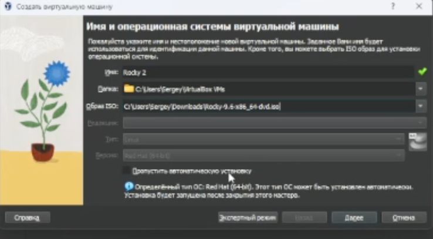
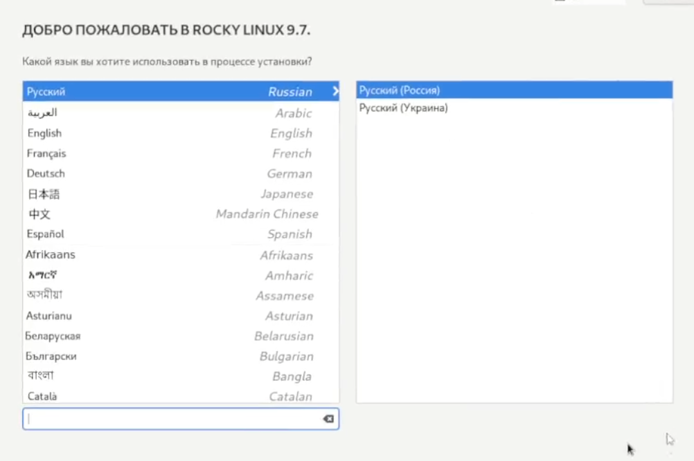
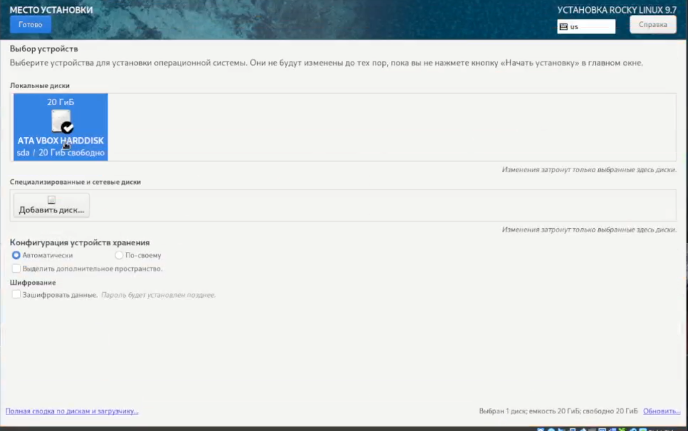
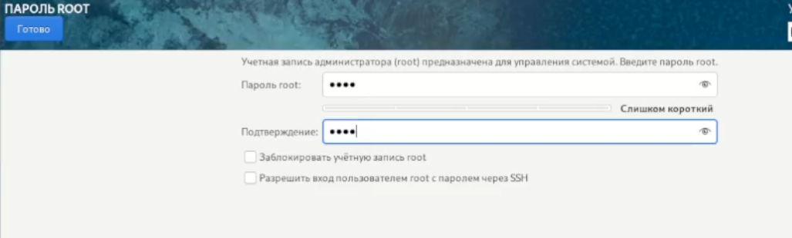
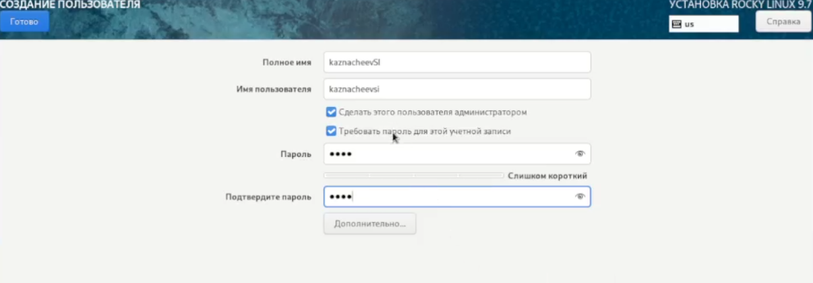
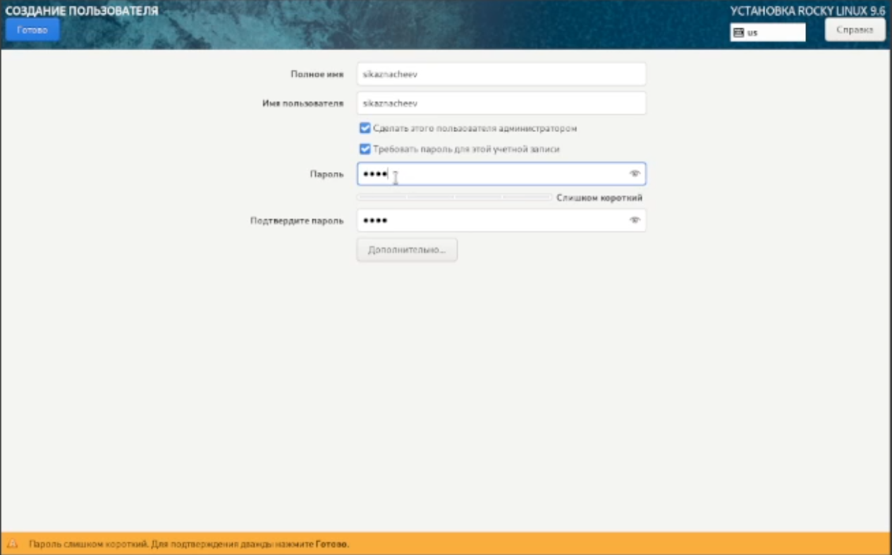
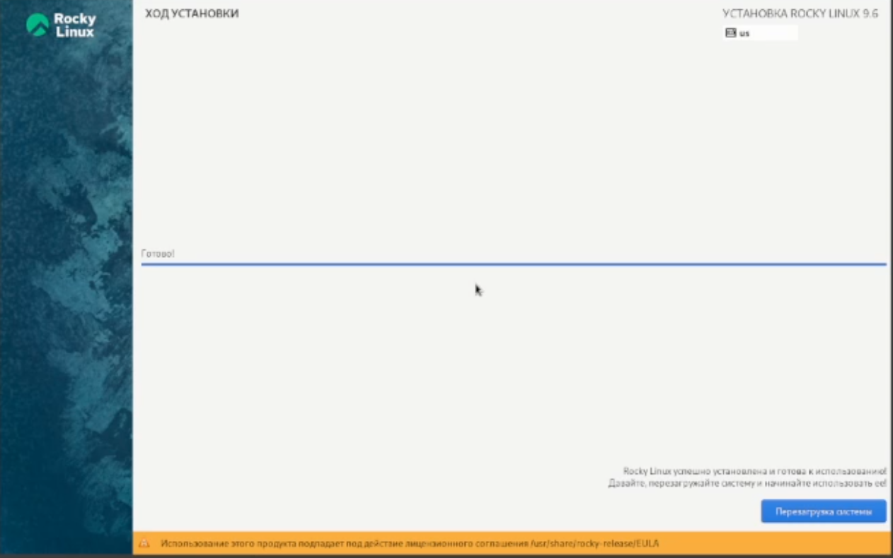
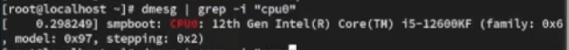
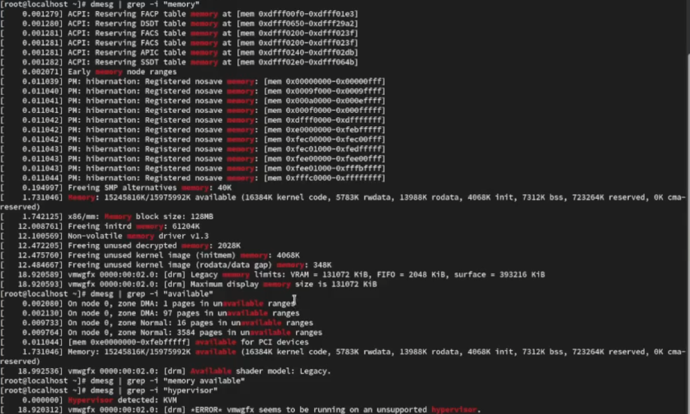
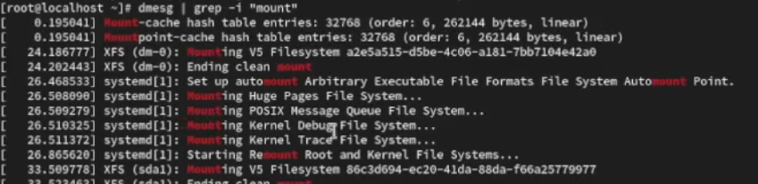

---
## Front matter
lang: ru-RU
title: Лабораторная работа 
subtitle: Номер 1
author:
  - Казначеев С. И.
institute:
  - Российский университет дружбы народов, Москва, Россия
date: 01 января 1970

## i18n babel
babel-lang: russian
babel-otherlangs: english

## Formatting pdf
toc: false
toc-title: Содержание
slide_level: 2
aspectratio: 169
section-titles: true
theme: metropolis
header-includes:
 - \metroset{progressbar=frametitle,sectionpage=progressbar,numbering=fraction}

## Fonts
mainfont: IBM Plex Serif
romanfont: IBM Plex Serif
sansfont: IBM Plex Sans
monofont: IBM Plex Mono
mathfont: STIX Two Math
mainfontoptions: Ligatures=Common,Ligatures=TeX,Scale=0.94
romanfontoptions: Ligatures=Common,Ligatures=TeX,Scale=0.94
sansfontoptions: Ligatures=Common,Ligatures=TeX,Scale=MatchLowercase,Scale=0.94
monofontoptions: Scale=MatchLowercase,Scale=0.94,FakeStretch=0.9
mathfontoptions:

---

# Информация

## Докладчик

:::::::::::::: {.columns align=center}
::: {.column width="70%"}

  * Казначеев Сергей Ильич 
  * Студент
  * Российский университет дружбы народов
  * [1132240693@pfur.ru]

:::
::: {.column width="30%"}

## Цель

Установка и конфигурация операционной системы на виртуальную машину 

## Выбор диска 

Для начала назовем нашу виртуальную машину Rocky3 и выберем установочный диск

## Выделение памяти и процессора 

Выделяем память и процессор

## Выделение диска 

Выделяем размер диска (20 гб)

## Выбор языка 

Далее выбираем язык,я выбрал русский язык

## Настройка сети 

Выбираем диск куда устанавится система

## Настройка пользователя 

Настроим рут пользователя указав пароль для него и разрешив ему ssh

## Экран об окончании установки 

Настром своего пользователя согласно об именовании

## Версия ядра 

Теперь выполняем домашнее задание  находим версию ядра

## Частота процессора

2) Частота процессора

## Модель процессора

3) Модель процессора

## Доступная память 

4) Количество доступной памяти 

## Гипервизор

5) Найти гипервизор

## Найти тип файловой системы корневого раздела

## Нати последовательность монтирования файловых систем

## Выводы

В результате выполнения лаборатоной работы была установлена система Rocky.

