---
## Front matter
lang: ru-RU
title: Управление пользователями и группами 
subtitle: лабораторная работа №2 
author:
  - Казанчеев С.И.
institute:
  - Российский университет дружбы народов, Москва, Россия
date: 09 сентябрь 2025

## i18n babel
babel-lang: russian
babel-otherlangs: english

## Formatting pdf
toc: false
toc-title: Содержание
slide_level: 2
aspectratio: 169
section-titles: true
theme: metropolis
header-includes:
 - \metroset{progressbar=frametitle,sectionpage=progressbar,numbering=fraction}
---

# Информация

## Докладчик

:::::::::::::: {.columns align=center}
::: {.column width="70%"}

  * Казначеев Сергей Ильич
  * Студент
  * Российский университет дружбы народов
  * [1132240693@pfur.ru]
:::
::: {.column width="30%"}

## Цель работы 

Получить представление о работе с учетными записями пользователей и группами пользователей в операционной системе типа Linux

## Выполнение лабораторной работы

Для начала входим как обычный пользователь и открываем терминал далее ввводим команду whoami  для того чтобы определить учетную запись

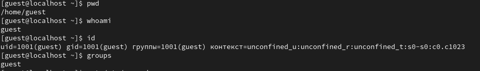

## Ввод команд 

Вводим команду id у нас выведиться uid=1000(sikaznacheev) gid=1000(sikaznacheev) groups=1000(sikaznacheev) 

1. uid=1000(sikaznacheev) - индификатор пользователя
2. gid=1000(sikaznacheev) - индификатор основной группы 
3. groups=1000(sikaznacheev) - список дополнительных группв которые входит пользователь 

## Скрин

## Ввод команд

Далее используем команду su для переключения к учетной записи root  и набераем id рис. [-@fig:003]).

1. uid=0(root) - индификатор пользователя
2. gid=0(root) - индификатор основной группы 
3. groups=1000(root) - список дополнительных группв которые входит пользователь 

И затем прописываем команду su sikaznacheev для того чтобы вернуться к учетной записи 

## Скрин

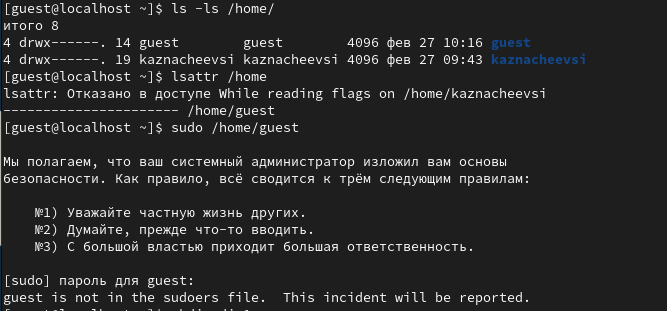

## Ввод команд

Затем пропишем команду sudo -i visudo 

1. sudo -i visudo  нам позволяет смотреть файл в безопасном режиме и редактировать его 

## Нахождение информации в файле 

Далее находим в файле %wheel all=(all) all 

1. %wheel - указывает на группу wheel в системе 
2. all= - разрешает выполнение команд на любом хосте 
3. (all) - разрешает выполнение команд от имени Любого пользователя
4. all - разрешает выполение любой команды 

## Скрин

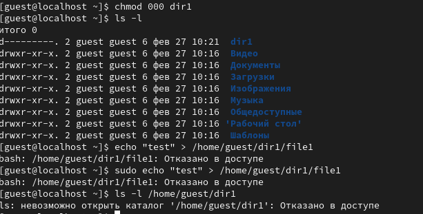

## Создание пользователя alice

Создаем пользователя под именем alice проверяем добавилась ли  alica в группу wheel введя команду  id alice, далее задаем пароль для пользователя alice

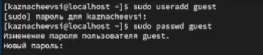

## Переключение на пользователя alice с bob

После чего переключаемся на пользователя alice и создаем нового пользователя  с именем bob

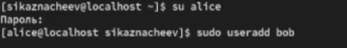

## Создание пароля bob

Создаем паполь для пользователя bob и проверяем id и переключаемся в супер пользователя  root

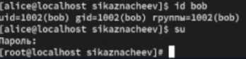

## Открытие файла 

Открываем файл конфигурации /etc/login.defs для редактирования его проверяем что CREATE_HOME
стоит значение yes и также устанавливаем в USERGROUPS_ENAB параметр no

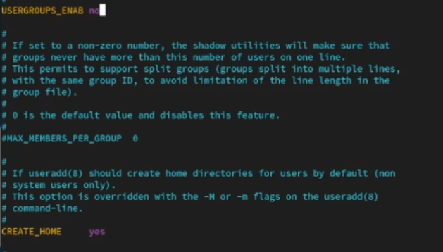

## Переход в каталог 

После чего переходим в каталог /etc/skel и создаем там каталоги Pictures и Documents

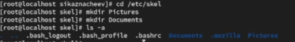

## Изменение файла 

После чего изменяем содержимое файла .bashrc, добавив строку - export EDITOR=/usr/bin/mceditor 

## Переключение учетной записи на  alice

После переключения в терминале на учетную запись alice создаем нового пользователя под именем bob и устанавливаем пароль 

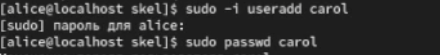

## Переход в пользователя  carol

Затем переходим в пользователя carol  проверяем в какую первоначальную группу входит данный пользователь и проверяем что также создались каталоги Pictures и Documents

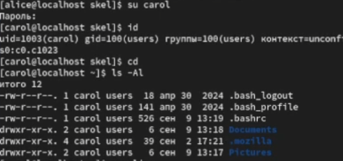

## Переключение учетной записи на  alice

Переключаемся в терминале на пользователя alice и пишем команду sudo cat /etc/shadow | grep carol

У нас выведится зашифрованный пароль дальше будет дата изменение пароля, минимальный срок действия у нас это 0 далее максимальное срок действия пароля 99999 и количество дней на предупреждение пользователяоб истечении срока действия пароля 
## Скрин

## Меняем свойства пользователя carol

После чего меняем свойства пользователя carol следуюзщей командой sudo passwd -n 30 -w 3 -x 90 carol рис. [-@fig:015]).

## Устанавливаем время паролю 

Теперь у нас будет 90 дней это когда пароль истечет срок действия за 3 дня будет предупреждение и пароль должен использоваться 30 дней до его изменения 

## Проверяем что индификатор alice существует

Проверяем что индификатор alice существует во всех трех файлах  командой sudo cat /etc/shadow | grep caro 

## Проверяем что индификатор carol существует

И убеждаемся что индификатор  carol существует не во всех трех файлах

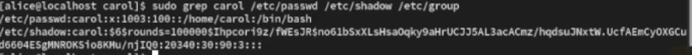

## Работа с группами 

Используя usermod для добавления пользователей alice и bob в группу main, а carol, dan, dave и david — в группу third:

Прописав данные команды 

sudo usermod -aG main alice
sudo usermod -aG main bob
sudo usermod -aG third carol

## Работа с группами скрин

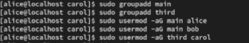

## Проверяем carol

Проверяем что пользователь carol правильно был добавлен в группу third 

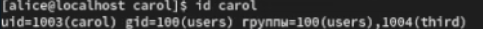

## Проверяем bob

Проверяем что пользователь bob правильно был добавлен в группу main

## Проверяем alice

Проверяем что пользователь alice правильно была добавлена в группу main

## Контрольный вопрос номер 1

1. При помощи каких команд можно получить информацию о номере (идентификаторе),назначенном пользователю Linux, о группах, в которые включён пользователь?

Ответ - при помощи команды  id - показывает uid, gid и группы пользователя, groups показывает список групп, whoami- имя текущего пользователя 

## Контрольный вопрос номер 2

2. Какой UID имеет пользователь root? При помощи какой команды можно узнать UID пользователя? Приведите примеры.

Ответ - у пользователя root всегда 0, с помошью команды id -u "имя пользователя" Привер: id -u root

## Контрольный вопрос номер 3

3. В чём состоит различие между командами su и sudo?

Ответ - su это  переключение на другого пользователя с вводом пароля, а sudo это дял выполнения отдельных команд от имени root с вводом своего пароля 

## Контрольный вопрос номер 4

4. В каком конфигурационном файле определяются параметры sudo?

Ответ - конфигурация sudo создается в файле /etc/suddoers

## Контрольный вопрос номер 5

5. Какую команду следует использовать для безопасного изменения конфигурации sudo?

Ответ - для безоппасного редактирования используют команду visudo

## Контрольный вопрос номер 6

6. Если вы хотите предоставить пользователю доступ ко всем командам администрирования системы через sudo, членом какой группы он должен быть?

Ответ - чтобы дать пользователю полный доступ ко всем командам через sudo он должен быть членом группы sudo

## Контрольный вопрос номер 7

7. Какие файлы/каталоги можно использовать для определения параметров, которые будут использоваться при создании учётных записей пользователей? Приведите при-меры настроек.

Ответ 1)/etc/default/useradd -общие параметры по умолчанию  Пример HOME =/home 2) /etc/login.defs- параметр для паролей  uid/gid Пример PASS_MAX_DAYS 90

## Контрольный вопрос номер 8

8. Где хранится информация о первичной и дополнительных группах пользователей ОС типа Linux? В отчёте приведите пояснение таких записей для пользователя alice.

Ответ 1) файл /etc/passwd - указывакет uid и первичную группу пользователей 2)файл /etc/group хранит список всех групп и их участников

Пример  alice в /etc/passwd   вывод будет - alice:x:1001:1001:Alice USer:/home/alice:/bin/bash  а при команде  /etc/group будет - developers:x:1002:alice,bob

## Контрольный вопрос номер 9

9. Какие команды вы можете использовать для изменения информации о пароле поль-зователя (например о сроке действия пароля)?

Ответ passwd "username" - смена пароля, chage "username" управление сроком действия пароля Пример о смене действия пароля chage -M 90 alice

## Контрольный вопрос номер 10

10. Какую команду следует использовать для прямого изменения информации в файле /etc/group и почему?

Ответ используют visudo для безоппасного редактирования 
 

## Выводы

В результате выполнения лабораторной работы я получил опыт работы  с учетными записями пользователей и группами пользователей в операционной системе типа Linux

