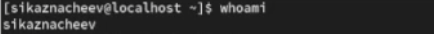
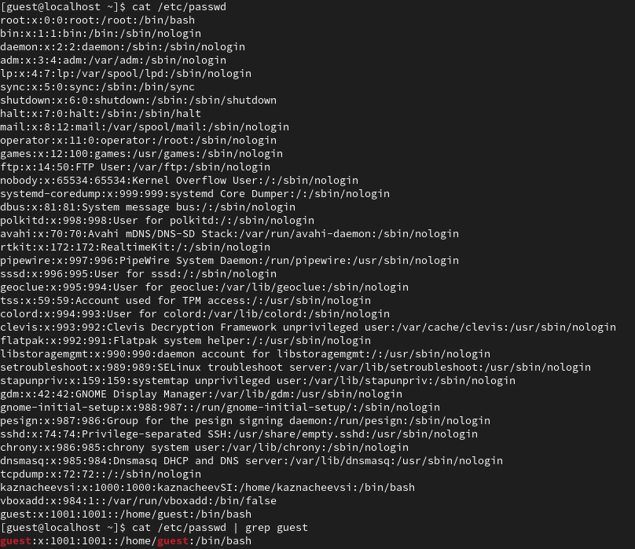
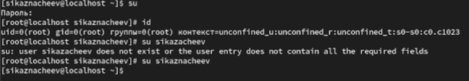
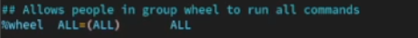
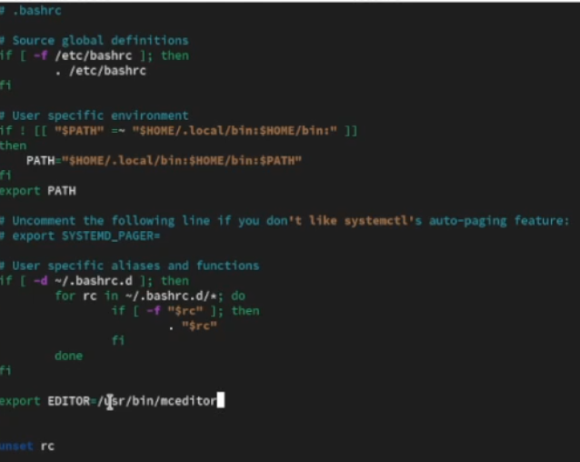
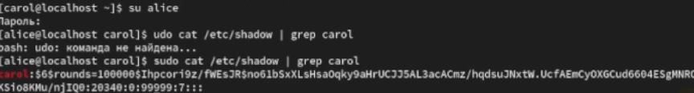
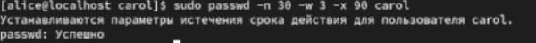
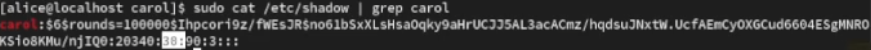
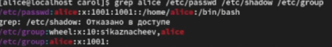
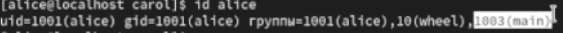

---
## Front matter
title: "Отчет о лабораторной работе"
subtitle: "Лабораторная работа №2"
author: "Казначеев Сергей Ильич"

## Generic otions
lang: ru-RU
toc-title: "Содержание"

## Bibliography
bibliography: bib/cite.bib
csl: pandoc/csl/gost-r-7-0-5-2008-numeric.csl

## Pdf output format
toc: true # Table of contents
toc-depth: 2
lof: true # List of figures
lot: true # List of tables
fontsize: 12pt
linestretch: 1.5
papersize: a4
documentclass: scrreprt
## I18n polyglossia
polyglossia-lang:
  name: russian
  options:
	- spelling=modern
	- babelshorthands=true
polyglossia-otherlangs:
  name: english
## I18n babel
babel-lang: russian
babel-otherlangs: english
## Fonts
mainfont: IBM Plex Serif
romanfont: IBM Plex Serif
sansfont: IBM Plex Sans
monofont: IBM Plex Mono
mathfont: STIX Two Math
mainfontoptions: Ligatures=Common,Ligatures=TeX,Scale=0.94
romanfontoptions: Ligatures=Common,Ligatures=TeX,Scale=0.94
sansfontoptions: Ligatures=Common,Ligatures=TeX,Scale=MatchLowercase,Scale=0.94
monofontoptions: Scale=MatchLowercase,Scale=0.94,FakeStretch=0.9
mathfontoptions:
## Biblatex
biblatex: true
biblio-style: "gost-numeric"
biblatexoptions:
  - parentracker=true
  - backend=biber
  - hyperref=auto
  - language=auto
  - autolang=other*
  - citestyle=gost-numeric
## Pandoc-crossref LaTeX customization
figureTitle: "Рис."
tableTitle: "Таблица"
listingTitle: "Листинг"
lofTitle: "Список иллюстраций"
lotTitle: "Список таблиц"
lolTitle: "Листинги"
## Misc options
indent: true
header-includes:
  - \usepackage{indentfirst}
  - \usepackage{float} # keep figures where there are in the text
  - \floatplacement{figure}{H} # keep figures where there are in the text
---

# Цель работы 

Получить представление о работе с учетными записями пользователей и группами пользователей в операционной системе типа Linux

# Выполнение лабораторной работы

Для начала входим как обычный пользователь и открываем терминал далее ввводим команду whoami  для того чтобы определить учетную запись (рис. [-@fig:001]).

{#fig:001 width=70%}

Вводим команду id у нас выведиться uid=1000(sikaznacheev) gid=1000(sikaznacheev) groups=1000(sikaznacheev) (рис. [-@fig:002]).

1. uid=1000(sikaznacheev) - индификатор пользователя
2. gid=1000(sikaznacheev) - индификатор основной группы 
3. groups=1000(sikaznacheev) - список дополнительных группв которые входит пользователь 

{#fig:002 width=70%}

Далее используем команду su для переключения к учетной записи root  и набераем id рис. [-@fig:003]).

1. uid=0(root) - индификатор пользователя
2. gid=0(root) - индификатор основной группы 
3. groups=1000(root) - список дополнительных группв которые входит пользователь 

И затем прописываем команду su sikaznacheev для того чтобы вернуться к учетной записи 

{#fig:003 width=70%}

Затем пропишем команду sudo -i visudo (рис. [-@fig:004]).

1. sudo -i visudo  нам позволяет смотреть файл в безопасном режиме и редактировать его 

{#fig:004 width=70%}

Далее находим в файле %wheel all=(all) all (рис. [-@fig:005]).

1. %wheel - указывает на группу wheel в системе 
2. all= - разрешает выполнение команд на любом хосте 
3. (all) - разрешает выполнение команд от имени Любого пользователя
4. all - разрешает выполение любой команды 

{#fig:005 width=70%}

Создаем пользователя под именем alice проверяем добавилась ли  alica в группу wheel введя команду  id alice, далее задаем пароль для пользователя alice (рис. [-@fig:006]).

{#fig:006 width=70%}

После чего переключаемся на пользователя alice и создаем нового пользователя  с именем bob(рис. [-@fig:007]).

{#fig:007 width=70%}

Создаем паполь дял пользователя bob и проверяем id и переключаемся в супер пользователя  root (рис. [-@fig:008]).

{#fig:008 width=70%}

Открываем файл конфигурации /etc/login.defs для редактирования его проверяем что CREATE_HOME
стоит значение yes и также устанавливаем в USERGROUPS_ENAB параметр no (рис. [-@fig:009]).

{#fig:009 width=70%}

После чего переходим в каталог /etc/skel и создаем там каталоги Pictures и Documents (рис. [-@fig:010]).

{#fig:010 width=70%}

После чего изменяем содержимое файла .bashrc, добавив строку - export EDITOR=/usr/bin/mceditor (рис. [-@fig:011]).

{#fig:011 width=70%}

После переключения в терминале на учетную запись alice создаем нового пользователя под именем bob и устанавливаем пароль рис. [-@fig:012]).

{#fig:012 width=70%}

Затем переходим в пользователя carol  проверяем в какую первоначальную группу входит данный пользователь и проверяем что также создались каталоги Pictures и Documents (рис. [-@fig:013]).

{#fig:013 width=70%}

Переключаемся в терминале на пользователя alice и пишем команду sudo cat /etc/shadow | grep carol

У нас выведится зашифрованный пароль дальше будет дата изменение пароля, минимальный срок действия у нас это 0 далее максимальное срок действия пароля 99999 и количество дней на предупреждение пользователяоб истечении срока действия пароля (рис. [-@fig:014]).

{#fig:014 width=70%}

После чего меняем свойства пользователя carol следуюзщей командой sudo passwd -n 30 -w 3 -x 90 carol рис. [-@fig:015]).

{#fig:015 width=70%}

Теперь у нас будет 90 дней это когда пароль истечет срок действия за 3 дня будет предупреждение и пароль должен использоваться 30 дней до его изменения  (рис. [-@fig:016]). 

{#fig:016 width=70%}

Проверяем что индификатор alice существует во всех трех файлах  командой sudo cat /etc/shadow | grep caro  (рис. [-@fig:017]). 

{#fig:017 width=70%}

И убеждаемся что индификатор  carol существует не во всех трех файлах (рис. [-@fig:018]). 

{#fig:018 width=70%}

#Работа с группами 

Используя usermod для добавления пользователей alice и bob в группу main, а carol, dan, dave и david — в группу third:

Прописав данные команды 

sudo usermod -aG main alice
sudo usermod -aG main bob
sudo usermod -aG third carol

{#fig:019 width=70%}

Проверяем что пользователь carol правильно был добавлен в группу third 

{#fig:020 width=70%}

Проверяем что пользователь bob правильно был добавлен в группу main

{#fig:021 width=70%}

Проверяем что пользователь alice правильно была добавлена в группу main

{#fig:022 width=70%}

# Контрольные вопросы

1. При помощи каких команд можно получить информацию о номере (идентификаторе),назначенном пользователю Linux, о группах, в которые включён пользователь?

Ответ - при помощи команды  id - показывает uid, gid и группы пользователя, groups показывает список групп, whoami- имя текущего пользователя 

2. Какой UID имеет пользователь root? При помощи какой команды можно узнать UID пользователя? Приведите примеры.

Ответ - у пользователя root всегда 0, с помошью команды id -u "имя пользователя" Привер: id -u root

3. В чём состоит различие между командами su и sudo?

Ответ - su это  переключение на другого пользователя с вводом пароля, а sudo это дял выполнения отдельных команд от имени root с вводом своего пароля 

4. В каком конфигурационном файле определяются параметры sudo?

Ответ - конфигурация sudo создается в файле /etc/suddoers

5. Какую команду следует использовать для безопасного изменения конфигурации sudo?

Ответ - для безоппасного редактирования используют команду visudo

6. Если вы хотите предоставить пользователю доступ ко всем командам администрирования системы через sudo, членом какой группы он должен быть?

Ответ - чтобы дать пользователю полный доступ ко всем командам через sudo он должен быть членом группы sudo

7. Какие файлы/каталоги можно использовать для определения параметров, которые будут использоваться при создании учётных записей пользователей? Приведите при-меры настроек.

Ответ 1)/etc/default/useradd -общие параметры по умолчанию  Пример HOME =/home 2) /etc/login.defs- параметр для паролей  uid/gid Пример PASS_MAX_DAYS 90

8. Где хранится информация о первичной и дополнительных группах пользователей ОС типа Linux? В отчёте приведите пояснение таких записей для пользователя alice.

Ответ 1) файл /etc/passwd - указывакет uid и первичную группу пользователей 2)файл /etc/group хранит список всех групп и их участников

Пример  alice в /etc/passwd   вывод будет - alice:x:1001:1001:Alice USer:/home/alice:/bin/bash  а при команде  /etc/group будет - developers:x:1002:alice,bob

9. Какие команды вы можете использовать для изменения информации о пароле поль-зователя (например о сроке действия пароля)?

Ответ passwd "username" - смена пароля, chage "username" управление сроком действия пароля Пример о смене действия пароля chage -M 90 alice

10. Какую команду следует использовать для прямого изменения информации в файле /etc/group и почему?

Ответ используют visudo для безоппасного редактирования 
 

# Выводы

В результате выполнения лабораторной работы я получил опыт работы  с учетными записями пользователей и группами пользователей в операционной системе типа Linux

