---
## Front matter
lang: ru-RU
title: Настройка прав доступа 
subtitle: лабораторная работа №3 
author:
  - Казанчеев С.И.
institute:
  - Российский университет дружбы народов, Москва, Россия
date: 15 сентябрь 2025

## i18n babel
babel-lang: russian
babel-otherlangs: english

## Formatting pdf
toc: false
toc-title: Содержание
slide_level: 2
aspectratio: 169
section-titles: true
theme: metropolis
header-includes:
 - \metroset{progressbar=frametitle,sectionpage=progressbar,numbering=fraction}
---

# Информация

## Докладчик

:::::::::::::: {.columns align=center}
::: {.column width="70%"}

  * Казначеев Сергей Ильич
  * Студент
  * Российский университет дружбы народов
  * [1132240693@pfur.ru]
:::
::: {.column width="30%"}

## Цель работы 

Получение навыков настройки базовых и специальных прав доступа для групп пользо-
вателей в операционной системе типа Linux.

## Выполнение лабораторной работы

Для начала откроем терминал и перейдем в учетную запись root в корневом каталоге создадим каталоги /data/main и /data/third 

## Смена владельца  каталогов 

Затем меняем владельцев каталогов с root  на  main и third соответственно  и проверяем это

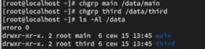

## Установка разрешений 

Далее устанавливаем разрешения позволяющие владельцам каталогов записывать файлы в эти каталоги и запрещающие доступ к содержимому каталогов всем другим пользователям и группам

## Переход под пользователя  bob и создаем файл 

Затем переходим в учетную запись bob 
Переходим в каталог /data/main и создаем файл emptyfile в данном каталоге 

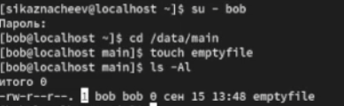

## Под  пользователя  bob пробуем переход в другие каталоги 

Под пользователем  bob пробуем перейти в каталог /data/third и создаем файл emptyfile  в этом каталоге и у нас не получится это так как  bob находится в  main и принадлежит группе  main 

## Переход под пользователя  alice  создаем два файла 

Меняем пользователя на alice переходим в каталог и создаем два файла 

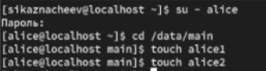

## Переход под пользователя  bob 

После чего в новом терминале перейдем под учетную запись пользователя  bob и пробуем удалить файлы принадлежащие пользователю  alice 

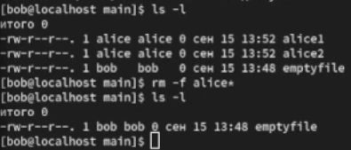

## Создаем файлы 

Далее создаем два файла  которые принадлежат bob

## Переход под пользователя root

Потом переходим под пользователя  root и устанавливаем для каталога /data/main бит иден-тификатора группы, а также stiky-бит для разделяемого (общего) каталога группы

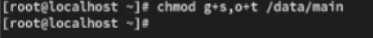

## Переход под пользователя alice

Далее в терминале под пользователем  alice создаем в каталоге  /data/main файлы alice3 и alice4 и проверяем это

## Пробуем удалять файлы 

Пробуем удалить файлы bob под пользователем alice  и убеждаемся что sticky-bit предотвратит удаление этих файлов пользователем alice

## Открываем новый терминал и устанавливаем права 

Открываем новый терминал и переходим в пользователя root и устанавливаем права для чтения и выполнения в каталоге /data/main для группы third и права на чтение и выполнение для группы main в каталоге /data/third

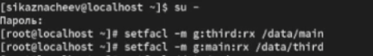

## Проверям правильность установки разрешений 

После чего используем команду getfacl, чтобы убедиться в правильности установки разрешений main и third

## СКРИН

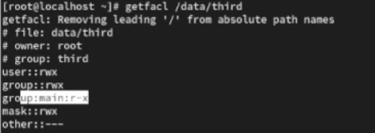
 
## Создание файлов и проверка их
 
После проверки создаем новый файл с именем newfile1и проверяем текущее назначение полномочий у нас оказываестя что права доступа

1. Владелец -root- чтение и запись 
2. Группа владелец - group main -  только чтение
3. Все остальные - other - только чтение

Причина почему права именно такие в том что отсутствуют наследуемые acl 

## Скрин

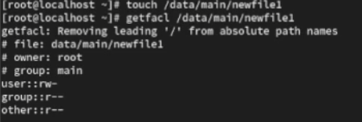

## Установка ACL 

Далее устанавливаем ACL по умолчанию для каталога /data/main и /data/third, проверяем что настройки acl работают добавив новые файлы в каталог /data/main  и проверяем текущее назначение полномочий для main 

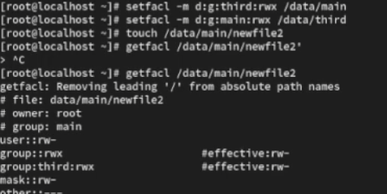

## Проверяем назначение полномочий для third 

Затем проверяем назанчение полномочий для third 

## Проверяем операции с файлами 

После чего переходим под учетную запись группы  third - carol и проверяем опеции с файлами 

1. rm /data/main/newfile1
2. rm /data/main/newfile2

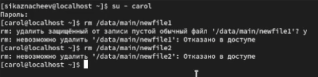

## Проверяем файлы 

Затем проверяем возможно ли осуществить запись в файл

1. echo "Hello, world" >> /data/main/newfile1
2. echo "Hello, world" >> /data/main/newfile2

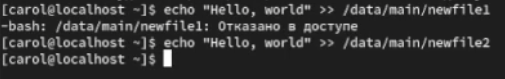

## Котрольный вопрос номер 1

1. Как следует использовать команду chown, чтобы установить владельца группы для файла? Приведите пример

Ответ - чтобы установить владельца группы для файла нужно использовать команду chown user:group file
Пример: chown sergey:developers report.txt 

## Котрольный вопрос номер 2

2. С помощью какой команды можно найти все файлы, принадлежащие конкретномупользователю? Приведите пример.

Ответ - с помощью команды  find / -user user_name
Пример:  find /home -user ivan

## Котрольный вопрос номер 3

3. Как применить разрешения на чтение, запись и выполнение для всех файлов в каталоге /data для пользователей и владельцев групп, не устанавливая никаких прав для других? Приведите пример

Ответ - для того чтобы  применить разрешения на чтение, запись и выполнение для всех файлов в каталоге /data для пользователей нужно выдать права чтение,запись и выполнение  только владельцу группе а для других убрать 
Пример: chmod 770 /data/file1

## Котрольный вопрос номер 4

4. Какая команда позволяет добавить разрешение на выполнение для файла, который необходимо сделать исполняемым?

Ответ - команда  chmod +x file.sh

## Котрольный вопрос номер 5

5. Какая команда позволяет убедиться, что групповые разрешения для всех новых файлов, создаваемых в каталоге, будут присвоены владельцу группы этого каталога? Приведите пример.

Ответ -  команда chmod g+s каталог
Пример: chmod g+s /projects

## Котрольный вопрос номер 6

6. Необходимо, чтобы пользователи могли удалять только те файлы, владельцами которых они являются, или которые находятся в каталоге, владельцами которого они являются. С помощью какой команды можно это сделать? Приведите пример.

Ответ - команда  chmod +t каталог
Пример: chmod +t /projects

## Котрольный вопрос номер 7

7. Какая команда добавляет ACL, который предоставляет членам группы права доступа на чтение для всех существующих файлов в текущем каталоге?

Ответ - команда setfacl -m g:groupname:r * 

## Котрольный вопрос номер 8

8. Что нужно сделать для гарантии того, что члены группы получат разрешения на чтение для всех файлов в текущем каталоге и во всех его подкаталогах, а также для всех файлов, которые будут созданы в этом каталоге в будущем? Приведите пример.

Ответ - чтобы гарантировать что члены группы всегда будут иметь доступ на чтение к файлам в текущем каталоге его подкаталогах и ко всем будущим файлам нужно использовать acl

Пример: setfacl -R m g:groupname:rX - это команда для установки прав чтения
Пример: setfacl -d -m g:groupname:rX. - это для установки прав по умолчанию для будущих прав файлов и каталов 

## Котрольный вопрос номер 9

9. Какое значение umask нужно установить, чтобы «другие» пользователи не получали какие-либо разрешения на новые файлы? Приведите пример.

Ответ - чтобы другие пользователи не получали никаких прав на новые файлы нужно выставить umask обнуляющий все разрешения для категорий  others.
Пример: umask 007

## Котрольный вопрос номер 10

10. Какая команда гарантирует, что никто не сможет удалить файл myfile случайно?

Ответ команда chattr +i myfile  гаранитирует что никто не сможет удалить файл myfile случайно.

##  Выводы

В результате выполнения лабораторной работы я получил опыт работы с настройками базовых и специальных прав доступа для групп пользователей в операционной системе типа linux 

