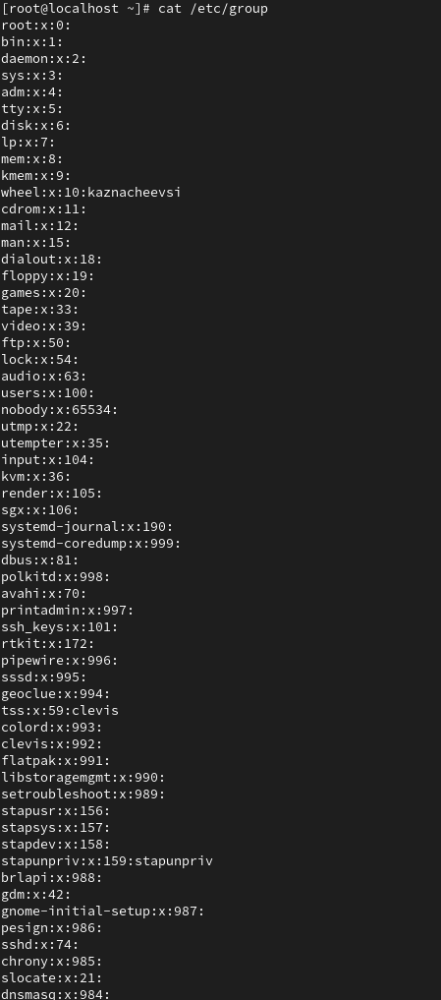

---
## Front matter
lang: ru-RU
title: Дискреционное разграничение прав в Linux
subtitle: лабораторная работа №3 
author:
  - Казанчеев С.И.
institute:
  - Российский университет дружбы народов, Москва, Россия
date: 15 сентябрь 2025

## i18n babel
babel-lang: russian
babel-otherlangs: english

## Formatting pdf
toc: false
toc-title: Содержание
slide_level: 2
aspectratio: 169
section-titles: true
theme: metropolis
header-includes:
 - \metroset{progressbar=frametitle,sectionpage=progressbar,numbering=fraction}
---

# Информация

## Докладчик

:::::::::::::: {.columns align=center}
::: {.column width="70%"}

  * Казначеев Сергей Ильич
  * Студент
  * Российский университет дружбы народов
  * [1132240693@pfur.ru]
:::
::: {.column width="30%"}

## Цель работы 

Получение практических навыков работы в консоли с атрибутами файлов для групп пользователей

## Выполнение лабораторной работы

Для начала переходим в супер пользователя и создаем пользователя guest2 и добавляем пользователя guest2 в группу guest

{#fig:001 width=70%}

## Пользователь guest

После чего открываем новый терминал под guest, затем определеим директорию для пользователя guest и сравниваем команды id -Gn и id -G с пользователем guest2

{#fig:002 width=70%}

## Пользователь guest2

Теперь открываем еще один терминал и переходим в пользователя guest2, также определяем директорию и сравниваем команды id -Gn и id -G с пользователем guest

{#fig:003 width=70%}

## Сравнение двух пользователей 

После сравнения двух пользователей, сравниваем полученную информацию с содержимым файла /etc/group

{#fig:004 width=70%}

## Пользователь guest2

Далее от имени пользователя guest2 выполним регистрацию пользователя guest2 в группу guest командой newgrp guest

{#fig:005 width=70%}

## Пользователь guest

Затем от пользователя guest меняем права директории /home/guest разрешив всех действия для пользователей группы 

{#fig:006 width=70%}

## Пользователь guest

После чего от имени пользователя guest снимим с директории /home/guest/dir1 все атрибуты командой chmod 000 dirl и проверяем снятия атрибутов 

{#fig:007 width=70%}

##  Выводы

В результате выполнения лабораторной работы я получил практические навыки работы в консоли с атрибутами файлов для групп пользователей 

