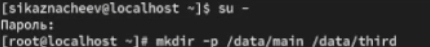
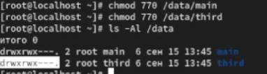
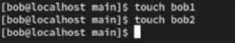
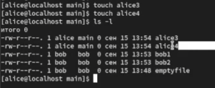
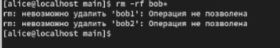
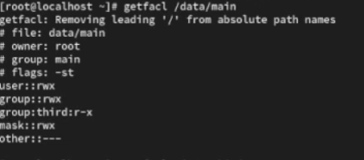
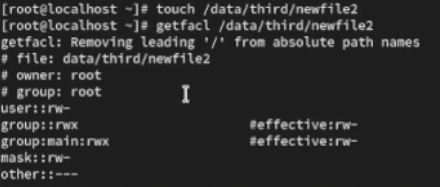

---
## Front matter
title: "Отчет о лабораторной работе"
subtitle: "Лабораторная работа №3"
author: "Казначеев Сергей Ильич"

## Generic otions
lang: ru-RU
toc-title: "Содержание"

## Bibliography
bibliography: bib/cite.bib
csl: pandoc/csl/gost-r-7-0-5-2008-numeric.csl

## Pdf output format
toc: true # Table of contents
toc-depth: 2
lof: true # List of figures
lot: true # List of tables
fontsize: 12pt
linestretch: 1.5
papersize: a4
documentclass: scrreprt
## I18n polyglossia
polyglossia-lang:
  name: russian
  options:
	- spelling=modern
	- babelshorthands=true
polyglossia-otherlangs:
  name: english
## I18n babel
babel-lang: russian
babel-otherlangs: english
## Fonts
mainfont: IBM Plex Serif
romanfont: IBM Plex Serif
sansfont: IBM Plex Sans
monofont: IBM Plex Mono
mathfont: STIX Two Math
mainfontoptions: Ligatures=Common,Ligatures=TeX,Scale=0.94
romanfontoptions: Ligatures=Common,Ligatures=TeX,Scale=0.94
sansfontoptions: Ligatures=Common,Ligatures=TeX,Scale=MatchLowercase,Scale=0.94
monofontoptions: Scale=MatchLowercase,Scale=0.94,FakeStretch=0.9
mathfontoptions:
## Biblatex
biblatex: true
biblio-style: "gost-numeric"
biblatexoptions:
  - parentracker=true
  - backend=biber
  - hyperref=auto
  - language=auto
  - autolang=other*
  - citestyle=gost-numeric
## Pandoc-crossref LaTeX customization
figureTitle: "Рис."
tableTitle: "Таблица"
listingTitle: "Листинг"
lofTitle: "Список иллюстраций"
lotTitle: "Список таблиц"
lolTitle: "Листинги"
## Misc options
indent: true
header-includes:
  - \usepackage{indentfirst}
  - \usepackage{float} # keep figures where there are in the text
  - \floatplacement{figure}{H} # keep figures where there are in the text
---

# Цель работы 

Получение навыков настройки базовых и специальных прав доступа для групп пользо-
вателей в операционной системе типа Linux.

# Выполнение лабораторной работы

Для начала откроем терминал и перейдем в учетную запись root в корневом каталоге создадим каталоги /data/main и /data/third (рис. [-@fig:001]).

{#fig:001 width=70%}

Затем меняем владельцев каталогов с root  на  main и third соответственно  и проверяем это (рис. [-@fig:002]).

{#fig:002 width=70%}

Далее устанавливаем разрешения позволяющие владельцам каталогов записывать файлы в эти каталоги и запрещающие доступ к содержимому каталогов всем другим пользователям и группам [-@fig:003]).

{#fig:003 width=70%}

Затем переходим в учетную запись bob (рис. [-@fig:004]).

Переходим в каталог /data/main и создаем файл emptyfile в данном каталоге 

{#fig:004 width=70%}

Под пользователем  bob пробуем перейти в каталог /data/third и создаем файл emptyfile  в этом каталоге и у нас не получится это так как  bob находится в  main и принадлежит группе  main (рис. [-@fig:005]).

{#fig:005 width=70%}

Меняем пользователя на alice переходим в каталог и создаем два файла (рис. [-@fig:006]).

{#fig:006 width=70%}

После чего в новом терминале перейдем под учетную запись пользователя  bob и пробуем удалить файлы принадлежащие пользователю  alice (рис. [-@fig:007]).

{#fig:007 width=70%}

Далее создаем два файла  которые принадлежат bob(рис. [-@fig:008]).

{#fig:008 width=70%}

Потом переходим под пользователя  root и устанавливаем для каталога /data/main бит иден-тификатора группы, а также stiky-бит для разделяемого (общего) каталога группы (рис. [-@fig:009]).

{#fig:009 width=70%}

Далее в терминале под пользователем  alice создаем в каталоге  /data/main файлы alice3 и alice4 и проверяем это (рис. [-@fig:010]).

{#fig:010 width=70%}

Пробуем удалить файлы bob под пользователем alice  и убеждаемся что sticky-bit предотвратит удаление этих файлов пользователем alice (рис. [-@fig:011]).

{#fig:011 width=70%}

Открываем новый терминал и переходим в пользователя root и устанавливаем права для чтения и выполнения в каталоге /data/main для группы third и права на чтение и выполнение для группы main в каталоге /data/third рис. [-@fig:012]).

{#fig:012 width=70%}

После чего используем команду getfacl, чтобы убедиться в правильности установки разрешений main и third (рис. [-@fig:013]).

{#fig:013 width=70%}

{#fig:014 width=70%}
 
После проверки создаем новый файл с именем newfile1и проверяем текущее назначение полномочий у нас оказываестя что права доступа рис. [-@fig:015]).

1. Владелец -root- чтение и запись 
2. Группа владелец - group main -  только чтение
3. Все остальные - other - только чтение

Причина почему права именно такие в том что отсутствуют наследуемые acl 

{#fig:015 width=70%}

Далее устанавливаем ACL по умолчанию для каталога /data/main и /data/third, проверяем что настройки acl работают добавив новые файлы в каталог /data/main  и проверяем текущее назначение полномочий для main(рис. [-@fig:016]). 

{#fig:016 width=70%}

Затем проверяем назанчение полномочий для third (рис. [-@fig:017]). 

{#fig:017 width=70%}

После чего переходим под учетную запись группы  third - carol и проверяем опеции с файолами (рис. [-@fig:018]). 

1. rm /data/main/newfile1
2. rm /data/main/newfile2

{#fig:018 width=70%}

Затем проверяем возможно ли осуществить запись в файл

1. echo "Hello, world" >> /data/main/newfile1
2. echo "Hello, world" >> /data/main/newfile2

{#fig:019 width=70%}

# Контрольные вопросы

1. Как следует использовать команду chown, чтобы установить владельца группы для файла? Приведите пример

Ответ - чтобы установить владельца группы для файла нужно использовать команду chown user:group file
Пример: chown sergey:developers report.txt 

2. С помощью какой команды можно найти все файлы, принадлежащие конкретномупользователю? Приведите пример.

Ответ - с помощью команды  find / -user user_name
Пример:  find /home -user ivan

3. Как применить разрешения на чтение, запись и выполнение для всех файлов в каталоге /data для пользователей и владельцев групп, не устанавливая никаких прав для других? Приведите пример

Ответ - для того чтобы  применить разрешения на чтение, запись и выполнение для всех файлов в каталоге /data для пользователей нужно выдать права чтение,запись и выполнение  только владельцу группе а для других убрать 
Пример: chmod 770 /data/file1

4. Какая команда позволяет добавить разрешение на выполнение для файла, который необходимо сделать исполняемым?

Ответ - команда  chmod +x file.sh

5. Какая команда позволяет убедиться, что групповые разрешения для всех новых файлов, создаваемых в каталоге, будут присвоены владельцу группы этого каталога? Приведите пример.

Ответ -  команда chmod g+s каталог
Пример: chmod g+s /projects

6. Необходимо, чтобы пользователи могли удалять только те файлы, владельцами которых они являются, или которые находятся в каталоге, владельцами которого они являются. С помощью какой команды можно это сделать? Приведите пример.

Ответ - команда  chmod +t каталог
Пример: chmod +t /projects

7. Какая команда добавляет ACL, который предоставляет членам группы права доступа на чтение для всех существующих файлов в текущем каталоге?

Ответ - команда setfacl -m g:groupname:r * 

8. Что нужно сделать для гарантии того, что члены группы получат разрешения на чтение для всех файлов в текущем каталоге и во всех его подкаталогах, а также для всех файлов, которые будут созданы в этом каталоге в будущем? Приведите пример.

Ответ - чтобы гарантировать что члены группы всегда будут иметь доступ на чтение к файлам в текущем каталоге его подкаталогах и ко всем будущим файлам нужно использовать acl

Пример: setfacl -R m g:groupname:rX - это команда для установки прав чтения
Пример: setfacl -d -m g:groupname:rX. - это для установки прав по умолчанию для будущих прав файлов и каталов 

9. Какое значение umask нужно установить, чтобы «другие» пользователи не получали какие-либо разрешения на новые файлы? Приведите пример.

Ответ - чтобы другие пользователи не получали никаких прав на новые файлы нужно выставить umask обнуляющий все разрешения для категорий  others.
Пример: umask 007

10. Какая команда гарантирует, что никто не сможет удалить файл myfile случайно?

Ответ команда chattr +i myfile  гаранитирует что никто не сможет удалить файл myfile случайно.

# Выводы

В результате выполнения лабораторной работы я получил опыт работы с настройками базовых и специальных прав доступа для групп пользователей в операционной системе типа linux 

