---
## Front matter
lang: ru-RU
title: Работа с программными пакетами
subtitle: Лабораторная работа №4 
author:
  - Казанчеев С.И.
institute:
  - Российский университет дружбы народов, Москва, Россия
date: 19 сентябрь 2025

## i18n babel
babel-lang: russian
babel-otherlangs: english

## Formatting pdf
toc: false
toc-title: Содержание
slide_level: 2
aspectratio: 169
section-titles: true
theme: metropolis
header-includes:
 - \metroset{progressbar=frametitle,sectionpage=progressbar,numbering=fraction}
---

# Информация

## Докладчик

:::::::::::::: {.columns align=center}
::: {.column width="70%"}

  * Казначеев Сергей Ильич
  * Студент
  * Российский университет дружбы народов
  * [1132240693@pfur.ru]
:::
::: {.column width="30%"}

## Цель работы 

Получить навыки работы с репозиториями и менеджерами пакетов.

## Выполнение лабораторной работы

Для начала откроем терминал и перейдем в супер пользователя root и перейдем в каталог /etc/yum.repos.d  и изучим содержимое данного каталога 

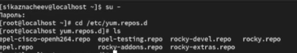

## Смотрим содержимео файла 

Далее посмотрим содержимое файла rocky-addons.repo

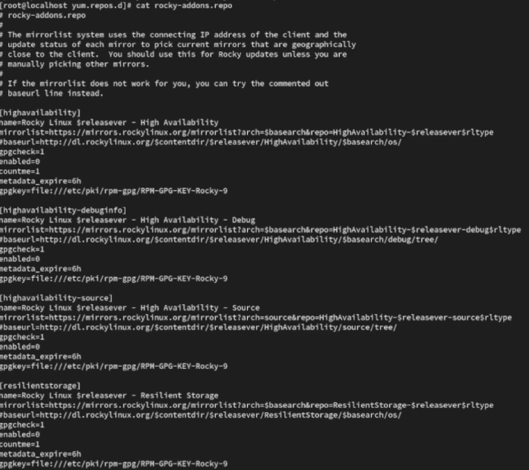

## Выводим список репозиториев 

После чего выведем список репозиториев, мы увидим название репозиториев и их индификатор 

## Выводим список пакетов 

После чего выводим список пакетов в названиии или описании которых есть слово user  у нас выведится все пакеты с именем user

## Находим пакет nmap

Далее находим пакет nmap

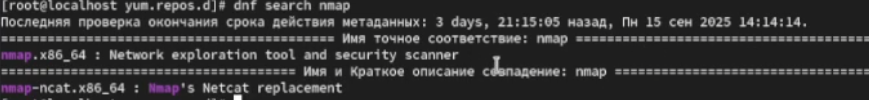

## Вывод информации 

И выведем информацию об этом пакете

## Установка пакетов

После всех проделанных дейтвий установим данный пакет разница между  dnf install nmap и dnf install nmap\* то что nmap\*,он будет устанавливать все где есть nmap, а  nmap без \* установит пакет nmap

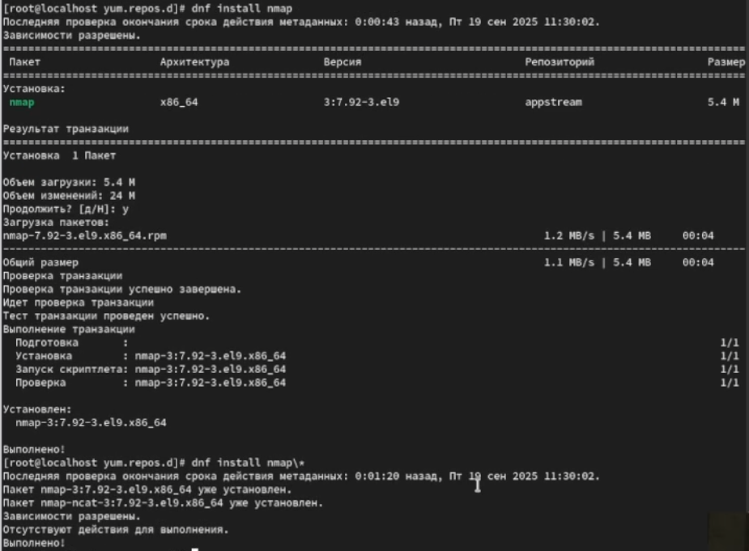

## Удаление пакетов 

После установки нужных пакетов удаляем их 

## Смотрим списки групп пакетов

Далее с помощью команды dnf groups list посмотрим списки групп пакетов

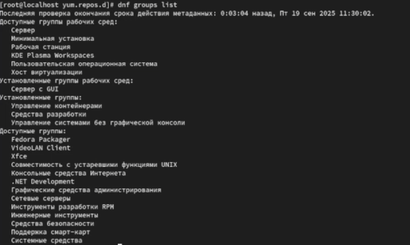

## Смотрим списки групп пакетов на другом языке 

И попробуем другую команду LANG=C dnf groups list ,данная команда выведет нам тот же  самый список пакетов, только на английском

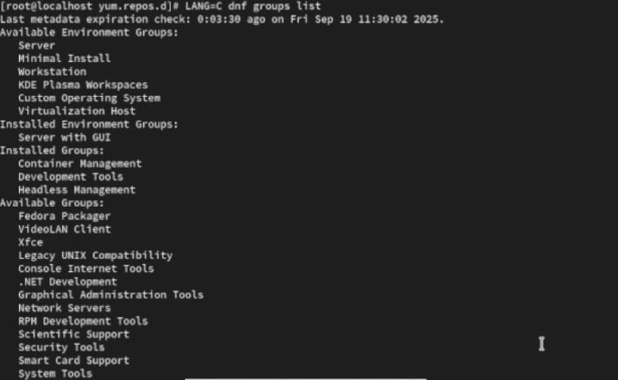

## Получаем конкретную информацию о группе

Пробуем получить конкретную информацию о группе  dnf groups info "RPM Development Tools" и устанавливаем его

## Смотрим историю команд 

После чего посмотрим иторию команд

## Отменяем последнюю команду 22

И отменим последнюю команду под номером 22

## Скачиваем rpm-пакет lynx

После всех проделанных дейстивий скачаем rpm-пакет lynx 

 
## Скрин
 

## Находим каталог 

Далее находим каталог в котором был помещен пакет после загрузки

## Переходим в данный каталог 

Переходим в данный каталог и затем устанавливаем rpm пакет,после чего определяем расположение исполняемого файла 

## Скрин

## Используем rmp  для определения имя файла

Используя rpm определяем имя файла к какому пакету принадлежит Lynx

## Находим дополнительную информацию 

Получаем дополнительную информацию  о содержимом пакета введя  rpm -qi lynx

## Получаем список файлов 

После чего получаем список всех файлов в пакете используя команду rpm -ql lynx

## Просмотр файлов документации

Просмотрим файлы документации применив команду man lynx

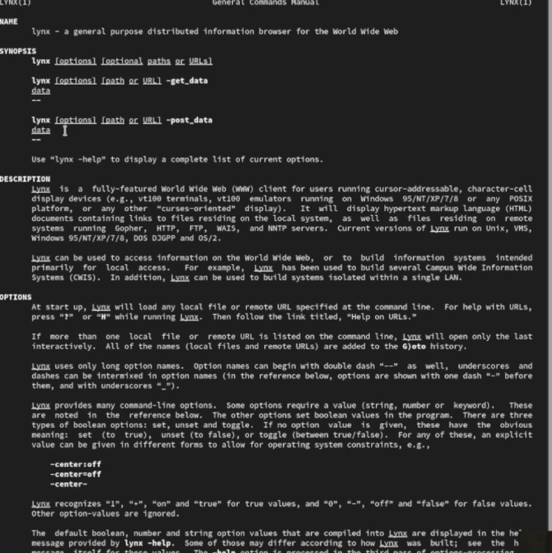

## Вывод на экран файлов 

Выведем на экран перечень и местонахождение конфигурационных файлов пакета 

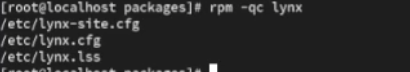

## Вывод на экран расположение и содержание скриптов

После чего выведем на экран расположение и содержание скриптов, после ввода команды мы обнаружим что у нас скриптов нет.

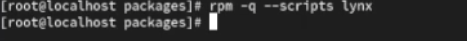

## В отдельном терминале запускаем lynx

В отдельном терминале запустим lynx и обнаружим что пакеты корректно установлены и все корректно работает 

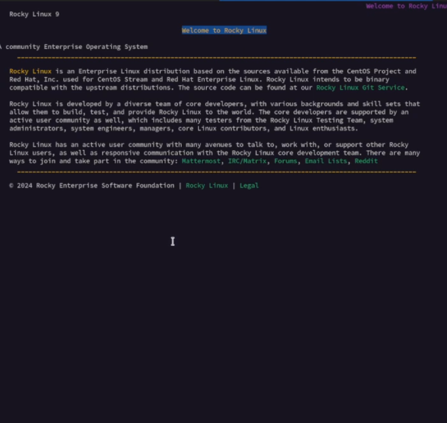

## Удаляем пакет lynx

Вернувшись в терминал с учетной записью root  и удалим пакет lynx, и проверим это командой ls,данный пакет будет в левом столбце под номером 34

## Находим информацию о пакете dmsmasq

После чего найдем информацию о пакете dmsmasq,затем установим его и определим расположение файла.

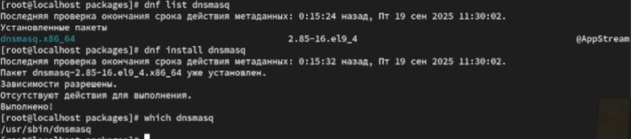

## Определение файла к какому пакету принадлежит 

Определим по имени файла к какому пакету принадлежит dnsmasq

## Получаем дополнительную информацию 

И получим дополнительную информацию о содержимом пакете.

## Получаем список всех файлов в пакете 

После чего получим список всех файлов в пакете

## Выводим перечень файлов с документацией пакетов 

А также выведем перечень файлов с докементацией пакетов 

## Просмотр файла 

Далее просмотрим файл документации применив команду man dnsmasq.

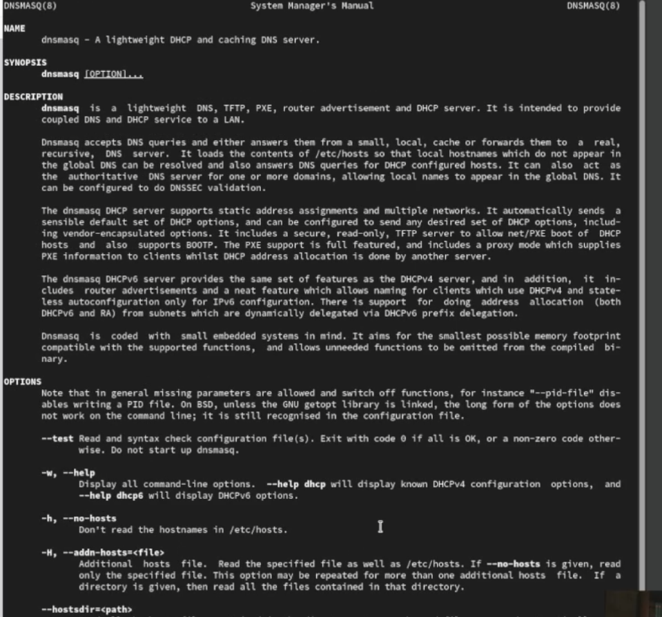

## Выводим  на экран конфигурационных файлов пакетов

И выведем на экран перечень и месторасположение конфигурационных файлов пакета.

## Выводим расположение и содержаниме скриптов 

Затем выведем на экран расположение и содержание скриптов выполняемых при установке пакета.

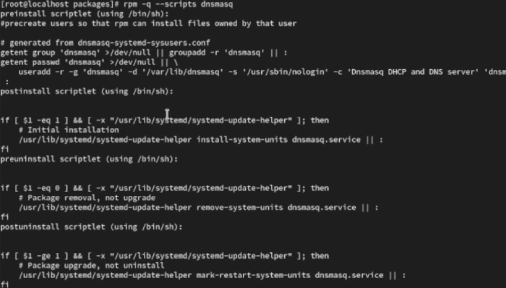

## Удаление пакета 

После чего возвращаемся в терминал и удаляем пакет 

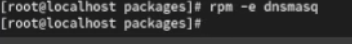

## Контрольный вопрос 1

1. Какая команда позволяет вам искать пакет rpm, содержащий файл useradd?

Ответ - команда rpm -qf $(Which useradd)

## Контрольный вопрос 2

2. Какие команды вам нужно использовать, чтобы показать имя группы dnf, которая содержит инструменты безопасности и показывает, что находится в этой группе?

Ответ - команды dnf group list -v (найти группу) и  dnf group info "имя группы"

## Контрольный вопрос 3

3. Какая команда позволяет вам установить rpm, который вы загрузили из Интернета и который не находится в репозиториях?

Ответ - команда dnf install /путь/к/файлу.rpm

## Контрольный вопрос 4

4. Вы хотите убедиться, что пакет rpm, который вы загрузили, не содержит никакого опасного кода сценария. Какая команда позволяет это сделать?

Ответ - команда rpm --checksig имя_пакета.rpm 

## Контрольный вопрос 5

5. Какая команда показывает всю документацию в rpm?

Ответ -  команда rpm -qd имя_пакета

## Контрольный вопрос 6

6. Какая команда показывает, какому пакету rpm принадлежит файл?

Ответ -  команда rpm -qf /путь/к/файлу

## Вывод 

В результате выполнения лабораторной работы я получил  навыки работы с репозиториями и менеджерами пакетов.

