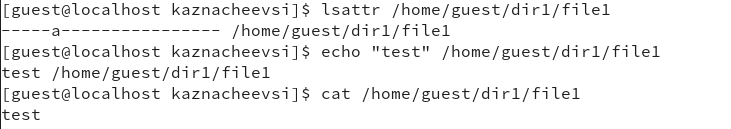
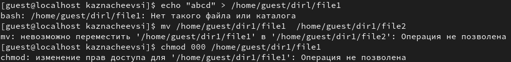
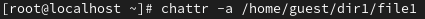
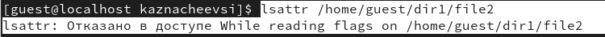
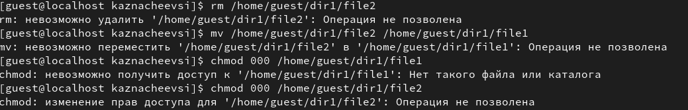
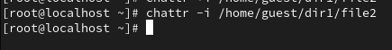

---
## Front matter
lang: ru-RU
title: Работа с программными пакетами
subtitle: Лабораторная работа №4 
author:
  - Казанчеев С.И.
institute:
  - Российский университет дружбы народов, Москва, Россия
date: 19 сентябрь 2025

## i18n babel
babel-lang: russian
babel-otherlangs: english

## Formatting pdf
toc: false
toc-title: Содержание
slide_level: 2
aspectratio: 169
section-titles: true
theme: metropolis
header-includes:
 - \metroset{progressbar=frametitle,sectionpage=progressbar,numbering=fraction}
---

# Информация

## Докладчик

:::::::::::::: {.columns align=center}
::: {.column width="70%"}

  * Казначеев Сергей Ильич
  * Студент
  * Российский университет дружбы народов
  * [1132240693@pfur.ru]
:::
::: {.column width="30%"}

## Цель работы 

Получение практических навыков работы в консоли с расширенными атрибутами файлов

## Выполнение лабораторной работы

Для начала откроем терминал и перейдем в пользователя guest, затем проверим роасширенные атрибуты файла, затем попробуем утсановить права 600,
после чего попытаемся утсановить расширенный атрибут а от пользователя guest

{#fig:001 width=70%}

## Атрибут a

Так как у нас не получилось установить расширенный атрибут а от имени пользователя guest, откроем второй терминал и перейдем в супер пользователя и попробуем снова установить расширенный атрибут а 

{#fig:002 width=70%}

## Пользователь guest

Далле вернемся на пользователя guest и проверим что атрибут установлен  и  выполним дозапись в файл test и проверим 

{#fig:003 width=70%}

## Проверка команд 

После чего  попробуем перезаписать файл, затем переименовать и попробовать изменить права доступа, и как мы увидим везде нам будет отказано 

{#fig:004 width=70%}

## Атрибут а

Затем вернемся в супер пользователя и снимем расширение а

{#fig:005 width=70%}

## Проверка команд 

И попробуем ранее запрещенные операции для проверки 

{#fig:006 width=70%}

## Атрибут i

После чего перейдем в супер пользователя и установим расширенный атрибут i 

{#fig:007 width=70%}

## Атрибут i

Далее снова вернемся в пользователя guest и проверим атрибут i

{#fig:008 width=70%}

## Команды из лабораторной работе 

Теперь попробуем перезаписать, удалить,переименовать и сменить права  везде будет отказано 

{#fig:009 width=70%}

## Атрибут i

Затем возвращаемся в супер пользователя и снимаем атрибут i

{#fig:010 width=70%}

## Выводы

В результате выполнения лабораторной работы я получил  навыки работы в консоли с расширенными атрибутами файлов

