---
## Front matter
title: "Отчет о лабораторной работе"
subtitle: "Лабораторная работа №4"
author: "Казначеев Сергей Ильич"

## Generic otions
lang: ru-RU
toc-title: "Содержание"

## Bibliography
bibliography: bib/cite.bib
csl: pandoc/csl/gost-r-7-0-5-2008-numeric.csl

## Pdf output format
toc: true # Table of contents
toc-depth: 2
lof: true # List of figures
lot: true # List of tables
fontsize: 12pt
linestretch: 1.5
papersize: a4
documentclass: scrreprt
## I18n polyglossia
polyglossia-lang:
  name: russian
  options:
	- spelling=modern
	- babelshorthands=true
polyglossia-otherlangs:
  name: english
## I18n babel
babel-lang: russian
babel-otherlangs: english
## Fonts
mainfont: IBM Plex Serif
romanfont: IBM Plex Serif
sansfont: IBM Plex Sans
monofont: IBM Plex Mono
mathfont: STIX Two Math
mainfontoptions: Ligatures=Common,Ligatures=TeX,Scale=0.94
romanfontoptions: Ligatures=Common,Ligatures=TeX,Scale=0.94
sansfontoptions: Ligatures=Common,Ligatures=TeX,Scale=MatchLowercase,Scale=0.94
monofontoptions: Scale=MatchLowercase,Scale=0.94,FakeStretch=0.9
mathfontoptions:
## Biblatex
biblatex: true
biblio-style: "gost-numeric"
biblatexoptions:
  - parentracker=true
  - backend=biber
  - hyperref=auto
  - language=auto
  - autolang=other*
  - citestyle=gost-numeric
## Pandoc-crossref LaTeX customization
figureTitle: "Рис."
tableTitle: "Таблица"
listingTitle: "Листинг"
lofTitle: "Список иллюстраций"
lotTitle: "Список таблиц"
lolTitle: "Листинги"
## Misc options
indent: true
header-includes:
  - \usepackage{indentfirst}
  - \usepackage{float} # keep figures where there are in the text
  - \floatplacement{figure}{H} # keep figures where there are in the text
---

# Цель работы 

Получить навыки работы с репозиториями и менеджерами пакетов.

# Выполнение лабораторной работы

Для начала откроем терминал и перейдем в супер пользователя root и перейдем в каталог /etc/yum.repos.d  и изучим содержимое данного каталога  (рис. [-@fig:001]).

{#fig:001 width=70%}

Далее посмотрим содержимое файла rocky-addons.repo(рис. [-@fig:002]).

{#fig:002 width=70%}

После чего выведем список репозиториев, мы увидим название репозиториев и их индификатор (рис.[-@fig:003]).

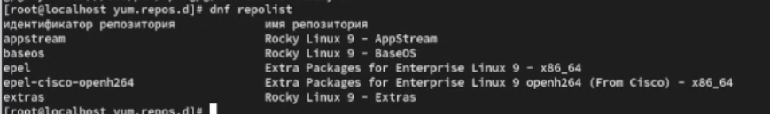{#fig:003 width=70%}

После чего выводим список пакетов в названиии или описании которых есть слово user  у нас выведится все пакеты с именем user(рис. [-@fig:004]).

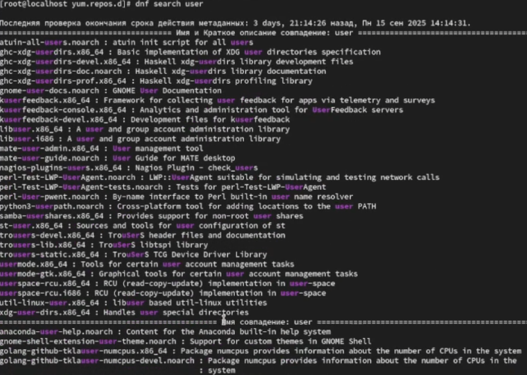{#fig:004 width=70%}

Далее находим пакет nmap(рис. [-@fig:005]).

{#fig:005 width=70%}

И выведем информацию об этом пакете (рис. [-@fig:006]).

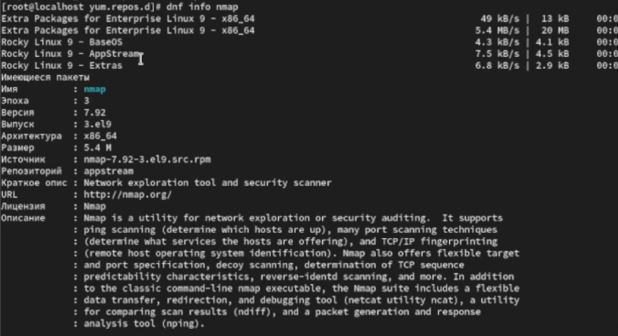{#fig:006 width=70%}

После всех проделанных дейтвий установим данный пакет разница между  dnf install nmap и dnf install nmap\* то что nmap\*,он будет устанавливать все где есть nmap, а  nmap без \* установит пакет nmap(рис. [-@fig:007]).

{#fig:007 width=70%}

После установки нужных пакетов удаляем их (рис. [-@fig:008]).

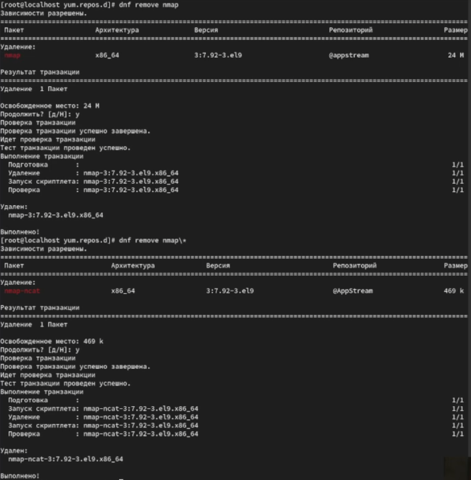{#fig:008 width=70%}

Далее с помощью команды dnf groups list посмотрим списки групп пакетов (рис. [-@fig:009]).

{#fig:009 width=70%}

И попробуем другую команду LANG=C dnf groups list ,данная команда выведет нам тот же  самый список пакетов, только на английском(рис. [-@fig:010]).

{#fig:010 width=70%}

Пробуем получить конкретную информацию о группе  dnf groups info "RPM Development Tools" и устанавливаем его  (рис. [-@fig:011]).

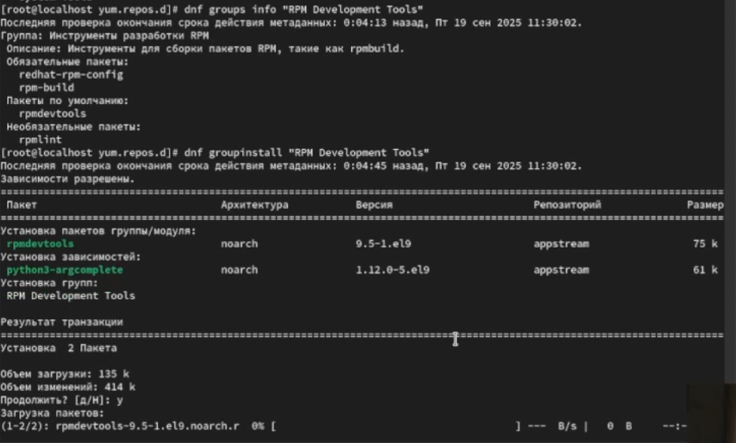{#fig:011 width=70%}

После чего посмотрим иторию команд(рис. [-@fig:012]).

{#fig:012 width=70%}

И отменим последнюю команду под номером 22 (рис. [-@fig:013]).

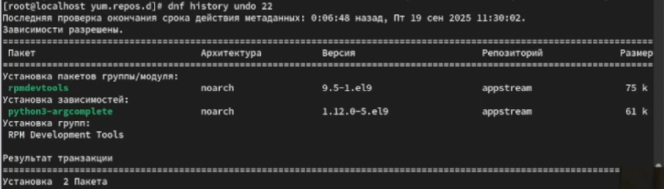{#fig:013 width=70%}

После всех проделанных дейстивий скачаем rpm-пакет lynx (рис. [-@fig:014).

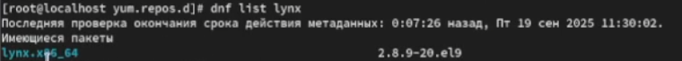{#fig:014 width=70%}
 
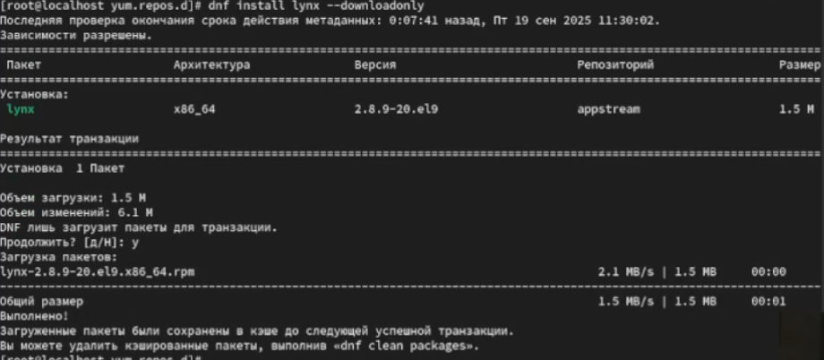{#fig:015 width=70%}

Далее находим каталог в котором был помещен пакет после загрузки (рис. [-@fig:016]). 

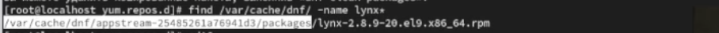{#fig:016 width=70%}

Переходим в данный каталог и затем устанавливаем rpm пакет,после чего определяем расположение исполняемого файла (рис. [-@fig:017]). 

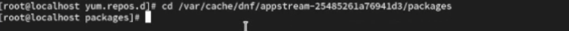{#fig:017 width=70%}

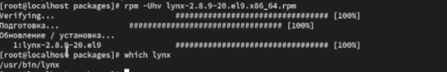{#fig:018 width=70%}

Используя rpm определяем имя фалы к какому пакету принадлежит Lynx

{#fig:019 width=70%}

Получаем дополнительную информацию  о содержимом пакета введя  rpm -qi lynx

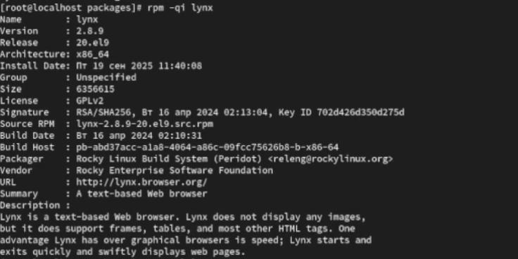{#fig:020 width=70%}

После чего получаем список всех файлов в пакете используя команду rpm -ql lynx

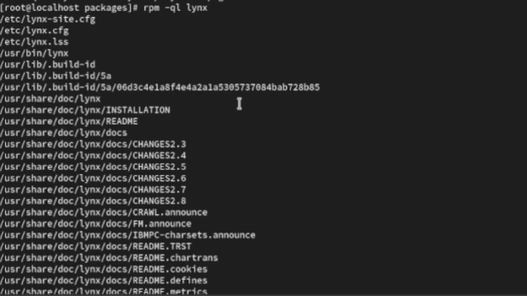{#fig:021 width=70%}

Просмотрим файлы документации применив команду man lynx

{#fig:022 width=70%}

Выведем на экран перечень и местонахождение конфигурационных файлов пакета 

{#fig:023 width=70%}

После чего выведем на экран расположение и содержание скриптов, после ввода команды мы обнаружим что у нас скриптов нет.

{#fig:024 width=70%}

В отдельном терминале запустим lynx и обнаружим что пакеты корректно установлены и все корректно работает 

{#fig:025 width=70%}

Вернувшись в терминал с учетной записью root  и удалим пакет lynx, и проверим это командой ls,данный пакет будет в левом столбце под номером 34

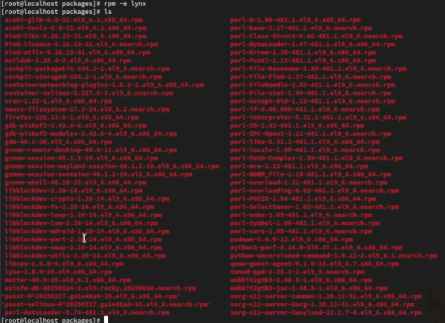{#fig:026 width=70%}

После чего найдем информацию о пакете dmsmasq,затем установим его и определим расположение файла.

{#fig:027 width=70%}

Определим по имени файла к какому пакету принадлежит dnsmasq

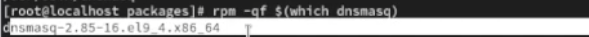{#fig:028 width=70%}

И получим дополнительную информацию о содержимом пакете.

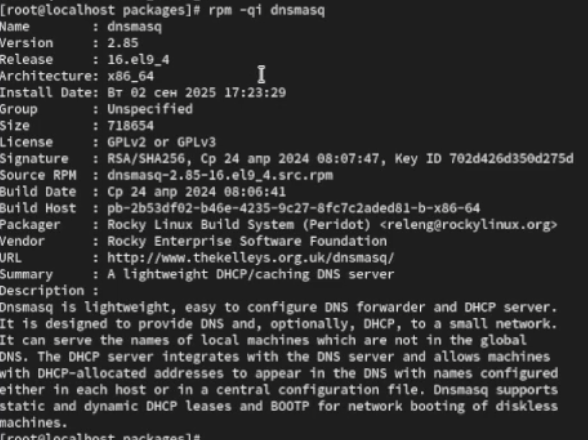{#fig:029 width=70%}

После чего получим список всех файлов в пакете

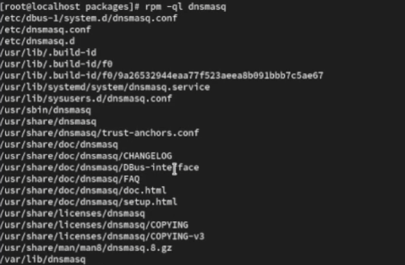{#fig:030 width=70%}

А также выведем перечень файлов с докементацией пакетов 

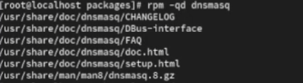{#fig:031 width=70%}

Далее просмотрим файл документации применив команду man dnsmasq.

{#fig:033 width=70%}

И выведем на экран перечень и месторасположение конфигурационных файлов пакета.

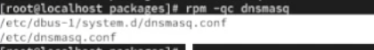{#fig:034 width=70%}

Затем выведем на экран расположение и содержание скриптов выполняемых при установке пакета.

{#fig:035 width=70%}

После чего возвращаемся в терминал и удаляем пакет 

{#fig:036 width=70%}

# Контрольные вопросы

1. Какая команда позволяет вам искать пакет rpm, содержащий файл useradd?

Ответ - команда rpm -qf $(Which useradd)

2. Какие команды вам нужно использовать, чтобы показать имя группы dnf, которая содержит инструменты безопасности и показывает, что находится в этой группе?

Ответ - команды dnf group list -v (найти группу) и  dnf group info "имя группы"

3. Какая команда позволяет вам установить rpm, который вы загрузили из Интернета и который не находится в репозиториях?

Ответ - команда dnf install /путь/к/файлу.rpm

4. Вы хотите убедиться, что пакет rpm, который вы загрузили, не содержит никакого опасного кода сценария. Какая команда позволяет это сделать?

Ответ - команда rpm --checksig имя_пакета.rpm 

5. Какая команда показывает всю документацию в rpm?

Ответ -  команда rpm -qd имя_пакета

6. Какая команда показывает, какому пакету rpm принадлежит файл?

Ответ -  команда rpm -qf /путь/к/файлу

# Выводы

В результате выполнения лабораторной работы я получил  навыки работы с репозиториями и менеджерами пакетов.
