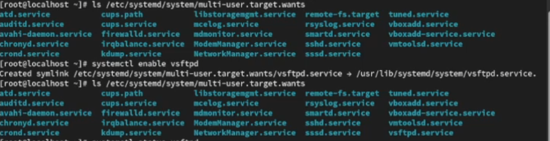
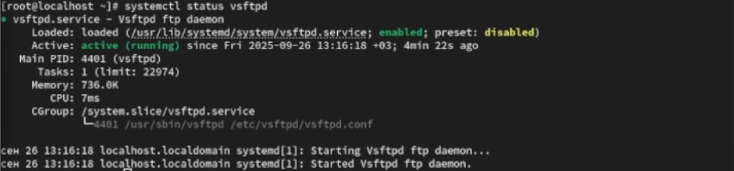
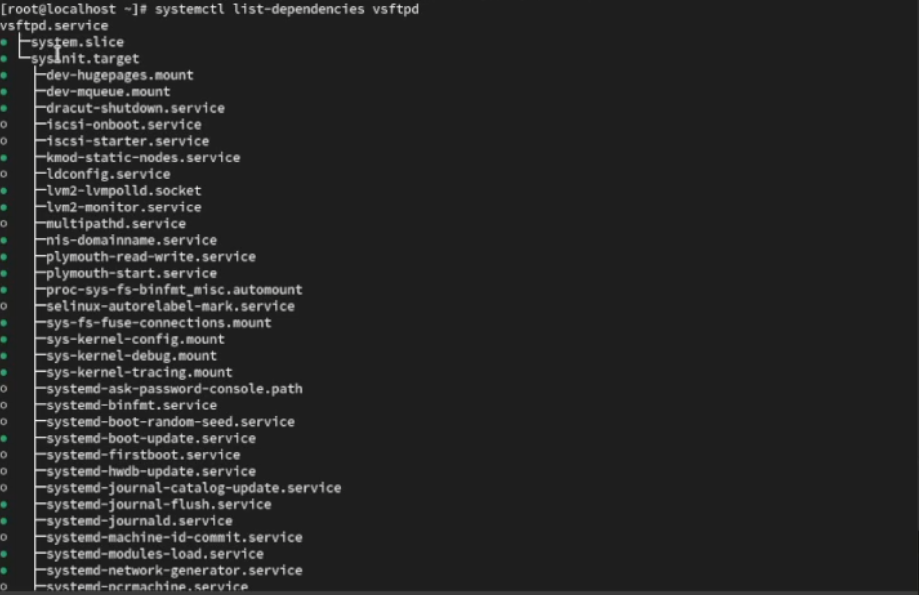
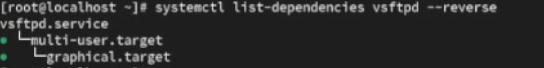
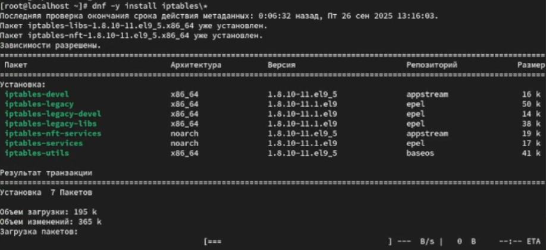
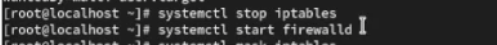
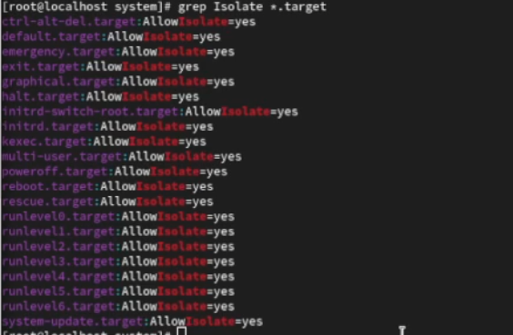
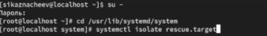
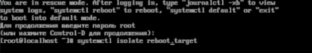
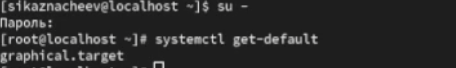

---
## Front matter
lang: ru-RU
title: Работа с программными пакетами
subtitle: Лабораторная работа №5 
author:
  - Казанчеев С.И.
institute:
  - Российский университет дружбы народов, Москва, Россия
date: 26 сентябрь 2025

## i18n babel
babel-lang: russian
babel-otherlangs: english

## Formatting pdf
toc: false
toc-title: Содержание
slide_level: 2
aspectratio: 169
section-titles: true
theme: metropolis
header-includes:
 - \metroset{progressbar=frametitle,sectionpage=progressbar,numbering=fraction}
---

# Информация

## Докладчик

:::::::::::::: {.columns align=center}
::: {.column width="70%"}

  * Казначеев Сергей Ильич
  * Студент
  * Российский университет дружбы народов
  * [1132240693@pfur.ru]
:::
::: {.column width="30%"}

## Цель работы 

Получить навыки управления системными слажбами операционной системы посредством systemd 

## Выполнение лабораторной работы

Для начала откроем терминал и перейдем в супер пользователя root после чего проверяем статус службы  Very Secure FTP и устанавливаем его 

## Запуск службы Very Secure FTP

Далее запускаем службу Very Secure FTP и проверяем статус службы Very Secure FTP

## Работа со службой Very Secure FTP

После чего чтобы добавить службу Very Secure FTP в автозапуск при загрузке операционной системы используем команду
systemctl enable vsftpd затем проверяем статус службы после чего удаляем службу из автозапуска  используя команду systemctl disable и снова проверяем статус 

## Работа со службой Very Secure FTP

Далее выводим символические ссылки ответственные за запуск различных сервисов после первого вывода мы увидим что ссылки на vsftpd.service не существует.После чего добавим службу Very Secure FTP в автозапуск и еще раз выведем ссылки и обнаружим что vsftpd.service добавилась

## Проверка изменение статуса disabled на enabled

Затем проверяем снова статус службы и увидим что файл юнита состояния изменено disabled на  enabled

## Вывод список зависимостей юнита 

Теперь выведем список зависимостей юнита

## Вывод список юнитов которые зависят от данного 

Затем выведем список юнитов которые зависят от данного юнита

## Установка iptables

После чего мы устанавливаем iptables 

{#fig:008 width=70%}

## Проверка статусов firewalld и iptables

Проверяем статус firewalld и iptables

{#fig:009 width=70%}

## Тестовый запуск  firewalld и iptables

Пробуем запустить firewalld и iptables

## Вывод на экран настрооек конфликтов для firewalld

После чего выведем на экран настройки конфликтов для firewalld и окажется что у него конфликт будет называться iptables.service iptable.service ebtables.service ipset.service 

## Вывод на экран настрооек конфликтов для iptables

Теперь выведем для iptables и там не будет конфликтов 

## Выгружем службу iptables и загружаем службу firewalld

После чего выгружаем службу iptables и загружаем службу firewalld и блокируем запуск iptables

## Тестовый запуск 

После блокировки iptables пробуем запустить его и  у нас появляется ошибка указывающая что служба замаскирована и по этой причине не может быть запущена.Пробуем добавить iptables в автозапуск и убеждаемся что сервис будет не активен и также будет оотображаться как замаскированным 

## После чего переходим в каталог system

После чего переходим в каталог system и нахом список всех целей которые можно изолировать 

## После чего переключаем операционную систмему 

Далее переключаем операционную систему в режим восстановления 

## Скрин

## Дальнейшие действия поле перезапуска системы 

После перезапуска системы переходим в супер пользователя root и выводим установленную цель по умолчанию

## Далее устанавливаем цель 

Далее устанавливаем цель используем команду systemctl set-default multi-user.target и перезаружем систему командой reboot.

## Проверяем что система загрузилась 

Затем проверяем что система загрузилась в текстовом режиме.После чего получаем полномочия администратора для и вводим команду systemctl set-default graphical.target и вновь перезагружаем командой reboot.Убеждаемся что загрузилась в графическом режиме

## Контрольные вопрос 1

1. Что такое юнит (unit)? Приведите примеры.

Ответ - это объект systemd описывающий службу, устройство точку монтирования и т.д
Пример -  service, target, mount

## Контрольные вопрос 2

2. Какая команда позволяет вам убедиться, что цель больше не входит в список автома-тического запуска при загрузке системы?

Ответ - чтобы проверить что цель больше не включина в автозапуск надо ввеси команду systemctl is-enabled <unit>

## Контрольные вопрос 3

3. Какую команду вы должны использовать для отображения всех сервисных юнитов,которые в настоящее время загружены?

Ответ - чтобы показать все загруженные сервисные юниты надо ввести команду systemctl list-units --type=service

## Контрольные вопрос 4

4. Как создать отребность (wants) в сервисе?

Ответ - что создать отребность (wants) в сервисе нужна команда  systemctl add-wants <target>.target <unit>.service

## Контрольные вопрос 5

5. Как переключить текущее состояние на цель восстановления (rescue target)?

Ответ - чтобы переключить текущее нужно переключиться в режим восстановления благодаря команде systemctl isolate rescue.target

## Контрольные вопрос 6

6. Поясните причину получения сообщения о том, что цель не может быть изолирована.

Ответ -  Цель не может быть изолирована если она не установлена как  AllowIsolate=yes в  unit-файле

## Контрольные вопрос 7

7. Вы хотите отключить службу systemd, но, прежде чем сделать это, вы хотите узнать, какие другие юниты зависят от этой службы. Какую команду вы бы использовали? 

Ответ - Показать зависимоть от службы командой  systemctl list-dependecies <unit>

## Вывод

В результате выполнения лабораторной работы я получил нываки работы управления системными служюами операционной системе посредством systemd

