---
## Front matter
lang: ru-RU
title: Дискреционное разграничение прав в Linux. Исследование влияния дополнительных атрибутов
subtitle: Лабораторная работа №5 
author:
  - Казанчеев С.И.
institute:
  - Российский университет дружбы народов, Москва, Россия
date: 26 сентябрь 2025

## i18n babel
babel-lang: russian
babel-otherlangs: english

## Formatting pdf
toc: false
toc-title: Содержание
slide_level: 2
aspectratio: 169
section-titles: true
theme: metropolis
header-includes:
 - \metroset{progressbar=frametitle,sectionpage=progressbar,numbering=fraction}
---

# Информация

## Докладчик

:::::::::::::: {.columns align=center}
::: {.column width="70%"}

  * Казначеев Сергей Ильич
  * Студент
  * Российский университет дружбы народов
  * [1132240693@pfur.ru]
:::
::: {.column width="30%"}

## Цель работы 

Изучение механизмов изменения идентификаторов, применения SetUID- и Sticky-битов. Получение практических навыков работы в консоли с дополнительными атрибутами. Рассмотрение работы механизма смены идентификатора процессов пользователей, а также влияние бита Sticky на запись и удаление файлов.

## Выполнение лабораторной работы

Для начала откроем терминал и перейдем в пользователя guest 

{#fig:001 width=70%}

## Simpleid

Далее создадим программму simpleid

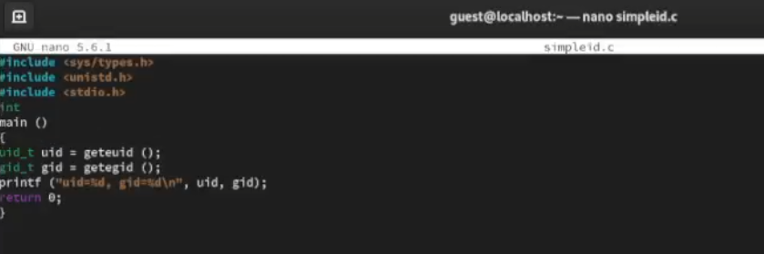{#fig:002 width=70%}

## Simpleid

После создания программы скомпелируем ее, далее выполним и выполним системную программу id 

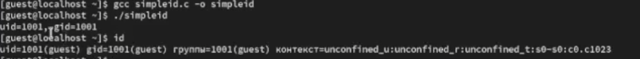{#fig:003 width=70%}

## Simpleid2

Затем усложним программу и назовем simpled2

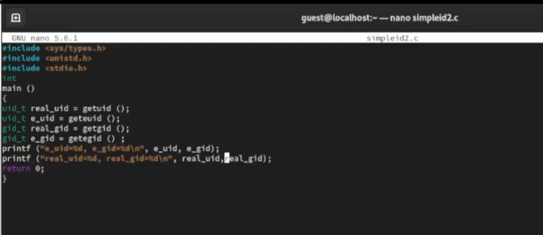{#fig:004 width=70%}

## Simpleid2

После чего скомпелируем и запустим ее 

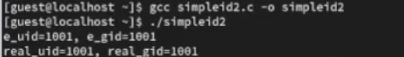{#fig:005 width=70%}

## Второй терминал

Далее откроем второй терминла и перейдем в суперпользователя и выполним команды 

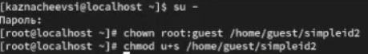{#fig:006 width=70%}

## Проверка установки новых атрибутов 

Затем выполним проверку правильности установки новых атрибутов и смены владельца simpleid2, и запустим simpleid2

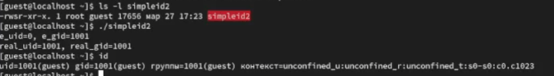{#fig:007 width=70%}

## Readfile

После чего создадим программу readfile

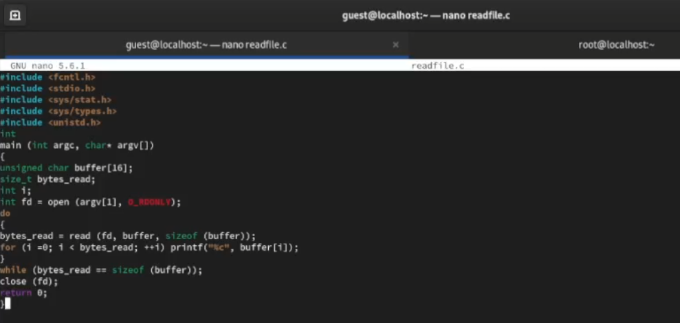{#fig:008 width=70%}

## Readfile

Скомпелируем readfile 

{#fig:009 width=70%}

## Второй терминал

После чего перейдем в супер пользователя и сменим владельца файла на root и установим права 600

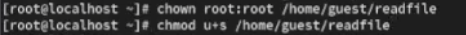{#fig:010 width=70%}

## Файл /etc/shadow

После все проделанных действий выведем  прочитанный файл /etc/shadow

{#fig:011 width=70%}

## Проверка наличие директориии tmp 

Затем перейдем в суперпользователя и проверим наличие директории tmp

{#fig:012 width=70%}

## Работа с file01

После чего от имени пользователя guest запишем слово test в file01, далее просмотрим  атрибуты у только что созданного нами файла и разрешим чтение и запись для категории  всех пользователей 

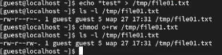{#fig:013 width=70%}

## Работа с file01

Далее перейдем в пользователя guest2,и попробуем прочитать file01, затем дозаписать в file01 test2,теперь проверим содержимое файла, и проделаем то же самое для test4,после чего попробуем удалить 

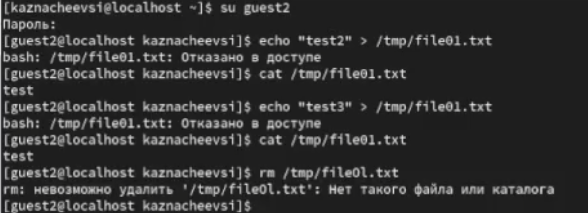{#fig:014 width=70%}

## Работа с file01

После все проделанных действий повысим свои права до суперпользователя и выполним команду снять sticky-бит директории

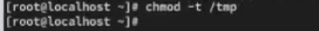{#fig:015 width=70%}

## Пользователь guest2

Затем от пользователя guest2 ,проверим что sticky-бит снят

{#fig:016 width=70%}

## Пользователь guest2

И проделаем те же  дейтсвия, что и со словами test2 и test3

{#fig:017 width=70%}

## Второй терминал 

После чего перейдем в суперпользователя и вернем sticky- бит на директорию /tmp

{#fig:018 width=70%}

## Выводы

В результате выполнения лабораторной работы я изучил механизм изменения идентификаторов, примененияSetUID- и Sticky-битов. Получение практических навыков работы в консоли с дополнительными атрибутами. Рассмотрение работы механизма смены идентификатора процессов пользователей, а также влияние бита Sticky на запись и удаление файлов

