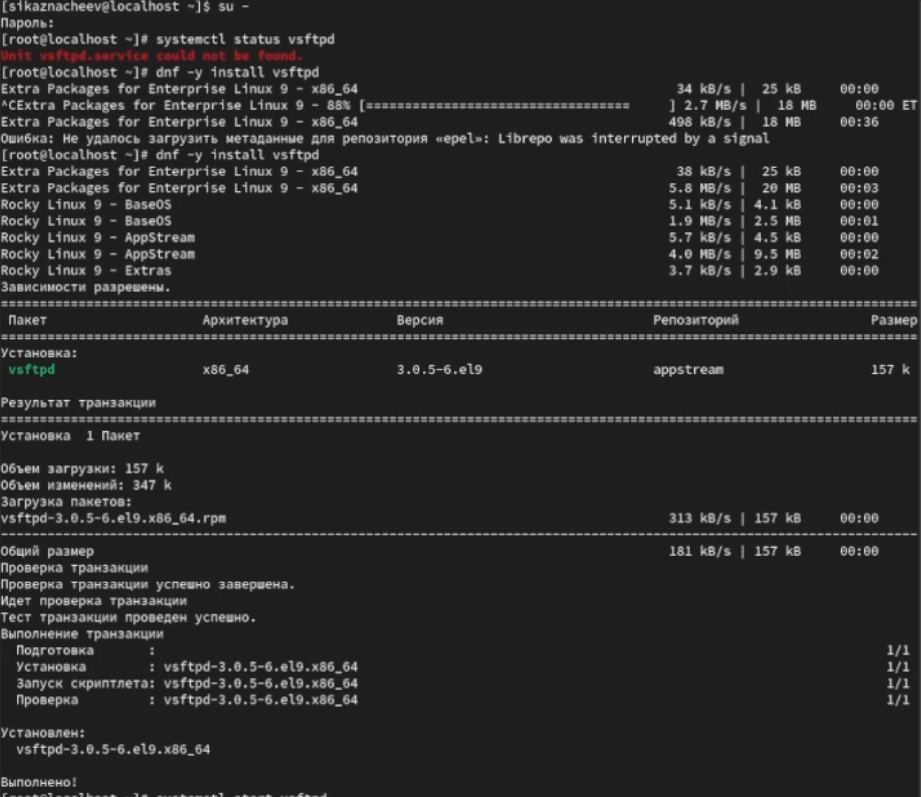
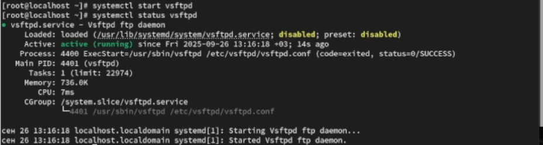
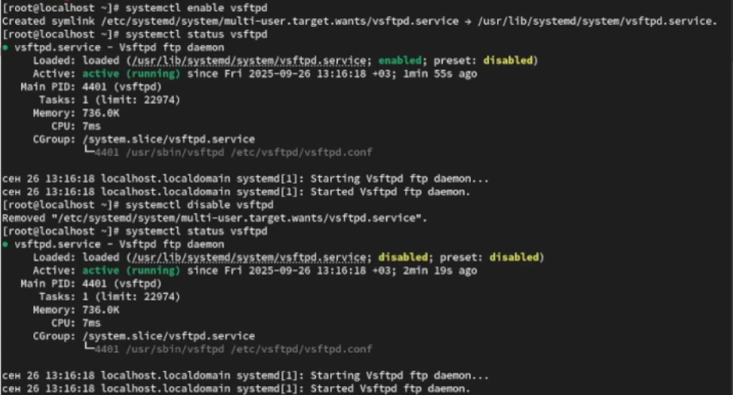
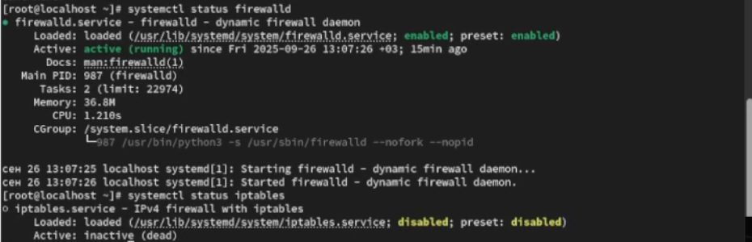
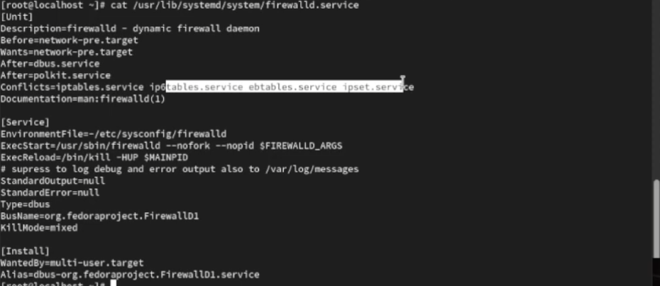
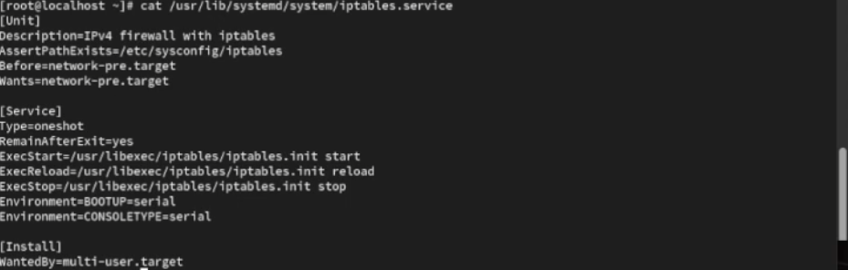
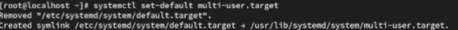

---
## Front matter
title: "Отчет о лабораторной работе"
subtitle: "Лабораторная работа №5"
author: "Казначеев Сергей Ильич"

## Generic otions
lang: ru-RU
toc-title: "Содержание"

## Bibliography
bibliography: bib/cite.bib
csl: pandoc/csl/gost-r-7-0-5-2008-numeric.csl

## Pdf output format
toc: true # Table of contents
toc-depth: 2
lof: true # List of figures
lot: true # List of tables
fontsize: 12pt
linestretch: 1.5
papersize: a4
documentclass: scrreprt
## I18n polyglossia
polyglossia-lang:
  name: russian
  options:
	- spelling=modern
	- babelshorthands=true
polyglossia-otherlangs:
  name: english
## I18n babel
babel-lang: russian
babel-otherlangs: english
## Fonts
mainfont: IBM Plex Serif
romanfont: IBM Plex Serif
sansfont: IBM Plex Sans
monofont: IBM Plex Mono
mathfont: STIX Two Math
mainfontoptions: Ligatures=Common,Ligatures=TeX,Scale=0.94
romanfontoptions: Ligatures=Common,Ligatures=TeX,Scale=0.94
sansfontoptions: Ligatures=Common,Ligatures=TeX,Scale=MatchLowercase,Scale=0.94
monofontoptions: Scale=MatchLowercase,Scale=0.94,FakeStretch=0.9
mathfontoptions:
## Biblatex
biblatex: true
biblio-style: "gost-numeric"
biblatexoptions:
  - parentracker=true
  - backend=biber
  - hyperref=auto
  - language=auto
  - autolang=other*
  - citestyle=gost-numeric
## Pandoc-crossref LaTeX customization
figureTitle: "Рис."
tableTitle: "Таблица"
listingTitle: "Листинг"
lofTitle: "Список иллюстраций"
lotTitle: "Список таблиц"
lolTitle: "Листинги"
## Misc options
indent: true
header-includes:
  - \usepackage{indentfirst}
  - \usepackage{float} # keep figures where there are in the text
  - \floatplacement{figure}{H} # keep figures where there are in the text
---

# Цель работы 

Получить навыки управления системными слажбами операционной системы посредством systemd 

# Выполнение лабораторной работы

Для начала откроем терминал и перейдем в супер пользователя root после чего проверяем статус службы  Very Secure FTP и устанавливаем его  (рис. [-@fig:001]).

{#fig:001 width=70%}

Далее запускаем службу Very Secure FTP и проверяем статус службы Very Secure FTP (рис. [-@fig:002]).

{#fig:002 width=70%}

После чего чтобы добавить службу Very Secure FTP в автозапуск при загрузке операционной системы используем команду
systemctl enable vsftpd затем проверяем статус службы после чего удаляем службу из автозапуска  используя команду systemctl disable и снова проверяем статус  (рис.[-@fig:003]).

{#fig:003 width=70%}

Далее выводим символические ссылки ответственные за запуск различных сервисов после первого вывода мы увидим что ссылки на vsftpd.service не существует.После чего добавим службу Very Secure FTP в автозапуск и еще раз выведем ссылки и обнаружим что vsftpd.service добавилась (рис. [-@fig:004]).

{#fig:004 width=70%}

Затем проверяем снова статус службы и увидим что файл юнита состояния изменено disabled на  enabled(рис. [-@fig:005]).

{#fig:005 width=70%}

Теперь выведем список зависимостей юнита (рис. [-@fig:006]).

{#fig:006 width=70%}

Затем выведем список юнитов которые зависят от данного юнита(рис. [-@fig:007]).

{#fig:007 width=70%}

После чего мы устанавливаем iptables (рис. [-@fig:008]).

{#fig:008 width=70%}

Проверяем статус firewalld и iptables (рис. [-@fig:009]).

{#fig:009 width=70%}

Пробуем запустить firewalld и iptables (рис. [-@fig:010]).

{#fig:010 width=70%}

После чего выведем на экран настройки конфликтов для firewalld и окажется что у него конфликт будет называться iptables.service iptable.service ebtables.service ipset.service (рис. [-@fig:011]).

{#fig:011 width=70%}

Теперь выведем для iptables и там не будет конфликтов (рис. [-@fig:012]).

{#fig:012 width=70%}

После чего выгружаем службу iptables и загружаем службу firewalld и блокируем запуск iptables(рис. [-@fig:013]).

{#fig:013 width=70%}

После блокировки iptables пробуем запустить его и  у нас появляется ошибка указывающая что служба замаскирована и по этой причине не может быть запущена.Пробуем добавить iptables в автозапуск и убеждаемся что сервис будет не активен и также будет оотображаться как замаскированным (рис. [-@fig:014).

{#fig:014 width=70%}

После чего переходим в каталог system и нахом список всех целей которые можно изолировать (рис. [-@fig:015]). 

{#fig:015 width=70%}

Далее переключаем операционную систему в режим восстановления (рис. [-@fig:016]). 

{#fig:016 width=70%}

{#fig:017 width=70%}

После перезапуска системы переходим в супер пользователя root и выводим установленную цель по умолчанию (рис. [-@fig:018]). 
 
{#fig:018 width=70%}

Далее устанавливаем цель используем команду systemctl set-default multi-user.target и перезаружем систему командой reboot.(рис. [-@fig:019]). 

{#fig:019 width=70%}

Затем проверяем что система загрузилась в текстовом режиме.После чего получаем полномочия администратора для и вводим команду systemctl set-default graphical.target и вновь перезагружаем командой reboot.Убеждаемся что загрузилась в графическом режиме (рис. [-@fig:020]). 

{#fig:020 width=70%}

# Контрольные вопросы

1. Что такое юнит (unit)? Приведите примеры.

Ответ - это объект systemd описывающий службу, устройство точку монтирования и т.д
Пример -  service, target, mount

2. Какая команда позволяет вам убедиться, что цель больше не входит в список автома-тического запуска при загрузке системы?

Ответ - чтобы проверить что цель больше не включина в автозапуск надо ввеси команду systemctl is-enabled <unit>

3. Какую команду вы должны использовать для отображения всех сервисных юнитов,которые в настоящее время загружены?

Ответ - чтобы показать все загруженные сервисные юниты надо ввести команду systemctl list-units --type=service

4. Как создать отребность (wants) в сервисе?

Ответ - что создать отребность (wants) в сервисе нужна команда  systemctl add-wants <target>.target <unit>.service

5. Как переключить текущее состояние на цель восстановления (rescue target)?

Ответ - чтобы переключить текущее нужно переключиться в режим восстановления благодаря команде systemctl isolate rescue.target

6. Поясните причину получения сообщения о том, что цель не может быть изолирована.

Ответ -  Цель не может быть изолирована если она не установлена как  AllowIsolate=yes в  unit-файле

7. Вы хотите отключить службу systemd, но, прежде чем сделать это, вы хотите узнать, какие другие юниты зависят от этой службы. Какую команду вы бы использовали? 

Ответ - Показать зависимоть от службы командой  systemctl list-dependecies <unit>

# Выводы

В результате выполнения лабораторной работы я получил нываки работы управления системными служюами операционной системе посредством systemd
