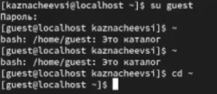
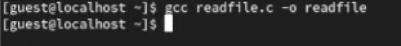
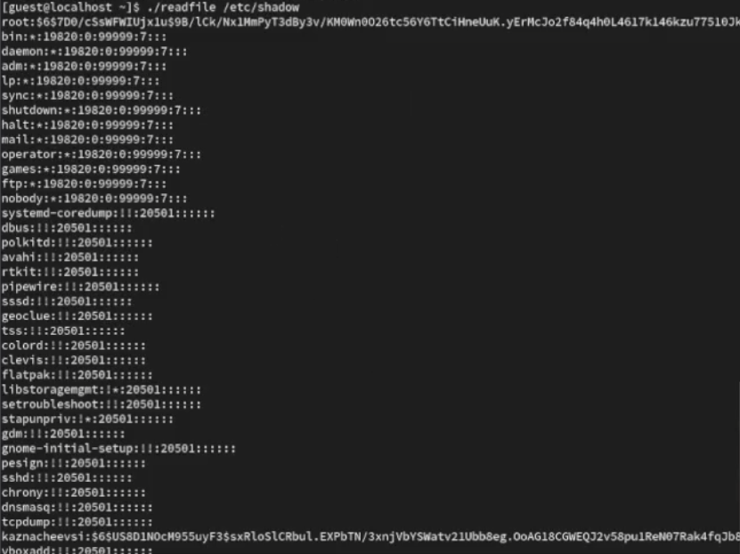
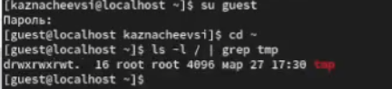
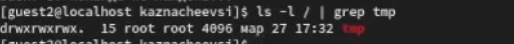
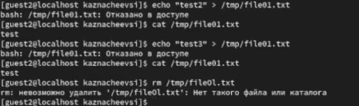
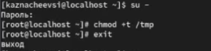

---
## Front matter
title: "Отчет о лабораторной работе"
subtitle: "Лабораторная работа №5"
author: "Казначеев Сергей Ильич"

## Generic otions
lang: ru-RU
toc-title: "Содержание"

## Bibliography
bibliography: bib/cite.bib
csl: pandoc/csl/gost-r-7-0-5-2008-numeric.csl

## Pdf output format
toc: true # Table of contents
toc-depth: 2
lof: true # List of figures
lot: true # List of tables
fontsize: 12pt
linestretch: 1.5
papersize: a4
documentclass: scrreprt
## I18n polyglossia
polyglossia-lang:
  name: russian
  options:
	- spelling=modern
	- babelshorthands=true
polyglossia-otherlangs:
  name: english
## I18n babel
babel-lang: russian
babel-otherlangs: english
## Fonts
mainfont: IBM Plex Serif
romanfont: IBM Plex Serif
sansfont: IBM Plex Sans
monofont: IBM Plex Mono
mathfont: STIX Two Math
mainfontoptions: Ligatures=Common,Ligatures=TeX,Scale=0.94
romanfontoptions: Ligatures=Common,Ligatures=TeX,Scale=0.94
sansfontoptions: Ligatures=Common,Ligatures=TeX,Scale=MatchLowercase,Scale=0.94
monofontoptions: Scale=MatchLowercase,Scale=0.94,FakeStretch=0.9
mathfontoptions:
## Biblatex
biblatex: true
biblio-style: "gost-numeric"
biblatexoptions:
  - parentracker=true
  - backend=biber
  - hyperref=auto
  - language=auto
  - autolang=other*
  - citestyle=gost-numeric
## Pandoc-crossref LaTeX customization
figureTitle: "Рис."
tableTitle: "Таблица"
listingTitle: "Листинг"
lofTitle: "Список иллюстраций"
lotTitle: "Список таблиц"
lolTitle: "Листинги"
## Misc options
indent: true
header-includes:
  - \usepackage{indentfirst}
  - \usepackage{float} # keep figures where there are in the text
  - \floatplacement{figure}{H} # keep figures where there are in the text
---

# Цель работы 

Изучение механизмов изменения идентификаторов, применения SetUID- и Sticky-битов. Получение практических навыков работы в консоли с дополнительными атрибутами. Рассмотрение работы механизма смены идентификатора процессов пользователей, а также влияние бита Sticky на запись и удаление файлов.

# Выполнение лабораторной работы

Для начала откроем терминал и перейдем в пользователя guest 

{#fig:001 width=70%}

Далее создадим программму simpleid

{#fig:002 width=70%}

После создания программы скомпелируем ее, далее выполним и выполним системную программу id 

{#fig:003 width=70%}

Затем усложним программу и назовем simpled2

{#fig:004 width=70%}

После чего скомпелируем и запустим ее 

{#fig:005 width=70%}

Далее откроем второй терминла и перейдем в суперпользователя и выполним команды 

{#fig:006 width=70%}

Затем выполним проверку правильности установки новых атрибутов и смены владельца simpleid2, и запустим simpleid2

{#fig:007 width=70%}

После чего создадим программу readfile

{#fig:008 width=70%}

Скомпелируем readfile 

{#fig:009 width=70%}

После чего перейдем в супер пользователя и сменим владельца файла на root и установим права 600

{#fig:010 width=70%}

После все проделанных действий выведем  прочитанный файл /etc/shadow

{#fig:011 width=70%}

Затем перейдем в суперпользователя и проверим наличие директории tmp

{#fig:012 width=70%}

После чего от имени пользователя guest запишем слово test в file01, далее просмотрим  атрибуты у только что созданного нами файла и разрешим чтение и запись для категории  всех пользователей 

{#fig:013 width=70%}

Далее перейдем в пользователя guest2,и попробуем прочитать file01, затем дозаписать в file01 test2,теперь проверим содержимое файла, и проделаем то же самое для test4,после чего попробуем удалить 

{#fig:014 width=70%}

После все проделанных действий повысим свои права до суперпользователя и выполним команду снять sticky-бит директории

{#fig:015 width=70%}

Затем от пользователя guest2 ,проверим что sticky-бит снят

{#fig:016 width=70%}

И проделаем те же  дейтсвия, что и со словами test2 и test3

{#fig:017 width=70%}

После чего перейдем в суперпользователя и вернем sticky- бит на директорию /tmp

{#fig:018 width=70%}

# Выводы

В результате выполнения лабораторной работы я изучил механизм изменения идентификаторов, примененияSetUID- и Sticky-битов. Получение практических навыков работы в консоли с дополнительными атрибутами. Рассмотрение работы механизма смены идентификатора процессов пользователей, а также влияние бита Sticky на запись и удаление файлов
