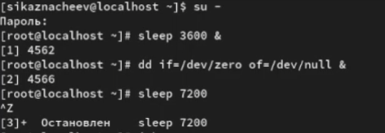
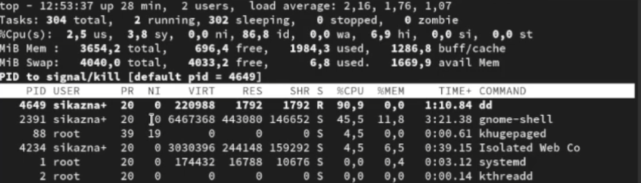
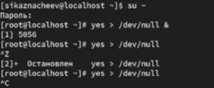
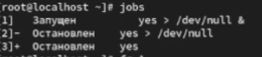
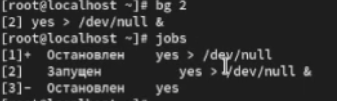
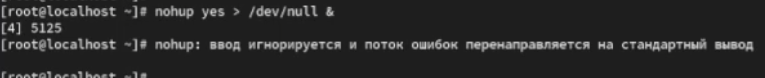
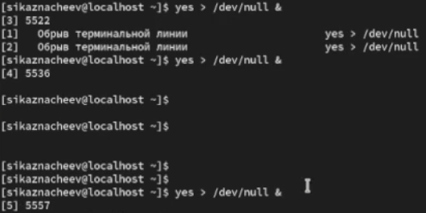
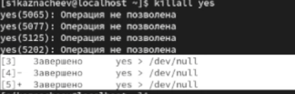

---
## Front matter
lang: ru-RU
title: Управление процессами 
subtitle: Лабораторная работа №6 
author:
  - Казначеев С.И.
institute:
  - Российский университет дружбы народов, Москва, Россия
date: 7 октября 2025

## i18n babel
babel-lang: russian
babel-otherlangs: english

## Formatting pdf
toc: false
toc-title: Содержание
slide_level: 2
aspectratio: 169
section-titles: true
theme: metropolis
header-includes:
 - \metroset{progressbar=frametitle,sectionpage=progressbar,numbering=fraction}
---

# Информация

## Докладчик

:::::::::::::: {.columns align=center}
::: {.column width="70%"}

  * Казначеев Сергей Ильич
  * Студент
  * Российский университет дружбы народов
  * [1132240693@pfur.ru]
:::
::: {.column width="30%"}

## Цель работы 

Получить навыки управления процессами операционной системы.

## Выполнение лабораторной работы

Для начала откроем терминал и перейдем в супер пользователя root после чего введем три команды 
1. sleep 3600 &
2. dd if=/dev/zero of=/dev/null &
3. sleep 7200
После остановим процесс sleep 7200 

Далее проверяем наши задачи с помошью команды jobs и продолжим 3 задание в фоновом режиме  с помощью команды bg 3 

## Перенос заданий 

После чего переводим 1 задание на передний план и отменим ее.Затем проверим статус заданий с помощью команды jobs после проверки проделаем тоже самое с 2 и 3 

Далее открываем второй терминал и под своей учетной записью вводим команду dd if=/dev/zero of=/dev/null &  и введем exit чтобы закрыть второй терминал

## Выход из top

Затем введем команду top  чтобы проверить запущена задание  dd  или нет. После проверки выйдем используя q

## Ввод команд 

Теперь перейдем в супер пользователя и введем следующие три команды 
1. dd if=/dev/zero of=/dev/null &
2. dd if=/dev/zero of=/dev/null &
3. dd if=/dev/zero of=/dev/null &

## Просмотр строк dd

Затем введем комаду ps aux | grep dd данная команда нам покажет строки в которых есть буква dd

## Смена приритетов 

После испльзуем PID ондого из процессов  dd чтобы изменить приоритет

## Просмотр иерархии

Далее введем ps fax | grep -B5 dd и увидим иерархию отношений между процессами и оболочку из которой были запущены процессы dd и ее PID 

## Убийство процесса

После чего находим PID корневой оболчки из которой были запущены процессы dd и введем kill -9 4682

## Запуск команд 

Далее  запустим команду dd if=/dev/zero of=/dev/null трижды

## Работа с приоритетами 

После чего увеличим приоритет одного из процессов на 5, а потом изменим на 15  и завершим все процессы 

## Задание 1-3

После запусти программу yes в фоновом режиме с подавлением потока вывода,далее запустим программу yes на переднем плане с подавлением потока вывода.После чего приостоновим процесс и заново запустим с теми же параметрами и завершим ее выполение

## Задание 4

После чего проверим состояния заданий

## Задание 5

Далее переводим процесс который выполняется в  фоновом режиме  на передний план и останавливем его

## Задание 6-8

Далее переводим любой процесс с подавлением потока вывода в фоновом режиме, затем проверяем состояние заданий командой jobs и запускаем процесс в фоновом режиме таким образом чтобы он продолжил свою работу даже после отключения 

## Задание 9

После закрываем окно и заново запускаем консоль
 

## Задание 10

И проверяем процессы.

## Задание 11

Затем  запустим три программы yes в фоновом режиме с подавлением потока вывода

## Задание 12

После чего убиваем два процесса для одного используем PID а для другого его индификатор конкретного задания 

## Задание 13

Пробуем послать сигнал 1 процессу запущенному с помощью nohup  и обычному  процессу 

## Задание 14

После чего запускаем еще несколько программ yes в фоновом режиме с подавлением потока вывода 

## Задание 15

И убиваем все процессы yes c помощью команды  killall yes

## Задание 16-17

Запустим программу yes в фоновом режиме с подавлением потока вывода.После чего используя утилиту nice запустим программу yes с теми же параметрами и с приоритетом большим на 5.И используя утилиту renice изменим приоритет у одного из потоков yes таким образом чтобы у обоих потоков приоритеты были равны 

{#fig:025 width=70%}

## Контрольный вопрос номер 1 

1. Какая команда даёт обзор всех текущих заданий оболочки?

Ответ - команда jobs показывает список всех заданий запущенных из текущей оболочки 

## Контрольный вопрос номер 2

2. Как остановить текущее задание оболочки, чтобы продолжить его выполнение в фоновом режиме?

Ответ - сначала приостанавливаем задание нажав на комбинаю клави Ctrl+Z затем отправляем его фон bg

## Контрольный вопрос номер 3

3. Какую комбинацию клавиш можно использовать для отмены текущего задания оболочки?

Ответ - комбинацию клавиш Ctrl+C

## Контрольный вопрос номер 4

4. Необходимо отменить одно из начатых заданий. Доступ к оболочке, в которой в данный момент работает пользователь, невозможен. Что можно сделать, чтобы отменить задание?

Ответ - используя команду kill указав pid процесса 

## Контрольный вопрос номер 5

5. Какая команда используется для отображения отношений между родительскими и дочерними процессами? 

Ответ - комадна pstree

## Контрольный вопрос номер 6

6. Какая команда позволит изменить приоритет процесса с идентификатором 1234 на более высокий?

Ответ - более высокий приоритет = меньшее значение nice sudo.  Пример renice -n -5 -p 1234

## Контрольный вопрос номер 7

7. В системе в настоящее время запущено 20 процессов dd. Как проще всего остановить их все сразу?

Ответ - команда killall dd

## Контрольный вопрос номер 8

8. Какая команда позволяет остановить команду с именем mycommand?

Ответ - команда pkill mycommand

## Контрольный вопрос номер 9

9. Какая команда используется в top, чтобы убить процесс?

Ответ - во время работы top нажать на клавишу k

## Контрольный вопрос номер 10 

10. Как запустить команду с достаточно высоким приоритетом, не рискуя, что не хватит ресурсов для других процессов?

Ответ - запустить команду с пониженным приоритетом. Комадна -nice -n 10 <command>

## Вывод 

В результате выполнения лабораторной работы я получил нываки управления процессами операционной системы 

