---
## Front matter
title: "Отчет о лабораторной работе"
subtitle: "Лабораторная работа №6"
author: "Казначеев Сергей Ильич"

## Generic otions
lang: ru-RU
toc-title: "Содержание"

## Bibliography
bibliography: bib/cite.bib
csl: pandoc/csl/gost-r-7-0-5-2008-numeric.csl

## Pdf output format
toc: true # Table of contents
toc-depth: 2
lof: true # List of figures
lot: true # List of tables
fontsize: 12pt
linestretch: 1.5
papersize: a4
documentclass: scrreprt
## I18n polyglossia
polyglossia-lang:
  name: russian
  options:
	- spelling=modern
	- babelshorthands=true
polyglossia-otherlangs:
  name: english
## I18n babel
babel-lang: russian
babel-otherlangs: english
## Fonts
mainfont: IBM Plex Serif
romanfont: IBM Plex Serif
sansfont: IBM Plex Sans
monofont: IBM Plex Mono
mathfont: STIX Two Math
mainfontoptions: Ligatures=Common,Ligatures=TeX,Scale=0.94
romanfontoptions: Ligatures=Common,Ligatures=TeX,Scale=0.94
sansfontoptions: Ligatures=Common,Ligatures=TeX,Scale=MatchLowercase,Scale=0.94
monofontoptions: Scale=MatchLowercase,Scale=0.94,FakeStretch=0.9
mathfontoptions:
## Biblatex
biblatex: true
biblio-style: "gost-numeric"
biblatexoptions:
  - parentracker=true
  - backend=biber
  - hyperref=auto
  - language=auto
  - autolang=other*
  - citestyle=gost-numeric
## Pandoc-crossref LaTeX customization
figureTitle: "Рис."
tableTitle: "Таблица"
listingTitle: "Листинг"
lofTitle: "Список иллюстраций"
lotTitle: "Список таблиц"
lolTitle: "Листинги"
## Misc options
indent: true
header-includes:
  - \usepackage{indentfirst}
  - \usepackage{float} # keep figures where there are in the text
  - \floatplacement{figure}{H} # keep figures where there are in the text
---

# Цель работы 

Получить навыки управления процессами операционной системы.

# Выполнение лабораторной работы

Для начала откроем терминал и перейдем в супер пользователя root после чего введем три команды 
1. sleep 3600 &
2. dd if=/dev/zero of=/dev/null &
3. sleep 7200
После остановим процесс sleep 7200 (рис. [-@fig:001]).

{#fig:001 width=70%}

Далее проверяем наши задачи с помошью команды jobs и продолжим 3 задание в фоновом режиме  с помощью команды bg 3 (рис. [-@fig:002]).

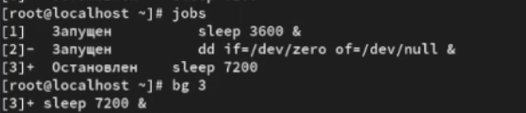{#fig:002 width=70%}

После чего переводим 1 задание на передний план и отменим ее.Затем проверим статус заданий с помощью команды jobs после проверки проделаем тоже самое с 2 и 3 (рис.[-@fig:003]).

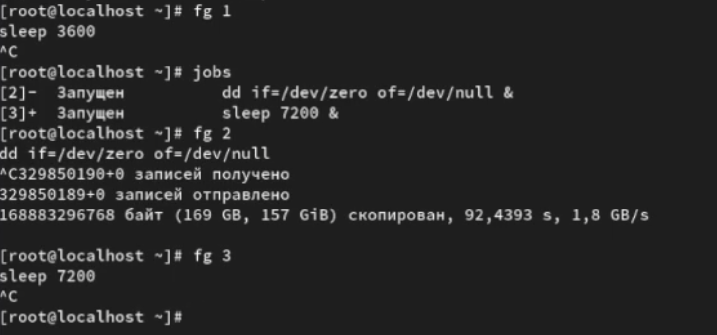{#fig:003 width=70%}

Далее открываем второй терминал и под своей учетной записью вводим команду dd if=/dev/zero of=/dev/null &  и введем exit чтобы закрыть второй терминал(рис. [-@fig:004]).

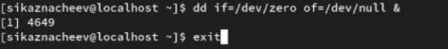{#fig:004 width=70%}

Затем введем команду top  чтобы проверить запущена задание  dd  или нет. После проверки выйдем используя q(рис. [-@fig:005]).

{#fig:005 width=70%}

Теперь перейдем в супер пользователя и введем следующие три команды 
1. dd if=/dev/zero of=/dev/null &
2. dd if=/dev/zero of=/dev/null &
3. dd if=/dev/zero of=/dev/null &
(рис. [-@fig:006]).

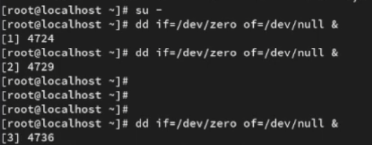{#fig:006 width=70%}

Затем введем комаду ps aux | grep dd данная команда нам покажет строки в которых есть буква dd (рис. [-@fig:007]).

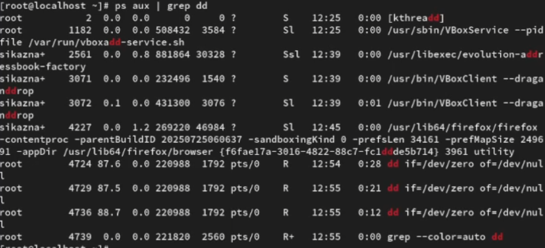{#fig:007 width=70%}

После испльзуем PID ондого из процессов  dd чтобы изменить приоритет (рис. [-@fig:008]).

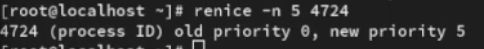{#fig:008 width=70%}

Далее введем ps fax | grep -B5 dd и увидим иерархию отношений между процессами и оболочку из которой были запущены процессы dd и ее PID (рис. [-@fig:009]).

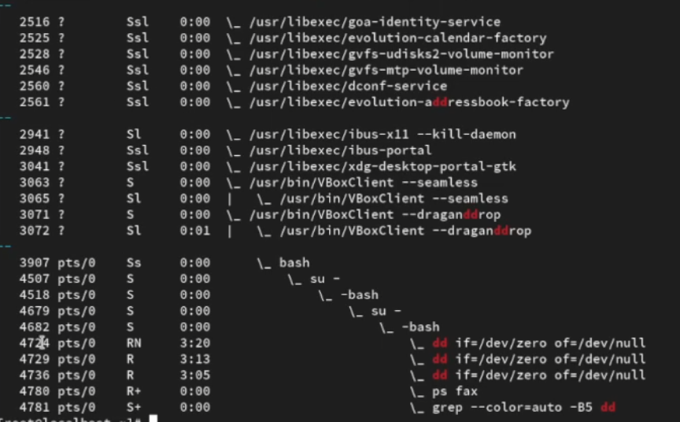{#fig:009 width=70%}

После чего находим PID корневой оболчки из которой были запущены процессы dd и введем kill -9 4682 (рис. [-@fig:010]).

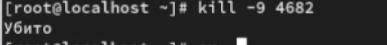{#fig:010 width=70%}

Далее  запустим команду dd if=/dev/zero of=/dev/null трижды  (рис. [-@fig:012]).

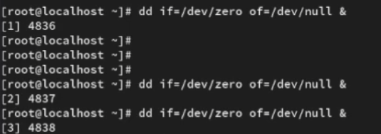{#fig:012 width=70%}

После чего увеличим приоритет одного из процессов на 5, а потом изменим на 15  и завершим все процессы (рис. [-@fig:013]).

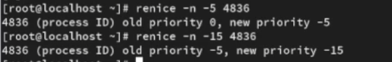{#fig:013 width=70%}

После запусти программу yes в фоновом режиме с подавлением потока вывода,далее запустим программу yes на переднем плане с подавлением потока вывода.После чего приостоновим процесс и заново запустим с теми же параметрами и завершим ее выполение (рис. [-@fig:014).

{#fig:014 width=70%}

После чего проверим состояния заданий (рис. [-@fig:015]). 

{#fig:015 width=70%}

Далее переводим процесс который выполняется в  фоновом режиме  на передний план и останавливем его   (рис. [-@fig:016]). 

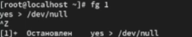{#fig:016 width=70%}

Далее переводим любой процесс с подавлением потока вывода в фоновом режиме, затем проверяем состояние заданий командой jobs и запускаем процесс в фоновом режиме таким образом чтобы он продолжил свою работу даже после отключения 

{#fig:017 width=70%}

После закрываем окно и заново запускаем консоль(рис. [-@fig:018]). 
 
{#fig:018 width=70%}

И проверяем процессы.(рис. [-@fig:019]). 

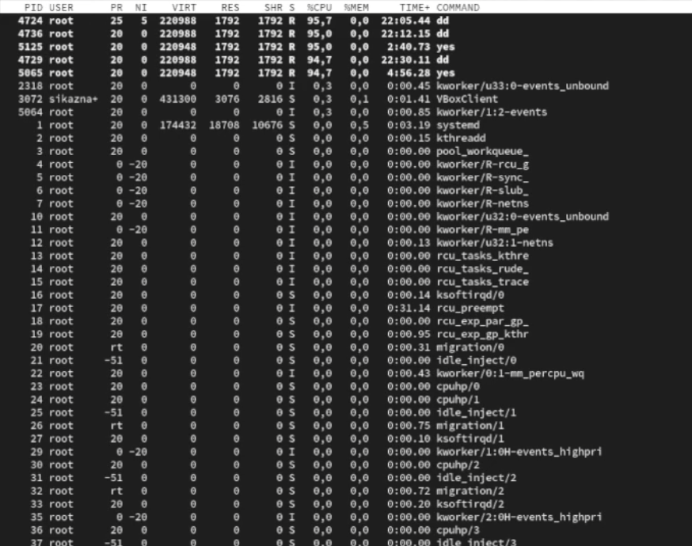{#fig:019 width=70%}

Затем  запустим три программы yes в фоновом режиме с подавлением потока вывода(рис. [-@fig:020]). 

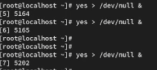{#fig:020 width=70%}

После чего убиваем два процесса для одного используем PID а для другого его индификатор конкретного задания 

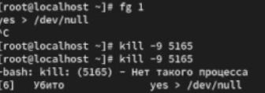{#fig:021 width=70%}

Пробуем послать сигнал 1 процессу запущенному с помощью nohup  и обычному  процессу 

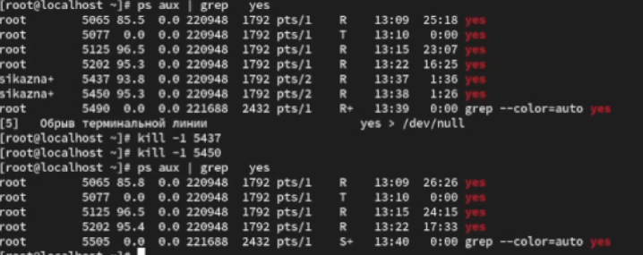{#fig:022 width=70%}

После чего запускаем еще несколько программ yes в фоновом режиме с подавлением потока вывода 

{#fig:023 width=70%}

И убиваем все процессы yes c помощью команды  killall yes

{#fig:024 width=70%}

Запустим программу yes в фоновом режиме с подавлением потока вывода.После чего используя утилиту nice запустим программу yes с теми же параметрами и с приоритетом большим на 5.И используя утилиту renice изменим приоритет у одного из потоков yes таким образом чтобы у обоих потоков приоритеты были равны 

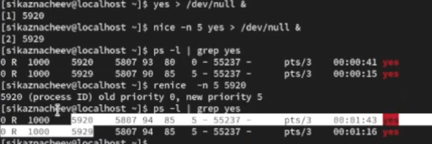{#fig:025 width=70%}

# Контрольные вопросы

1. Какая команда даёт обзор всех текущих заданий оболочки?

Ответ - команда jobs показывает список всех заданий запущенных из текущей оболочки 

2. Как остановить текущее задание оболочки, чтобы продолжить его выполнение в фоновом режиме?

Ответ - сначала приостанавливаем задание нажав на комбинаю клави Ctrl+Z затем отправляем его фон bg

3. Какую комбинацию клавиш можно использовать для отмены текущего задания оболочки?

Ответ - комбинацию клавиш Ctrl+C

4. Необходимо отменить одно из начатых заданий. Доступ к оболочке, в которой в данный момент работает пользователь, невозможен. Что можно сделать, чтобы отменить задание?

Ответ - используя команду kill указав pid процесса 

5. Какая команда используется для отображения отношений между родительскими и дочерними процессами? 

Ответ - комадна pstree

6. Какая команда позволит изменить приоритет процесса с идентификатором 1234 на более высокий?

Ответ - более высокий приоритет = меньшее значение nice sudo.  Пример renice -n -5 -p 1234

7. В системе в настоящее время запущено 20 процессов dd. Как проще всего остановить их все сразу?

Ответ - команда killall dd

8. Какая команда позволяет остановить команду с именем mycommand?

Ответ - команда pkill mycommand

9. Какая команда используется в top, чтобы убить процесс?

Ответ - во время работы top нажать на клавишу k

10. Как запустить команду с достаточно высоким приоритетом, не рискуя, что не хватит ресурсов для других процессов?

Ответ - запустить команду с пониженным приоритетом. Комадна -nice -n 10 <command>

# Выводы

В результате выполнения лабораторной работы я получил нываки управления процессами операционной системы 
