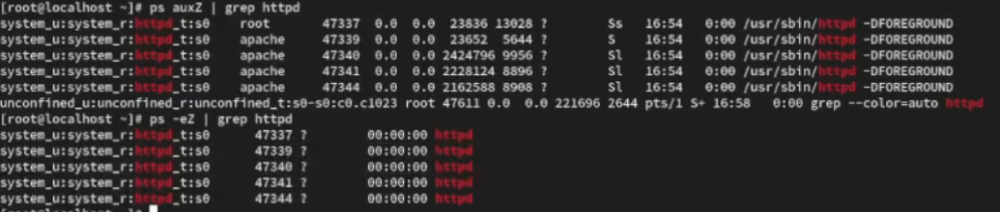
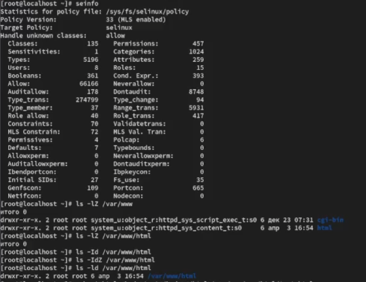
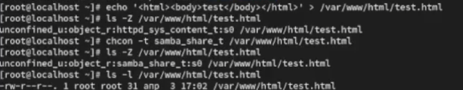
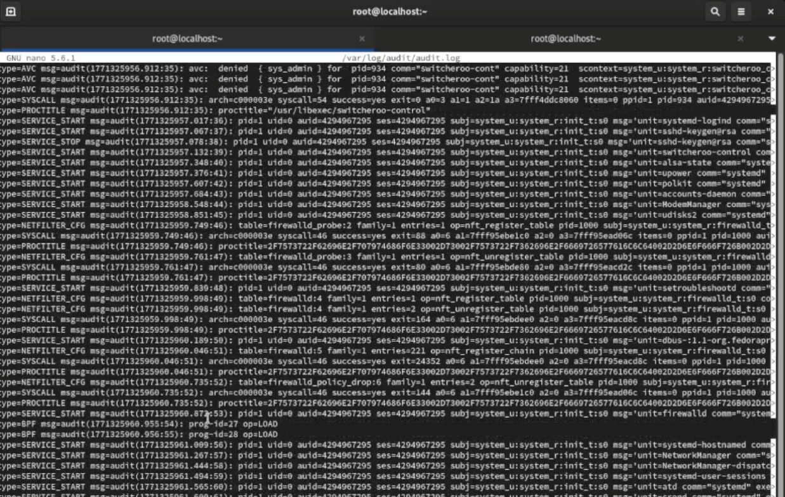

---
## Front matter
title: "Отчет о лабораторной работе"
subtitle: "Лабораторная работа №6"
author: "Казначеев Сергей Ильич"

## Generic otions
lang: ru-RU
toc-title: "Содержание"

## Bibliography
bibliography: bib/cite.bib
csl: pandoc/csl/gost-r-7-0-5-2008-numeric.csl

## Pdf output format
toc: true # Table of contents
toc-depth: 2
lof: true # List of figures
lot: true # List of tables
fontsize: 12pt
linestretch: 1.5
papersize: a4
documentclass: scrreprt
## I18n polyglossia
polyglossia-lang:
  name: russian
  options:
	- spelling=modern
	- babelshorthands=true
polyglossia-otherlangs:
  name: english
## I18n babel
babel-lang: russian
babel-otherlangs: english
## Fonts
mainfont: IBM Plex Serif
romanfont: IBM Plex Serif
sansfont: IBM Plex Sans
monofont: IBM Plex Mono
mathfont: STIX Two Math
mainfontoptions: Ligatures=Common,Ligatures=TeX,Scale=0.94
romanfontoptions: Ligatures=Common,Ligatures=TeX,Scale=0.94
sansfontoptions: Ligatures=Common,Ligatures=TeX,Scale=MatchLowercase,Scale=0.94
monofontoptions: Scale=MatchLowercase,Scale=0.94,FakeStretch=0.9
mathfontoptions:
## Biblatex
biblatex: true
biblio-style: "gost-numeric"
biblatexoptions:
  - parentracker=true
  - backend=biber
  - hyperref=auto
  - language=auto
  - autolang=other*
  - citestyle=gost-numeric
## Pandoc-crossref LaTeX customization
figureTitle: "Рис."
tableTitle: "Таблица"
listingTitle: "Листинг"
lofTitle: "Список иллюстраций"
lotTitle: "Список таблиц"
lolTitle: "Листинги"
## Misc options
indent: true
header-includes:
  - \usepackage{indentfirst}
  - \usepackage{float} # keep figures where there are in the text
  - \floatplacement{figure}{H} # keep figures where there are in the text
---

# Цель работы 

Развить навыки администрирования ОС Linux. Получить первое практическое знакомство с технологией SELinux1.
Проверить работу SELinx на практике совместно с веб-сервером Apache.

# Выполнение лабораторной работы

После того как открыли терминал, перешли в супер пользователя, проверили статус SELinux,затем статус Apache

{#fig:001 width=70%}

Далее просмотрим контекста безопасноти процессов Apache

{#fig:002 width=70%}

Затем просмотрим переключатель SELinux для Apache

{#fig:003 width=70%}

Далее просмотрим статистику по политике SELinux, типы файлов /var/www, типы файлов /var/www/html,

{#fig:004 width=70%}

После чего создадим текстовый файл HTML-формата, проверим контекст созданного файла, круг пользователей, также изменим  контекст файла и проверим ошибки доступа 

{#fig:005 width=70%}

Далее обратимся к файлу через веб-сервер и изучим справку 

{#fig:011 width=70%}

После чего просмотрим логи для анализа ошибки 

{#fig:006 width=70%}

Затем изменим порта Apache на 81 

{#fig:007 width=70%}

После чего просмотрим файлы error_log, access_log и audit.log и увидим что в файле audit появились записи 

{#fig:008 width=70%}

Затем добавим порт 81, затем проверим появился ли он или нет и пробуем запустить apache или нет, после чего вернем контекст httpd_sys_cоntent__t, затем  возвращаем обратно  конфигурацию файлу apache 80 и удаляем порт 81 

{#fig:009 width=70%}

Затем удаляем файл 

{#fig:0010 width=70%}

# Выводы

В ходе выполнения данной работы были успешно достигнуты поставленные цели: развитие навыков администрирования ОС Linux и получение первичного практического знакомства с мандатной системой контроля доступа SELinux.
