---
## Front matter
lang: ru-RU
title: Управление журналами собыий в системе 
subtitle: Лабораторная работа №7 
author:
  - Казначеев С.И.
institute:
  - Российский университет дружбы народов, Москва, Россия
date: 10 октября 2025

## i18n babel
babel-lang: russian
babel-otherlangs: english

## Formatting pdf
toc: false
toc-title: Содержание
slide_level: 2
aspectratio: 169
section-titles: true
theme: metropolis
header-includes:
 - \metroset{progressbar=frametitle,sectionpage=progressbar,numbering=fraction}
---

# Информация

## Докладчик

:::::::::::::: {.columns align=center}
::: {.column width="70%"}

  * Казначеев Сергей Ильич
  * Студент
  * Российский университет дружбы народов
  * [1132240693@pfur.ru]
:::
::: {.column width="30%"}

## Цель работы 

Получить навыки работы с журналами мониторинга различных событий в системе.

## Выполнение лабораторной работы

Для начала откроем три вклдки терминала и в каждом из них получим полномочия администратора

## Действия во втором терминале 

Теперь во второй вкладке пропишем команду tail -f /var/log/messages чтобы вывести события в реальном времени.После чего перейдем в 3 терминал и попробуем зайти в супер пользователя введя неправильный пароль и у нас во 2 терминале появится сообщение  «FAILED SU (to root) username ...».

## Действия в третьем терминале 

После в 3 терминале введем из оболочки пользователя logger hello

## Проверка действий

Далее открываем второй терминал и проверям то что hello записалось 

## Проверка сообщений 

Затем введем команду tail -n 20 /var/log/secure чтобы увидить сообщения, которые ранее были зафиксированы во время ошибки 

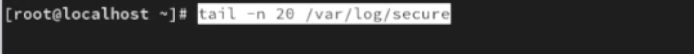

## Установка нового пакета 

В первой вкладке установим httpd 

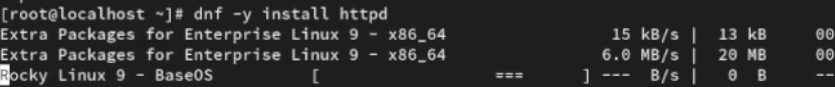

## Запуск веб-служб

После окончания процесса установки запустим веб-службу 

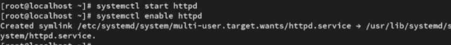

## Работа во втором терминале 

После во второй вкладке терминала посмотрим журнал сообщений об ошибках веб-служб командой  tail -f /var/log/httpd/error_log

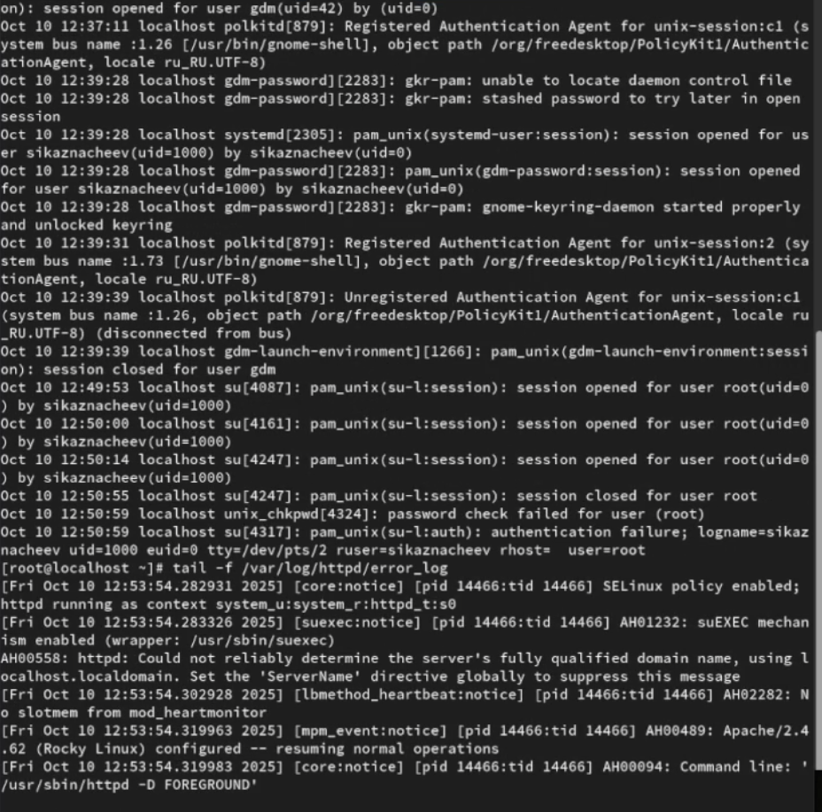

## Работа в третьем терминале 

Далее в 3 терминале  запишем в файл конфигурации /etc/httpd/conf/httpd.conf в конце добавим ErrorLog syslog:local1

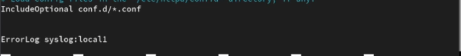

## Создание нового файла  

После чего переходим в каталог /etc/rsyslog.d и создаем файл мониторинга событий веб-службы

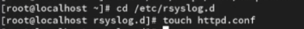

## Редактируем его 

Далее открыв его на редактировании запишем local1.* -/var/log/httpd-error.log 

## Работа в первом терминале 

После чего переходим в первую вкладку терминала и перезагружаем концигурацию rsyslogd и веб-службу 

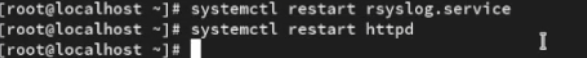

## Работа в третьей вкладке 

После в  третьей вкладке терминала создайем отдельный файл концигурации для мониторинга отладочной информации  и в том же терминале вводим echo "*.debug /var/log/messages-debug" > /etc/rsyslog.d/debug.conf

## Работа в первом терминале 

Затем в первой вкладке терминала снова перезапускаем rsyslogd

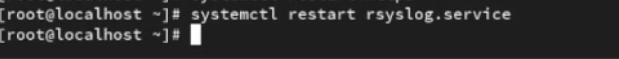

## Работа во второй вкладке 

Далее переходим во вторую вкладку терминала запускаем мониторинг отладочной информации tail -f /var/log/messages-debug 

## Работа в третьей вкладке 

Далее в третьей вкладке терминала введем logger -p daemon.debug "Daemon Debug Message"

## Проверка действий 

Проверим это
 

## Работа во второй вкладке 

Во второй вкладке терминала посмотрим содержимое журнала с событиями с момента последнего запуска системы

## Просмотр содержимого журнала 

Затем просмотрим содержимое журнала без использования пейджера командой journalctl --no-pager и просмотрим журнал в реальном времени journalctl -f

## Фильтрация просмотра  

После чего используем фильтрацию просмотра конкретных параметров журнала введя команду journalctl и дважды нажав на tab

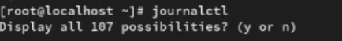

## Проверка событий uid0

Пробуем просмотреть события для uid0

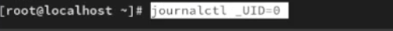

## Запуск journalctl

После чего запустим journalctl -n 20 для просмотра только сообщений об ошибке используем комаду journalctl -p err

## Просмотр сообщейний 

Теперь  просмотрим сообщейния вчерашнего дня введя команду journalctl --since yesterday

## Вывод сообщейний с ошибкой

Затем выведем все сообщения с ошибкой приоритета которые были зафиксированы со вчерашнего дня 

## Вывод информации

Затем выведем детальную информацию  с помощью команды  journalctl -o verbose

## Просмотр дополнительной информации 

Далее просмотрим дополнительную информацию о модуле sshd введя команду journalctl _SYSTEMD_UNIT=sshd.service

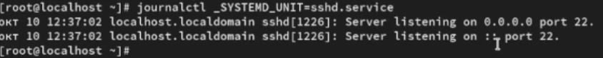

## Действия в новом терминале 

После чего откроем новый терминла и создадим новый каталог и скорректируем его права доступа для каталога /var/log/journal, чтобы journald смог записывать в него информацию и для принятия изменений необходимо перезагрузить систему или использовать команду killall
SR1 systemd-journald

{#fig:028 width=70%}

## Проверка журнала 

Теперь журнал systemd теперь постоянный и можем проверить это командой journalctl -b

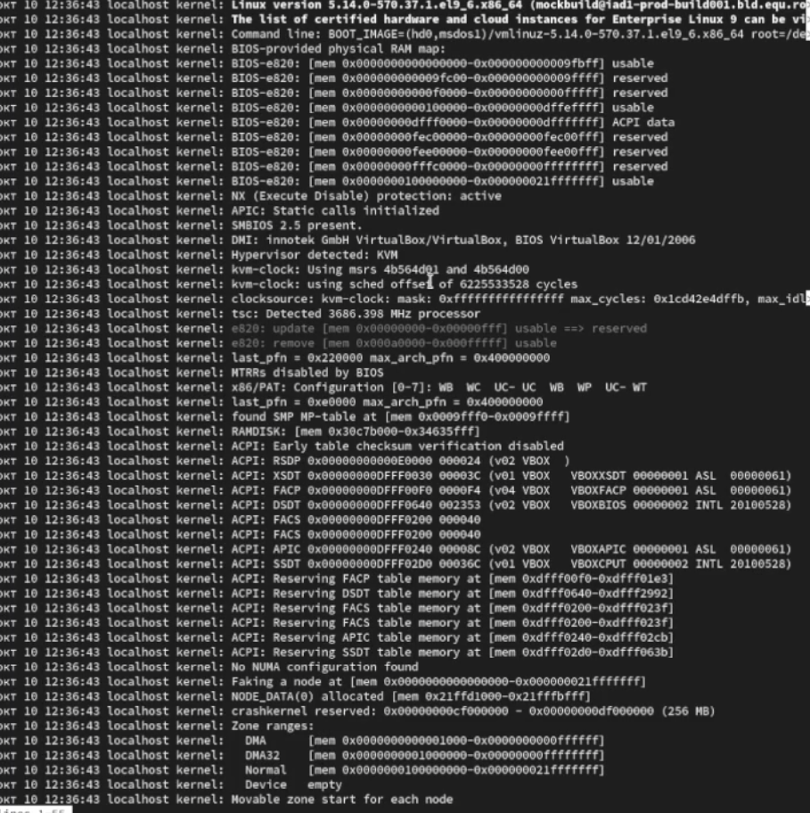{#fig:029 width=70%}

## Контрольный вопрос 1

1. Какой файл используется для настройки rsyslogd?

Ответ - файл  /etc/rsyslog.conf

## Контрольный вопрос 2

2. В каком файле журнала rsyslogd содержатся сообщения, связанные с аутентификацией?

Ответ - файл журнала айнтефекации /var/log/auth.log

## Контрольный вопрос 3

3. Если вы ничего не настроите, то сколько времени потребуется для ротации файлов журналов?

Ответ - период ротации журналов по умолчанию раз в неделю 

## Контрольный вопрос 4

4. Какую строку следует добавить в конфигурацию для записи всех сообщений с приоритетом info в файл /var/log/messages.info?

Ответ - строку /var/log/message.info

## Контрольный вопрос 5

5. Какая команда позволяет вам видеть сообщения журнала в режиме реального времени?

Ответ - команда tail -f /var/log/syslog

## Контрольный вопрос 6

6. Какая команда позволяет вам видеть все сообщения журнала, которые были написаны для PID 1 между 9:00 и 15:00?

Ответ - команада  journalctl _PID=1 --since "9:00" --until "15:00"

## Контрольный вопрос 7

7. Какая команда позволяет вам видеть сообщения journald после последней перезагрузки системы?

Ответ - команда journalctl -b

## Контрольный вопрос 8

8. Какая процедура позволяет сделать журнал journald постоянным?

Ответ - команда создать каталог и перезапустить службу  mkdir -p /var/log/journal 
systemctl restart systemd-journald

## Вывод

В результате выполнения лабораторной работы я получил навыки работы с журналами мониторинга различных событий в системе 

