---
## Front matter
title: "Отчет о лабораторной работе"
subtitle: "Лабораторная работа №7"
author: "Казначеев Сергей Ильич"

## Generic otions
lang: ru-RU
toc-title: "Содержание"

## Bibliography
bibliography: bib/cite.bib
csl: pandoc/csl/gost-r-7-0-5-2008-numeric.csl

## Pdf output format
toc: true # Table of contents
toc-depth: 2
lof: true # List of figures
lot: true # List of tables
fontsize: 12pt
linestretch: 1.5
papersize: a4
documentclass: scrreprt	
## I18n polyglossia
polyglossia-lang:
  name: russian
  options:
	- spelling=modern
	- babelshorthands=true
polyglossia-otherlangs:
  name: english
## I18n babel
babel-lang: russian
babel-otherlangs: english
## Fonts
mainfont: IBM Plex Serif
romanfont: IBM Plex Serif
sansfont: IBM Plex Sans
monofont: IBM Plex Mono
mathfont: STIX Two Math
mainfontoptions: Ligatures=Common,Ligatures=TeX,Scale=0.94
romanfontoptions: Ligatures=Common,Ligatures=TeX,Scale=0.94
sansfontoptions: Ligatures=Common,Ligatures=TeX,Scale=MatchLowercase,Scale=0.94
monofontoptions: Scale=MatchLowercase,Scale=0.94,FakeStretch=0.9
mathfontoptions:
## Biblatex
biblatex: true
biblio-style: "gost-numeric"
biblatexoptions:
  - parentracker=true
  - backend=biber
  - hyperref=auto
  - language=auto
  - autolang=other*
  - citestyle=gost-numeric
## Pandoc-crossref LaTeX customization
figureTitle: "Рис."
tableTitle: "Таблица"
listingTitle: "Листинг"
lofTitle: "Список иллюстраций"
lotTitle: "Список таблиц"
lolTitle: "Листинги"
## Misc options
indent: true
header-includes:
  - \usepackage{indentfirst}
  - \usepackage{float} # keep figures where there are in the text
  - \floatplacement{figure}{H} # keep figures where there are in the text
---

# Цель работы 

Получить навыки работы с журналами мониторинга различных событий в системе.

# Выполнение лабораторной работы

Для начала откроем три вклдки терминала и в каждом из них получим полномочия администратора рис. [-@fig:001]).

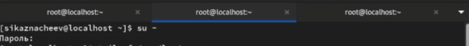{#fig:001 width=70%}

Теперь во второй вкладке пропишем команду tail -f /var/log/messages чтобы вывести события в реальном времени.После чего перейдем в 3 терминал и попробуем зайти в супер пользователя введя неправильный пароль и у нас во 2 терминале появится сообщение  «FAILED SU (to root) username ...». (рис. [-@fig:002]).

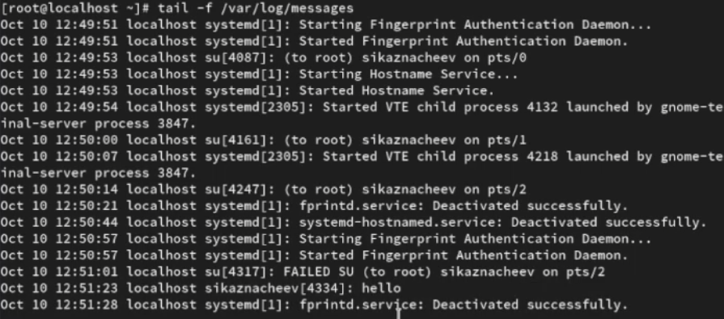{#fig:002 width=70%}

После в 3 терминале введем из оболочки пользователя logger hello (рис.[-@fig:003]).

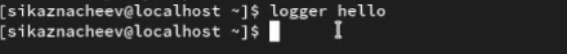{#fig:003 width=70%}

Далее открываем второй терминал и проверям то что hello записалось (рис. [-@fig:004]).

{#fig:004 width=70%}

Затем введем команду tail -n 20 /var/log/secure чтобы увидить сообщения, которые ранее были зафиксированы во время ошибки (рис. [-@fig:005]).

{#fig:005 width=70%}

В первой вкладке установим httpd (рис. [-@fig:006]).

{#fig:006 width=70%}

После окончания процесса установки запустим веб-службу (рис. [-@fig:007]).

{#fig:007 width=70%}

После во второй вкладке терминала посмотрим журнал сообщений об ошибках веб-служб командой  tail -f /var/log/httpd/error_log (рис. [-@fig:008]).

{#fig:008 width=70%}

Далее в 3 терминале  запишем в файл конфигурации /etc/httpd/conf/httpd.conf в конце добавим ErrorLog syslog:local1 (рис. [-@fig:009]).

{#fig:009 width=70%}

После чего переходим в каталог /etc/rsyslog.d и создаем файл мониторинга событий веб-службы  (рис. [-@fig:010]).

{#fig:010 width=70%}

Далее открыв его на редактировании запишем local1.* -/var/log/httpd-error.log  (рис. [-@fig:012]).

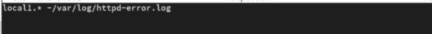{#fig:012 width=70%}

После чего переходим в первую вкладку терминала и перезагружаем концигурацию rsyslogd и веб-службу (рис. [-@fig:013]).

{#fig:013 width=70%}

После в  третьей вкладке терминала создайем отдельный файл концигурации для мониторинга отладочной информации  и в том же терминале вводим echo "*.debug /var/log/messages-debug" > /etc/rsyslog.d/debug.conf

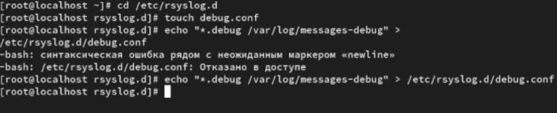{#fig:014 width=70%}

Затем в первой вкладке терминала снова перезапускаем rsyslogd  (рис. [-@fig:015]). 

{#fig:015 width=70%}

Далее переходим во вторую вкладку терминала запускаем мониторинг отладочной информации tail -f /var/log/messages-debug  (рис. [-@fig:016]). 

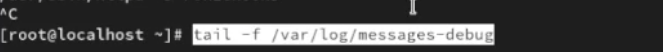{#fig:016 width=70%}

Далее в третьей вкладке терминала введем logger -p daemon.debug "Daemon Debug Message"

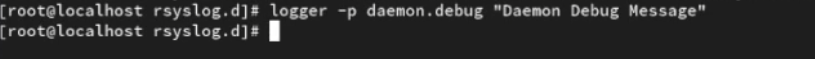{#fig:017 width=70%}

Проверим это (рис. [-@fig:018]). 
 
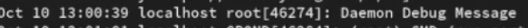{#fig:018 width=70%}

Во второй вкладке терминала посмотрим содержимое журнала с событиями с момента последнего запуска системы (рис. [-@fig:019]). 

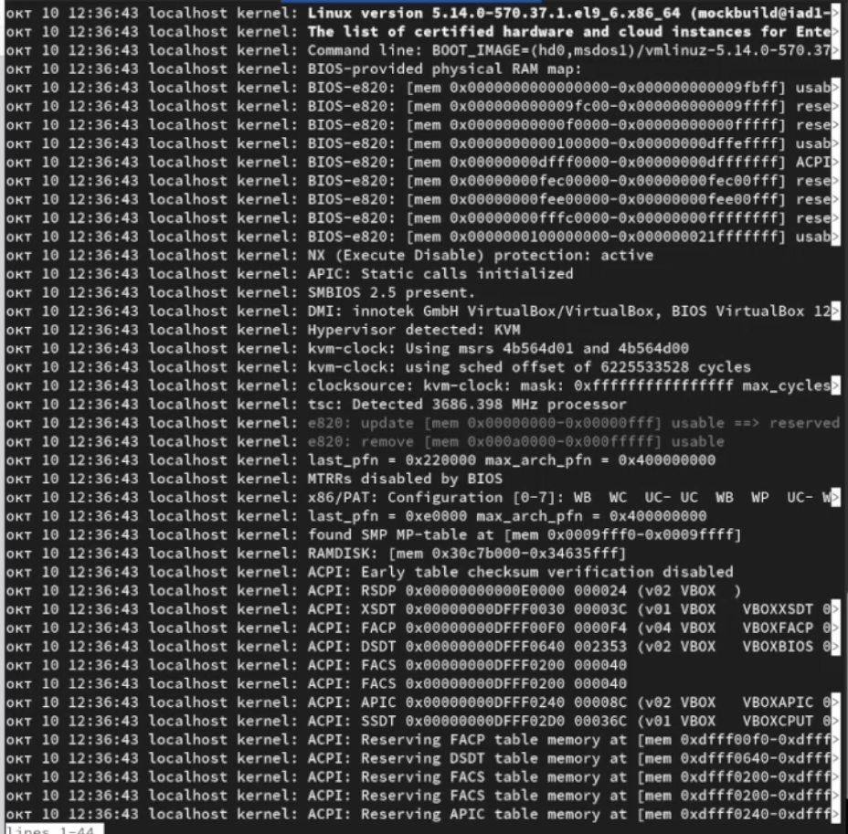{#fig:019 width=70%}

Затем просмотрим содержимое журнала без использования пейджера командой journalctl --no-pager и просмотрим журнал в реальном времени journalctl -f (рис. [-@fig:020]). 

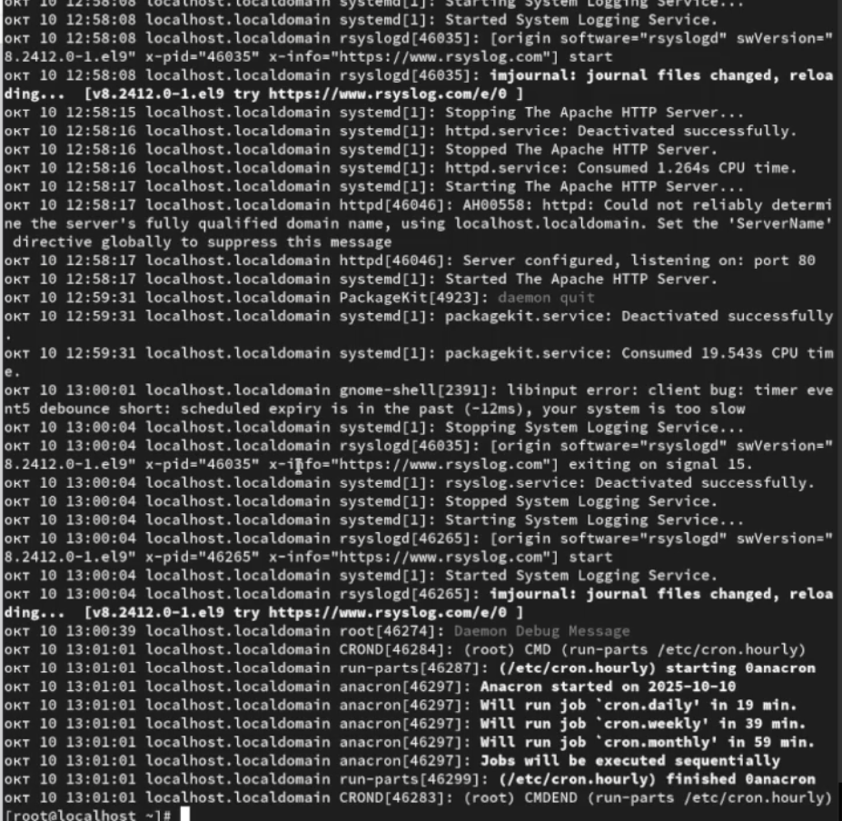{#fig:020 width=70%}

После чего используем фильтрацию просмотра конкретных параметров журнала введя команду journalctl и дважды нажав на tab

{#fig:021 width=70%}

Пробуем просмотреть события для uid0

{#fig:022 width=70%}

После чего запустим journalctl -n 20 для просмотра только сообщений об ошибке используем комаду journalctl -p err

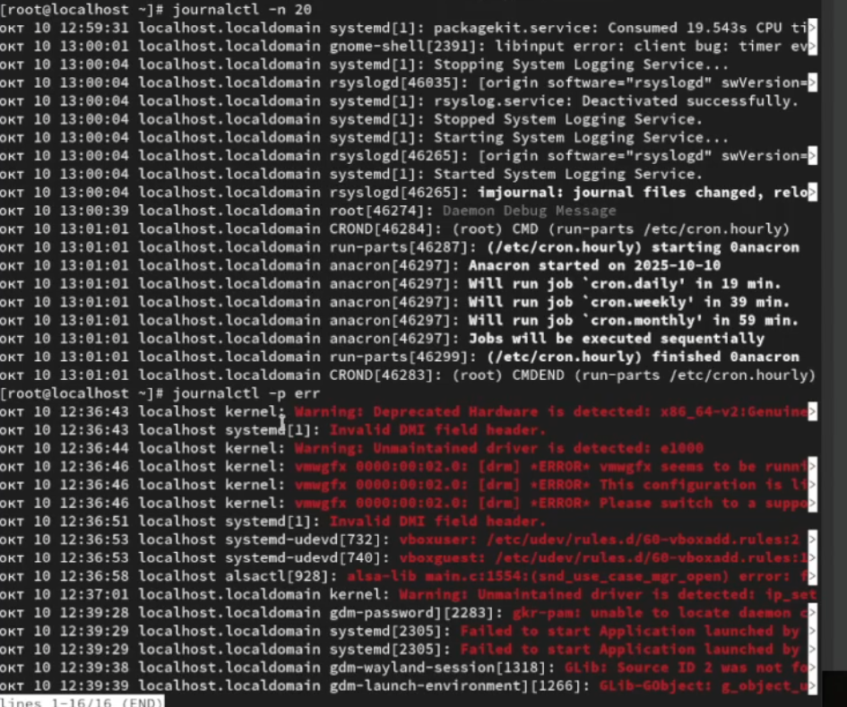{#fig:023 width=70%}

Теперь  просмотрим сообщейния вчерашнего дня введя команду journalctl --since yesterday

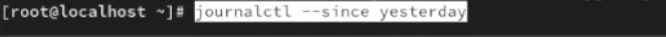{#fig:024 width=70%}

Затем выведем все сообщения с ошибкой приоритета которые были зафиксированы со вчерашнего дня 

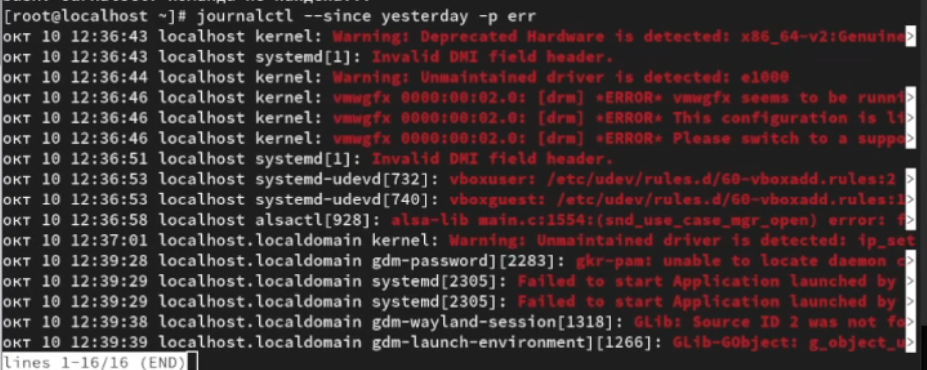{#fig:025 width=70%}

Затем выведем детальную информацию  с помощью команды  journalctl -o verbose

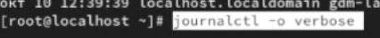{#fig:026 width=70%}

Далее просмотрим дополнительную информацию о модуле sshd введя команду journalctl _SYSTEMD_UNIT=sshd.service

{#fig:027 width=70%}

После чего откроем новый терминла и создадим новый каталог и скорректируем его права доступа для каталога /var/log/journal, чтобы journald смог записывать в него информацию и для принятия изменений необходимо перезагрузить систему или использовать команду killall
SR1 systemd-journald

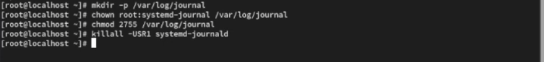{#fig:028 width=70%}

Теперь журнал systemd теперь постоянный и можем проверить это командой journalctl -b

{#fig:029 width=70%}

# Контрольные вопросы

1. Какой файл используется для настройки rsyslogd?

Ответ - файл  /etc/rsyslog.conf

2. В каком файле журнала rsyslogd содержатся сообщения, связанные с аутентификацией?

Ответ - файл журнала айнтефекации /var/log/auth.log

3. Если вы ничего не настроите, то сколько времени потребуется для ротации файлов журналов?

Ответ - период ротации журналов по умолчанию раз в неделю 

4. Какую строку следует добавить в конфигурацию для записи всех сообщений с приоритетом info в файл /var/log/messages.info?

Ответ - строку /var/log/message.info

5. Какая команда позволяет вам видеть сообщения журнала в режиме реального времени?

Ответ - команда tail -f /var/log/syslog

6. Какая команда позволяет вам видеть все сообщения журнала, которые были написаны для PID 1 между 9:00 и 15:00?

Ответ - команада  journalctl _PID=1 --since "9:00" --until "15:00"

7. Какая команда позволяет вам видеть сообщения journald после последней перезагрузки системы?

Ответ - команда journalctl -b

8. Какая процедура позволяет сделать журнал journald постоянным?

Ответ - команда создать каталог и перезапустить службу  mkdir -p /var/log/journal 
systemctl restart systemd-journald

# Выводы

В результате выполнения лабораторной работы я получил навыки работы с журналами мониторинга различных событий в системе 
