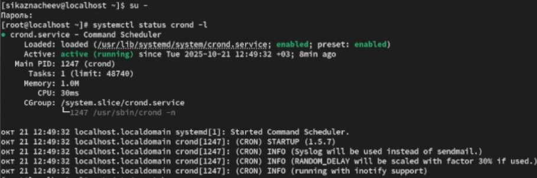
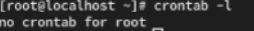
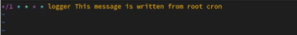
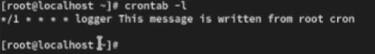
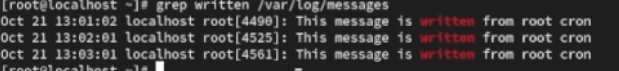
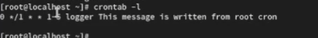
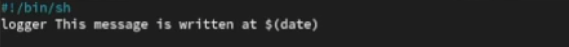
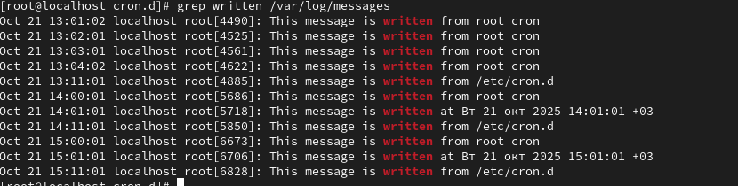
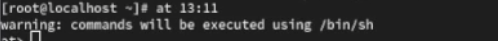
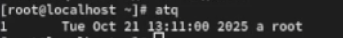

---
## Front matter
lang: ru-RU
title: Планировщики собыйт
subtitle: Лабораторная работа №8 
author:
  - Казначеев С.И.
institute:
  - Российский университет дружбы народов, Москва, Россия
date: 10 октября 2025

## i18n babel
babel-lang: russian
babel-otherlangs: english

## Formatting pdf
toc: false
toc-title: Содержание
slide_level: 2
aspectratio: 169
section-titles: true
theme: metropolis
header-includes:
 - \metroset{progressbar=frametitle,sectionpage=progressbar,numbering=fraction}
---

# Информация

## Докладчик

:::::::::::::: {.columns align=center}
::: {.column width="70%"}

  * Казначеев Сергей Ильич
  * Студент
  * Российский университет дружбы народов
  * [1132240693@pfur.ru]
:::
::: {.column width="30%"}

## Цель работы 

Получение навыков работы с планировщиками событий cron и at

## Выполнение лабораторной работы

Для начала откроем терминал и перейдем в супер пользователя, затем  просмотрим статус демона crond

## Просмотр файла конфигурации 

Теперь просмотрим содержимое файла концигурации /etc/crontab

## Просмотр список заданий в расписании 

После чего просмотрим список заданий в расписании и он окажется пуст

## Запись в файл скрипта 

Далее открываем файл расписания на редактирования комадной crontab -e и записываем */1 * * * * logger This message is written from root cron 

## Проверка список заданий 

После чего проверяем  спиисок заданий в расписании 

## Просмотр журнала 

Не выключая систему через 2-3 мин просмотрим журнал системных событий

## Изменение скрипта 

После чего изменяем запись в расписании crontab на следующую 0 */1 * * 1-5 logger This message is written from root cron 

## Просмотр  список заданий 

Затем просматриваем список заданий в расписании 

## Создание нового файла 

После чего переходим в каталог /etc/cron.hourly и создаем файл сценария  с именем erachhour

## Пропишем скрипт в файл 

Далее в этом файле записываем 
!/bin/sh
logger This message is written at $(date)

## Сделайем файл сценария 

После чего сделайем файл сценария eachhour исполняемым и перейдем в каталог  /etc/crond.d и создадим файл с расписанием  eachhour 

## Пропишем новый скрипт 

В него запишем следующий скрипт  11 * * * * root logger This message is written from /etc/cron.d данный скрипт каждую 11 минуту каждого часа, любого дня и месяца, cron запускает команду logger от имени пользователя root

## Проверка журнала 

Не выключая систему через 2-3 часа просмотрели журнал системных событий с помощью команды grep written /var/log/messages

## Запуск нового терминала 

После чего запустили терминал и получили полномочия администратора и проверили что служба atd загружена и включена 

## Задаем время выполнения 

Далее зададим выполнение команды logger message from at в 13:11

## Проверка что задание запланированно 

Теперь проверим что задание запланировано 

## Проверка всех действий 

С помощью команды grep 'from at' /var/log/messages просмотрим появилось ли соответствующиее сообщение в лог-файле в указанное время и как увидим да все получилось 
 

## Контрольный вопрос 1

1. Как настроить задание cron, чтобы оно выполнялось раз в 2 недели?

Ответ - найтрока 0 2 * * 1 test $(( $(date +\%V) % 2 )) -eq 0 && cmd

## Контрольный вопрос 2

2. Как настроить задание cron, чтобы оно выполнялось 1-го и 15-го числа каждого месяца в 2 часа ночи?

Ответ - найтрока 0 2 1,15 * * /path/to/script.sh

## Контрольный вопрос 3

3. Как настроить задание cron, чтобы оно выполнялось каждые 2 минуты каждый день?

Ответ - настройка */2 * * * * /path/to/script.sh

## Контрольный вопрос 4

4. Как настроить задание cron, чтобы оно выполнялось 19 сентября ежегодно?

Ответ - настройка  0 0 19 9 * /path/to/script.sh

## Контрольный вопрос 5

5. Как настроить задание cron, чтобы оно выполнялось каждый четверг сентября ежегодно?

Ответ - настройка  0 0 * 9 4 /path/to/script.sh

## Контрольный вопрос 6

6. Какая команда позволяет вам назначить задание cron для пользователя alice? Приведите подтверждающий пример.

Ответ - команда sudo crontab -u alice -e Пример  0 3 * * * /path/to/script.sh

## Контрольный вопрос 7

7. Какая команда позволяет вам видеть сообщения journald после последней перезагрузки системы?

Ответ - нужно указать echo bob | sudo tee -a /etc/cron.deny

## Контрольный вопрос 8

8. Вам нужно убедиться, что задание выполняется каждый день, даже если сервер во время выполнения временно недоступен. Как это сделать?

Ответ -  это можно сделать прописав persistent=true

## Контрольный вопрос 9

9. Какая команда позволяет узнать, запланированы ли какие-либо задания на выполнение планировщиком atd?

Ответ - команда atq

## Выводы

В результате выполнения лабораторной работы я получил навыки работы с планировщиками событий cron  и  at
