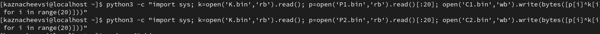
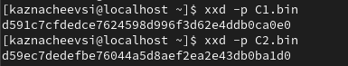
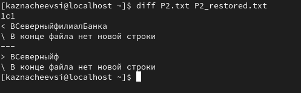

---
## Front matter
lang: ru-RU
title: Элементы криптографии. Шифрование (кодирование) различных исходных текстов одним ключом
subtitle: Лабораторная работа №8 
author:
  - Казначеев С.И.
institute:
  - Российский университет дружбы народов, Москва, Россия
date: 24 апреля 2026

## i18n babel
babel-lang: russian
babel-otherlangs: english

## Formatting pdf
toc: false
toc-title: Содержание
slide_level: 2
aspectratio: 169
section-titles: true
theme: metropolis
header-includes:
 - \metroset{progressbar=frametitle,sectionpage=progressbar,numbering=fraction}
---

# Информация

## Докладчик

:::::::::::::: {.columns align=center}
::: {.column width="70%"}

  * Казначеев Сергей Ильич
  * Студент
  * Российский университет дружбы народов
  * [1132240693@pfur.ru]
:::
::: {.column width="30%"}

## Цель работы 

Освоить на практике применение режима однократного гаммирования на примере кодирования различных исходных текстов одним ключом

## Выполнение лабораторной работы

Для начала откроем терминал и создадим два файла с текстом который указан в лабораторной работе 

{#fig:001 width=70%}

## Слайд 2

После чего просматриваем содержимого в hex 

{#fig:002 width=70%}

## Слайд 3

Далее создаем бинарный ключ 

{#fig:003 width=70%}

## Слайд 4

Затем мы копируем два файла в бинарные 

{#fig:004 width=70%}

## Слайд 5

После чего шифруем в XOR первое сообщение  и второе в шифрование XOR 

{#fig:005 width=70%}

## Слайд 6

Затем выводим зашифрованные данные 

{#fig:006 width=70%}

## Слайд 7

Далее делаем XOR двух шифротекстов P1 или P2 и восстановление P2 из предположения, что известен P1

{#fig:007 width=70%}

## Слайд 8

И проверяем результат 

{#fig:008 width=70%}

## Выводы

В результате выполнения лабораторной работы я освоил на практике применение режима однократного гаммирования на примере кодирования различных исходных текстов одним ключом
