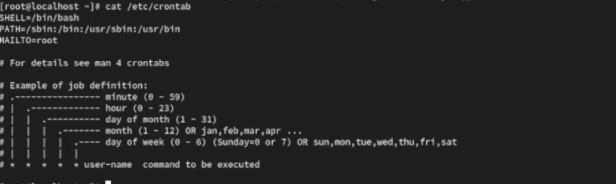
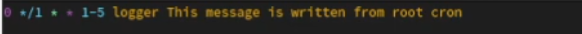
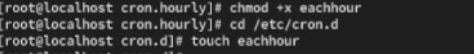
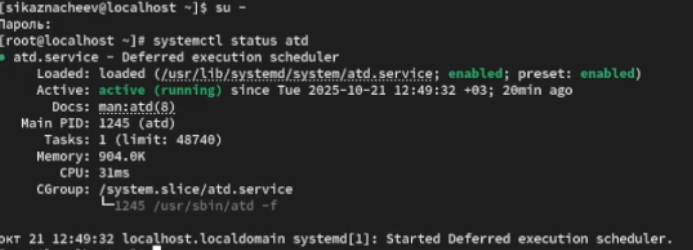
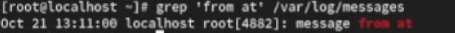

---
## Front matter
title: "Отчет о лабораторной работе"
subtitle: "Лабораторная работа №8"
author: "Казначеев Сергей Ильич"

## Generic otions
lang: ru-RU
toc-title: "Содержание"

## Bibliography
bibliography: bib/cite.bib
csl: pandoc/csl/gost-r-7-0-5-2008-numeric.csl

## Pdf output format
toc: true # Table of contents
toc-depth: 2
lof: true # List of figures
lot: true # List of tables
fontsize: 12pt
linestretch: 1.5
papersize: a4
documentclass: scrreprt	
## I18n polyglossia
polyglossia-lang:
  name: russian
  options:
	- spelling=modern
	- babelshorthands=true
polyglossia-otherlangs:
  name: english
## I18n babel
babel-lang: russian
babel-otherlangs: english
## Fonts
mainfont: IBM Plex Serif
romanfont: IBM Plex Serif
sansfont: IBM Plex Sans
monofont: IBM Plex Mono
mathfont: STIX Two Math
mainfontoptions: Ligatures=Common,Ligatures=TeX,Scale=0.94
romanfontoptions: Ligatures=Common,Ligatures=TeX,Scale=0.94
sansfontoptions: Ligatures=Common,Ligatures=TeX,Scale=MatchLowercase,Scale=0.94
monofontoptions: Scale=MatchLowercase,Scale=0.94,FakeStretch=0.9
mathfontoptions:
## Biblatex
biblatex: true
biblio-style: "gost-numeric"
biblatexoptions:
  - parentracker=true
  - backend=biber
  - hyperref=auto
  - language=auto
  - autolang=other*
  - citestyle=gost-numeric
## Pandoc-crossref LaTeX customization
figureTitle: "Рис."
tableTitle: "Таблица"
listingTitle: "Листинг"
lofTitle: "Список иллюстраций"
lotTitle: "Список таблиц"
lolTitle: "Листинги"
## Misc options
indent: true
header-includes:
  - \usepackage{indentfirst}
  - \usepackage{float} # keep figures where there are in the text
  - \floatplacement{figure}{H} # keep figures where there are in the text
---

# Цель работы 

Получение навыков работы с планировщиками событий cron и at

# Выполнение лабораторной работы

Для начала откроем терминал и перейдем в супер пользователя, затем  просмотрим статус демона crond рис. [-@fig:001]).

{#fig:001 width=70%}

Теперь просмотрим содержимое файла концигурации /etc/crontab (рис. [-@fig:002]).

{#fig:002 width=70%}

После чего просмотрим список заданий в расписании и он окажется пуст рис.[-@fig:003]).

{#fig:003 width=70%}

Далее открываем файл расписания на редактирования комадной crontab -e и записываем */1 * * * * logger This message is written from root cron  (рис. [-@fig:004]).

{#fig:004 width=70%}

После чего проверяем  спиисок заданий в расписании (рис. [-@fig:005]).

{#fig:005 width=70%}

Не выключая систему через 2-3 мин просмотрим журнал системных событий рис. [-@fig:006]).

{#fig:006 width=70%}

После чего изменяем запись в расписании crontab на следующую 0 */1 * * 1-5 logger This message is written from root cron (рис. [-@fig:007]).

{#fig:007 width=70%}

Затем просматриваем список заданий в расписании (рис. [-@fig:008]).

{#fig:008 width=70%}

После чего переходим в каталог /etc/cron.hourly и создаем файл сценария  с именем erachhour(рис. [-@fig:009]).

{#fig:009 width=70%}

Далее в этом файле записываем 
!/bin/sh
logger This message is written at $(date) (рис. [-@fig:010]).

{#fig:010 width=70%}

После чего сделайем файл сценария eachhour исполняемым и перейдем в каталог  /etc/crond.d и создадим файл с расписанием  eachhour (рис. [-@fig:012]).

{#fig:012 width=70%}

В него запишем следующий скрипт  11 * * * * root logger This message is written from /etc/cron.d данный скрипт каждую 11 минуту каждого часа, любого дня и месяца, cron запускает команду logger от имени пользователя root(рис. [-@fig:013]).

{#fig:013 width=70%}

Не выключая систему через 2-3 часа просмотрели журнал системных событий с помощью команды grep written /var/log/messages

{#fig:014 width=70%}

После чего запустили терминал и получили полномочия администратора и проверили что служба atd загружена и включена (рис. [-@fig:015]). 

{#fig:015 width=70%}

Далее зададим выполнение команды logger message from at в 13:11(рис. [-@fig:016]). 

{#fig:016 width=70%}

Теперь проверим что задание запланировано 

{#fig:017 width=70%}

С помощью команды grep 'from at' /var/log/messages просмотрим появилось ли соответствующиее сообщение в лог-файле в указанное время и как увидим да все получилось  (рис. [-@fig:018]). 
 
{#fig:018 width=70%}

# Контрольные вопросы

1. Как настроить задание cron, чтобы оно выполнялось раз в 2 недели?

Ответ - найтрока 0 2 * * 1 test $(( $(date +\%V) % 2 )) -eq 0 && cmd

2. Как настроить задание cron, чтобы оно выполнялось 1-го и 15-го числа каждого месяца в 2 часа ночи?

Ответ - найтрока 0 2 1,15 * * /path/to/script.sh

3. Как настроить задание cron, чтобы оно выполнялось каждые 2 минуты каждый день?

Ответ - настройка */2 * * * * /path/to/script.sh

4. Как настроить задание cron, чтобы оно выполнялось 19 сентября ежегодно?

Ответ - настройка  0 0 19 9 * /path/to/script.sh

5. Как настроить задание cron, чтобы оно выполнялось каждый четверг сентября ежегодно?

Ответ - настройка  0 0 * 9 4 /path/to/script.sh

6. Какая команда позволяет вам назначить задание cron для пользователя alice? Приведите подтверждающий пример.

Ответ - команда sudo crontab -u alice -e Пример  0 3 * * * /path/to/script.sh

7. Какая команда позволяет вам видеть сообщения journald после последней перезагрузки системы?

Ответ - нужно указать echo bob | sudo tee -a /etc/cron.deny

8. Вам нужно убедиться, что задание выполняется каждый день, даже если сервер во время выполнения временно недоступен. Как это сделать?

Ответ -  это можно сделать прописав persistent=true

9. Какая команда позволяет узнать, запланированы ли какие-либо задания на выполнение планировщиком atd?

Ответ - команда atq

# Выводы

В результате выполнения лабораторной работы я получил навыки работы с планировщиками событий cron  и  at
