---
## Front matter
title: "Отчет о лабораторной работе"
subtitle: "Лабораторная работа №9"
author: "Казначеев Сергей Ильич"

## Generic otions
lang: ru-RU
toc-title: "Содержание"

## Bibliography
bibliography: bib/cite.bib
csl: pandoc/csl/gost-r-7-0-5-2008-numeric.csl

## Pdf output format
toc: true # Table of contents
toc-depth: 2
lof: true # List of figures
lot: true # List of tables
fontsize: 12pt
linestretch: 1.5
papersize: a4
documentclass: scrreprt	
## I18n polyglossia
polyglossia-lang:
  name: russian
  options:
	- spelling=modern
	- babelshorthands=true
polyglossia-otherlangs:
  name: english
## I18n babel
babel-lang: russian
babel-otherlangs: english
## Fonts
mainfont: IBM Plex Serif
romanfont: IBM Plex Serif
sansfont: IBM Plex Sans
monofont: IBM Plex Mono
mathfont: STIX Two Math
mainfontoptions: Ligatures=Common,Ligatures=TeX,Scale=0.94
romanfontoptions: Ligatures=Common,Ligatures=TeX,Scale=0.94
sansfontoptions: Ligatures=Common,Ligatures=TeX,Scale=MatchLowercase,Scale=0.94
monofontoptions: Scale=MatchLowercase,Scale=0.94,FakeStretch=0.9
mathfontoptions:
## Biblatex
biblatex: true
biblio-style: "gost-numeric"
biblatexoptions:
  - parentracker=true
  - backend=biber
  - hyperref=auto
  - language=auto
  - autolang=other*
  - citestyle=gost-numeric
## Pandoc-crossref LaTeX customization
figureTitle: "Рис."
tableTitle: "Таблица"
listingTitle: "Листинг"
lofTitle: "Список иллюстраций"
lotTitle: "Список таблиц"
lolTitle: "Листинги"
## Misc options
indent: true
header-includes:
  - \usepackage{indentfirst}
  - \usepackage{float} # keep figures where there are in the text
  - \floatplacement{figure}{H} # keep figures where there are in the text
---

# Цель работы 

Получить навыки работы с контекстом безопасности и политиками SELinux.

# Выполнение лабораторной работы

Для начала  откроем терминал и перейдем в супер пользователя  рис. [-@fig:001]).

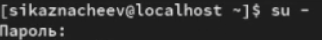{#fig:001 width=70%}

Далее посмотрим текущую информацию о состаянии SELinux на экран была выведена подробная сводка о состоянии и конфигурации SELinux 

Строка 1 - пользователь то есть  я на хосте localhost выполнил команду sestatus -v с правами суперпользователя 
Строка 2 - запрос пароля sudo система запросила пароль пользователя  для предоставления прав суперпользователя 
Строка 3 - Общий статус SELinux был активирован в системе и функционирует 
Строка 4 - Виртуальная файловая система SELinux смонтирована в директории  через эту файловую систему ядро предоставляет информацию о SELinux
Строка 5 = основные конфигурациионные файлы и политики SELinux расположены в директории  /etc/selinux
Строка 6 - Загружена политика безопасноти типа targeted - защищаются только  определенные системные службы остальные процессы работают без ограниченний 
Строка 7 - SELinux работает в режиме принудительного применения политики - все нарушения блокируются 
Строка 8 - Режим enforcing установлен в концигурационном фалйе и будет сохраняться после перезагрузки 
Строка 9 - поддержка Multi-level Security включена в политику 
Строка 10 - Политика разрешает доступ к объектам с неизвестными классами или разрешениями 
Строка 11 = SELinux проверяет защиту памяти на основе фактических безопасности 
Строка 12 - Ядро поддерживает политики SELinux до версии 33 включительно 
Строка 14 - начало раздела с контекстами безопасности текущих процессов
Строка 15 - Текущая сессия пользователя работает в неограниченном домене сам домен 
Строка 16 - Основной системный процесс init работает в домене  init_t 
Строка 17 - Домен ssh работает в ограниченном домене sshd_t с дополнительными уровнями безопасности 
Строка 19 - начало раздела с контекстами безопасности системных файлов 
Строка 20 - Управляющий терминал имеет тип user_devpts_t для псевдо терминалов
Строка 21 - Файл с учетными  записями пользователей имеет тип passwd_file_t
Строка 22 - файл с хешами паролей имеет защищенный тип shadow_t
Строка 23 - Исполняемый файл bash  имеет тип  shell_exec_t
Строка 24 - Исполняемый файл login bvttn nbg login_exect_t
Строка 25 - Символичная ссылка /bin/sh указывает на файл с типом  shell_exec_t
Строка 26 - Исполяемый файл  agetty имеет тип  getty_exec_t
Строка 27 - исполняемый файл init имеет тип init_exec_t
Строка 28 - Исполняемый файл  ssh домена имеет тип  ssh_exec_t

{#fig:002 width=70%}

После чего просмотрим в каком режиме работает SELinux, затем изменим режим раьботы SELinux на разрешающий (Permissive)

{#fig:003 width=70%}

Далее запишем в файл /etc/sysconfig/selinux следующее SELINUX=disabled

{#fig:004 width=70%}

Перезагрузим систему 

{#fig:005 width=70%}

После перезагрузки просмотрим статуст SELinux

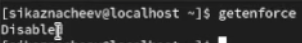{#fig:006 width=70%}

Затем пробуем переключить режим работы SELinux

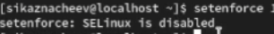{#fig:007 width=70%}

После чего откроем файл /etc/sysconfig/selinux и изменим на SELINUX=enforcing

{#fig:008 width=70%}

И перезагрузим 

{#fig:009 width=70%}

После перезагрузки просмотрим текущую информацию  о состоянии SELinux командой  sestatus -v

{#fig:010 width=70%}

Далее запускаем терминал и получаем полномочия администратора, затем просмотриваем контекст безопасноти файла  /etc/hosts

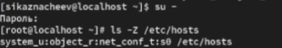{#fig:011 width=70%}

После скопируем файл /etc/hosts в домашний каталог и проверим контекст файла ~/hosts

{#fig:012 width=70%}

Пытаемся перезаписать сеществующий файл hosts из домашнего каталога в каталог /etc: и замет убеждаемся что тип контекста по-прежнему установлен на admin_home_t

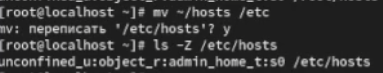{#fig:013 width=70%}

Далее исправляем контекст безопасности 

{#fig:014 width=70%}

Убеждаемся что тип контекста изменился и вводим touch /.autorelabel для массового исправления контекста безопасности

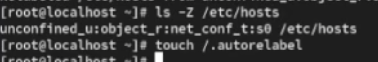{#fig:015 width=70%}

Перезагружаем систему  и во время перезагрузки нажимаем клавишу esc

{#fig:016 width=70%}

Псоле чего переходим в супер польователя и устанавливаем пакет  httpd

{#fig:017 width=70%}

И устанавливаем пакет lynx

{#fig:018 width=70%}

Далее создаем папку под названием web и переходим в нее  и создаем в ней файл index.html

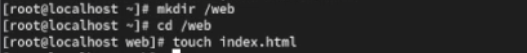{#fig:019 width=70%}

Затем открываем файл index.html и записываем следующее 

{#fig:020 width=70%}

После в файле /etc/httpd/conf/httpd.conf закоменнтираем строки которые указаны в лабораторной работае и заменим их 

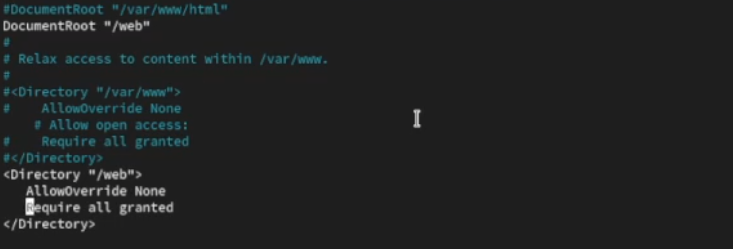{#fig:021 width=70%}

Затем запустим веб-сервер и службу httpd

{#fig:022 width=70%}

Далее в терминале под учетной записью пользователя обратимся к веб серверу в текстовом браузере lynx:

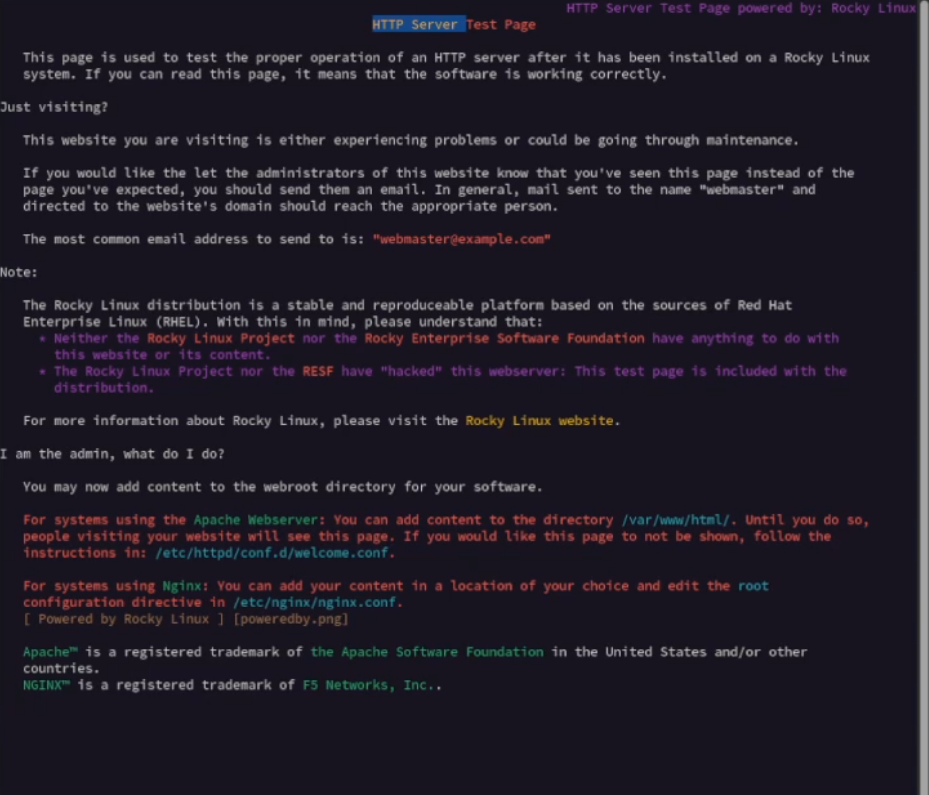{#fig:023 width=70%}

Затем в терминале с  полномочиями администратора применим новую метку контекста к /web и восстановим контекст безопасности 

{#fig:024 width=70%}

И пробуем снова обратиться к веб-сурверу и увидим Welcome to my web-server

{#fig:025 width=70%}

После всех прооделанных действий запускаем терминал и получаем полномочия администратора и просматриваем список переключаителей SELinux для службы ftp

{#fig:026 width=70%}

Для службы ftpd_anon просмотрим список переключателей мы увидим что система настроена безопасно-анонимная запись через ftp запрещена это стандартная и рекомендуемая конфигурация для большинства сценариев использования ftp-сервера 

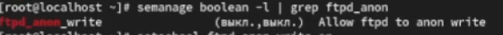{#fig:027 width=70%}

После изменяем текущее значение переключателей для службы ftpd_anon_write с off на on и повторно просматриваем список переключателей SELinux для службы ftpd_anon_write

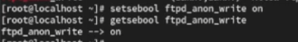{#fig:028 width=70%}

После просмторим список переключателей первая команда для просмотра всех boolean-переключателей с фильтром по ftpd_anon затем изменяем постоянное значение переключателей для службы tpd_anon_write с off на on и просматриваем список переключателей и последняя команда для просмотра всех boolean-переключателей с фильтром по ftpd_anon

{#fig:029 width=70%}

# Контрольные вопросы 

1. Вы хотите временно поставить SELinux в разрешающем режиме. Какую команду вы используете?

Ответ - временный permissive- режим  setenforce 0

2. Вам нужен список всех доступных переключателей SELinux. Какую команду вы используете?

Ответ - список переключателей getsebool -a

3. Каково имя пакета, который требуется установить для получения легко читаемых сообщений журнала SELinux в журнале аудита?

Ответ - пакет для читаемых сообщений SELinux setroubleshoot 

4. Какие команды вам нужно выполнить, чтобы применить тип контекста httpd_sys_content_t к каталогу /web?

Ответ - надо применить тип httpd_sys_content_t к /web

Команды semanage fcontext -a -t httpd_sys_content_t "/web(/.*)?" и restorecon -Rv /web

5. Какой файл вам нужно изменить, если вы хотите полностью отключить SELinux?

Ответ - полное отключение SELinux -редактировать /etc/selinux/config

6. Где SELinux регистрирует все свои сообщения?

Ответ - логи SELinux  /var/log/audit/audit.log

7. Вы не знаете, какие типы контекстов доступны для службы ftp. Какая команда позволяет получить более конкретную информацию?

Ответ - узнать доступные контексты для ftp semanage fcontext -l | grep ftp

8. Ваш сервис работает не так, как ожидалось, и вы хотите узнать, связано ли это с SELinux или чем-то ещё. Какой самый простой способ узнать?

Ответ - командой setenforce 0

# Вывод

После выполнения лабораторной работы я получил навыки работы с контекстом безопасности и политиками SELinux

