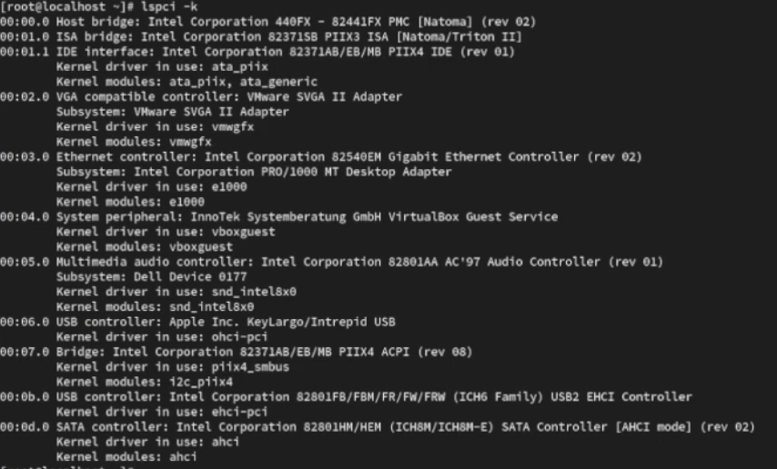
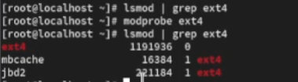
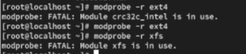
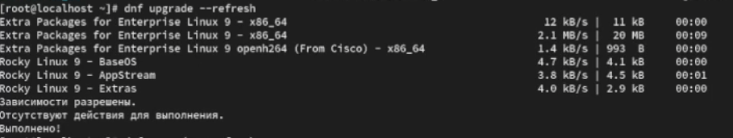
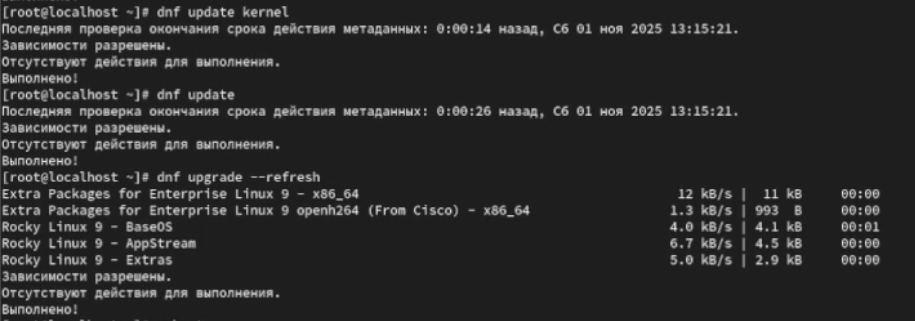
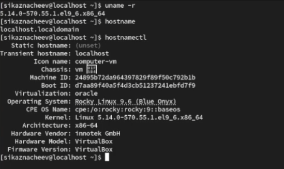

---
## Front matter
lang: ru-RU
title: Структура научной презентации
subtitle: Простейший шаблон
author:
  - Казначеев С. И.
institute:
  - Российский университет дружбы народов
date: 01 ноября 2025

## i18n babel
babel-lang: russian
babel-otherlangs: english

## Formatting pdf
toc: false
toc-title: Содержание
slide_level: 2
aspectratio: 169
section-titles: true
theme: metropolis
header-includes:
 - \metroset{progressbar=frametitle,sectionpage=progressbar,numbering=fraction}
---

# Информация

## Докладчик

  * Казначеев Сергей Ильич
  * Студент 
  * Российский университет дружбы народов
  

## Цель работы 

Получить навыки работы с утилитами управления модулями ядра операционной системы.

## Выполнение

После запуска терминала перейдем в супер пользователя 

{#fig:001 width=70%}

## Просмотр какие устройства имеются в нашей системе и модуля ядра 

Далее посмотрим какие устройства имеются в нашей системе и модули ядра с ними связаны

Команда lspci -k отображает список всех PCI-устройств в системе, а также информацию о том, какие драйверы ядра и модули с ними связаны.Это позволяет проанализировать как операционная система взаимодействует с "железом"

{#fig:002 width=70%}

## Просмотр модулей ядра 

После чего просмотрим какие модули ядра загружены 

{#fig:003 width=70%}

## Просмотр загруженных модулей

Далее просмотрим загружен ли модуль ext4, затем загрузим его и убедимся что модуль загружен,просмотрев список загруженных модулей 

{#fig:004 width=70%}

## Просмотр информации о модуле ext4

После чего просмотрим инфомацию о модуле ядра ext4

Команда modinfo отображает информацию о модуле ядра Linux.В данном случае мы исследуем модуль ext4, который отвечает за поддержку одноименной файловой системы 

{#fig:005 width=70%}

## Попвтка выгрузить модуль ядра ext4

После пробуем выгрузить модуль ядра ext4, мы увидим что нам система сообщает что не может выгрузить ext4 потому что от него зависит другой модуль cr32c_intel который в данный момент используется.Ядро Linux не позволяет выгрузить модуль от которого зависят другие активные модули,чтобы избежать сбоев.Затем пробуем выгрузить  модуль ядра xfs

{#fig:006 width=70%}

## Просмотр загружен ли модуль bluetooth

Далее просмотрим загружен ли модуль bluetooth увидм что нет и загрузим его,затем просмотрим список модулей ядра , отвечающий за работу Bluetooth

{#fig:007 width=70%}

## Просмотр информации  о модуле bluetooth

После чего просмотрим информацию о модуле bluetooth

Команда отображает информацию о модуле ядра,отвечающем за работу Bluetooth-стека в системе. В выводе команды содержатся параметры,которые могут быть установлены для настройки работы этого модуля 

{#fig:008 width=70%}

## Выгружаем модуль ядра bluetooth

И выгрузим модуль ядра bluetooth

{#fig:009 width=70%}

## Проверка ядра в используемой операционной системе 

После чего перейдем в супер пользователя,просмотрим версию ядра используемую в операционной системе и выведем на экран список пакетов относящихся к ядру операционной системы

{#fig:010 width=70%}

## Обновляем систему 

Обновим систему, чтобы убедиться, что все существующие пакеты обновлены

{#fig:011 width=70%}

## Обновляем ядро операционной системы 

Далее обновим ядро операционной системы,а затем саму операционную систему 

{#fig:012 width=70%}

## Проверка версии ядра после перезагрузки 

После перезагрузки просмотрим версию ядра, используемую в операционной системе

{#fig:013 width=70%}

## Контрольные вопросы 

1. Какая команда показывает текущую версию ядра, которая используется на вашей системе?

Ответ - команда uname -r

## Контрольные вопрос 2

2. Как можно посмотреть более подробную информацию о текущей версии ядра операционной системы?

Ответ - чтобы просмотреть более подробную информацию  о текущей версии ядра операционной системы командой  uname -a

## Контрольные вопрос 3

3. Какая команда показывает список загруженных модулей ядра?

Ответ - команда lsmod

## Контрольные вопрос 4

4. Какая команда позволяет вам определять параметры модуля ядра?

Ответ - команда modinfo "имя_модуля"

## Контрольные вопрос 5

5. Как выгрузить модуль ядра?

Ответ - с помощью команды modprobe -r "имя_модуля"

## Контрольные вопрос 6

6. Что вы можете сделать, если получите сообщение об ошибке при попытке выгрузить модуль ядра?

Ответ - при ошибки выгрузки модуля надо проверить зависимость lsmod | grep "модуль",размонтировать связанные файловые системы, остановить используеющие сервисы и выгрузить зависимые модули 

## Контрольные вопрос 7

7. Как определить, какие параметры модуля ядра поддерживаются?

Ответ - определение поддерживаемых параметров командой modinfo "имя_модуль"

## Контрольные вопрос 8

8. Как установить новую версию ядра?

Ответ - установка новой версии ядра через пакетный менеджер или обновление дистрибутива, после чего перезагружаем систему 

## Выводы 

После выполнения лабораторной работы я получил навыки работы с утилитами управления модулями ядра операционной системы 

