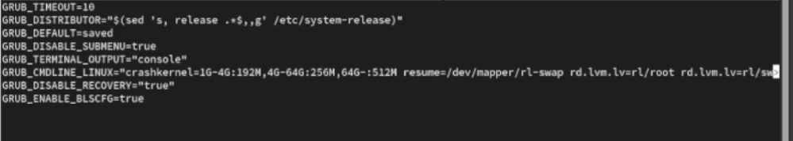
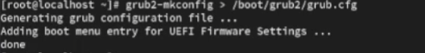
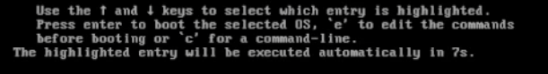
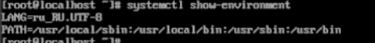
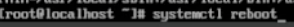
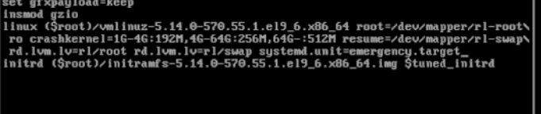
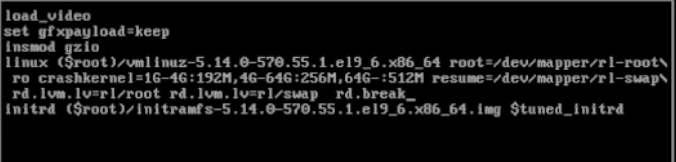
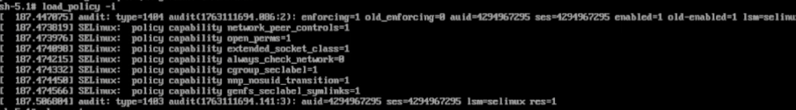

---
## Front matter
lang: ru-RU
title: Управление загрузкой системы
subtitle: Лабораторная работа №11
author:
  - Казначеев С.И.
institute:
  - Российский университет дружбы народов, Москва, Россия
date: 14 ноября 2025

## i18n babel
babel-lang: russian
babel-otherlangs: english

## Formatting pdf
toc: false
toc-title: Содержание
slide_level: 2
aspectratio: 169
section-titles: true
theme: metropolis
header-includes:
 - \metroset{progressbar=frametitle,sectionpage=progressbar,numbering=fraction}
---

# Информация

## Докладчик

:::::::::::::: {.columns align=center}
::: {.column width="70%"}

  * Казначеев Сергей Ильич
  * Студент
  * Российский университет дружбы народов
  * [1132240693@pfur.ru]
:::
::: {.column width="30%"}

## Цель работы 

Получить навыки работы с загрузчиком системы GRUB2.

## Выполнение лабораторной работы

Перейдем в супер пользователя 

{#fig:001 width=70%}

## Меняем параметр отображения меню загрузки 
 
После чего в файле /etc/default/grub установи параметр отображения меню загрузки в течене 10 секунд 

{#fig:002 width=70%}

## Сохраняем файл 

После сохраняем файл и закрываем редактор и записываем изменения в GRUB2 введя  grub2-mkconfig > /boot/grub2/grub.cfg

{#fig:004 width=70%}

## Просмотр изменений 

Просмотр изменений 

{#fig:003 width=70%}

## Перезагружаем систему и меняем настройки версии ядра 

Затем перезагружаем систему, как только появляется GRUB выбираем строку текущей версии ядра в меню и нажимаем e для редактирования добавляем в конце строки systemd.unit=rescue.target

{#fig:005 width=70%}

## Просмотр списков файлов модулей 

Далее просмотрим список всех файлов модулей, которые загружены в настоящее время  systemctl list-units

{#fig:006 width=70%}

## Вывод информации

вывод информации 

{#fig:007 width=70%}

## Просмотр задействованных переменных 

После чего просмотрим задействованные переменные среды оболочки  systemctl show-environment

{#fig:008 width=70%}

## Перезагрузка 

Затем перезагрузим систему 

{#fig:009 width=70%}

## Меняем настроки версии ядра системы

После того как отображается меню GRUB выбираем в меню строки версии ядра системы и нажимаем e чтобы отредактировать  и добавляем в конце  systemd.unit=emergency.target

{#fig:010 width=70%}

## Просмотр всех файлов модулей 

Снова просматриваем список всех файлов модулей, которые загружены в настоящее время так же просмотрим задействованные переменные среды оболочки и перезапустим систему 

{#fig:011 width=70%}

## Переходим в меню строки версии ядра системы

После чего переходим в меню строки версии ядра системы и нажимаем e чтобы отредактировать  и добавляем в конце  rd.break

{#fig:012 width=70%}

## Получаем доступ к системному образу 

Чтобы получить доступ к системному образу для чтения и записи пишем mount -o remount,rw /sysroot

{#fig:013 width=70%}

## Делаем содержание каталога 

Далее сделаем содержание каталога   /sysimage новым корневым каталогом, набрав chroot /sysroot и изменим пароль 

{#fig:014 width=70%}

## Загрузка политики SELinux

Загружаем политику SELinux с помощью команды  load_policy -i

{#fig:015 width=70%}

## Установка правильного типа контекста 

После чего установи правильный тип контекста для /etc/shadow введя команду  chcon -t shadow_t /etc/shadow

{#fig:016 width=70%}

## Контрольные вопрос 1

1. Какой файл конфигурации следует изменить для применения общих изменений в GRUB2?

Ответ - /etc/default/grub

## Контрольные вопрос 2

2. Как называется конфигурационный файл GRUB2, в котором вы применяете изменения для GRUB2?

Ответ -  /etc/default/grub

## Контрольные вопрос 3

3. После внесения изменений в конфигурацию GRUB2, какую команду вы должны выполнить, чтобы изменения сохранились и воспринялись при загрузке системы?

Ответ - update-grub или grub-mkconfig -o /boot/grub/grub.cfg

## Выводы

После выполнения лабораторной работы я получил навыки работы  с загрузчиком системы GRUB2.

