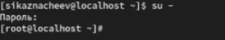
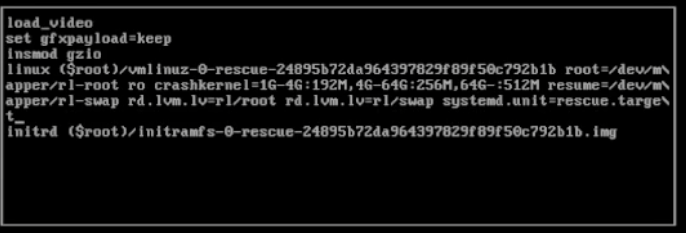
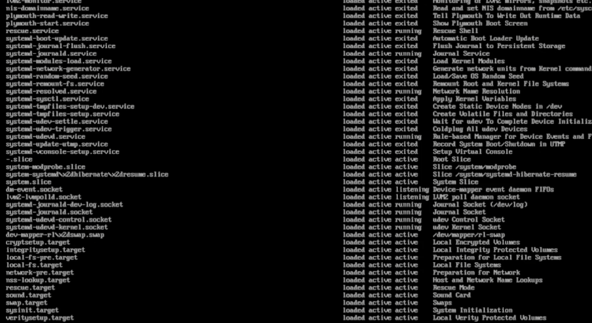
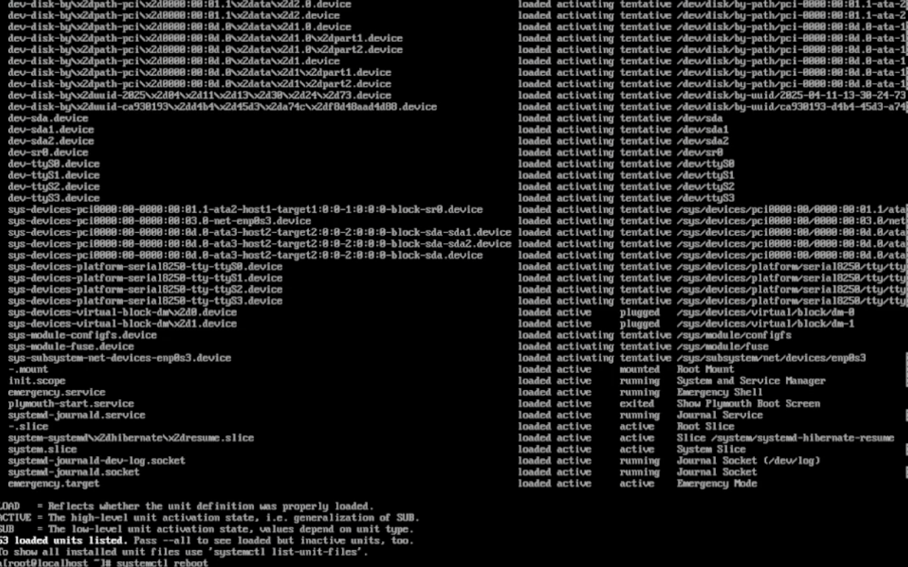
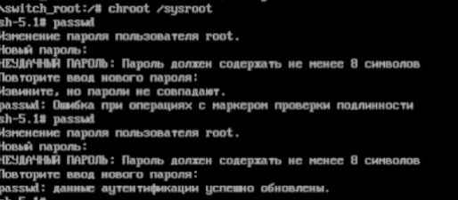

---
## Front matter
title: "Управление загрузкой системы"
subtitle: "Отчет"
author: "Казначеев Сергей Ильич"

## Generic otions
lang: ru-RU
toc-title: "Содержание"

## Bibliography
bibliography: bib/cite.bib
csl: pandoc/csl/gost-r-7-0-5-2008-numeric.csl

## Pdf output format
toc: true # Table of contents
toc-depth: 2
lof: true # List of figures
lot: true # List of tables
fontsize: 12pt
linestretch: 1.5
papersize: a4
documentclass: scrreprt
## I18n polyglossia
polyglossia-lang:
  name: russian
  options:
	- spelling=modern
	- babelshorthands=true
polyglossia-otherlangs:
  name: english
## I18n babel
babel-lang: russian
babel-otherlangs: english
## Fonts
mainfont: IBM Plex Serif
romanfont: IBM Plex Serif
sansfont: IBM Plex Sans
monofont: IBM Plex Mono
mathfont: STIX Two Math
mainfontoptions: Ligatures=Common,Ligatures=TeX,Scale=0.94
romanfontoptions: Ligatures=Common,Ligatures=TeX,Scale=0.94
sansfontoptions: Ligatures=Common,Ligatures=TeX,Scale=MatchLowercase,Scale=0.94
monofontoptions: Scale=MatchLowercase,Scale=0.94,FakeStretch=0.9
mathfontoptions:
## Biblatex
biblatex: true
biblio-style: "gost-numeric"
biblatexoptions:
  - parentracker=true
  - backend=biber
  - hyperref=auto
  - language=auto
  - autolang=other*
  - citestyle=gost-numeric
## Pandoc-crossref LaTeX customization
figureTitle: "Рис."
tableTitle: "Таблица"
listingTitle: "Листинг"
lofTitle: "Список иллюстраций"
lotTitle: "Список таблиц"
lolTitle: "Листинги"
## Misc options
indent: true
header-includes:
  - \usepackage{indentfirst}
  - \usepackage{float} # keep figures where there are in the text
  - \floatplacement{figure}{H} # keep figures where there are in the text
---

# Цель работы

Получить навыки работы с загрузчиком системы GRUB2.

# Задание

1. Продемонстрируйте навыки по изменению параметров GRUB и записи изменений в файл конфигурации 
2. Продемонстрируйте навыки устранения неполадок при работе с GRUB 
3. Продемонстрируйте навыки работы с GRUB без использования root 

# Выполнение лабораторной работы

Перейдем в супер пользователя 

{#fig:001 width=70%}
 
После чего в файле /etc/default/grub установи параметр отображения меню загрузки в течене 10 секунд 

{#fig:002 width=70%}

Просмотр изний 

{#fig:003 width=70%}

После сохраняем файл и закрываем редактор и записываем изменения в GRUB2 введя  grub2-mkconfig > /boot/grub2/grub.cfg

{#fig:004 width=70%}

Затем перезагружаем систему, как только появляется GRUB выбираем строку текущей версии ядра в меню и нажимаем e для редактирования добавляем в конце строки systemd.unit=rescue.target

{#fig:005 width=70%}

Далее просмотрим список всех файлов модулей, которые загружены в настоящее время  systemctl list-units

{#fig:006 width=70%}

Сам вывод 

{#fig:007 width=70%}

После чего просмотрим задействованные переменные среды оболочки  systemctl show-environment

{#fig:008 width=70%}

Затем перезагрузим систему 

{#fig:009 width=70%}

После того как отображается меню GRUB выбираем в меню строку версии ядра системы и нажимаем e чтобы отредактировать  и добавляем в конце  systemd.unit=emergency.target

{#fig:010 width=70%}

Снова просматриваем список всех файлов модулей, которые загружены в настоящее время так же просмотрим задействованные переменные среды оболочки и перезапустим систему 

{#fig:011 width=70%}

После чего переходим в меню строку версии ядра системы и нажимаем e чтобы отредактировать  и добавляем в конце  rd.break

{#fig:012 width=70%}

Чтобы получить доступ к системному образу для чтения и записи пишем mount -o remount,rw /sysroot

{#fig:013 width=70%}

Далее сделаем содержание каталога   /sysimage новым корневым каталогом, набрав chroot /sysroot и изменим пароль 

{#fig:014 width=70%}

Загружаем политику SELinux с помощью команды  load_policy -i

{#fig:015 width=70%}

После чего установи правильный тип контекста для /etc/shadow введя команду  chcon -t shadow_t /etc/shadow

{#fig:016 width=70%}

# Контрольные вопросы 

1. Какой файл конфигурации следует изменить для применения общих изменений в GRUB2?

Ответ - /etc/default/grub

2. Как называется конфигурационный файл GRUB2, в котором вы применяете изменения для GRUB2?

Ответ -  /etc/default/grub

3. После внесения изменений в конфигурацию GRUB2, какую команду вы должны выполнить, чтобы изменения сохранились и воспринялись при загрузке системы?

Ответ - update-grub или grub-mkconfig -o /boot/grub/grub.cfg

# Выводы

После выполнения лабораторной работы я получил навыки работы  с загрузчиком системы GRUB2.

