---
## Front matter
lang: ru-RU
title: Настройки сети в Linux
subtitle: Лабораторная работа №12
author:
  - Казначеев С.И.
institute:
  - Российский университет дружбы народов, Москва, Россия
date: 14 ноября 2025

## i18n babel
babel-lang: russian
babel-otherlangs: english

## Formatting pdf
toc: false
toc-title: Содержание
slide_level: 2
aspectratio: 169
section-titles: true
theme: metropolis
header-includes:
 - \metroset{progressbar=frametitle,sectionpage=progressbar,numbering=fraction}
---

# Информация

## Докладчик

:::::::::::::: {.columns align=center}
::: {.column width="70%"}

  * Казначеев Сергей Ильич
  * Студент
  * Российский университет дружбы народов
  * [1132240693@pfur.ru]
:::
::: {.column width="30%"}

## Цель работы

Получить навыки настройки сетевых параметров системы.

## Задание

1. Продемонстрируйте навыки использования утилиты ip (см. раздел 12.4.1).
2. Продемонстрируйте навыки использования утилиты nmcli (см. раздел 12.4.2 и 12.4.3).

## Выполнение лабораторной работы

Перейдем в супер пользователя 

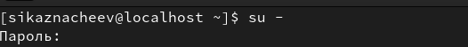{#fig:001 width=70%}

## Выведем информацию на экран о сетевых подключениях 

После чего выведем информацию на экран о существующих сетевых подключениях  и статистику о количестве отправленных пакетов
и мы увидим 2 интерфеса  первый  lo второй enp0s3,

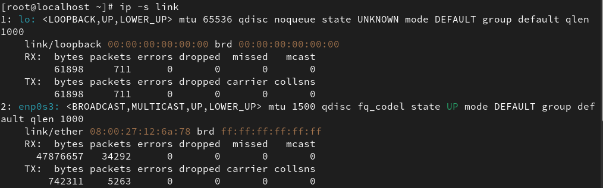{#fig:002 width=70%}

## Вывод на экран  информации о текущих маршрутах 

Затем выведем на экран  информацию о текущих маршрутах,мы увидим,что маршрут по умолчанию 10.0.2.2 на интерфейсе enp0s3 локальная сеть  10.0.2.0/24 доступна на прямую через интерфейс  enp0s3 и протокол  DHCP

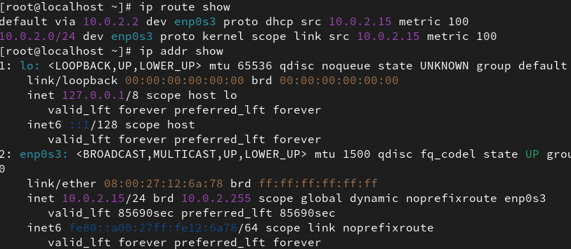{#fig:003 width=70%}

## Проверяем подключение к интернету 

Используем команду ping, чтобы проверить правильность подключения к Интернету 

{#fig:004 width=70%}

## Добавляем доплнительный адрес 

Добавим дополнительный адрес к нашему интерфесу 

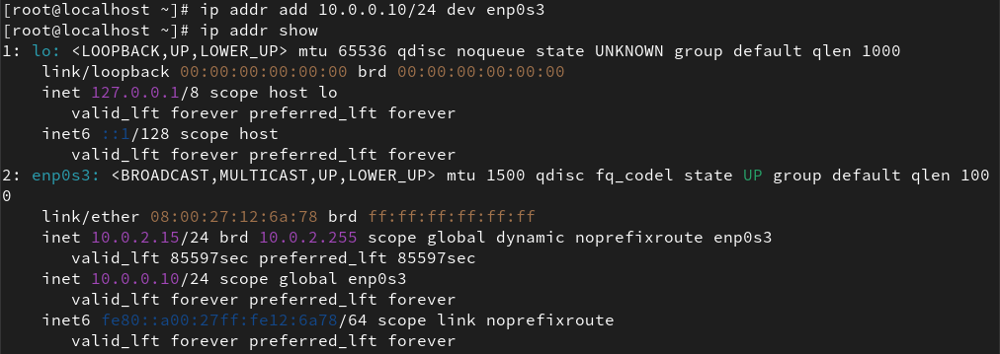{#fig:005 width=70%}

## Провека адреса 

После чего проверим, что адрес добавился 

{#fig:006 width=70%}

## Вывод информации 

Затем выведем на экран список всех прослушиваемых системой портов UPD, TCP

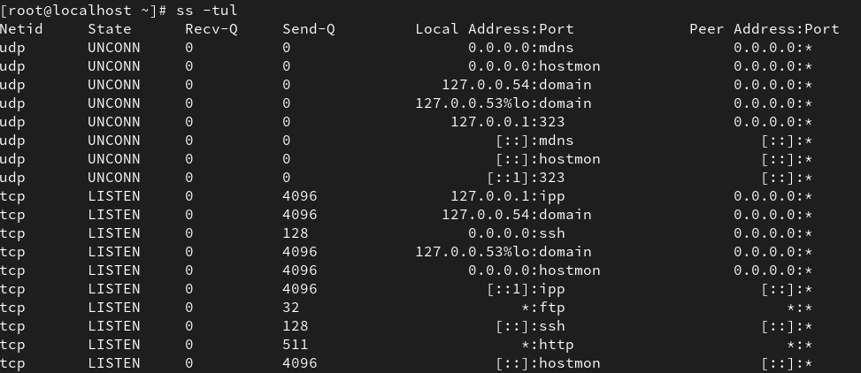{#fig:007 width=70%}

## Просмотр текущей информации 

Просмотрим информацию о текущих соединениях 

{#fig:008 width=70%}

## Добавим Ethernet-соединение dhcp

Теперь добавим  Ethernet-соединение с именем dhcp к интерфейсу

{#fig:009 width=70%}

## Добавим Ethernet-соединение static

И добавим к этому же интерфейсу Ethernet- соединение с именем static статическим IPv4-адресом адаптера и статическим адресом шлюза

{#fig:010 width=70%}

## Вывод информации 

Выведем на экран информацию о текущих соединениях 

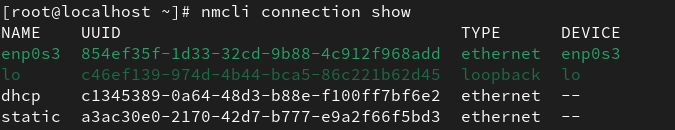{#fig:011 width=70%}

## Переключение на сатическое соединение 

Переключимся на статическое соединение 

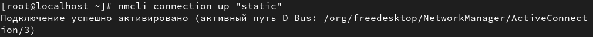{#fig:012 width=70%}

## Проверка на успешное переключение

Проверим успешность переключения при помощи nmcli connection show и ip addr

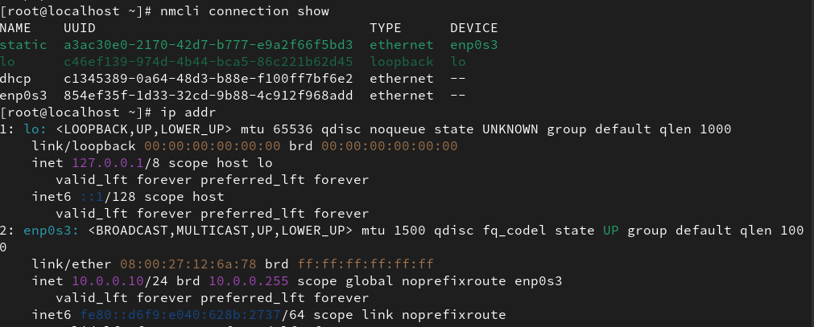{#fig:013 width=70%}

## Проверка на успешное переключение

Затем вернемся к соединению dhcp и проверим успешность переключения при помощи nmcli connection show

{#fig:014 width=70%}

## Изменение параметров соединения с помощью nmcli

Первое  отключим автоподключение статического соединения,второе добавим DNS-сервер в статическое соединение, третье добавим второй DNS-сервер,четвертое изменим IP-адрес статического соединения, пятое добавим другой IP-адрес для статического соединения, после чего активируем его 

{#fig:015 width=70%}

## Проверка подключения 

И проверим успешно ли произошло подключение или нет 

{#fig:017 width=70%}

## Просмотрим настройки сети 

Используя nmtui просмотрим настройки сети 

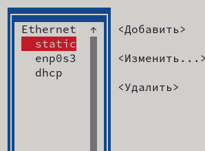{#fig:018 width=70%}

## Скрин 

{#fig:019 width=70%}

## Просмотр настроек 

Просмотрим настройки сетевых соединений в графическом интерфейсе операционной системы 

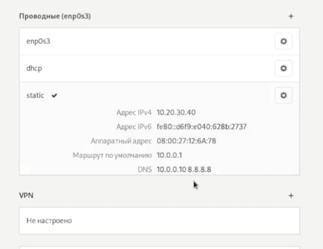{#fig:020 width=70%}

## Скрин 

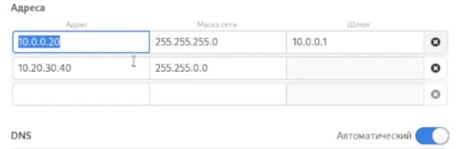{#fig:021 width=70%}

## Скрин 

После всех проделанных действий на  возвращаемся на  первоначальное сетевое соединение 

{#fig:022 width=70%}

## Контрольный вопрос 1

1. Какая команда отображает только статус соединения, но не IP-адрес?

Ответ - nmcli general status

## Контрольный вопрос 2

2. Какая служба управляет сетью в ОС типа RHEL?

Ответ -  NetworkManager 

## Контрольный вопрос 3

3. Какой файл содержит имя узла (устройства) в ОС типа RHEL?

Ответ - /etc/hostname 

## Контрольный вопрос 4

4. Какая команда позволяет вам задать имя узла (устройства)?

Ответ - hostnamectl set-hostname "имя узла"

## Контрольный вопрос 5

5. Какой конфигурационный файл можно изменить для включения разрешения имён для конкретного IP-адреса?

Ответ - /etc/hosts

## Контрольный вопрос 6

6. Какая команда показывает текущую конфигурацию маршрутизации?

Ответ - ip route show 

## Контрольный вопрос 7

7. Как проверить текущий статус службы NetworkManager?

Ответ - systemctl status NetworkManager

## Контрольный вопрос 8

8. Какая команда позволяет вам изменить текущий IP-адрес и шлюз по умолчанию для вашего сетевого соединения?

Ответ - nmcli connection modify "имя соединения"

## Выводы

В ходе выполнения лабораторной работы я получил навыки работы с настройкой сетевых параметров системы.

