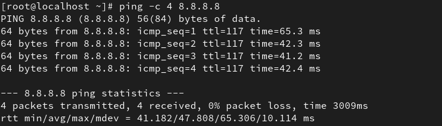
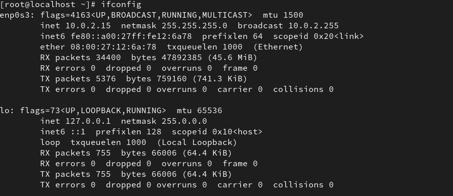
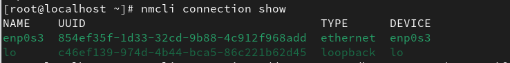
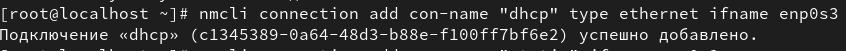
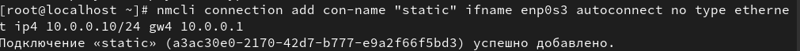
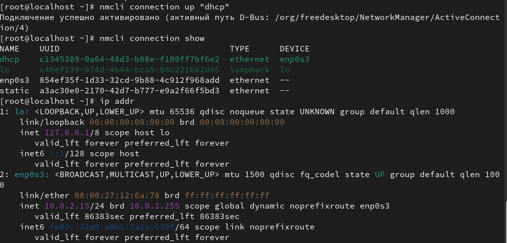
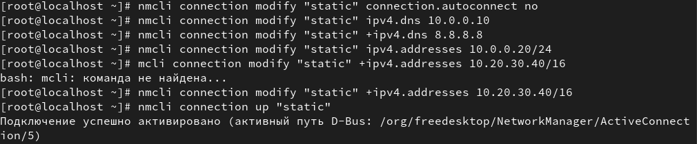
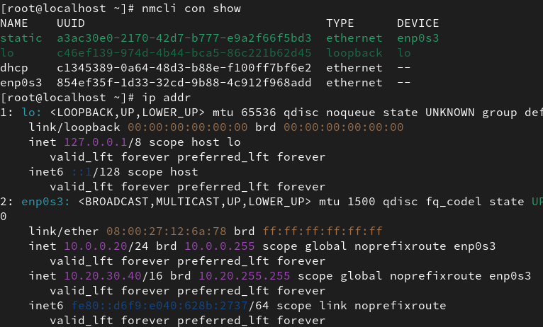
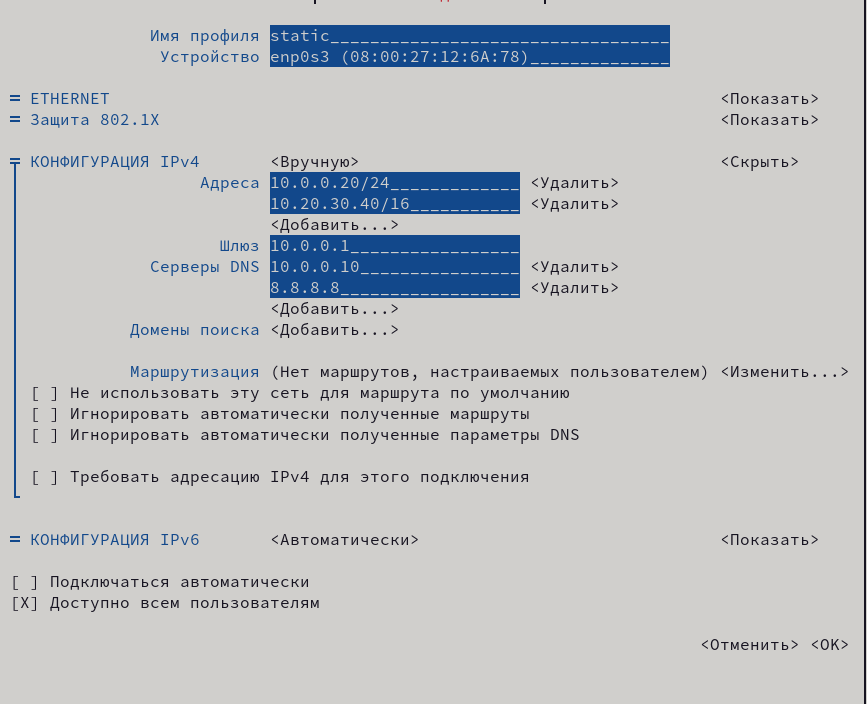
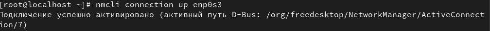

---
## Front matter
title: "Настройки сети в Linux"
subtitle: "Отчет"
author: "Казначеев Сергей Ильич"

## Generic otions
lang: ru-RU
toc-title: "Содержание"

## Bibliography
bibliography: bib/cite.bib
csl: pandoc/csl/gost-r-7-0-5-2008-numeric.csl

## Pdf output format
toc: true # Table of contents
toc-depth: 2
lof: true # List of figures
lot: true # List of tables
fontsize: 12pt
linestretch: 1.5
papersize: a4
documentclass: scrreprt
## I18n polyglossia
polyglossia-lang:
  name: russian
  options:
	- spelling=modern
	- babelshorthands=true
polyglossia-otherlangs:
  name: english
## I18n babel
babel-lang: russian
babel-otherlangs: english
## Fonts
mainfont: IBM Plex Serif
romanfont: IBM Plex Serif
sansfont: IBM Plex Sans
monofont: IBM Plex Mono
mathfont: STIX Two Math
mainfontoptions: Ligatures=Common,Ligatures=TeX,Scale=0.94
romanfontoptions: Ligatures=Common,Ligatures=TeX,Scale=0.94
sansfontoptions: Ligatures=Common,Ligatures=TeX,Scale=MatchLowercase,Scale=0.94
monofontoptions: Scale=MatchLowercase,Scale=0.94,FakeStretch=0.9
mathfontoptions:
## Biblatex
biblatex: true
biblio-style: "gost-numeric"
biblatexoptions:
  - parentracker=true
  - backend=biber
  - hyperref=auto
  - language=auto
  - autolang=other*
  - citestyle=gost-numeric
## Pandoc-crossref LaTeX customization
figureTitle: "Рис."
tableTitle: "Таблица"
listingTitle: "Листинг"
lofTitle: "Список иллюстраций"
lotTitle: "Список таблиц"
lolTitle: "Листинги"
## Misc options
indent: true
header-includes:
  - \usepackage{indentfirst}
  - \usepackage{float} # keep figures where there are in the text
  - \floatplacement{figure}{H} # keep figures where there are in the text
---

# Цель работы

Получить навыки настройки сетевых параметров системы.

# Задание

1. Продемонстрируйте навыки использования утилиты ip (см. раздел 12.4.1).
2. Продемонстрируйте навыки использования утилиты nmcli (см. раздел 12.4.2 и 12.4.3).

# Выполнение лабораторной работы

Перейдем в супер пользователя 

{#fig:001 width=70%}

После чего выведем информацию на экран о существующих сетевых подключениях  и статистику о количестве отправленных пакетов
и мы увидим 2 интерфеса  первый  lo второй emp0s3,  также статус активен или нет, и статистику сколько принято и передано байт, пакетов 

{#fig:002 width=70%}

Затем выведем на экран  информацию о текущих маршрутах,мы увидим,что маршрут по умолчанию 10.0.2.2 на интерфейсе emp0s3 локальная сеть  10.0.2.0/24 доступна на прямую через интерфейс  emp0s3 и протокол  DHCP

{#fig:003 width=70%}

Используем команду ping, чтобы проверить проавильность подключения к ИНтернету 

{#fig:004 width=70%}

Добавим дополнительный адрес к нашему интерфесу 

{#fig:005 width=70%}

После чего проверимЮ что адрес добавился 

{#fig:006 width=70%}

Затем выведем на экран список всех прослушиваемых системой портов UPD, TCP

{#fig:007 width=70%}

Просмотрим информацию о текущих соединениях 

{#fig:008 width=70%}

Теперь добавим  Ethernet-соединение с именем dhcp к интерфейсу

{#fig:009 width=70%}

И добавим к этому же интерфейсу Ethernet- соединение с именем static статическим IPv4-адресом адаптера и статическим адресом шлюза

{#fig:010 width=70%}

Выведем на экран информацию о текущих соединениях 

{#fig:011 width=70%}

Переключимся на статическое соединение 

{#fig:012 width=70%}

Проверим успешность переключения при помощи nmcli connection show и ip addr

{#fig:013 width=70%}

Затем вернемся к соединению dhcp и проверим успешность переключения при помощи nmcli connection show

{#fig:014 width=70%}

Первое  отключим автоподключение статического соединения,второе добавим DNS-сервер в статическое соединение, третье добавим второй DNS-сервер,четвертое изменим IP-адрес статического соединения, пятое добавим другой IP-адрес для статического соединения, после чего активируем его 

{#fig:015 width=70%}

И проверим успешно ли произошло подключение или нет 

{#fig:017 width=70%}

Используя nmtui просмотрим настройки сети 

{#fig:018 width=70%}

Сами настройки 

1) Имя профиля static 
2) Устройство  emp0s3
3) Тип подкелючения  Ethernet 
4) Доступ всем 

Конфигурация IPv4

Ip-адреса 

1) 10.0.0.20/14
2) 10.20.30.40/16

Шлюз 10.0.0.1

DNS - серверы 

1) 10.0.0.10
2) 8.8.8.8

{#fig:019 width=70%}

Просмотрим настройки сетевых соединений в графическом интерфейсе операционной системы 

{#fig:020 width=70%}

{#fig:021 width=70%}

После всех проделанных действий на  возвращаемся на  первоначальное сетевое соединение

{#fig:022 width=70%}

# Контрольные работы 

1. Какая команда отображает только статус соединения, но не IP-адрес?

Ответ - nmcli general status

2. Какая служба управляет сетью в ОС типа RHEL?

Ответ -  NetworkManager 

3. Какой файл содержит имя узла (устройства) в ОС типа RHEL?

Ответ - /etc/hostname 

4. Какая команда позволяет вам задать имя узла (устройства)?

Ответ - hostnamectl set-hostname "имя узла"

5. Какой конфигурационный файл можно изменить для включения разрешения имён для конкретного IP-адреса?

Ответ - /etc/hosts

6. Какая команда показывает текущую конфигурацию маршрутизации?

Ответ - ip route show 

7. Как проверить текущий статус службы NetworkManager?

Ответ - systemctl status NetworkManager

8. Какая команда позволяет вам изменить текущий IP-адрес и шлюз по умолчанию для вашего сетевого соединения?

Ответ - nmcli connection modify "имя соединения"

# Выводы 

В ходе выполнения лабораторной работы я получил навыки работы с настройкой сетевых параметров системы.

