---
## Front matter
lang: ru-RU
title: Фильтр пакетов
subtitle: Лабораторная работа №13
author:
  - Казначеев С.И.
institute:
  - Российский университет дружбы народов, Москва, Россия
date: 25 ноября 2025

## i18n babel
babel-lang: russian
babel-otherlangs: english

## Formatting pdf
toc: false
toc-title: Содержание
slide_level: 2
aspectratio: 169
section-titles: true
theme: metropolis
header-includes:
 - \metroset{progressbar=frametitle,sectionpage=progressbar,numbering=fraction}
---

# Информация

## Докладчик

:::::::::::::: {.columns align=center}
::: {.column width="70%"}

  * Казначеев Сергей Ильич
  * Студент
  * Российский университет дружбы народов
  * [1132240693@pfur.ru]
:::
::: {.column width="30%"}

## Цель работы 

Получить навыки настройки пакетного фильтра в Linux.

## Задание

1. Используя firewall-cmd:
– определить текущую зону по умолчанию;
– определить доступные для настройки зоны;
– определить службы, включённые в текущую зону;
– добавить сервер VNC в конфигурацию брандмауэра.
2. Используя firewall-config:
– добавьте службы http и ssh в зону public;
– добавьте порт 2022 протокола UDP в зону public;
– добавьте службу ftp.
3. Выполните задание для самостоятельной работы (раздел 13.5).

## Выполнение лабораторной работы

Перейдем в супер пользователя 

{#fig:001 width=70%}

## Определение текищей зоны 

После чего определим текущую зону

{#fig:002 width=70%}

## Определение доступной зоны 

Определим доступные зоны

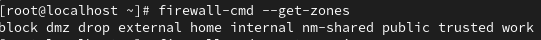{#fig:003 width=70%}

## Просмотр служб на нашем компьютере

Затем просмотрим службы доступные на нашем компьютере 

{#fig:004 width=70%}

## Определяем доступные службы
 
Определим доступные службы в текущей зоне

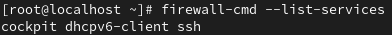{#fig:005 width=70%}

## Сравнение двух команд 

После чего сравним вывод информации при использовании двух команд первая команда firewall-cmd --list-all,вторая firewall-cmd --list-all --zone=public

{#fig:006 width=70%}

## Добавление сервера VNC

Далее добавим сервер VNC в конфигурацию брандмауэра

{#fig:007 width=70%}

## Проверка добавление сервера

И проверим добавился или нет 

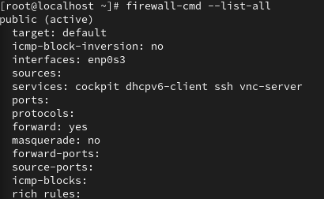{#fig:008 width=70%}

## Запуск службы firewalld

После чего перезапустим службу firewalld 

{#fig:009 width=70%}

## Проверка vnc-server в конфигурации

Затем проверим есть ли vnc-server в конфигурации и  мы обнаружим,что vnc-server больше не указан это из за того что не был постоянным 

{#fig:010 width=70%}

## Добавление службы vnc-server только уже постоянной 

Добавим службу vnc-server ещё раз, но на этот раз сделав её постоянной

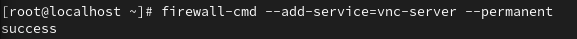{#fig:011 width=70%}

## Проверка vnc-server в конфигурации

После чего проверим наличие vnc-server в конфигурации

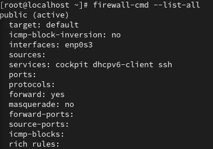{#fig:012 width=70%}

## Проверка vnc-server после перезагрузки firewalld

Теперь проверим перезагрузив конфигурацию firewalld

{#fig:013 width=70%}

## Добавление конфигурации межсетевого экрана

Добавим в конфигурацию межсетевого экрана порт 2022 протокола TCP,после чего перезагрузим конфигурацию firewalld и прроверим что порт добавился в конфигурацию

{#fig:014 width=70%}

## Запускт интерфейса GUI firewall-config

После чего откроем терминал и под учетной записью пользователя запустим интерфейс GUI firewall-config

{#fig:015 width=70%}

## Настройка интерфейса GUI firewall-config

Далее рядом с  параметром Configuration откроем раскрывающийся список и выберем Permanent, после чего выберем зону public и отметим службы http, https и ftp

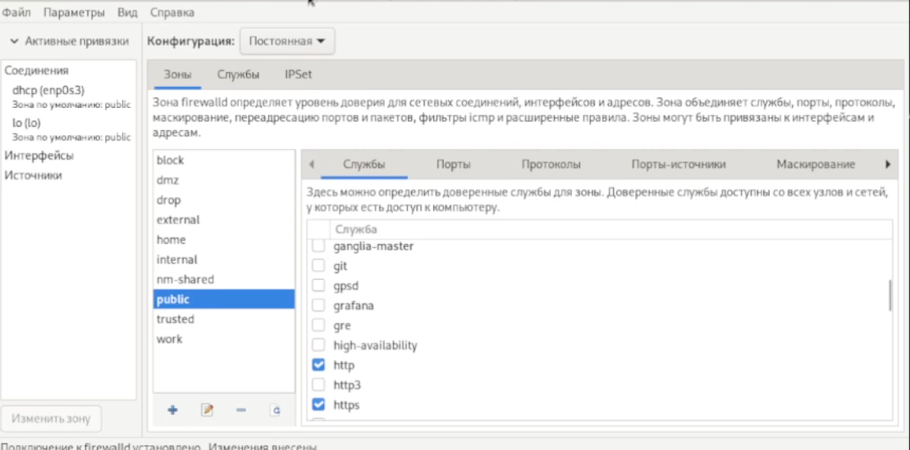{#fig:016 width=70%}

## Скрин 

{#fig:017 width=70%}

## Добавление порта через GUI firewall-config

Полче чего выберем вкладку Ports и добавим порт 2022 udp

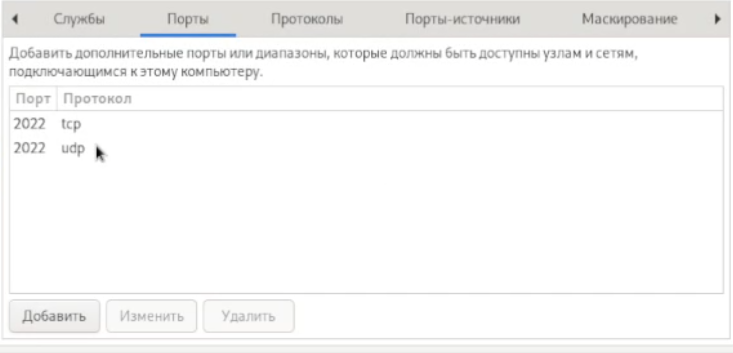{#fig:018 width=70%}

## Проверка всех изменений 

И проверим все изменения которые мы только что внесли 

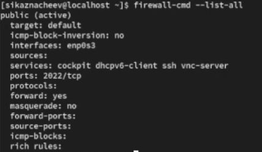{#fig:019 width=70%}

## Перезапуск конфигурации firewall-cmd

Перезапустим конфигурацию firewall-cmd для того,чтобы изменения вступили в силу  и проверим это 

{#fig:020 width=70%}

## Самостоятельная работа 

Создадим конфигурацию межсетевого экрана которая позволяет получить доступ к следующим службам telnet,imap, pop3, smtp

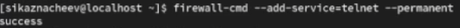{#fig:021 width=70%}

## Добавляем imap, pop3, smtp

Добавляем imap, pop3, smtp

## Скрин 1

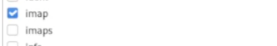{#fig:022 width=70%}

## Скрин 2

{#fig:023 width=70%}

## Скрин 3

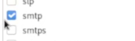{#fig:024 width=70%}

## Проверка что конфигурация является постоянной

И проверяем,что конфигурация является постоянной и будет активирована после перезагрузки компьютера

{#fig:025 width=70%}

## Контрольные вопрос 1

1. Какая служба должна быть запущена перед началом работы с менеджером конфигурации брандмауэра firewall-config?

Ответ - firewall должна быть запущена 

## Контрольные вопрос 2

2. Какая команда позволяет добавить UDP-порт 2355 в конфигурацию брандмауэра в зоне по умолчанию?

Ответ - firewall-cmd --add-port=2355/udp

## Контрольные вопрос 3

3. Какая команда позволяет показать всю конфигурацию брандмауэра во всех зонах?

Ответ - firewall-cmd --list-all-zones

## Контрольные вопрос 4

4. Какая команда позволяет удалить службу vnc-server из текущей конфигурации брандмауэра?

Ответ - firewall-cmd --remove-service=vnc-server

## Контрольные вопрос 5

5. Какая команда firewall-cmd позволяет активировать новую конфигурацию, добавленную опцией --permanent?

Ответ - firewall-cmd --reload

## Контрольные вопрос 6

6. Какой параметр firewall-cmd позволяет проверить, что новая конфигурация была добавлена в текущую зону и теперь активна?

Ответ - firewall-cmd --list-all

## Контрольные вопрос 7

7. Какая команда позволяет добавить интерфейс eno1 в зону public?

Ответ - firewall-cmd --zone=public --add-interface=eno1

## Контрольные вопрос 8

8. Если добавить новый интерфейс в конфигурацию брандмауэра, пока не указана зона, в какую зону он будет добавлен?

Ответ - интерфейс попадет в зону по умолчанию (public)

## Выводы 

В ходе выполнения лабораторной работы я получил навыки настройки пакетного фильтра в Linux.

