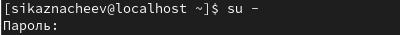
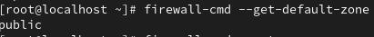
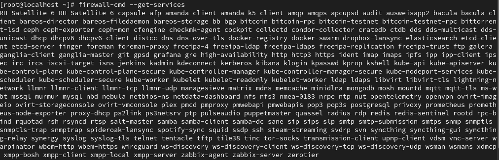
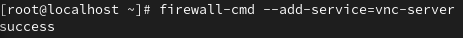
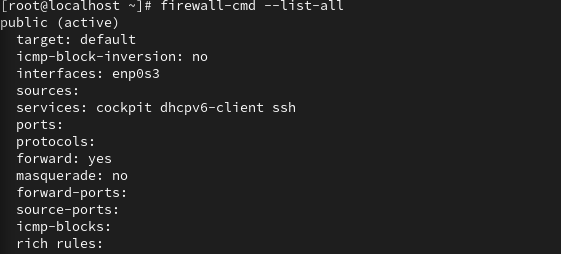
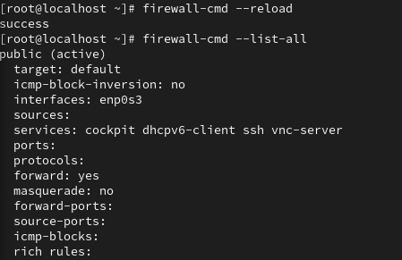
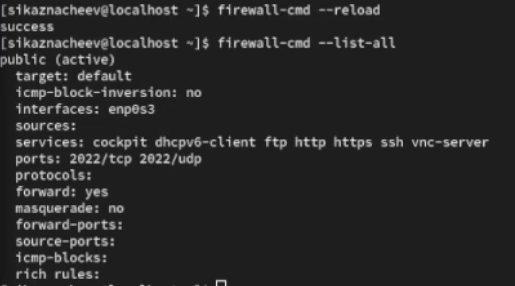
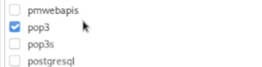
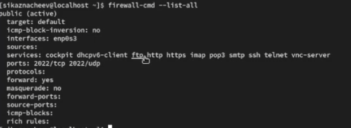

---
## Front matter
title: "Фильтр пакетов"
subtitle: "Отчет"
author: "Казначеев Сергей Ильич"

## Generic otions
lang: ru-RU
toc-title: "Содержание"

## Bibliography
bibliography: bib/cite.bib
csl: pandoc/csl/gost-r-7-0-5-2008-numeric.csl

## Pdf output format
toc: true # Table of contents
toc-depth: 2
lof: true # List of figures
lot: true # List of tables
fontsize: 12pt
linestretch: 1.5
papersize: a4
documentclass: scrreprt
## I18n polyglossia
polyglossia-lang:
  name: russian
  options:
	- spelling=modern
	- babelshorthands=true
polyglossia-otherlangs:
  name: english
## I18n babel
babel-lang: russian
babel-otherlangs: english
## Fonts
mainfont: IBM Plex Serif
romanfont: IBM Plex Serif
sansfont: IBM Plex Sans
monofont: IBM Plex Mono
mathfont: STIX Two Math
mainfontoptions: Ligatures=Common,Ligatures=TeX,Scale=0.94
romanfontoptions: Ligatures=Common,Ligatures=TeX,Scale=0.94
sansfontoptions: Ligatures=Common,Ligatures=TeX,Scale=MatchLowercase,Scale=0.94
monofontoptions: Scale=MatchLowercase,Scale=0.94,FakeStretch=0.9
mathfontoptions:
## Biblatex
biblatex: true
biblio-style: "gost-numeric"
biblatexoptions:
  - parentracker=true
  - backend=biber
  - hyperref=auto
  - language=auto
  - autolang=other*
  - citestyle=gost-numeric
## Pandoc-crossref LaTeX customization
figureTitle: "Рис."
tableTitle: "Таблица"
listingTitle: "Листинг"
lofTitle: "Список иллюстраций"
lotTitle: "Список таблиц"
lolTitle: "Листинги"
## Misc options
indent: true
header-includes:
  - \usepackage{indentfirst}
  - \usepackage{float} # keep figures where there are in the text
  - \floatplacement{figure}{H} # keep figures where there are in the text
---

# Цель работы

Получить навыки настройки пакетного фильтра в Linux.

# Задание

1. Используя firewall-cmd:
– определить текущую зону по умолчанию;
– определить доступные для настройки зоны;
– определить службы, включённые в текущую зону;
– добавить сервер VNC в конфигурацию брандмауэра.
2. Используя firewall-config:
– добавьте службы http и ssh в зону public;
– добавьте порт 2022 протокола UDP в зону public;
– добавьте службу ftp.
3. Выполните задание для самостоятельной работы (раздел 13.5).

# Выполнение лабораторной работы

Перейдем в супер пользователя 

{#fig:001 width=70%}

После чего определим текущую зону

{#fig:002 width=70%}

Определим доступные зоны

{#fig:003 width=70%}

Затем просмотрим службы доступные на нашем компьютере 

{#fig:004 width=70%}

Определим доступные службы в текущей зоне

{#fig:005 width=70%}

После чего сравним вывод информации при использовании двух команд первая команда firewall-cmd --list-all,вторая firewall-cmd --list-all --zone=public

{#fig:006 width=70%}

Далее добавим сервер VNC в конфигурацию брандмауэра

{#fig:007 width=70%}

И проверим добавился или нет 

{#fig:008 width=70%}

После чего перезапустим службу firewalld 

{#fig:009 width=70%}

Затем проверим есть ли vnc-server в конфигурации и  мы обнаружим,что vnc-server больше не указан это из за того что не был постоянным 

{#fig:010 width=70%}

Добавим службу vnc-server ещё раз, но на этот раз сделав её постоянной

{#fig:011 width=70%}

После чего проверим наличие vnc-server в конфигурации

{#fig:012 width=70%}

Теперь проверим перезагрузив конфигурацию firewalld

{#fig:013 width=70%}

Добавим в конфигурацию межсетевого экрана порт 2022 протокола TCP,после чего перезагрузим конфигурацию firewalld и прроверим что порт добавился в конфигурацию

{#fig:014 width=70%}

После чего откроем терминал и под учетной записью пользователя запустим интерфейс GUI firewall-config:

{#fig:015 width=70%}

Далее рядом с  параметром Configuration откроем раскрывающийся список и выберем Permanent, после чего выберем зону public и отметим службы http, https и ftp

{#fig:016 width=70%}

{#fig:017 width=70%}

Полче чего выберем вкладку Ports и добавим порт 2022 udp

{#fig:018 width=70%}

И проверим все изменения которые мы только что внесли 

{#fig:019 width=70%}

Перезапустим конфигурацию firewall-cmd для того,чтобы изменения вступили в силу  и проверим это 

{#fig:020 width=70%}

# Самостоятельная работа 

Создадим конфигурацию межсетевого экрана которая позволяет получить доступ к следующим службам telnet,imap, pop3, smtp

{#fig:021 width=70%}

Добавляем imap, pop3, smtp

{#fig:022 width=70%}

{#fig:023 width=70%}

{#fig:024 width=70%}

И проверяем,что конфигурация является постоянной и будет активирована после перезагрузки компьютера

{#fig:025 width=70%}

# Контрольные вопросы 

1. Какая служба должна быть запущена перед началом работы с менеджером конфигурации брандмауэра firewall-config?

Ответ - firewall должна быть запущена 

2. Какая команда позволяет добавить UDP-порт 2355 в конфигурацию брандмауэра в зоне по умолчанию?

Ответ - firewall-cmd --add-port=2355/udp

3. Какая команда позволяет показать всю конфигурацию брандмауэра во всех зонах?

Ответ - firewall-cmd --list-all-zones

4. Какая команда позволяет удалить службу vnc-server из текущей конфигурации брандмауэра?

Ответ - firewall-cmd --remove-service=vnc-server

5. Какая команда firewall-cmd позволяет активировать новую конфигурацию, добавленную опцией --permanent?

Ответ - firewall-cmd --reload

6. Какой параметр firewall-cmd позволяет проверить, что новая конфигурация была добавлена в текущую зону и теперь активна?

Ответ - firewall-cmd --list-all

7. Какая команда позволяет добавить интерфейс eno1 в зону public?

Ответ - firewall-cmd --zone=public --add-interface=eno1

8. Если добавить новый интерфейс в конфигурацию брандмауэра, пока не указана зона, в какую зону он будет добавлен?

Ответ - интерфейс попадет в зону по умолчанию (public)

# Выводы 

В ходе выполнения лабораторной работы я получил навыки настройки пакетного фильтра в Linux.

