---
## Front matter
title: "Лабораторная работа №14"
subtitle: "Партиции, файловые системы,монтирование"
author: "Дмитрий Сергеевич Кулябов"

## Generic otions
lang: ru-RU
toc-title: "Содержание"

## Bibliography
bibliography: bib/cite.bib
csl: pandoc/csl/gost-r-7-0-5-2008-numeric.csl

## Pdf output format
toc: true # Table of contents
toc-depth: 2
lof: true # List of figures
lot: true # List of tables
fontsize: 12pt
linestretch: 1.5
papersize: a4
documentclass: scrreprt
## I18n polyglossia
polyglossia-lang:
  name: russian
  options:
	- spelling=modern
	- babelshorthands=true
polyglossia-otherlangs:
  name: english
## I18n babel
babel-lang: russian
babel-otherlangs: english
## Fonts
mainfont: IBM Plex Serif
romanfont: IBM Plex Serif
sansfont: IBM Plex Sans
monofont: IBM Plex Mono
mathfont: STIX Two Math
mainfontoptions: Ligatures=Common,Ligatures=TeX,Scale=0.94
romanfontoptions: Ligatures=Common,Ligatures=TeX,Scale=0.94
sansfontoptions: Ligatures=Common,Ligatures=TeX,Scale=MatchLowercase,Scale=0.94
monofontoptions: Scale=MatchLowercase,Scale=0.94,FakeStretch=0.9
mathfontoptions:
## Biblatex
biblatex: true
biblio-style: "gost-numeric"
biblatexoptions:
  - parentracker=true
  - backend=biber
  - hyperref=auto
  - language=auto
  - autolang=other*
  - citestyle=gost-numeric
## Pandoc-crossref LaTeX customization
figureTitle: "Рис."
tableTitle: "Таблица"
listingTitle: "Листинг"
lofTitle: "Список иллюстраций"
lotTitle: "Список таблиц"
lolTitle: "Листинги"
## Misc options
indent: true
header-includes:
  - \usepackage{indentfirst}
  - \usepackage{float} # keep figures where there are in the text
  - \floatplacement{figure}{H} # keep figures where there are in the text
---

# Цель работы

Получить навыки создания разделов на диске и файловых систем. Получить навыки монтирования файловых систем.

# Задание

1. Добавьте два диска на виртуальной машине (раздел 14.4.1).
2. Продемонстрируйте навыки создания разделов MBR с помощью fdisk (раздел 14.4.2).
3. Продемонстрируйте навыки создания логических разделов с помощью fdisk (раз-
дел 14.4.3).
4. Продемонстрируйте навыки создания раздела подкачки с помощью fdisk (раз-
дел 14.4.4).
5. Продемонстрируйте навыки создания разделов GPT с помощью gdisk (раздел 14.4.5).
6. Продемонстрируйте навыки форматирования файловой системы XFS (раздел 14.4.6).
7. Продемонстрируйте навыки форматирования файловой системы EXT4 (раздел 14.4.7).
8. Продемонстрируйте навыки ручного монтирования файловых систем (раздел 14.4.8).
9. Продемонстрируйте навыки монтирования файловых систем с помощью /etc/fstab
(раздел 14.4.9).
10. Выполните задание для самостоятельной работы (раздел 14.5).

# Выполнение лабораторной работы

Для начала мы добавили к нашей виртуальной машшине два диска размером 512МБ

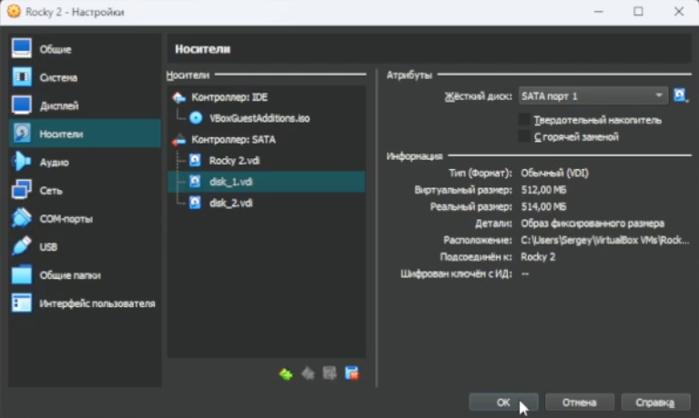{#fig:001 width=70%}

После чего запустили виртуальную машину и перешли в супер пользователя 

{#fig:002 width=70%}

Затем с помощью fdisk просмотрели перечень разделов на всех имеющихся в системе устройствах жестких дисков 

{#fig:003 width=70%}

После чего сделаем разметку диска /dev/sdb с помошью утилиты fdisk и просмотрим справку команд 

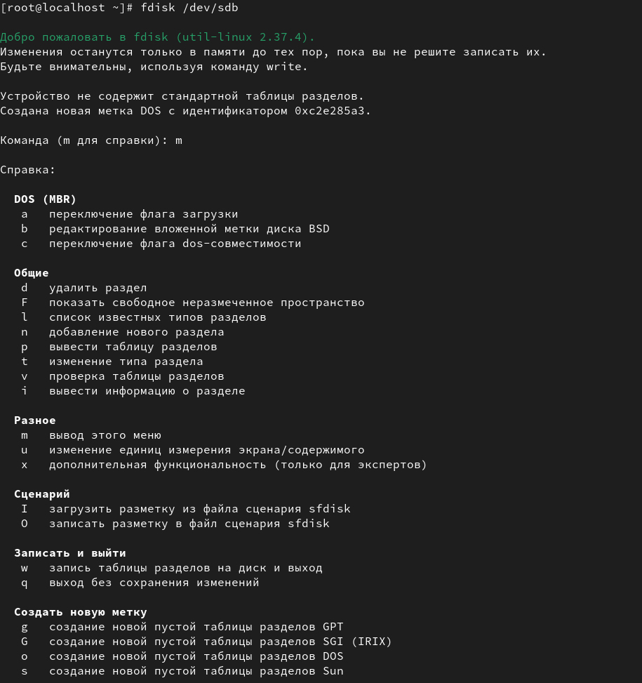{#fig:004 width=70%}

Далее нажмем p чтобы просмотреть текущее распределение пространства диска, далее введем n , чтобы добавить новый раздел выберем раздел p, чтобы создать основной раздел, после чего изменим раздел используя для изменений t и поставим 83  Linux

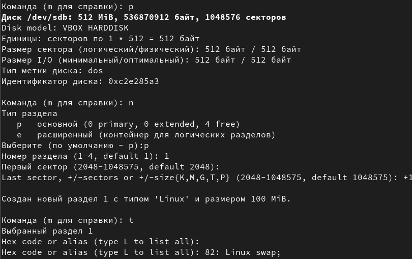{#fig:005 width=70%}

После всех проделанных действий запишем изменения с помощью w

{#fig:006 width=70%}

Далее сравним вывод команды  fdisk -l /dev/sdb и cat /proc/partitions

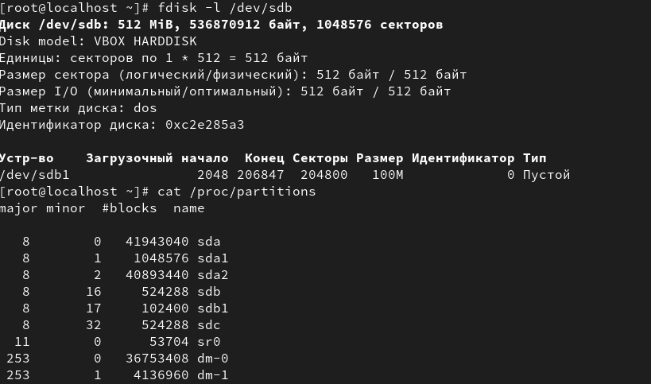{#fig:007 width=70%}

И запишем изменения в таблицу разделов ядра 

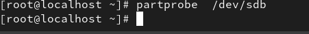{#fig:008 width=70%}

Затем откроем второй терминал войдем в супер пользователя 

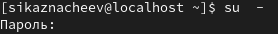{#fig:009 width=70%}

И запустим fdisk /dev/sdb, затем введем n,чтобы добавить новый раздел и введя e создадим расширенный раздел,и примем первый сектор и второй нажам на enter

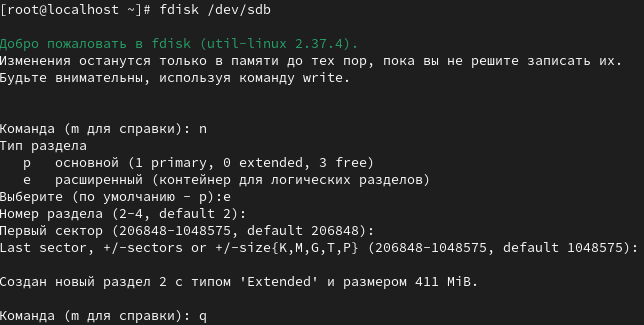{#fig:010 width=70%}

После чего из интерфейса fdisk снова нажмем n , а в последнем секторе введем +101М после чего запишем изменения на диск 

{#fig:011 width=70%}

Обновим страницу 

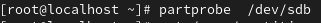{#fig:012 width=70%}

Затем просмотрим информацию о добаленных разделах 

{#fig:013 width=70%}

После всех проделанных действий,снова открываем новый терминал переходим в супер пользователя и запускаем fdisk /dev/sdb, но теперь на последнем секторе введим +100М и изменим тип раздела на 82 , и запишем изменения 

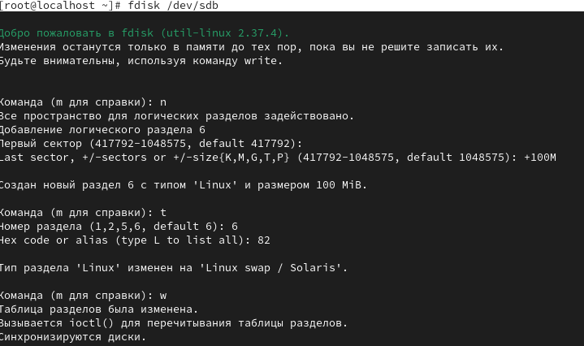{#fig:014 width=70%}

Обновим таблицу разделов ядра

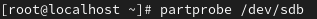{#fig:015 width=70%}

И просмотрим информацию о добавленных разделах 

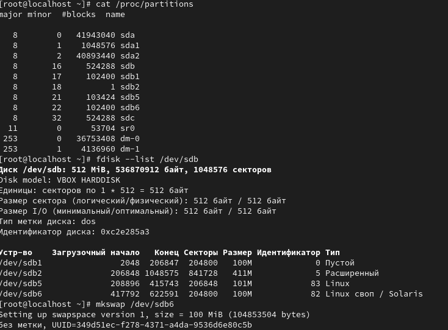{#fig:016 width=70%}

После чего отформатируем раздел подкачки, после чего снова включим и для просмотра размера подкачки введем free -m

{#fig:017 width=70%}

Затем снова открываем новый терминнал и переходим в супер пользователя,затем просматриваем таблицу на втором диске 

{#fig:018 width=70%}

После чего введя  n, чтобы добавить новый раздел выберем номер по умолчанию, в последнем секторе укажем +100М и установим тип раздела 8300

{#fig:019 width=70%}

Теперь раздел создан и отобразим введя p

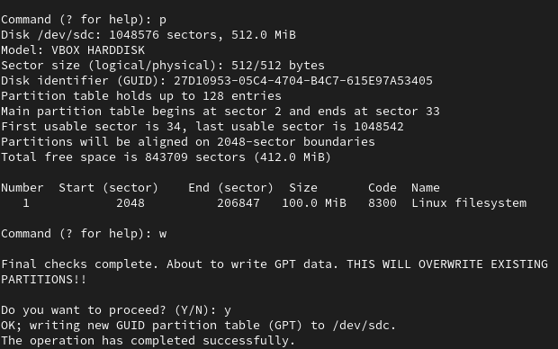{#fig:020 width=70%}

После чего обновим таблицу разделов 

{#fig:021 width=70%}

И просмотрим информацию о добавленных разделах 

{#fig:022 width=70%}

После чего откроем новый терминал, затем перейдем в супер пользователя  и создадим файловую систему XFS для  sdb1, и установим  файловой системы в xfsdis,и создадим файловую систему уже для sdb5

{#fig:023 width=70%}

Для установки параметров монтирования по умолчанию для файловой системы используем команду:

tune2fs -o acl,user_xattr /dev/sdb5

{#fig:024 width=70%}

После всех проделанных действий открываем новый терминал переходим в супер пользователя и создадим точку для монтироавния для раздела /mnt/tmp, после чего используем команду mount /dev/sdb5 /mnt/tmp,  чтобы смонртировать файловую систему и проверим с помощью команды mount 

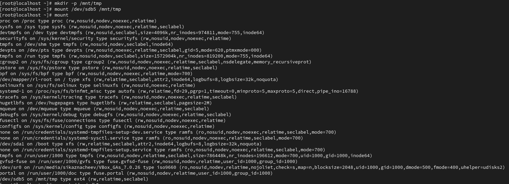{#fig:025 width=70%}

Для того чтобы отмонтировать раздел используем команду umount /dev/sdb5 и проверим что раздел отмонтирован 

{#fig:026 width=70%}

После чего откроем новый терминал и перейдем в супер пользователя, создадим точку монтирования для раздела  /dev/sdb1  и просмотрим информацию об индификаторах блочных устройств 

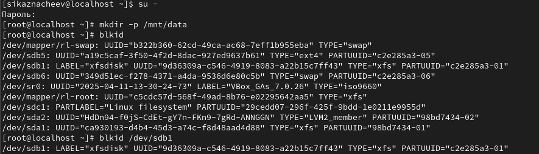{#fig:027 width=70%}

После чего введем  blkid /dev/sdb1, скопируем UUID для устройства /dev/sdb1, и изменим файл /etc/fstab

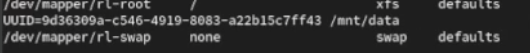{#fig:028 width=70%}

Далее монтируем все что указано в /etc/fstab и проверяем это 

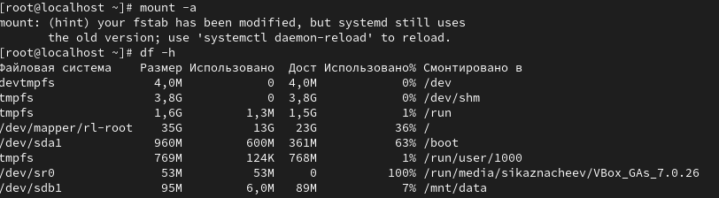{#fig:029 width=70%}

# Самостоятельная часть 

Откроем новый терминал, перейдем в супер пользователя,затем запустим gdisk дял диска  /dev/sdc, после чего создадим  первый раздел (для ext4) и второй (для swap), после чего запишем изменения и выйдем

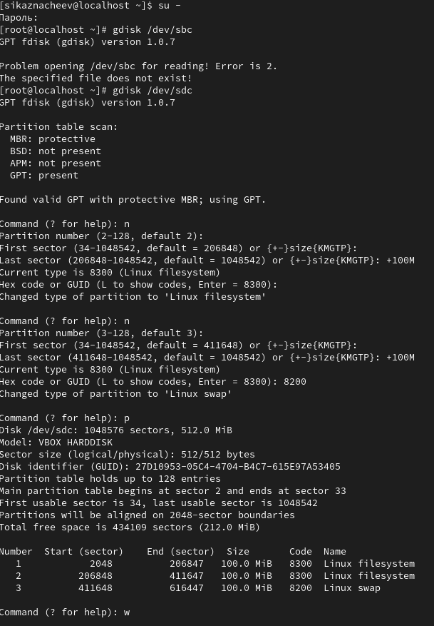{#fig:030 width=70%}

Далее обновим таблицу рахделов ядра  и проверим созданные разделы 

{#fig:031 width=70%}

После чего создаем точку монтирования для раздела  ext4 и форматируем второй раздел как  swap, после чего узнаем UUID разделов sdc1 и sdc2

{#fig:032 width=70%}

Монтируем и активируем swap раздел для  sdc2, проверяем монтирование,проверяем swap

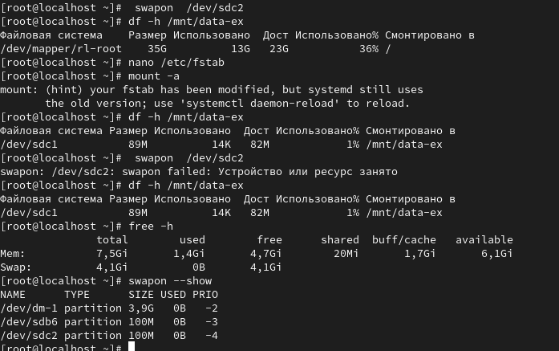{#fig:033 width=70%}

# Контрольные вопросы  

1. Какой инструмент используется для создания разделов GUID?

Ответ - gdisk для разделов GUID

2. Какой инструмент применяется для создания разделов MBR?

Ответ - fdisk - для раздлелов MBR

3. Какой файл используется для автоматического монтирования разделов во время загрузки?

Ответ - /etc/fstab - для автоподключения при загрузке 

4. Какой вариант монтирования целесообразно выбрать, если необходимо, чтобы файловая система не была автоматически примонтирована во время загрузки?

Ответ - использовать опцию монтирования  noaouto

5. Какая команда позволяет форматировать раздел с типом 82 с соответствующей файловой системой?

Ответ - тип 82 это Linux swap

6. Вы только что добавили несколько разделов для автоматического монтирования при загрузке. Как можно безопасно проверить, будет ли это работать без реальной перезагрузки?

Ответ - проверить без перезагрузки sudo mount -a

7. Какая файловая система создаётся, если вы используете команду mkfs без какой либо спецификации файловой системы?

Ответ - по умолчанию ext2

8. Как форматировать раздел EXT4?

Ответ - mkfs.ext4 /deb/...

9. Как найти UUID для всех устройств на компьютере?

Ответ - командой  blkid

# Выводы 

В ходе выполнения лабораторной работы я получил  навыки создания разделов на диске и файловых систем и  навыки монтирования файловых систем.

