---
## Front matter
title: "Лабораторная работа №15"
subtitle: "Управление логическими томами"
author: "Казначеев Сергей Ильич"

## Generic otions
lang: ru-RU
toc-title: "Содержание"

## Bibliography
bibliography: bib/cite.bib
csl: pandoc/csl/gost-r-7-0-5-2008-numeric.csl

## Pdf output format
toc: true # Table of contents
toc-depth: 2
lof: true # List of figures
lot: true # List of tables
fontsize: 12pt
linestretch: 1.5
papersize: a4
documentclass: scrreprt
## I18n polyglossia
polyglossia-lang:
  name: russian
  options:
	- spelling=modern
	- babelshorthands=true
polyglossia-otherlangs:
  name: english
## I18n babel
babel-lang: russian
babel-otherlangs: english
## Fonts
mainfont: IBM Plex Serif
romanfont: IBM Plex Serif
sansfont: IBM Plex Sans
monofont: IBM Plex Mono
mathfont: STIX Two Math
mainfontoptions: Ligatures=Common,Ligatures=TeX,Scale=0.94
romanfontoptions: Ligatures=Common,Ligatures=TeX,Scale=0.94
sansfontoptions: Ligatures=Common,Ligatures=TeX,Scale=MatchLowercase,Scale=0.94
monofontoptions: Scale=MatchLowercase,Scale=0.94,FakeStretch=0.9
mathfontoptions:
## Biblatex
biblatex: true
biblio-style: "gost-numeric"
biblatexoptions:
  - parentracker=true
  - backend=biber
  - hyperref=auto
  - language=auto
  - autolang=other*
  - citestyle=gost-numeric
## Pandoc-crossref LaTeX customization
figureTitle: "Рис."
tableTitle: "Таблица"
listingTitle: "Листинг"
lofTitle: "Список иллюстраций"
lotTitle: "Список таблиц"
lolTitle: "Листинги"
## Misc options
indent: true
header-includes:
  - \usepackage{indentfirst}
  - \usepackage{float} # keep figures where there are in the text
  - \floatplacement{figure}{H} # keep figures where there are in the text
---

# Цель работы

Получить навыки управления логическими томами.

# Задание

1. Продемонстрировать навыки создания физических томов на LVM (см. раздел 15.4.1).
2. Продемонстрировать навыки создания группы томов и логических томов на LVM (см.
раздел 15.4.2).
3. Продемонстрировать навыки изменения размера логических томов на LVM (см. раз-
дел 15.4.3).
4. Выполнить задание для самостоятельной работы (см. раздел 15.5)

# Выполнение лабораторной работы

Для начала мы отмонтируем /mnt/data и /mnt/data-ext

{#fig:001 width=70%}

После чего с помощью команды mount убедимся что диски  /dev/sdb и  /dev/sdc не подключены 

{#fig:002 width=70%}

Далее сделаем новую разметку для  sdb и  sdc, введем p  для просмотра текущей разметки затем создадим пустую таблицу o для того чтобы удалить все имеющиеся партиции, проверяем что партиции удалены введя p и сохраняем w

{#fig:003 width=70%}

Запишем изменения 

{#fig:004 width=70%}

После чего просматриваем информацию о разделах 

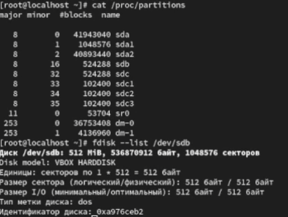{#fig:005 width=70%}

Теперь создадим новый раздел с типом LVM, введем  n чтобы создать новый раздел выберем основной p и в последнем секторе введем +100М, после чего вернувшись в приглашение fdisk введем t чтобы изменить тип раздела, при запросе о выборе раздела выбераем 8e, после чего записываем изменения w

{#fig:006 width=70%}

Затем обновляем страницу разделов 

{#fig:007 width=70%}

После того как раздел был создан, мы указываем его как физический том LVM 

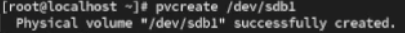{#fig:008 width=70%}

Чтобы убедиться,что физический том создан успешно введем pvs 

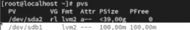{#fig:009 width=70%}

Далее открываем новый терминал и переходим в супер пользователя 

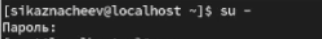{#fig:010 width=70%}

И проверяем доступность физических томов в нашей системе 

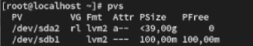{#fig:011 width=70%}

Затем создаем группу томов с присвоенным ей физическим томом 

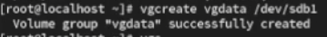{#fig:012 width=70%}

Проверяем что группа томов была  создана успешно 

{#fig:013 width=70%}

После чего создадим логический том LVM с именем lvdata, который будет использовать 50%

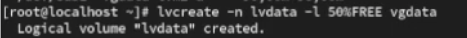{#fig:014 width=70%}

Для проверки успешного добавления введем lvs

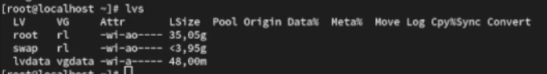{#fig:015 width=70%}

Теперь создадим файловую систему поверх логического тома 

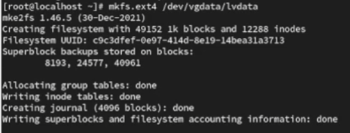{#fig:016 width=70%}

Затем создаем папку и в файл /etc/fstab записываем следующую строку /dev/vgdata/lvdata /mnt/data ext4 defaults 1 2 и проверяем монтируется ли файловая система или нет 

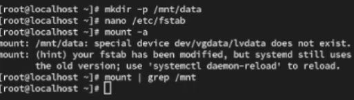{#fig:017 width=70%}

После всех проделанных действий открываем новый терминал, переходим в супер пользователя и просматриваем конфигурацию физических томов и группы томов

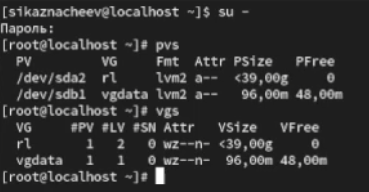{#fig:018 width=70%}

Далее добавляем новый раздел /dev/sdb2 размером 100 М и тип раздела 8е

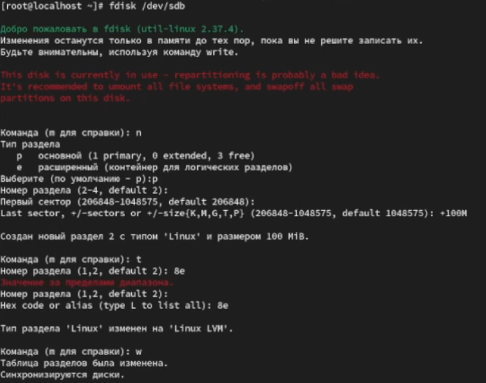{#fig:019 width=70%}

После чего создаем физический том, расширяем его и проверяем, что размер доступных групп томов увеличен и проверяем размер логического тома lvdata

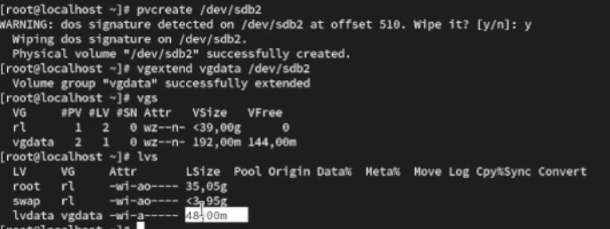{#fig:020 width=70%}

Затем проверяем текущий размер фаловой системы на lvdata

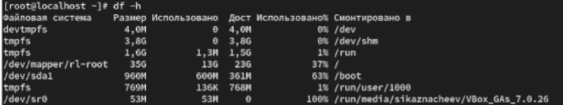{#fig:021 width=70%}

И увеличиваем lvdata на 50% оставшегося доступного дискового пространства

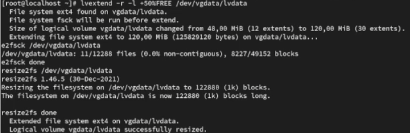{#fig:022 width=70%}

После чего убеждаемся что добавленное дисковое пространство стало доступным 

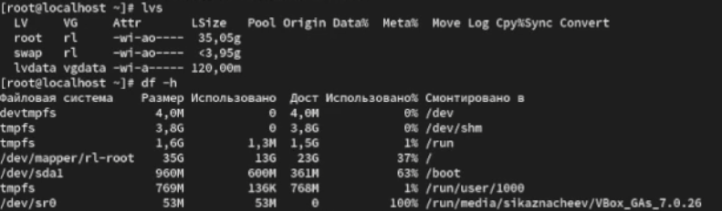{#fig:023 width=70%}

Затем уменьшаем размер lvdata на 50МБ

{#fig:024 width=70%}

И проверяем успешное изменение дискового пространства 

{#fig:025 width=70%}

# Контрольные вопросы 

1. Какой тип раздела используется в разделе GUID для работы с LVM?

Ответ - тип раздела 8e00
2. Какой командой можно создать группу томов с именем vggroup, которая содержит физическое устройство /dev/sdb3 и использует физический экстент 4 MiB?

Ответ - командой vgcreate -s 4M vggroup /dev/sdb3

3. Какая команда показывает краткую сводку физических томов в вашей системе, а также группу томов, к которой они принадлежат?

Ответ -  команда  pvs

4. Что вам нужно сделать, чтобы добавить весь жёсткий диск /dev/sdd в группу томов группы?

Ответ - сначало надо создать lVM раздел  pvcreate /dev/sdd и  vgextend "vgname" /dev/sdd

5. Какая команда позволяет вам создать логический том lvvol1 с размером 6 MiB?

Ответ - команда  lvcreate -n lvvol1 -L 6M "vgname"

6. Какая команда позволяет вам добавить 100 МБ в логический том lvvol1, если предположить, что дисковое пространство доступно в группе томов?

Ответ - команда  lvextend -L +100M /dev/"vgname"/lvvol1

7. Каков первый шаг, чтобы добавить ещё 200 МБ дискового пространства в логический том, если требуемое дисковое пространство недоступно в группе томов?

Ответ - добавляем новый физический том pvcreate "device"  и  vgextend "vgname" "device"

8. Какую опцию нужно использовать с командой lvextend, чтобы также изменить размер файловой системы?

Ответ - -r

9. Как посмотреть, какие логические тома доступны?

Ответ - lvs

10. Какую команду нужно использовать для проверки целостности файловой системы на /dev/vgdata/lvdata?

Ответ - команда  fsck /dev/vgdata/lvdata

# Выводы 

В ходе выполнения лабораторной работы я получил навыки управления логическими томами.

