---
## Front matter
title: "Лабораторная работа №16"
subtitle: "Программный RAID"
author: "Казначеев Сергей Ильич"

## Generic otions
lang: ru-RU
toc-title: "Содержание"

## Bibliography
bibliography: bib/cite.bib
csl: pandoc/csl/gost-r-7-0-5-2008-numeric.csl

## Pdf output format
toc: true # Table of contents
toc-depth: 2
lof: true # List of figures
lot: true # List of tables
fontsize: 12pt
linestretch: 1.5
papersize: a4
documentclass: scrreprt
## I18n polyglossia
polyglossia-lang:
  name: russian
  options:
	- spelling=modern
	- babelshorthands=true
polyglossia-otherlangs:
  name: english
## I18n babel
babel-lang: russian
babel-otherlangs: english
## Fonts
mainfont: IBM Plex Serif
romanfont: IBM Plex Serif
sansfont: IBM Plex Sans
monofont: IBM Plex Mono
mathfont: STIX Two Math
mainfontoptions: Ligatures=Common,Ligatures=TeX,Scale=0.94
romanfontoptions: Ligatures=Common,Ligatures=TeX,Scale=0.94
sansfontoptions: Ligatures=Common,Ligatures=TeX,Scale=MatchLowercase,Scale=0.94
monofontoptions: Scale=MatchLowercase,Scale=0.94,FakeStretch=0.9
mathfontoptions:
## Biblatex
biblatex: true
biblio-style: "gost-numeric"
biblatexoptions:
  - parentracker=true
  - backend=biber
  - hyperref=auto
  - language=auto
  - autolang=other*
  - citestyle=gost-numeric
## Pandoc-crossref LaTeX customization
figureTitle: "Рис."
tableTitle: "Таблица"
listingTitle: "Листинг"
lofTitle: "Список иллюстраций"
lotTitle: "Список таблиц"
lolTitle: "Листинги"
## Misc options
indent: true
header-includes:
  - \usepackage{indentfirst}
  - \usepackage{float} # keep figures where there are in the text
  - \floatplacement{figure}{H} # keep figures where there are in the text
---

# Цель работы

Освоить работу с RAID-массивами при помощи утилиты mdadm.

# Задание

1. Прочитайте руководство по работе с утилитами fdisk, sfdisk и mdadm.

2. Добавить три диска на виртуальную машину (объёмом от 512 MiB каждый). При помо-
щи sfdisk создать на каждом из дисков по одной партиции, задав тип раздела для
RAID (см. разделы 16.4.1, 16.4.2).

3. Создать массив RAID 1 из двух дисков, смонтировать его. Эмитировать сбой одного из
дисков массива, удалить искусственно выведенный из строя диск, добавить в массив
работающий диск (см. раздел 16.4.2).

4. Создать массив RAID 1 из двух дисков, смонтировать его. Добавить к массиву тре-
тий диск. Эмитировать сбой одного из дисков массива. Проанализировать состояние
массива, указать различия по сравнению с предыдущим случаем (см. раздел 16.4.3).

5. Создать массив RAID 1 из двух дисков, смонтировать его. Добавить к массиву третий
диск. Изменить тип массива с RAID1 на RAID5, изменить число дисков в массиве с 2 на 3.
Проанализировать состояние массива, указать различия по сравнению с предыдущим
случаем (см. раздел 16.4.4).

# Выполнение лабораторной работы

Для начала мы перейдем в суперпользователя и проверим наличие созданных дисков 

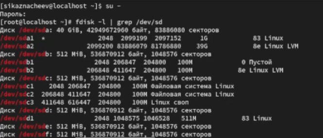{#fig:001 width=70%}

После чего создадим на каждом из дисков раздел EOF

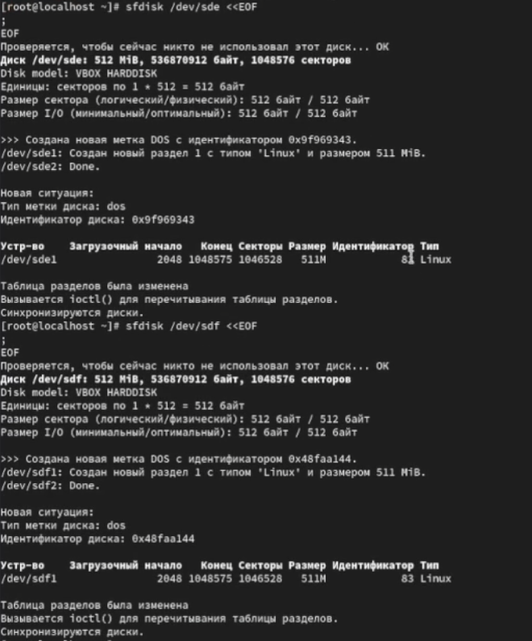{#fig:002 width=70%}

После чего проверим текущий тип созданных разделов 

{#fig:003 width=70%}

Далее просмотрим какие типы партиций относящиеся к RAID можно задать и затем установим тип разделов  в Linux raid aautodetect

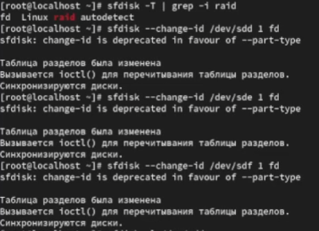{#fig:004 width=70%}

Затем просмотрим состояние дисков 

{#fig:005 width=70%}

После чего устанавливаем утилиту mdadm и создаем массив  RAID 1 из двух дисков 

{#fig:006 width=70%}

Далее проверим состояние массива RAID 

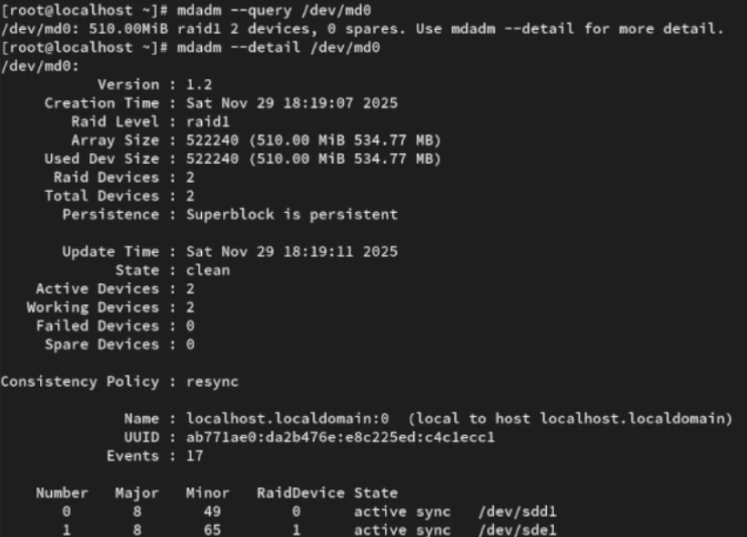{#fig:007 width=70%}

Затем создаем файловую систему на RAID и подмонтируем  RAID

{#fig:008 width=70%}

Для автомонтирования добавляем запись в /etc/fstab

{#fig:009 width=70%}

После сымитируем сбой одного из дисков, удалим сбойный диск и заменим диск в массиве 

{#fig:010 width=70%}

Затем просмотрим изменения 

{#fig:011 width=70%}

После чего удалим массив и очистим матеданные 

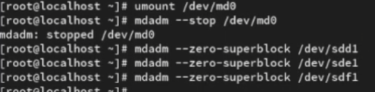{#fig:012 width=70%}

Далее откроем второй терминал и перейдем в суперпользователя, создадим массив RAID 1, довабив третий диск и подмонтируем его 

{#fig:013 width=70%}

И проверим это 

{#fig:014 width=70%}

После чего сымитируем сбой одного диска, проверим состояние массива и уюедимся что массив автоматически пересобирается 

{#fig:015 width=70%}

Затем удалим массив и очистим метаданные 

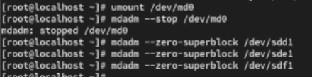{#fig:016 width=70%}

После все проделанных действий  откроем новый терминал перейдем в суперпользователя и создадим массив RAID 1 из 2 дисков 

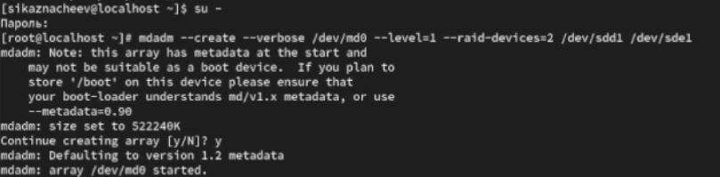{#fig:017 width=70%}

После чего добавим третий диск и подмонтируем его 

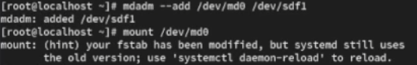{#fig:018 width=70%}

Затем проверим состояние массива 

{#fig:019 width=70%}

Далее  изменим тип массива RAID, проверим состояние его 

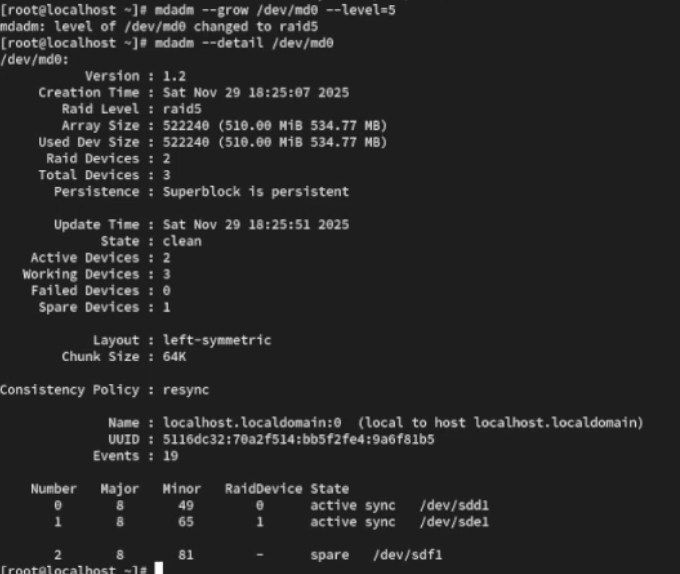{#fig:020 width=70%}

Теперь изменим количество дисков в массиве  RAID 5 и проверим состояние 

{#fig:021 width=70%}

Затем удалим массив, очистим метаданные и закоментируем запись в  /etc/fstab

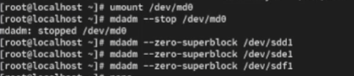{#fig:022 width=70%}

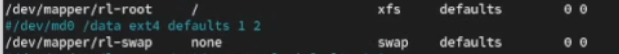{#fig:023 width=70%}

# Контрольные вопросы 

1. Приведите определение RAID.

Ответ - это технология объединения нескольких физических дисков в единый логический массив для повышения производительности, надежности или объема хранения данных

2. Какие типы RAID-массивов существуют на сегодняшний день?

Ответ - основыные типы  RAID 0, RAID 1, RAID 2, RAID 5, RAID 6

Комбинированные RAID 10 (1+0),RAID 50, RAID 60
 
3. Охарактеризуйте RAID 0, RAID 1, RAID 5, RAID 6, опишите алгоритм работы, назначение, приведите примеры применения.

1 - RAID 0 (страйпинг)

Алгоритм: Данные разбиваются на блоки и записываются на несколько дисков параллельно.

Назначение: Максимальное увеличение производительности и объёма.

Недостаток: Отсутствие избыточности; выход одного диска разрушает массив.

Пример: Обработка видео, кэширование, игровые системы.

2 - RAID 1 (зеркалирование)

Алгоритм: Полное дублирование данных на двух или более дисках.

Назначение: Обеспечение отказоустойчивости и увеличение скорости чтения.

Недостаток: Высокие затраты на хранение (50% полезной ёмкости).

Пример: Серверы ОС, критичные базы данных.

3 - RAID 5

Алгоритм: Данные и чётность (контрольная сумма) распределяются по всем дискам массива. Для восстановления при отказе одного диска используется информация о чётности.

Назначение: Баланс производительности, надёжности и эффективности использования ёмкости.

Недостаток: Снижение производительности при записи; риск при выходе второго диска во время восстановления.

Пример: Файловые серверы, веб-серверы.

4 - RAID 6

Алгоритм: Используется две независимые схемы чётности, распределяемые по всем дискам (например, коды Рида-Соломона).

Назначение: Высокая отказоустойчивость — сохранение работоспособности при отказе двух дисков одновременно.

Недостаток: Ещё большие потери производительности на записи, чем в RAID 5.

Пример: Системы хранения критичных данных, архивы, медиа-хранилища.

# Выводы 

После выполнения лабораторной работы я получил навыки работы с RAID-массивами при помощи утилиты mdadm.

