---
## Front matter
lang: ru-RU
title: Структура научной презентации
subtitle: Простейший шаблон
author:
  - Кулябов Д. С.
institute:
  - Российский университет дружбы народов, Москва, Россия
  - Объединённый институт ядерных исследований, Дубна, Россия
date: 01 января 1970

## i18n babel
babel-lang: russian
babel-otherlangs: english

## Formatting pdf
toc: false
toc-title: Содержание
slide_level: 2
aspectratio: 169
section-titles: true
theme: metropolis
header-includes:
 - \metroset{progressbar=frametitle,sectionpage=progressbar,numbering=fraction}
---

# Информация

## Докладчик

:::::::::::::: {.columns align=center}
::: {.column width="70%"}

  * Казначеев Сергей Ильич 
  * Студент
  * Российский университет дружбы народов
  * [1132240693@pfur.ru]

:::
::: {.column width="30%"}

:::
::::::::::::::

## Цель 

Научится создавать сайты с помощью hugo

## Задачи

Установить необходимое программное обеспечение.
Скачать шаблон темы сайта.
Разместить его на хостинге git.
Установить параметр для URLs сайта.
Разместить заготовку сайта на Github pages.
    
## Установка Hugo

Для начала необходимо скачать последнюю версию движка сайтов Hugo для Linux

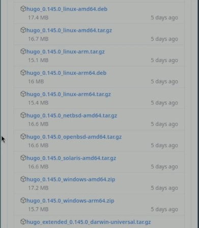

## Установка Hugo

Далее с помощью утилита распаковываем архив с Hugo

## Установка Hugo

Установим Hugo переместив файл в директорию /usr/local/bin

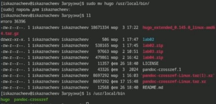

## Настройка репозитория 

Заходим на страницу шаблона для сайтов и создаем из нее репозиторий 

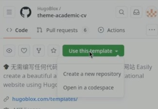

## Настройка репозитория 

Создаем репозиторий с названием blog

## Настройка репозитория 

И клонируем репозиторий к себе на компьютер

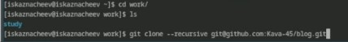

## Установка Go

Установим язык Go на компьютер так как он необходим для работы с Hugo

## Запуск Hugo

Запустим Hugo В момент запуска он подготовит папку с сайтом создав дополнительные каталоги 

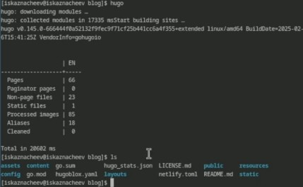

## Удаляем папку  Public

Удаляем папку Public

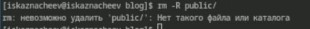

## Запуск Hugo server

Теперь запустим Hugo с опцией server которая позволит запустить наш сайт 

## Вид нашего сайта 

Перейда по адресу local:1313, мы увидим наш сайт 

## Настройка второго репозитория 

Теперь создаем второй репозиторий на котором будет висеть наш сайт. Его нужно назвать в формате "Имя нашего аккаунат Github + .github.io"

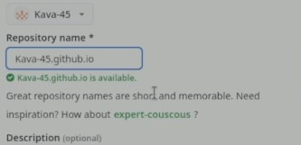

## Настройка второго репозитория 

Теперь клонируем наш пустой репозиторий на компьютер создадим README.md и переключимся на ветку main

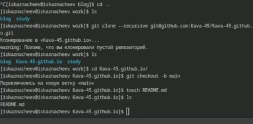

## Настройка второго репозитория 

Обновляем репозиторий делаем коммит и отправляем на github

## Настройка сабмодуля 

Теперь добавляем второй репозиторий как сабмодуль первого, и он будет хранить в себе папку public

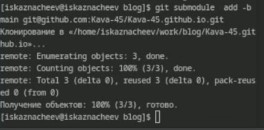

## Настройка сабмодуля 

Проверяем корректность настройки сабмодуля 

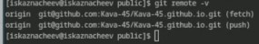

## Загрузим изменения в репозиторий 

Делаем коммит 

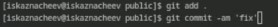

## Загрузим изменения в репозиторий 

Выгружаем на github

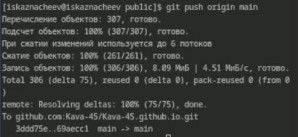

## Вид сайта на хостинге github

Теперь посмотрим как выглядит наш сайт который располагается https://kava-45.github.io/

## Вывод 

Я научился устанавливать необходимое программное обеспечение,скачивать шаблоны и темы сайтов,размещать их на хостинг git,
устанавливать параметр для URLs сайта, размещать заготовку сайта на Github pages
:::

