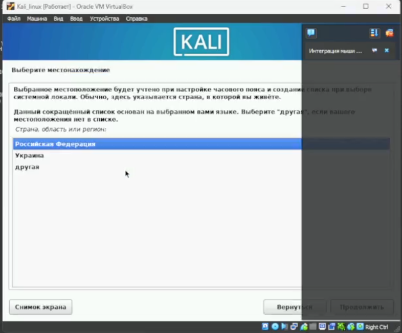
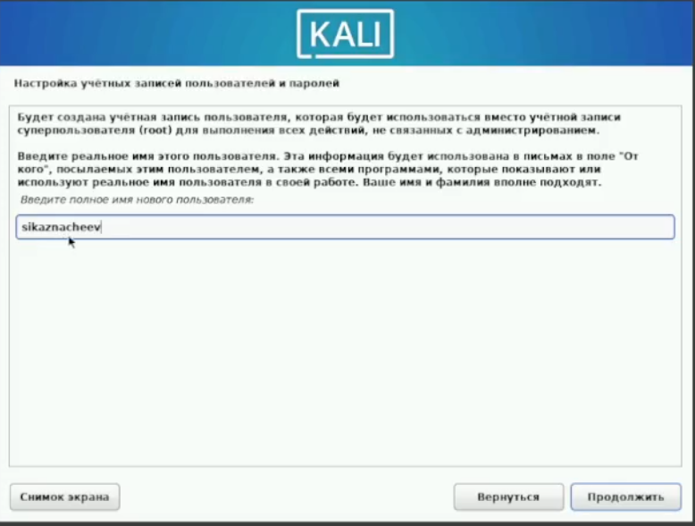
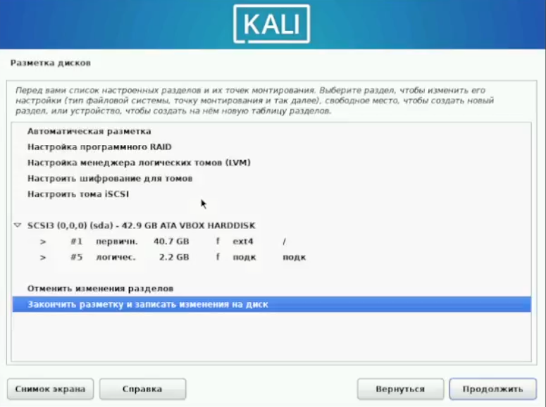
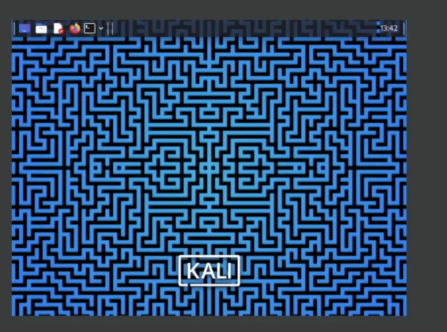

---
## Front matter
lang: ru-RU
title: Структура научной презентации
subtitle: Простейший шаблон
author:
  - Казначеев С.И.
institute:
  - Российский университет дружбы народов, Москва, Россия
date: 06 января 2026

## i18n babel
babel-lang: russian
babel-otherlangs: english

## Formatting pdf
toc: false
toc-title: Содержание
slide_level: 2
aspectratio: 169
section-titles: true
theme: metropolis
header-includes:
 - \metroset{progressbar=frametitle,sectionpage=progressbar,numbering=fraction}
---

# Информация

## Докладчик

:::::::::::::: {.columns align=center}
::: {.column width="70%"}

  * Казначеев Сергей Ильич 
  * Студент
  * Российский университет дружбы народов
  * [1132240693@pfur.ru]

:::
::: {.column width="30%"}

## Цель работы 

Установить дистрибутив Kali Linux в виртуальную машину 

## Выполнение индивидуального проекта 

После того как настрои kali linux выберем язык 

{#fig:001 width=70%}

## После чего выберем местонахождение 

{#fig:002 width=70%}

## Далее выберем настройку клавиатуры 

{#fig:003 width=70%}

## Затем настроим сеть

{#fig:004 width=70%}

## После настоим учетную запись пользователя 

{#fig:005 width=70%}

## И пароль к учетной записи 

{#fig:007 width=70%}

## После чего выберем разметку дисков

{#fig:008 width=70%}

## И выберем сам диск 

{#fig:011 width=70%}

## Подтверждаем разметку дисков 

{#fig:012 width=70%}

## И записываем изменения 

{#fig:013 width=70%}

## Затем выбераем программные обеспечения

{#fig:014 width=70%}

## Устанавливаем системного загрузчика GRUB

{#fig:015 width=70%}

## После чего перезапускаем систему и входим в учетную запись 

{#fig:016 width=70%}

## Выводы

В результате выполнения индивидуального проекта был установлен kali linux.
