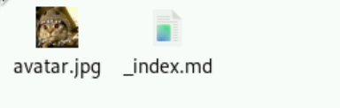
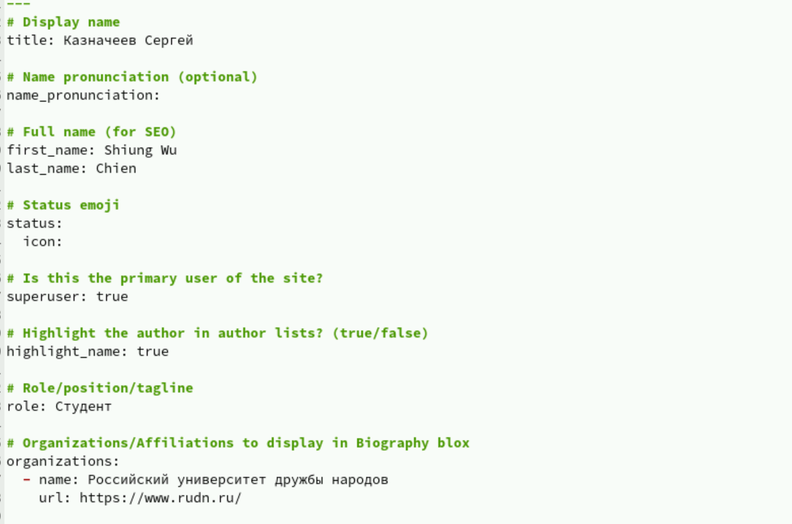
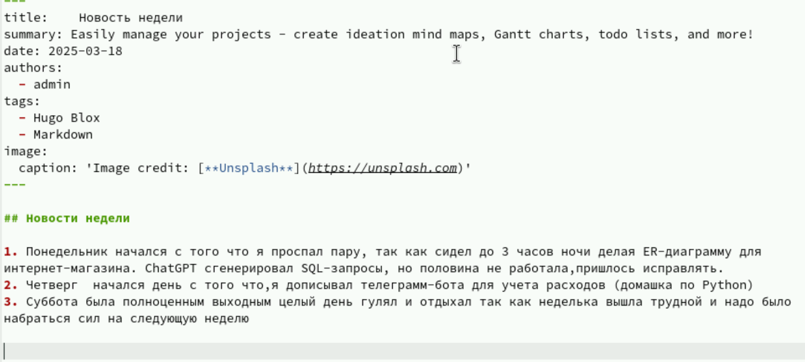

---
## Front matter
lang: ru-RU
title: Структура научной презентации
subtitle: Простейший шаблон
author:
  - Кулябов Д. С.
institute:
  - Российский университет дружбы народов, Москва, Россия
  - Объединённый институт ядерных исследований, Дубна, Россия
date: 01 января 1970

## i18n babel
babel-lang: russian
babel-otherlangs: english

## Formatting pdf
toc: false
toc-title: Содержание
slide_level: 2
aspectratio: 169
section-titles: true
theme: metropolis
header-includes:
 - \metroset{progressbar=frametitle,sectionpage=progressbar,numbering=fraction}
---

# Информация

## Докладчик

:::::::::::::: {.columns align=center}
::: {.column width="70%"}

  * Казначеев Сергей Ильич 
  * Студент
  * Российский университет дружбы народов
  * [1132240693@pfur.ru]

:::
::: {.column width="30%"}

:::
::::::::::::::

## Цель работы 

Создать индивидуальный сайт, постепенно его заполняя

## Задание

Разместить фотографию владельца сайта.
Разместить краткое описание владельца сайта (Biography).
Добавить информацию об интересах (Interests).
Добавить информацию от образовании (Education).
Сделать пост по прошедшей неделе.
Добавить пост на тему по выбору

## Выполнение работы 

Для начала нужно было загрузить фотографию, добавив ее в папку blog/content/authors/admin

## Заполнение базовой информации 

Теперь добавим информацию о себе в файле index.md

## Интересы и образование 

Добавляем там же  информацию об интересах и образовании 

## Пост о прошедшей неделе 

Напишем пост о прошедшей неделе в папке post

## Вывод

В результате работы были добавлены основные элементы об авторе, а также написано 2 поста 
