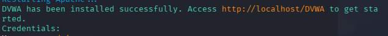
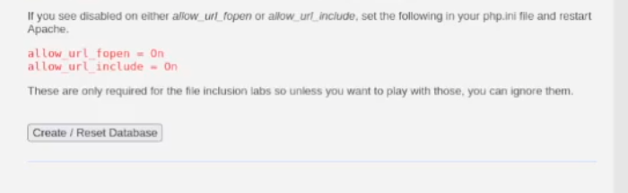
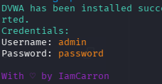

---
## Front matter
lang: ru-RU
title: Структура научной презентации
subtitle: Простейший шаблон
author:
  - Кулябов Д. С.
institute:
  - Российский университет дружбы народов, Москва, Россия
  - Объединённый институт ядерных исследований, Дубна, Россия
date: 01 января 1970

## i18n babel
babel-lang: russian
babel-otherlangs: english

## Formatting pdf
toc: false
toc-title: Содержание
slide_level: 2
aspectratio: 169
section-titles: true
theme: metropolis
header-includes:
 - \metroset{progressbar=frametitle,sectionpage=progressbar,numbering=fraction}
---

# Информация

## Докладчик

:::::::::::::: {.columns align=center}
::: {.column width="70%"}

  * Казначеев Сергей Ильич 
  * Студент
  * Российский университет дружбы народов
  * [1132240693@pfur.ru]

:::
::: {.column width="30%"}

## Цель работы 

Установите DVWA в гостевую систему к Kali Linux.

## Выполнение индивидуального проекта 

Для начала откроем репозиторий и скопируем команду для установки  DVWA

## Установка DVWA

После установки появится ссылка на DVWA

## DVWA

Откроем ее и нажмем на create / reset Database

## DVWA

Затем введем данные которые выдались после установки DVWA

## Проверка входа в аккаунт 

После чего мы увидим, что у нас все получилось и мы зашли 

## Вывод

В результате работы был установлен DVWA в гостевую систему к Kali Linux.
