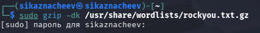
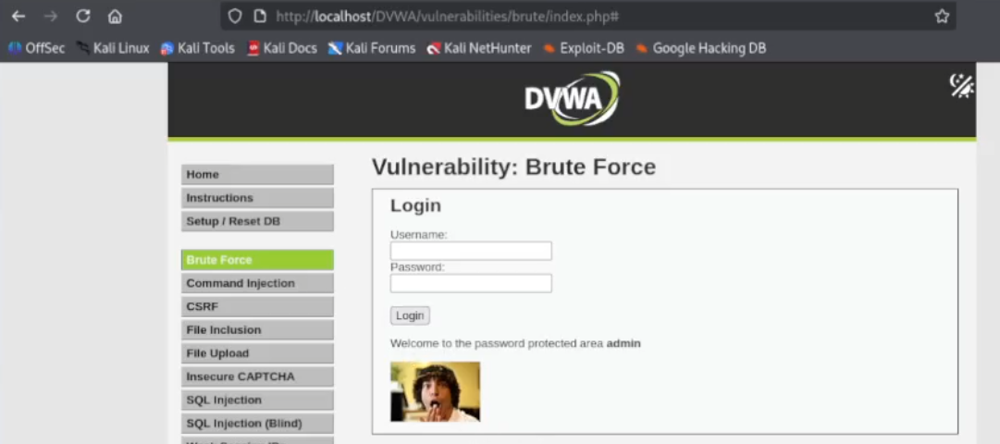

---
## Front matter
lang: ru-RU
title: Отчет по индивидуальному проекту
subtitle: Часть 3
author:
  - Казначеев С.И.
institute:
  - Российский университет дружбы народов, Москва, Россия
date: 03 апреля 2026

## i18n babel
babel-lang: russian
babel-otherlangs: english

## Formatting pdf
toc: false
toc-title: Содержание
slide_level: 2
aspectratio: 169
section-titles: true
theme: metropolis
header-includes:
 - \metroset{progressbar=frametitle,sectionpage=progressbar,numbering=fraction}
---

# Информация

## Докладчик

:::::::::::::: {.columns align=center}
::: {.column width="70%"}

  * Казначеев Сергей Ильич 
  * Студент
  * Российский университет дружбы народов
  * [1132240693@pfur.ru]

:::
::: {.column width="30%"}

## Задание

Hydra используется для подбора или взлома имени пользователя и пароля.
Поддерживает подбор для большого набора приложений.

## Выполнение лабораторной работы

После открытие терминала и командой распакует файл rockyou.txt.gz

## Данные куки

После чего откроем на сайте файлы куки 

## Команда 

Затем пропишем команду, которая указана в туисе и откредактируем под наши данные 

## Проверка 

Проверим получилось ли у нас или нет 

## Вывод

 В ходе лабораторной работы утилита Hydra была применена для подбора учетных данных. Подтверждена её функциональность по поддержке множества приложений (от веб-форм до SSH). Эксперимент показал, что скорость и успех подбора зависят от качества словаря и количества потоков. На практике доказано, что использование простых или словарных паролей делает систему уязвимой для атак типа "brute force" и "dictionary attack", и Hydra позволяет эффективно демонстрировать эту уязвимость.

