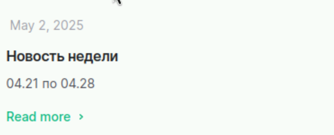

---
## Front matter
lang: ru-RU
title: Индивидуальный проект 
subtitle: Часть 4
author:
  - Казначеев С. И.
institute:
  - Российский университет дружбы народов, Москва, Россия 
date: 01 января 1970

## i18n babel
babel-lang: russian
babel-otherlangs: english

## Formatting pdf
toc: false
toc-title: Содержание
slide_level: 2
aspectratio: 169
section-titles: true
theme: metropolis
header-includes:
 - \metroset{progressbar=frametitle,sectionpage=progressbar,numbering=fraction}
---

# Информация

## Докладчик

:::::::::::::: {.columns align=center}
::: {.column width="70%"}

  * Казначеев Сергей Ильич 
  * Студент
  * Российский университет дружбы народов
  * [1132240693@pfur.ru]

:::
::: {.column width="30%"}
:::
::::::::::::::

## Цель 
Создать индивидуальный сайт,постепенно его заполняя 

## Задачи

Добавить в файле index.md нашего профиля ссылки на ресурсы 

## Пост о прошедшей неделе 

Напишем пост о прошедшей неделе

## Пост про презентации

Напишем пост про презентации

## Вид постов 

Так выглядят посты 

## Второй пост

## Выводы

В результате работы были добавлены ссылки на ресурсы 
