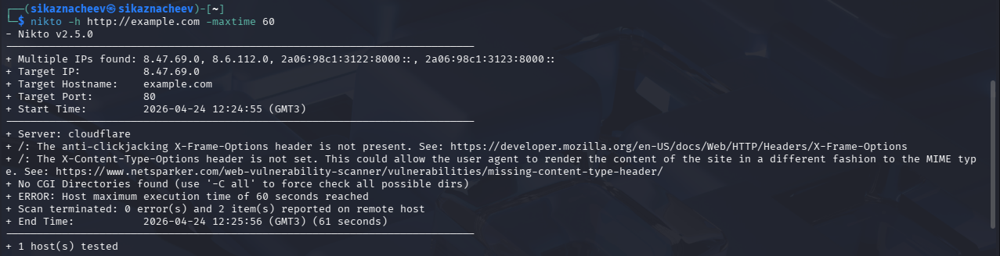

---
## Front matter
lang: ru-RU
title: Индивидуальный проект 
subtitle: Часть 4
author:
  - Казначеев С. И.
institute:
  - Российский университет дружбы народов, Москва, Россия 
date: 24 апреля 2026

## i18n babel
babel-lang: russian
babel-otherlangs: english

## Formatting pdf
toc: false
toc-title: Содержание
slide_level: 2
aspectratio: 169
section-titles: true
theme: metropolis
header-includes:
 - \metroset{progressbar=frametitle,sectionpage=progressbar,numbering=fraction}
---

# Информация

## Докладчик

:::::::::::::: {.columns align=center}
::: {.column width="70%"}

  * Казначеев Сергей Ильич 
  * Студент
  * Российский университет дружбы народов
  * [1132240693@pfur.ru]

:::
::: {.column width="30%"}

## Цель 

Изпользовать nikto

## Слайд 1

Для начала откровем терминал и установим nikto 

## Слайд 2

После чего проверим сканирование веб-сервера 

## Слайд 3

Далее проверим детальное сканирование с выводом в файл 

## Слайд 4

Затем сделаем сканирование с игнорированием ошибок SSL

## Слайд 5

После чего сделаем сканирование конкретного порта, я выбрал 8080

## Слайд 6

Далее сделаем ускоренное сканирование

## Слайд 7

Затем сделаем проверку конкретной уязвимости или файла 

## Слайд 8

И в последней проверке отсканируем конкретный сервер, сохраним отчет в формате html и максимально время 120

## Выводы

В результате выполнения лабораторной работы я получил навыки работы с nikto

