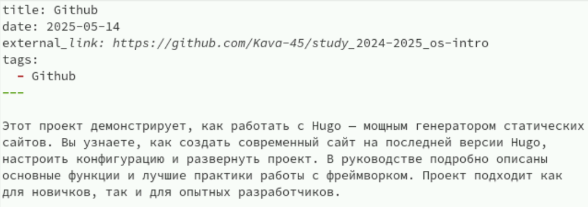
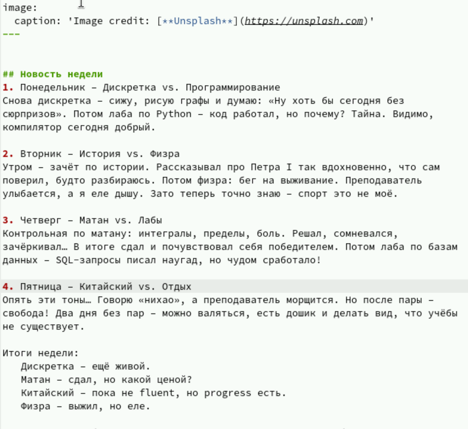

---
## Front matter
lang: ru-RU
title:  отчет по презентации  индивидуальный проект 
subtitle: Простейший шаблон
author:
  - Казначеев С. И.
institute:
  - Российский университет дружбы народов, Москва, Россия
date: 14 мая 2025

## i18n babel
babel-lang: russian
babel-otherlangs: english

## Formatting pdf
toc: false
toc-title: Содержание
slide_level: 2
aspectratio: 169
section-titles: true
theme: metropolis
header-includes:
 - \metroset{progressbar=frametitle,sectionpage=progressbar,numbering=fraction}
---

# Информация

## Докладчик

:::::::::::::: {.columns align=center}
::: {.column width="70%"}

  * Казначеев Сергей Ильич 
  * Студент
  * Российский университет дружбы народов
  * [1132240693@pfur.ru]

:::
::: {.column width="30%"}
:::
::::::::::::::
# Вводная часть

## Цель работы 

Создать индивидуальный сайт постепенно его заполняя 

## Задание 

Добавить с сайту все остальные элементы 

## Добавим свой проект 

Добавим в файле index.md нашего проекта ссылку на гитхаб 

## Напишем пост о неделе 

Напишем пост о прошедшей неделе 

## Напишем пост о языке программирования 

Напишем пост о языке программирования 

## Github

Вот так выглядит на сайте github

## Посты 

Вот так выглядит на сайте посты

