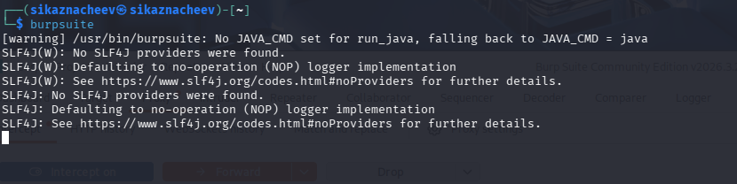
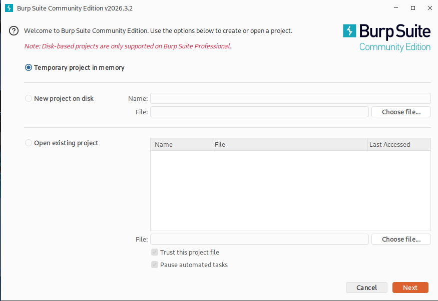
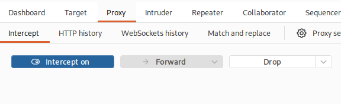
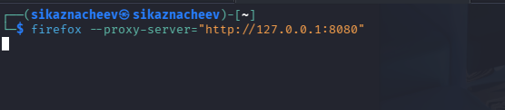

---
## Front matter
lang: ru-RU
title:  Работа с burpsuite
subtitle: Часть 5
author:
  - Казначеев С. И.
institute:
  - Российский университет дружбы народов, Москва, Россия
date: 2 мая 2026

## i18n babel
babel-lang: russian
babel-otherlangs: english

## Formatting pdf
toc: false
toc-title: Содержание
slide_level: 2
aspectratio: 169
section-titles: true
theme: metropolis
header-includes:
 - \metroset{progressbar=frametitle,sectionpage=progressbar,numbering=fraction}
---

# Информация

## Докладчик

:::::::::::::: {.columns align=center}
::: {.column width="70%"}

  * Казначеев Сергей Ильич 
  * Студент
  * Российский университет дружбы народов
  * [1132240693@pfur.ru]

:::
::: {.column width="30%"}

# Вводная часть

## Цель работы 
Использовать Burp Suite

## Выполнение индивидуального проекта 

Для начала откроем терминал и запустим Burp Suite

## Слайд 2

После чего настроим его 

## Слайд 3

Затем проверим запустился ли burp suite или нет 

## Слайд 4

Далее настроим Proxy включив перехват запросов 

## Слайд 5

После чего запустим браузер с прокси  burp

## Слайд 6

Затем проверим работу прокси и убедимся что запрос перехвотили 

##  Выводи 

В результате выполнения индивидуального проекта часть 5, я получил навыки работы с burp suite

