---
## Front matter
lang: ru-RU
title: Первая часть внешнего курса 
subtitle: Часть 1
author:
  - Казначеев С.И.
institute:
  - Российский университет дружбы народов, Москва, Россия
date: 4 мая 2026

## i18n babel
babel-lang: russian
babel-otherlangs: english

## Formatting pdf
toc: false
toc-title: Содержание
slide_level: 2
aspectratio: 169
section-titles: true
theme: metropolis
header-includes:
 - \metroset{progressbar=frametitle,sectionpage=progressbar,numbering=fraction}
---

# Информация

## Докладчик

:::::::::::::: {.columns align=center}
::: {.column width="70%"}

  * Казначеев Сергей Ильич 
  * Студент
  * Российский университет дружбы народов
  * [1132240693@pfur.ru]

:::
::: {.column width="30%"}

## Цель работы 

Прохождение первой части внешнего курса 

## Вопрос 1

{#fig:001 width=70%}

## Вопрос 2

{#fig:002 width=70%}

## Вопрос 3 

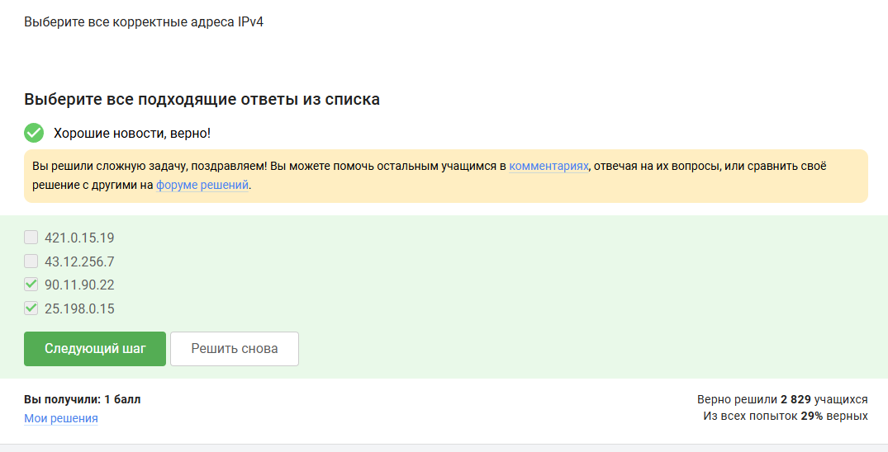{#fig:003 width=70%}

## Вопрос 4

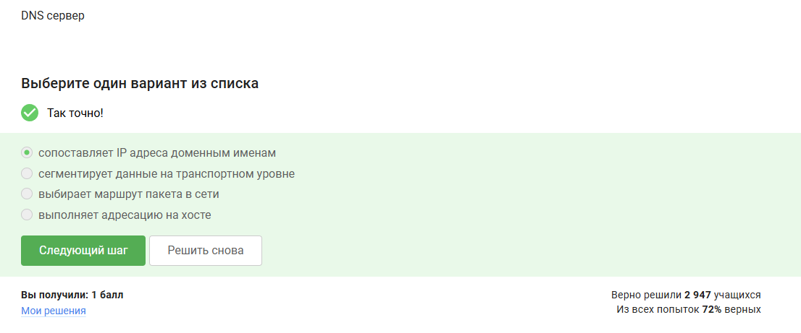{#fig:004 width=70%}

## Вопрос 5

{#fig:005 width=70%}

## Вопрос 6

{#fig:006 width=70%}

## Вопрос 7

{#fig:007 width=70%}

## Вопрос 8 

{#fig:008 width=70%}

## Вопрос 9 

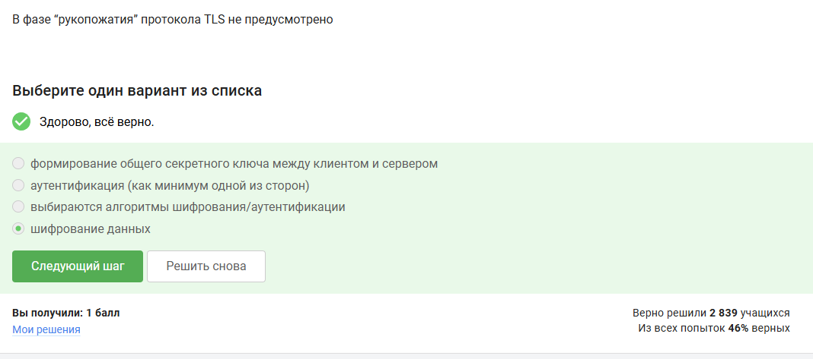{#fig:009 width=70%}

## Вопрос 10 

{#fig:010 width=70%}

## Вопрос 11

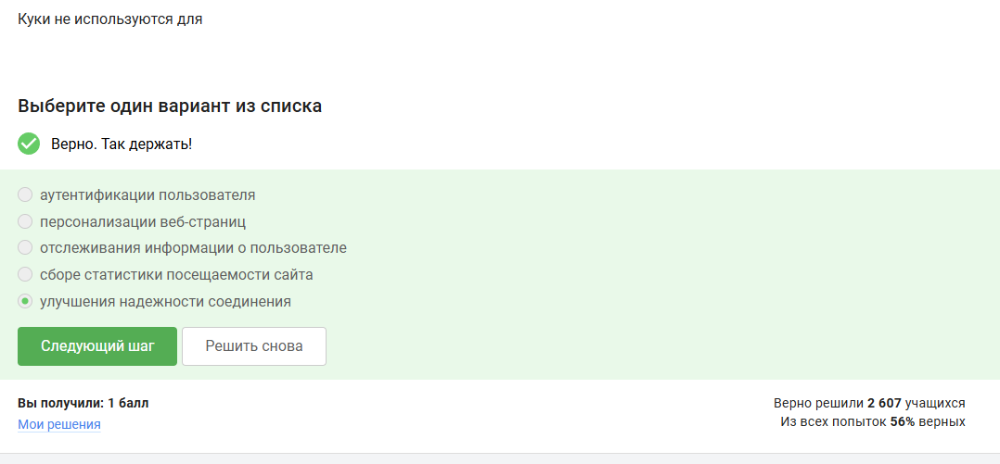{#fig:011 width=70%}

## Вопрос 12

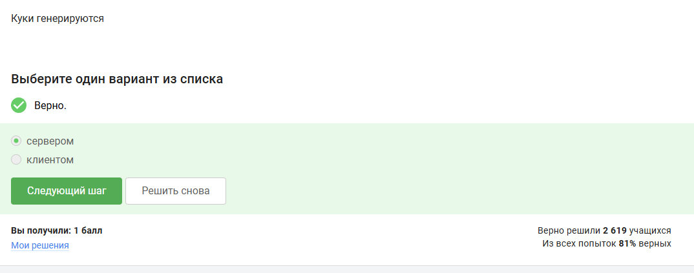{#fig:012 width=70%}

## Вопрос 13

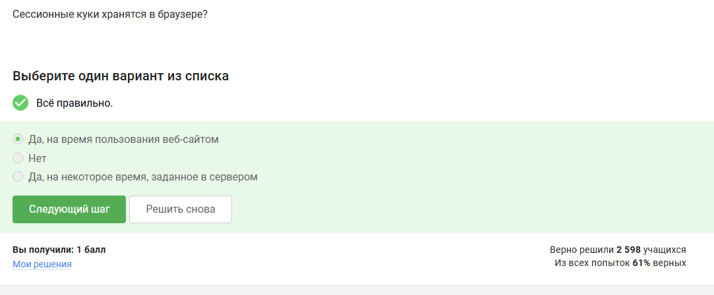{#fig:013 width=70%}

## Вопрос 14 

{#fig:014 width=70%}

## Вопрос 15 

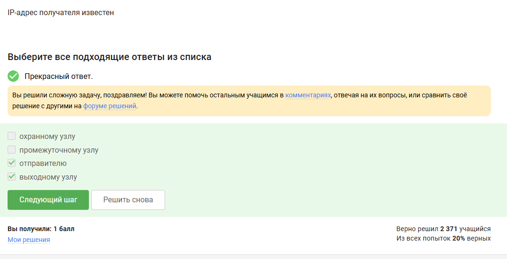{#fig:015 width=70%}

## Вопрос 16

{#fig:016 width=70%}

## Вопрос 17

{#fig:017 width=70%}

## Вопрос 18

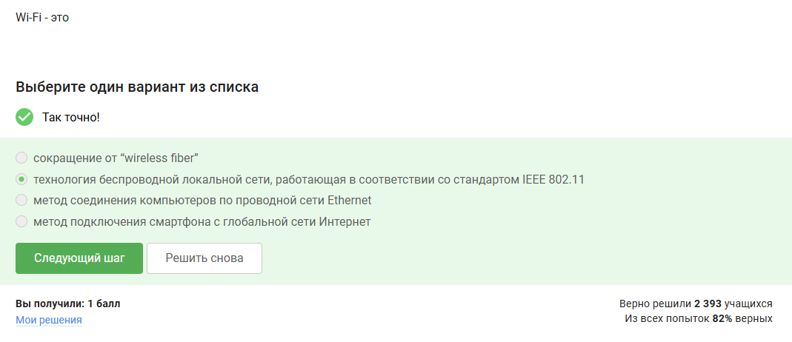{#fig:018 width=70%}

## Впорос 19

{#fig:019 width=70%}

## Вопрос 20

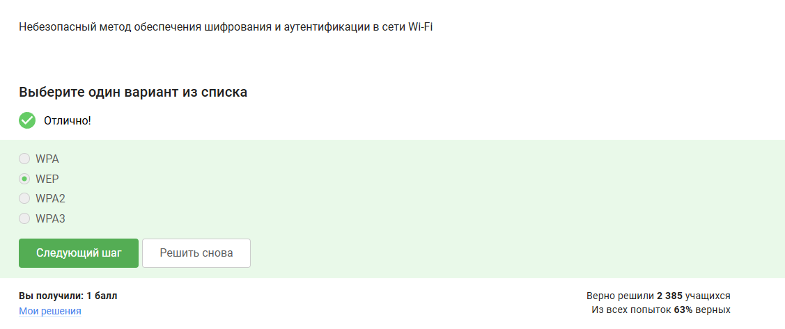{#fig:020 width=70%}

## Вопрос 21

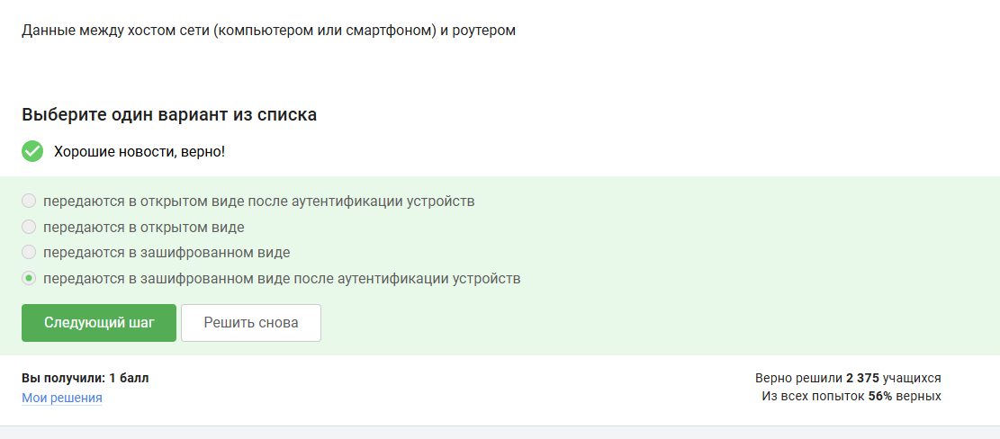{#fig:021 width=70%}

## Вопрос 22

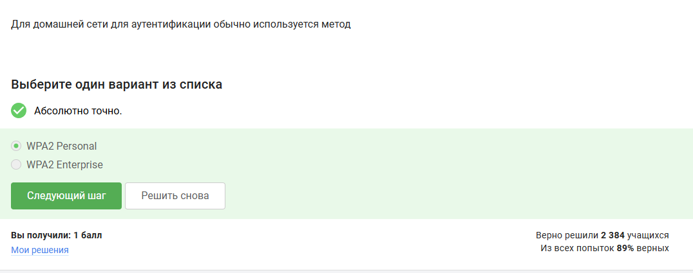{#fig:022 width=70%}

## Выводы

В результате выполнения внешнего курса, я прошел первую часть курса и освоил базовые знания безопасность сети 

