---
## Front matter
title: "Внешний курс "
subtitle: "Часть 1"
author: "Казначеев Сергей Ильич"

## Generic otions
lang: ru-RU
toc-title: "Содержание"

## Bibliography
bibliography: bib/cite.bib
csl: pandoc/csl/gost-r-7-0-5-2008-numeric.csl

## Pdf output format
toc: true # Table of contents
toc-depth: 2
lof: true # List of figures
lot: true # List of tables
fontsize: 12pt
linestretch: 1.5
papersize: a4
documentclass: scrreprt
## I18n polyglossia
polyglossia-lang:
  name: russian
  options:
	- spelling=modern
	- babelshorthands=true
polyglossia-otherlangs:
  name: english
## I18n babel
babel-lang: russian
babel-otherlangs: english
## Fonts
mainfont: IBM Plex Serif
romanfont: IBM Plex Serif
sansfont: IBM Plex Sans
monofont: IBM Plex Mono
mathfont: STIX Two Math
mainfontoptions: Ligatures=Common,Ligatures=TeX,Scale=0.94
romanfontoptions: Ligatures=Common,Ligatures=TeX,Scale=0.94
sansfontoptions: Ligatures=Common,Ligatures=TeX,Scale=MatchLowercase,Scale=0.94
monofontoptions: Scale=MatchLowercase,Scale=0.94,FakeStretch=0.9
mathfontoptions:
## Biblatex
biblatex: true
biblio-style: "gost-numeric"
biblatexoptions:
  - parentracker=true
  - backend=biber
  - hyperref=auto
  - language=auto
  - autolang=other*
  - citestyle=gost-numeric
## Pandoc-crossref LaTeX customization
figureTitle: "Рис."
tableTitle: "Таблица"
listingTitle: "Листинг"
lofTitle: "Список иллюстраций"
lotTitle: "Список таблиц"
lolTitle: "Листинги"
## Misc options
indent: true
header-includes:
  - \usepackage{indentfirst}
  - \usepackage{float} # keep figures where there are in the text
  - \floatplacement{figure}{H} # keep figures where there are in the text
---

# Цель работы 

Прохождение первой части внешнего курса 

# Выполнение индивидуального проекта

Вопрос 1

Ответ: HTTPS - протокол прикладного уровня используется для безопасной передачи веб страниц 

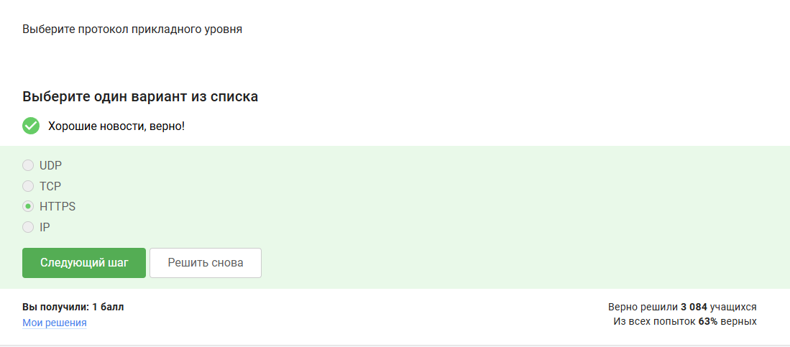{#fig:001 width=70%}

Вопрос 2

Ответ: Транспортный  данный протокол работает на транспортном уровне. Он обеспечивает надежную упорядоченную доставку данных  между приложениями, отвечая за сегментацию, управление потоком, контроль ошибок и восстановление потерянных пакетов 

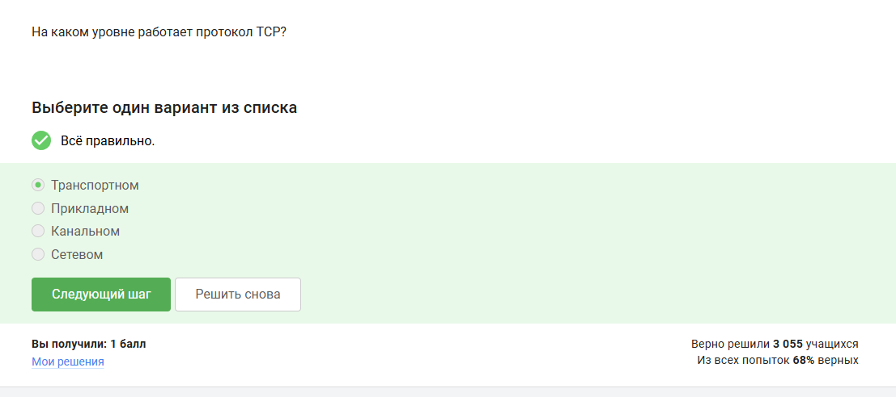{#fig:002 width=70%}

Вопрос 3 

Ответ - 90.11.90.22 и 25.198.0.15 в корректном ipc4 адресе каждый из четырех ответов должен быть целым числом в диапазоне от 0 до 255.

{#fig:003 width=70%}

Вопрос 4

Ответ - сопоставление Ip адреса доменным именам  так как DNS сервер преобразует читаемые доменные  имена 

{#fig:004 width=70%}

Вопрос 5

Ответ - прикладной - транспортный - сетевой - канальный 

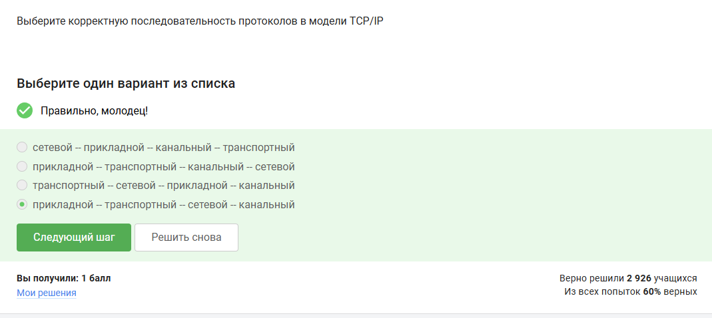{#fig:005 width=70%}

Вопрос 6

Ответ - http протокол предполагает передачу данных между клиентом и сервером  в открытом виде 

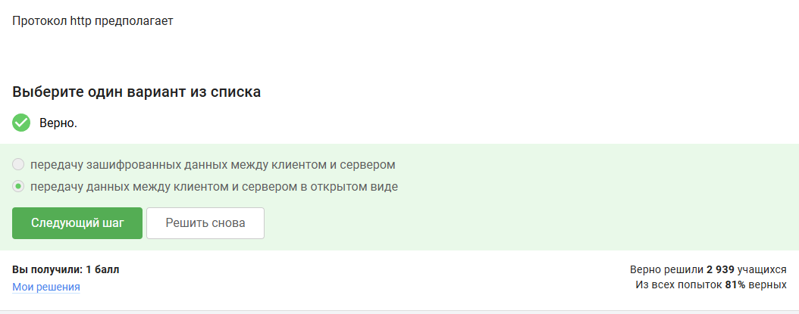{#fig:006 width=70%}

Вопрос 7

Ответ - Протокол https состоит из двух фаз: рукопожатия и передачи данных

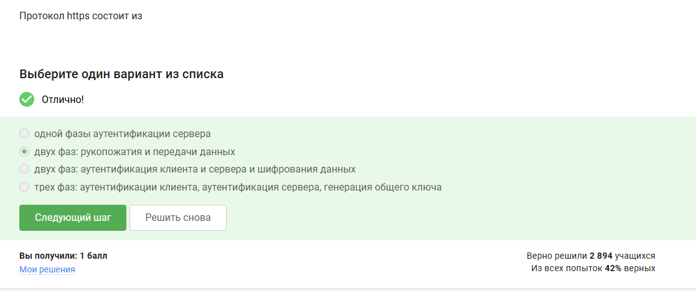{#fig:007 width=70%}

Вопрос 8 

Ответ - версия протокола tLS определяется и клиентом, и сервером в процессе "переговоров "

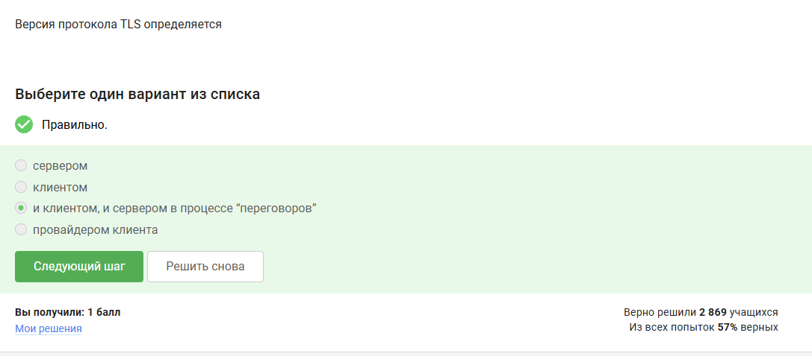{#fig:008 width=70%}

Вопрос 9 

Ответ - в фазе рукопожатия протокол TLS не предусмотрено шифрование данных 

{#fig:009 width=70%}

Вопрос 10 

Ответ - Куки хранят id-сессии и индификатор  пользователя 

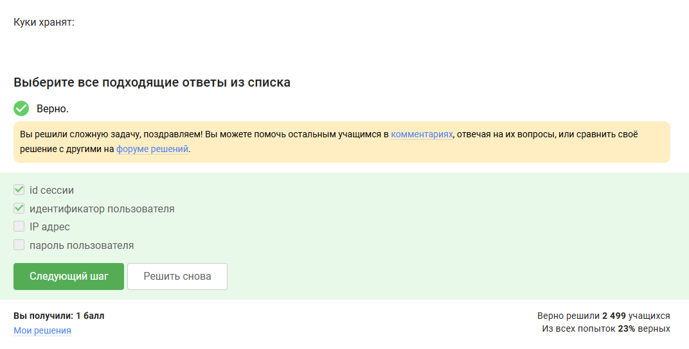{#fig:010 width=70%}

Вопрос 11

Ответ - куки не используются для улучшения надежности соединения 

{#fig:011 width=70%}

Вопрос 12

Ответ - куки генерируются сервером 
 
{#fig:012 width=70%}

Вопрос 13

Ответ - сессионные куки хранятся в браузере 

{#fig:013 width=70%}

Вопрос 14 

Ответ - промежуточных узлов в луковой сети TOR - 3

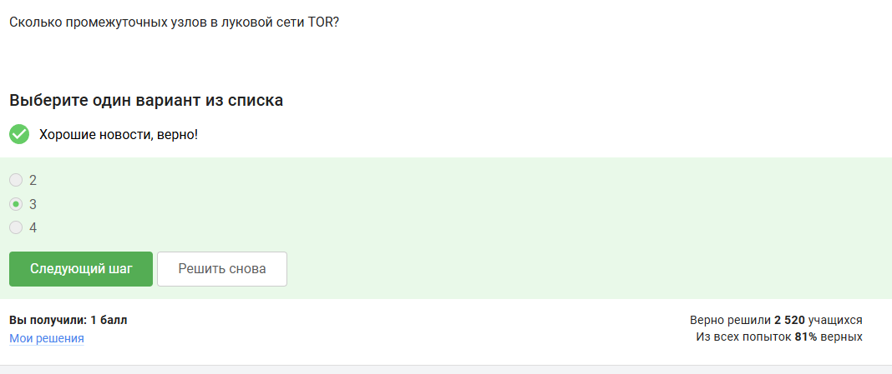{#fig:014 width=70%}

Вопрос 15 

Ответ - IP - адрес получателя известен только отправителю и выходному узлу 

{#fig:015 width=70%}

Вопрос 16

Ответ - отправитель генерирует общий секретный ключ с охранным, промежуточным и выходном узлом 

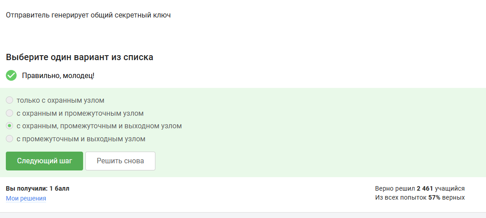{#fig:016 width=70%}

Вопрос 17

Ответ - должен ли получатель использовать браузер TOR для успешного  получения пакетов - нет 

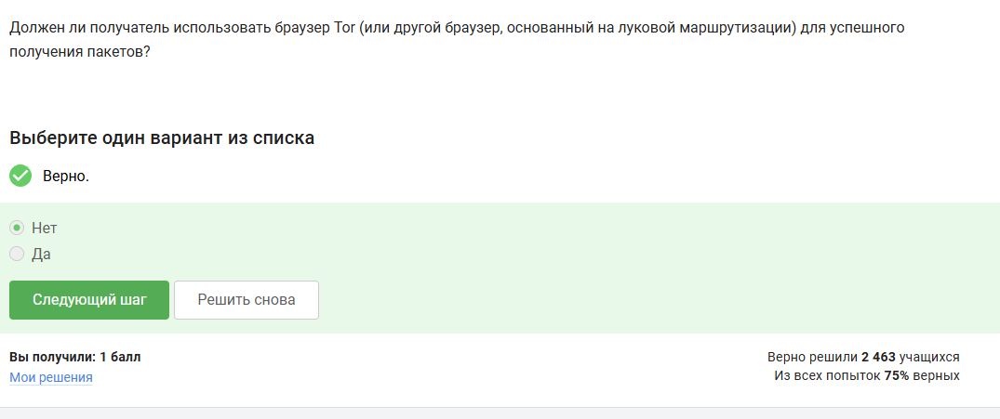{#fig:017 width=70%}

Вопрос 18

Ответ - Wi-Fi - это технология беспроводной локальной сети, работающая в соответствии со стандартом IEEE 802.11

{#fig:018 width=70%}

Впорос 19

Ответ - протокол WIFI работает на канальном протоколе 

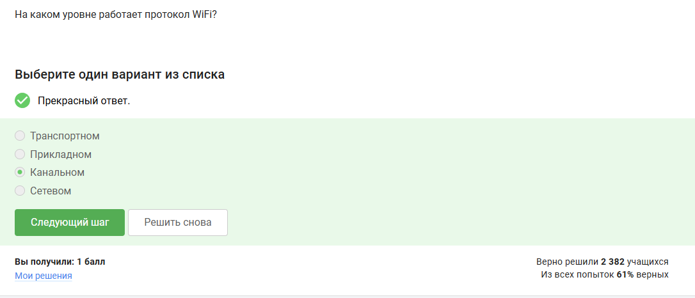{#fig:019 width=70%}

Вопрос 20

Ответ - Небезопасным методом обеспечения шифрования и аунтификации в сети WIFI это WEP

{#fig:020 width=70%}

Вопрос 21

Ответ -  данные между хостом сети и роутером передаются в зашифрованном виде после аутентификации устройств 

{#fig:021 width=70%}

Вопрос 22

Ответ - для домашней сети для аутентификации обычно используется метод WPA2 Personal

{#fig:022 width=70%}

# Выводы

В результате выполнения внешнего курса, я прошел первую часть курса и освоил базовые знания безопасность сети 

