---
## Front matter
title: "Внешний курс "
subtitle: "Часть 2"
author: "Казначеев Сергей Ильич"

## Generic otions
lang: ru-RU
toc-title: "Содержание"

## Bibliography
bibliography: bib/cite.bib
csl: pandoc/csl/gost-r-7-0-5-2008-numeric.csl

## Pdf output format
toc: true # Table of contents
toc-depth: 2
lof: true # List of figures
lot: true # List of tables
fontsize: 12pt
linestretch: 1.5
papersize: a4
documentclass: scrreprt
## I18n polyglossia
polyglossia-lang:
  name: russian
  options:
	- spelling=modern
	- babelshorthands=true
polyglossia-otherlangs:
  name: english
## I18n babel
babel-lang: russian
babel-otherlangs: english
## Fonts
mainfont: IBM Plex Serif
romanfont: IBM Plex Serif
sansfont: IBM Plex Sans
monofont: IBM Plex Mono
mathfont: STIX Two Math
mainfontoptions: Ligatures=Common,Ligatures=TeX,Scale=0.94
romanfontoptions: Ligatures=Common,Ligatures=TeX,Scale=0.94
sansfontoptions: Ligatures=Common,Ligatures=TeX,Scale=MatchLowercase,Scale=0.94
monofontoptions: Scale=MatchLowercase,Scale=0.94,FakeStretch=0.9
mathfontoptions:
## Biblatex
biblatex: true
biblio-style: "gost-numeric"
biblatexoptions:
  - parentracker=true
  - backend=biber
  - hyperref=auto
  - language=auto
  - autolang=other*
  - citestyle=gost-numeric
## Pandoc-crossref LaTeX customization
figureTitle: "Рис."
tableTitle: "Таблица"
listingTitle: "Листинг"
lofTitle: "Список иллюстраций"
lotTitle: "Список таблиц"
lolTitle: "Листинги"
## Misc options
indent: true
header-includes:
  - \usepackage{indentfirst}
  - \usepackage{float} # keep figures where there are in the text
  - \floatplacement{figure}{H} # keep figures where there are in the text
---

# Цель работы 

Прохождение второй  части внешнего курса 

# Выполнение индивидуального проекта

Вопрос 1

Ответ: Да можно зашиврофать загрузочный сектор диска 

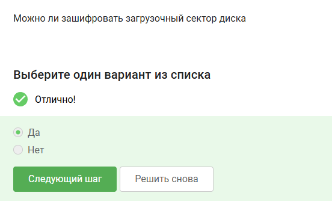{#fig:001 width=70%}

Вопрос 2

Ответ: шифрование диска основано на симметричном шифровании

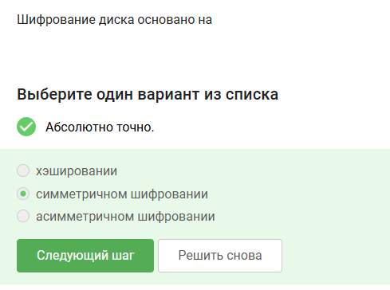{#fig:002 width=70%}

Вопрос 3 

Ответ - с помощью VeraCrypt и BitLocker можно зашифровать жесткий диск

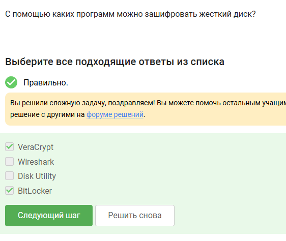{#fig:003 width=70%}

Вопрос 4

Ответ - к стойким паролям можно отнести пароли в которых используются спец символы, числа, буквы верхнего и нижнего регистра 

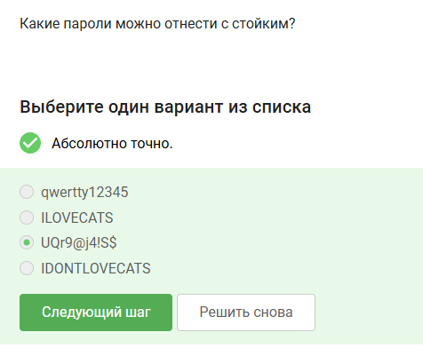{#fig:004 width=70%}

Вопрос 5

Ответ - безопасное место для хранения паролей это менеджер паролей 

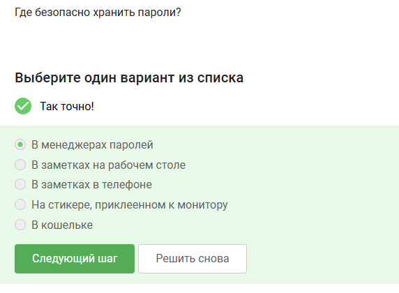{#fig:005 width=70%}

Вопрос 6

Ответ - капча нужна для защиты от автоматизированных атак, направленных на получение несанкционированного доступа 

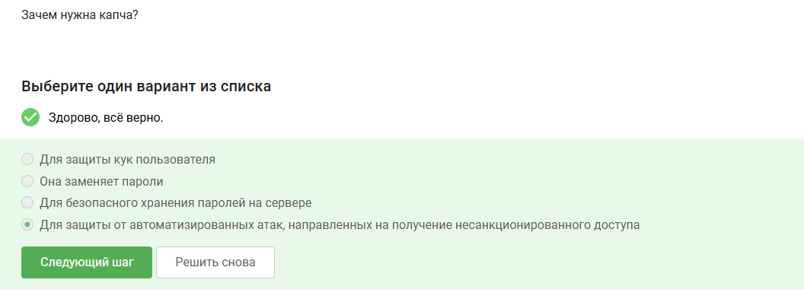{#fig:006 width=70%}

Вопрос 7

Ответ - хеширование паролей применяется для того, чтобы не хранить пароли на сервевре в открытом виде 

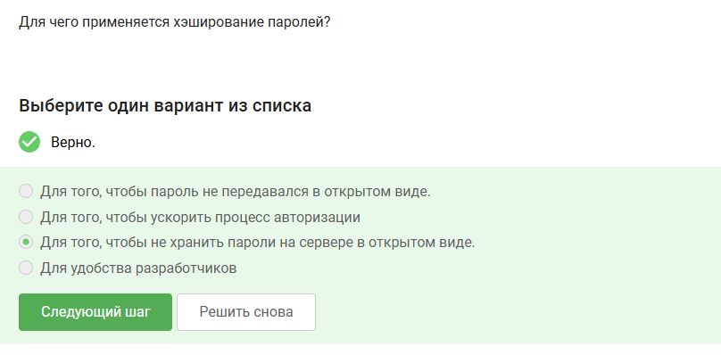{#fig:007 width=70%}

Вопрос 8 

Ответ - нет соль не поможет для улучшения стойкости паролей к атаке перебором

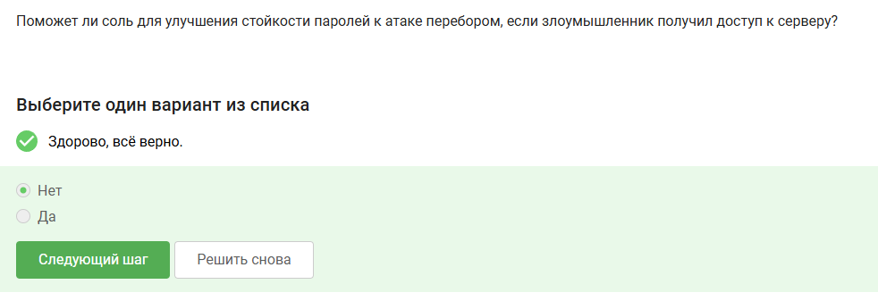{#fig:008 width=70%}

Вопрос 9 

Ответ - главные меры защиты от утечек данных атакой перебором являются: разные пароли на всех сайтах, периодическая смена паролей, сложные и длинные пароли, капча 

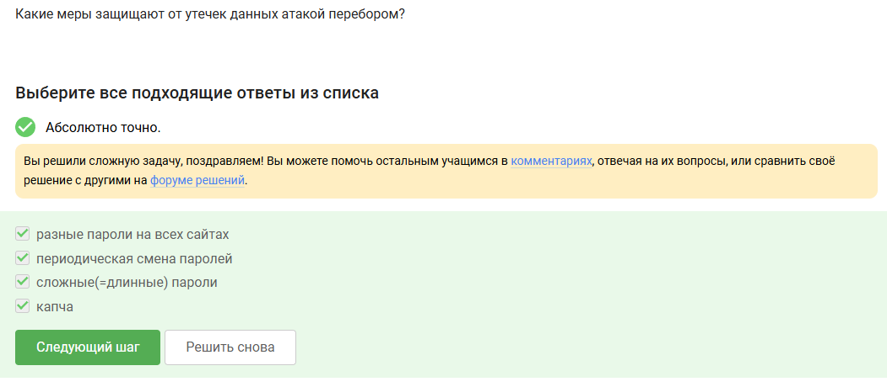{#fig:009 width=70%}

Вопрос 10 

Ответ - две ссылки являются вишинговыми это ссылка на  сбербанк онлайн и вход в аккаунт яндекс 

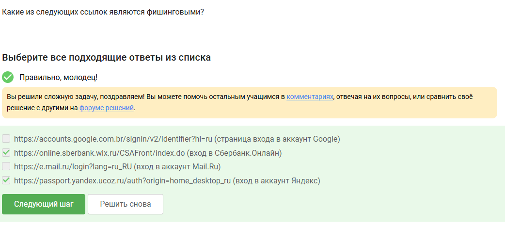{#fig:010 width=70%}

Вопрос 11

Ответ - да фишинговый имейл может прийти от знакомого адреса 

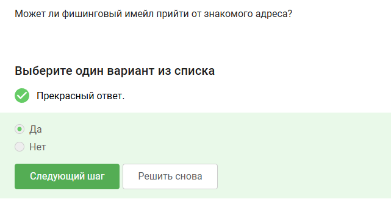{#fig:011 width=70%}

Вопрос 12

Ответ - Email спуфинг - это подмена адреса отправителя в имейлах
 
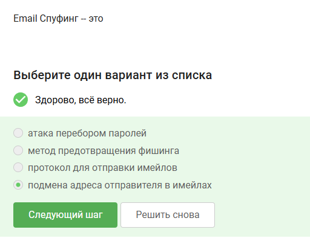{#fig:012 width=70%}

Вопрос 13

Ответ - Вирус-троян  маскирует под легитимную программу 

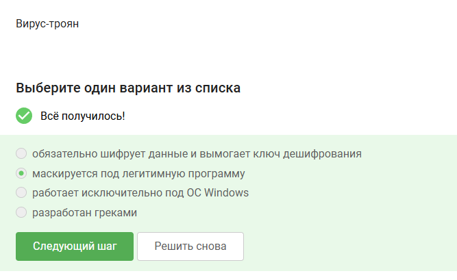{#fig:013 width=70%}

Вопрос 14 

Ответ - ключ шифрования в протоколе мессенджеров Signal формируется при генерации первого сообщения стороной- отправителем

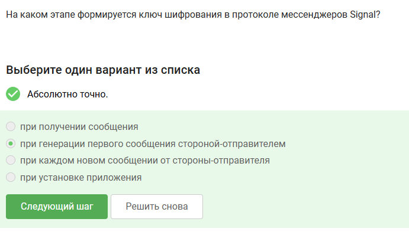{#fig:014 width=70%}

Вопрос 15 

Ответ - главной сутью сквозного шифрования состоит в том, что  сообщения передаются по узлам связи(серверами) в зашифрованном виде 

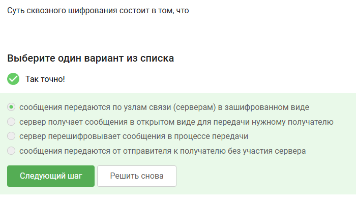{#fig:015 width=70%}

# Выводы

В результате выполнения внешнего курса, я прошел вторую часть курса и освоил базовые знания защита Пк/Телефонов 

