---
## Front matter
title: "Внешний курс "
subtitle: "Часть 3"
author: "Казначеев Сергей Ильич"

## Generic otions
lang: ru-RU
toc-title: "Содержание"

## Bibliography
bibliography: bib/cite.bib
csl: pandoc/csl/gost-r-7-0-5-2008-numeric.csl

## Pdf output format
toc: true # Table of contents
toc-depth: 2
lof: true # List of figures
lot: true # List of tables
fontsize: 12pt
linestretch: 1.5
papersize: a4
documentclass: scrreprt
## I18n polyglossia
polyglossia-lang:
  name: russian
  options:
	- spelling=modern
	- babelshorthands=true
polyglossia-otherlangs:
  name: english
## I18n babel
babel-lang: russian
babel-otherlangs: english
## Fonts
mainfont: IBM Plex Serif
romanfont: IBM Plex Serif
sansfont: IBM Plex Sans
monofont: IBM Plex Mono
mathfont: STIX Two Math
mainfontoptions: Ligatures=Common,Ligatures=TeX,Scale=0.94
romanfontoptions: Ligatures=Common,Ligatures=TeX,Scale=0.94
sansfontoptions: Ligatures=Common,Ligatures=TeX,Scale=MatchLowercase,Scale=0.94
monofontoptions: Scale=MatchLowercase,Scale=0.94,FakeStretch=0.9
mathfontoptions:
## Biblatex
biblatex: true
biblio-style: "gost-numeric"
biblatexoptions:
  - parentracker=true
  - backend=biber
  - hyperref=auto
  - language=auto
  - autolang=other*
  - citestyle=gost-numeric
## Pandoc-crossref LaTeX customization
figureTitle: "Рис."
tableTitle: "Таблица"
listingTitle: "Листинг"
lofTitle: "Список иллюстраций"
lotTitle: "Список таблиц"
lolTitle: "Листинги"
## Misc options
indent: true
header-includes:
  - \usepackage{indentfirst}
  - \usepackage{float} # keep figures where there are in the text
  - \floatplacement{figure}{H} # keep figures where there are in the text
---

# Цель работы 

Прохождение третьей части внешнего курса 

# Выполнение индивидуального проекта

Вопрос 1

Ответ: в асимметричных криптографических примитивах обе стороны имеют пару ключей 

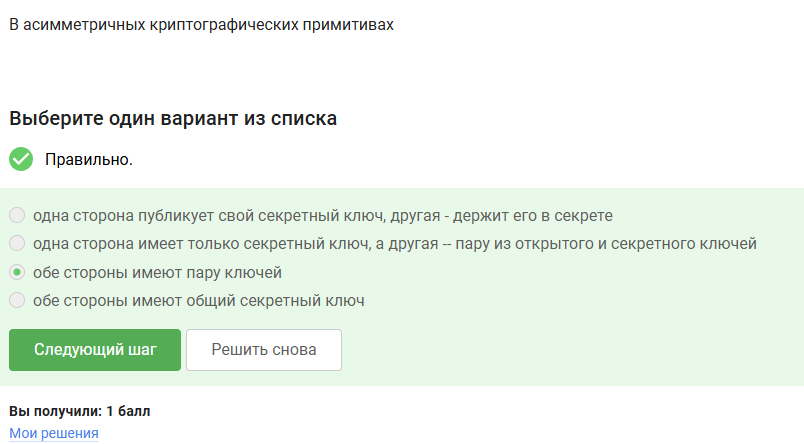{#fig:001 width=70%}

Вопрос 2

Ответ: криптографическая хэш-функция стойкая к коллизиям, дает на выходе фиксированное число бит независимо от объема входных данных  и эффективно вычисляется 

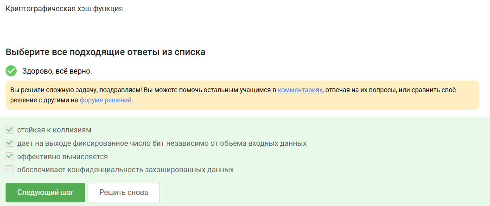{#fig:002 width=70%}

Вопрос 3 

Ответ - к агоритмам цифровой подписи относятся  RSA ECDSA  и ГОСТ Р 34.10-2012

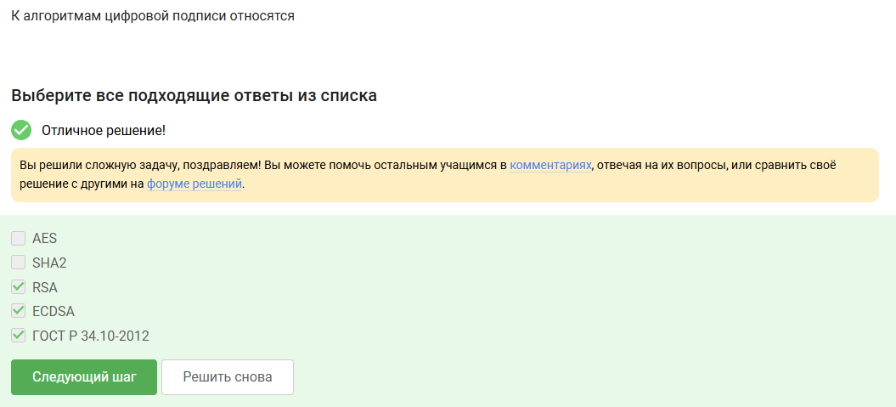{#fig:003 width=70%}

Вопрос 4

Ответ - код аутентификации сообщения относится к симметричным примитивам 

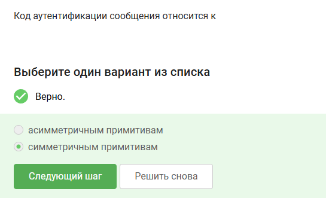{#fig:004 width=70%}

Вопрос 5

Ответ - обмен ключами Диффи-Хэллмана - это асимметричный примитив генерации общего секретного ключа 

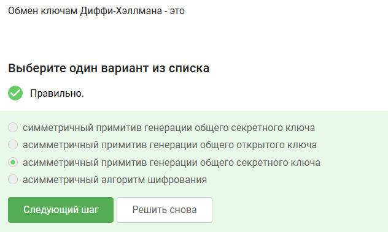{#fig:005 width=70%}

Вопрос 6

Ответ - протокол электронной цифровой подписи относится к протоколам с публичным ключом 

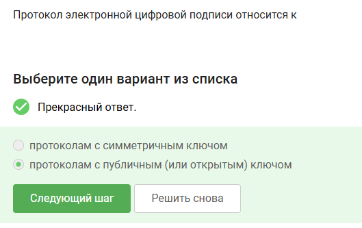{#fig:006 width=70%}

Вопрос 7

Ответ - алгоритм верификации электронной цифровой подписи требует на вход подпись, открытый ключ, сообщение 

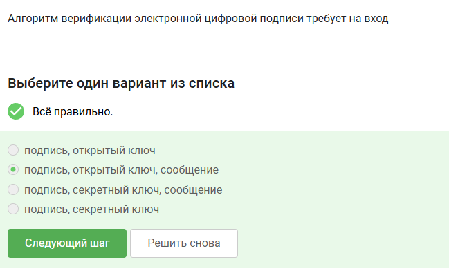{#fig:007 width=70%}

Вопрос 8 

Ответ - электронная цифровая подпись не обеспечивает конфиденциальность 

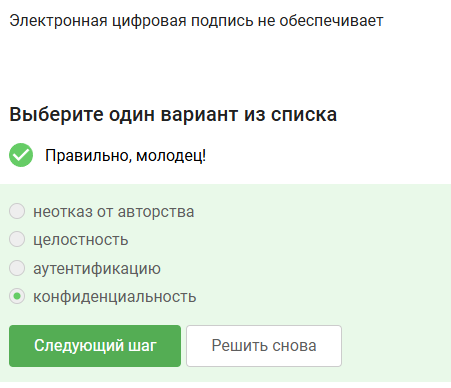{#fig:008 width=70%}

Вопрос 9 

Ответ - усиленная квалифицированная электронная подпись понадобится для отправки налоговой отчетности в ФНС

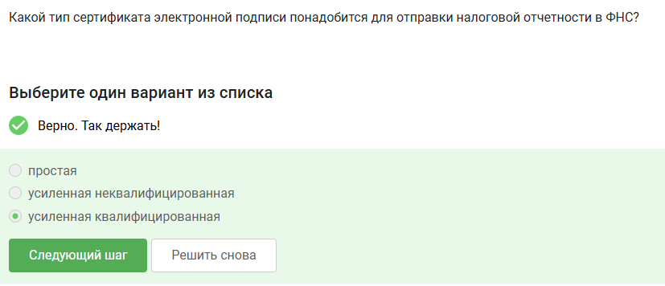{#fig:009 width=70%}

Вопрос 10 

Ответ - в удостоверяющем центре можно получить квалифицированный сертификат ключа проверки электронной подписи 

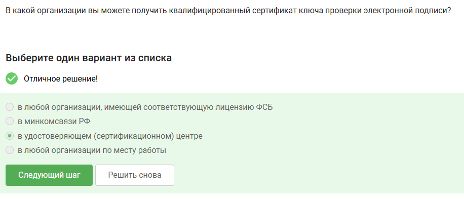{#fig:010 width=70%}

Вопрос 11

Ответ - главные платежные системы МИР и MasterCard

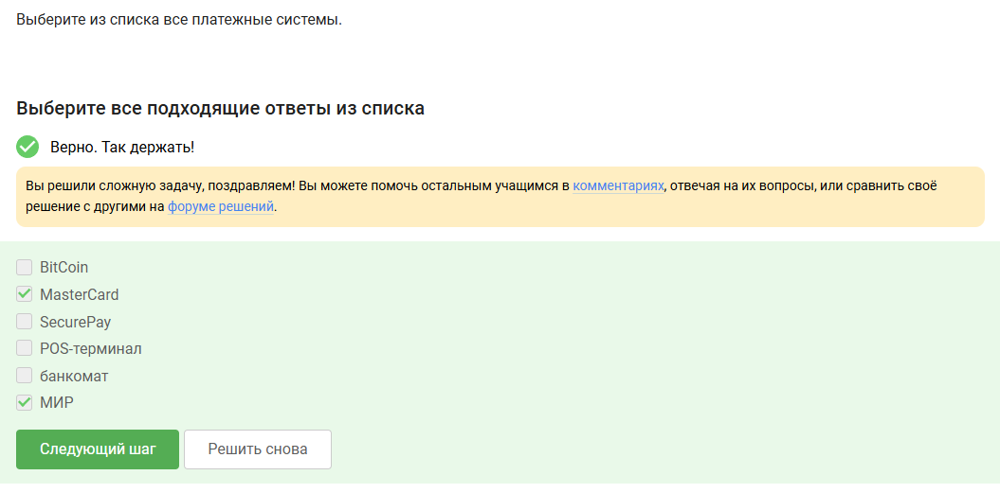{#fig:011 width=70%}

Вопрос 12

Ответ - главным примером многофакторной аунтефикации является комбинация проверка пароля + код в sms сообщении и комбинация код в sms сообщении + отпечаток пальца 
 
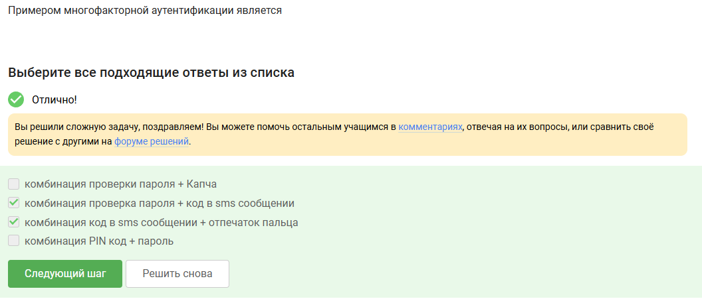{#fig:012 width=70%}

Вопрос 13

Ответ - при онлайн платежах сегодня используется многофакторная аутентификация  покупателя  пережд банком - эмитентом 

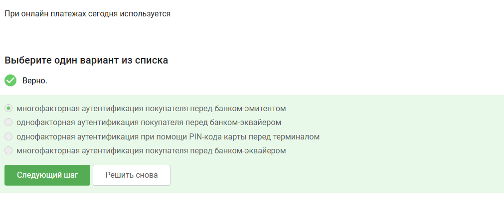{#fig:013 width=70%}

Вопрос 14 

Ответ - главным свойством криптографической хэш-функции используется в доказательстве работы сложность нахождения прообраза 

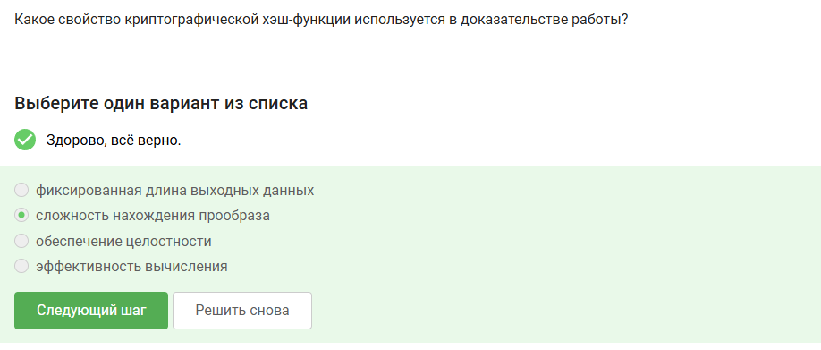{#fig:014 width=70%}

Вопрос 15 

Ответ - консенсус в некоторых системах блокчейна обладает свойствами постоянства, открытость, консенсус и  живучесть

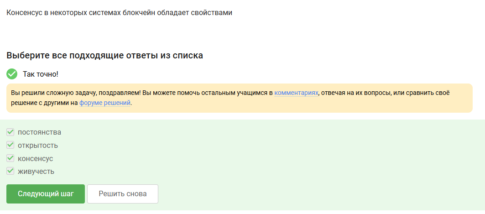{#fig:015 width=70%}

Вопрос 16

Ответ - цифровая подпись

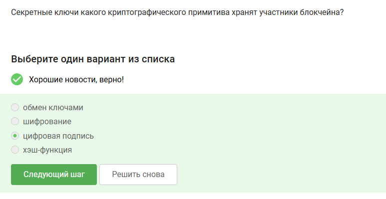{#fig:016 width=70%}

# Выводы

В результате выполнения внешнего курса, я прошел третью часть курса и освоил криптографию  на практике 

