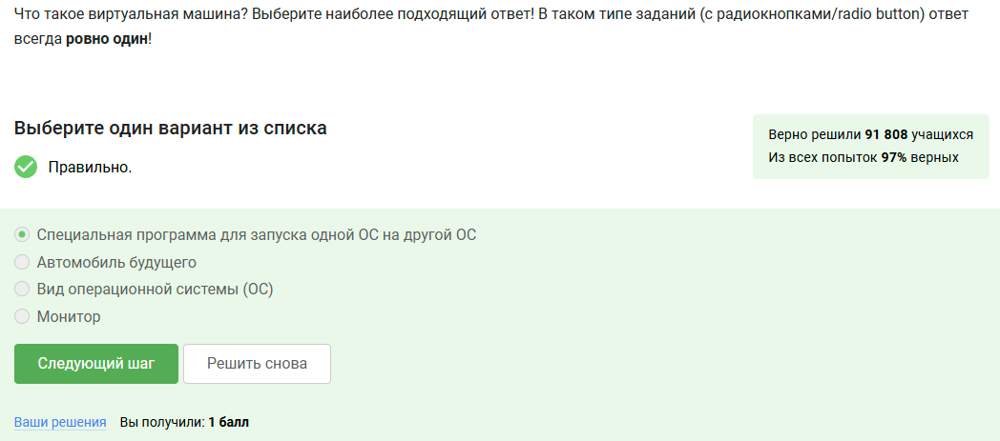
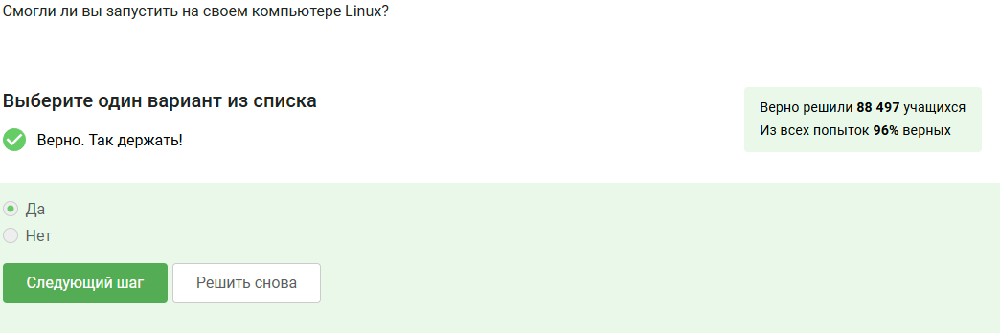
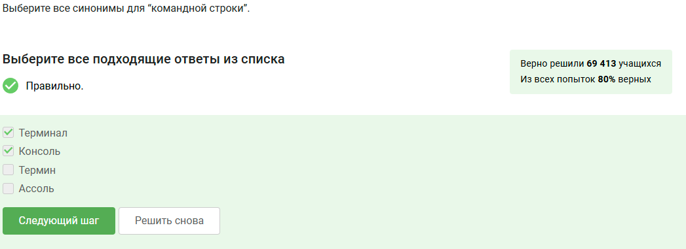
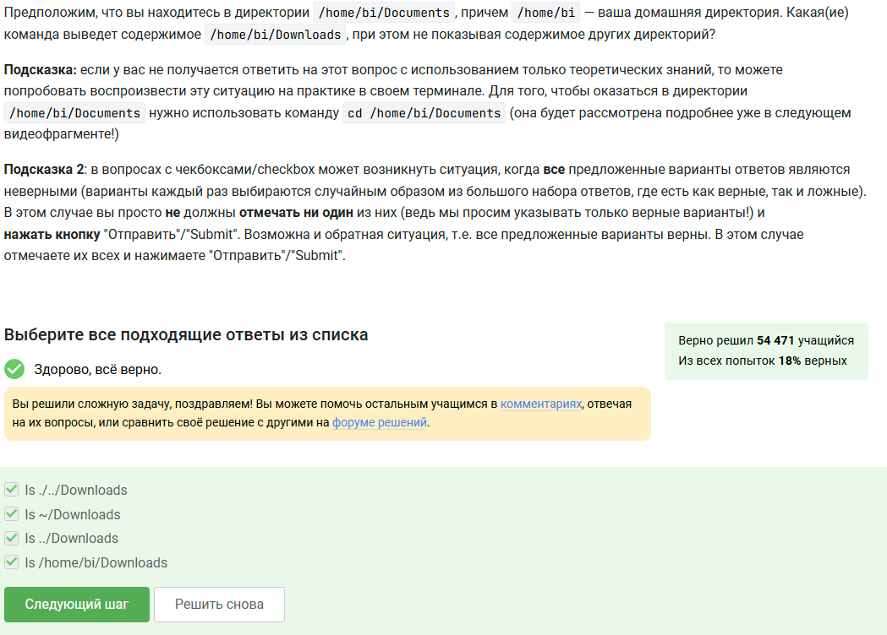
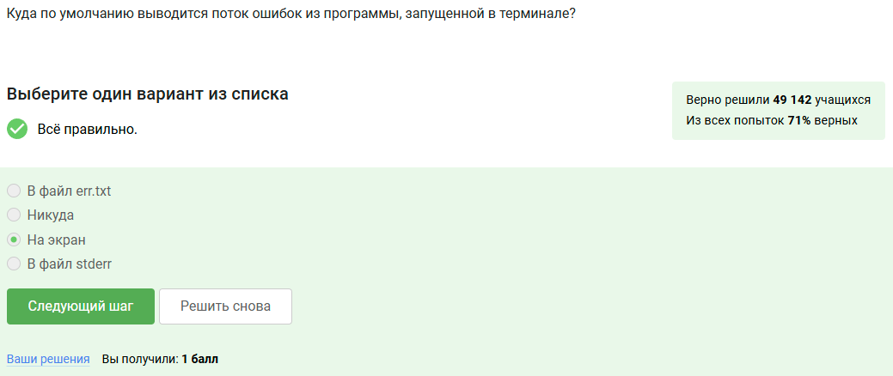
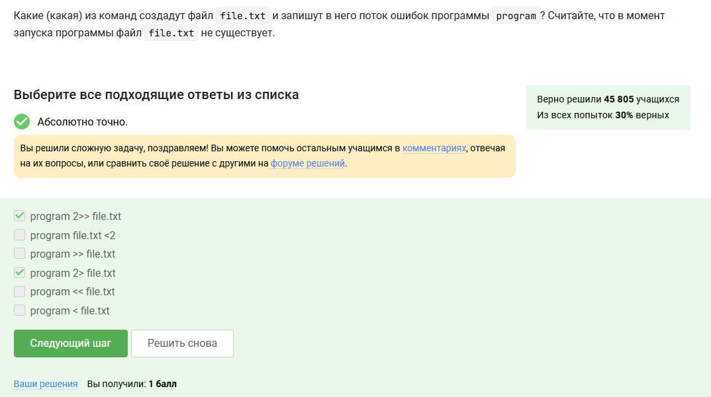
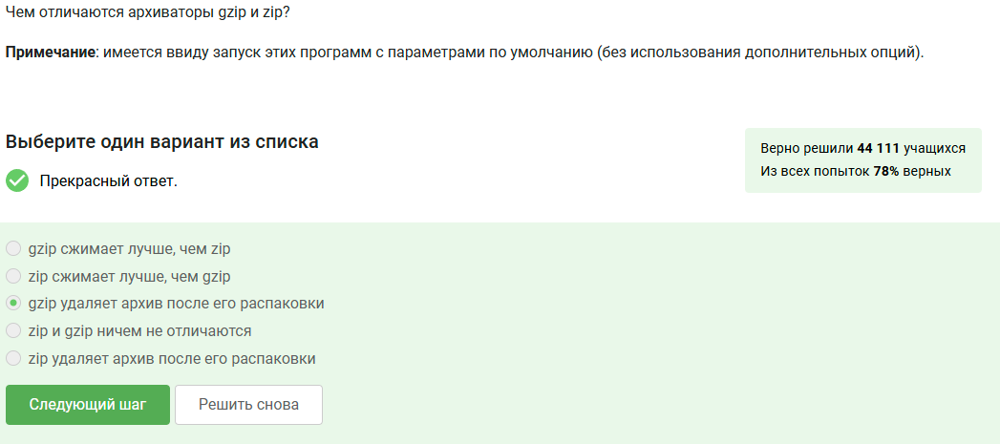
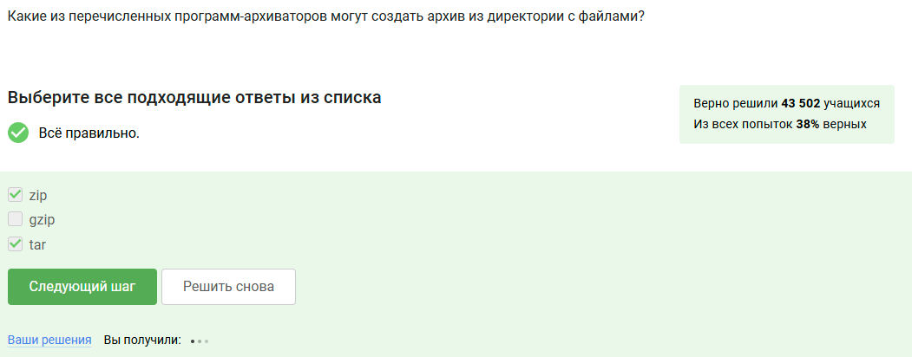
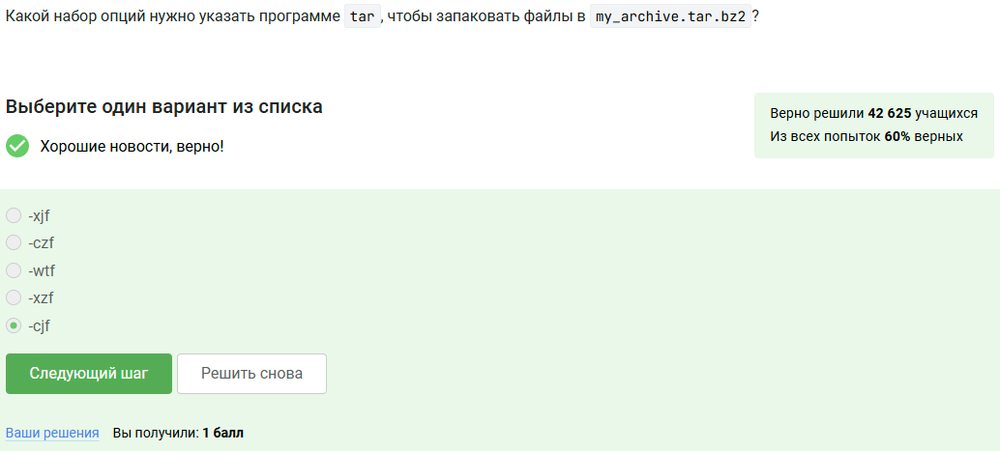
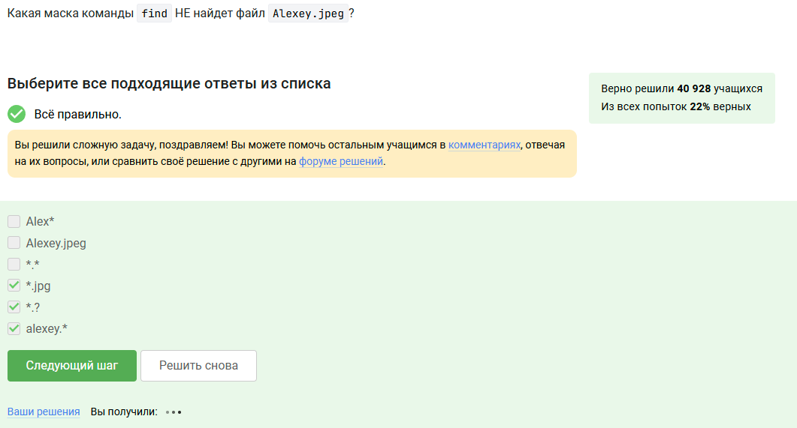

---
## Front matter
title: "Введение в linux"
subtitle: "Часть 1"
author: "Казанчеев Сергей Ильич"

## Generic otions
lang: ru-RU
toc-title: "Содержание"

## Bibliography
bibliography: bib/cite.bib
csl: pandoc/csl/gost-r-7-0-5-2008-numeric.csl

## Pdf output format
toc: true # Table of contents
toc-depth: 2
lof: true # List of figures
lot: true # List of tables
fontsize: 12pt
linestretch: 1.5
papersize: a4
documentclass: scrreprt
## I18n polyglossia
polyglossia-lang:
  name: russian
  options:
	- spelling=modern
	- babelshorthands=true
polyglossia-otherlangs:
  name: english
## I18n babel
babel-lang: russian
babel-otherlangs: english
## Fonts
mainfont: IBM Plex Serif
romanfont: IBM Plex Serif
sansfont: IBM Plex Sans
monofont: IBM Plex Mono
mathfont: STIX Two Math
mainfontoptions: Ligatures=Common,Ligatures=TeX,Scale=0.94
romanfontoptions: Ligatures=Common,Ligatures=TeX,Scale=0.94
sansfontoptions: Ligatures=Common,Ligatures=TeX,Scale=MatchLowercase,Scale=0.94
monofontoptions: Scale=MatchLowercase,Scale=0.94,FakeStretch=0.9
mathfontoptions:
## Biblatex
biblatex: true
biblio-style: "gost-numeric"
biblatexoptions:
  - parentracker=true
  - backend=biber
  - hyperref=auto
  - language=auto
  - autolang=other*
  - citestyle=gost-numeric
## Pandoc-crossref LaTeX customization
figureTitle: "Рис."
tableTitle: "Таблица"
listingTitle: "Листинг"
lofTitle: "Список иллюстраций"
lotTitle: "Список таблиц"
lolTitle: "Листинги"
## Misc options
indent: true
header-includes:
  - \usepackage{indentfirst}
  - \usepackage{float} # keep figures where there are in the text
  - \floatplacement{figure}{H} # keep figures where there are in the text
---

# Цель работы

Прохождение Первой части внешнего курса stepik

# Выполнение лабораторной работы

Задание 1

Обычно использую операционную систему Linux и Windows

Задание 2

Специальная программа для запуска OC на другой OC

Задание 3

Да смог смог запустить Linux

Задание 4

Создаем документ в OpenOffice/LibreOffice Write и далее записываем фразу Hello Linux! шрифтом FreeMono

Задание 5

Linux имеет установочные пакеты deb

Задание 6

После установки VLC запускаем файл и отрываем Help -> About и пишем ниже первую фамилию из вкладки Authors

Задание 7

Update Manager используют обычно для обновления установленных программ,для обновления всей системы до новой версии,дляобновления ссылок в Software Center

Задание 8

Синонимы командной строки являются- терминал, консоль 

Задание 9

Команда pwd напечатает в какой директории мы сейчас находимся 

Задание 10

Команды эквиваленты команде ls -A --human-readable -l /some/directory
Сами команды: 1)ls --human-readable -A -l/some/directory , 2) ls --almost-all --human-readable -l /some/directory 

Задание 11

Команды которые выведет содержимое /home/bi/Downloads
1)ls ./../Downloads
2)ls ~/Downloads
3)ls ../Downloads
4)ls /home/bi/Downloads

Задание 12

Команда  rm -r используется для удаления директорий 

Задание 13

Если ввести команду firefox а затем  exit, никто не закроется 

Задание 14

Команда & эквивалентна запуску Ctrl+z,bg

Задание 15

Сначала скачиваем файл,затем открываем его и копируем что в нем выведется

2023-11-15 14:30:45
Control sum: 1234

Задание 16

По умолчанию поток ошибок выводится из программ на экран 

Задание 17

Команды program 2>> file.txt,program 2> file.txt создадут файл и запишут в них program

Задание 18

Сообщения об ошибках программ, которые объединены в конвейр(pipe) выведутся на экран 

Задание 19

После следующих команда cd /home/alex/
wget -P /home/alex/Pictures -O 1.jpg http://example.com/example.jpg
картинка окажется в /home/alex/1.jpg

Задание 20

Чтобы не выводилась никаких сообщений на экран надо указать вот такую опцию:-q и -quiet

Задание 21

После запуска  wget -r -l 1 -A jpg и передачи аргумента ссылки на эту веб-страницу будут скачены jpg html файлы, но все будут html удалены 

Задание 22

Файлы отличаються gzip и zip, тем что gzip удаляет архив после его распоковки 

Задание 23

Из перечисленных программ-архиваторов могут создать архив из директории файлов zip и tar

Задание 24

Чтобы запаковать файл my_archive.tar.bz2 командой  -cjf

Задание 25

Маска *.jpg , *.? , alexey.* не гайдут файл alexey.jpeg

Задание 26

Команда grep "world" text.txt выведет на экран 
1) The beautifulworld is not enought
2)The beatiful-world is not enought
3)world
4) The "world" is not enoght
5) The "world" is not enoght

Задание 27

После скачивания архива генерируем файл в котором будут все строчки из этих произведений содержащие "love"

# Выводы

Я прошел первую часть внешнего курса stepik

