---
## Front matter
lang: ru-RU
title: Введение в linux
subtitle: Часть 2
author:
  - Казначеев С.И.
institute:
  - Российский университет дружбы народов, Москва, Россия Россия
date: 14 января 2025

## i18n babel
babel-lang: russian
babel-otherlangs: english

## Formatting pdf
toc: false
toc-title: Содержание
slide_level: 2
aspectratio: 169
section-titles: true
theme: metropolis
header-includes:
 - \metroset{progressbar=frametitle,sectionpage=progressbar,numbering=fraction}
---

# Информация

## Докладчик

:::::::::::::: {.columns align=center}
::: {.column width="70%"}

  * Казначеев Сергей Ильич
  * Студент
  * Российский университет дружбы народов
  * [1132240693@pfur.ru]

:::
::: {.column width="30%"}

# Вводная часть

## Задание 1

Удаленные севреа можно использовать 
1)Хранение конфиденциальных данных
2)Хранение общедоступных данных
3)Хранение больших объемов данных
4)Выполнение сложных вычислений 

## Задание 2

Ключ id_rsa это личный ключ который не стоит пересылать а ключ  id_rsa.pub можно спокойно так как он публичный 

## Задание 3

Команда scp -r stepic username@server:~/ скопирует папку степик вместе с содержимым ее самой и всех ее подпапок
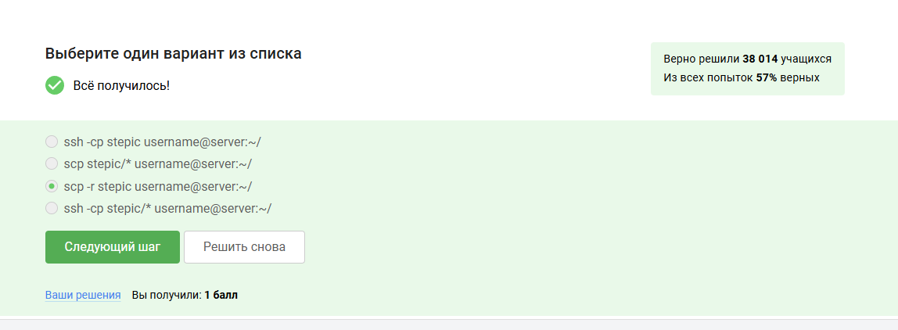

## Задание 4

Если терминал сообщает вам то что он не может найти и скачать установочный пакет 

1)sudo apt-get update
2)Проверка интернет соединения и его установка, если соединения нет.
	

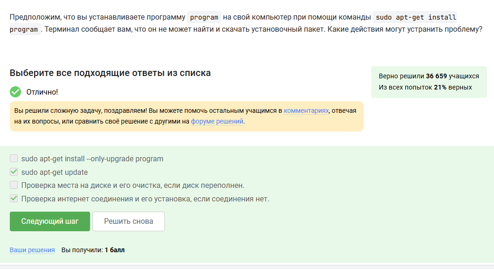

## Задание 5

Программа Filezilla можно использовать для 
1)Для копирования файлов с сервера на свой компьютер
2)Для копирования файлов со своего компьютера на сервер
3)Для просмотра содержимого директорий на сервере
4)Для просмотра содержимого директорий на своем компьютере

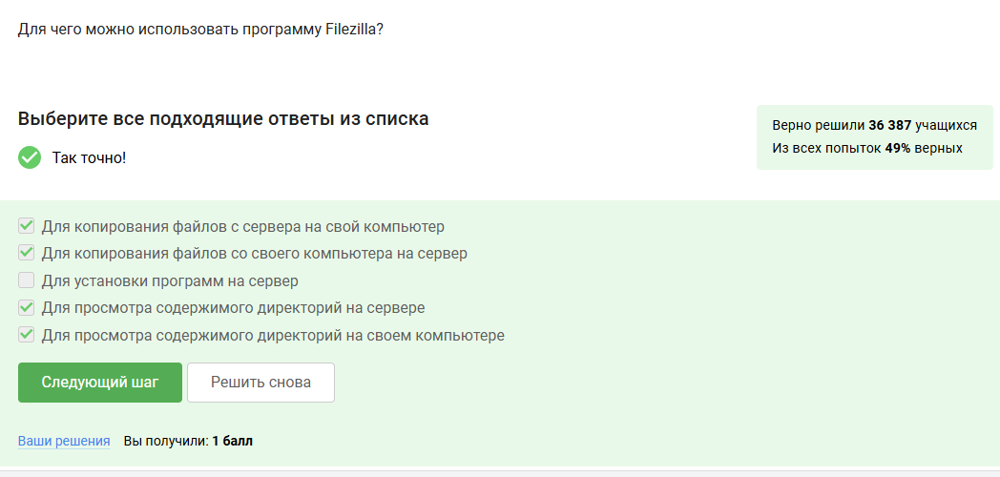

## Задание 6

Для того чтобы запустить на сервер программу для работы которой нужен не терминал а экран 

1)Проверить, есть ли другая версия этой программы (специально для терминала)
2)Настроить сервер, чтобы он поддерживал вывод информации на экран компьютера

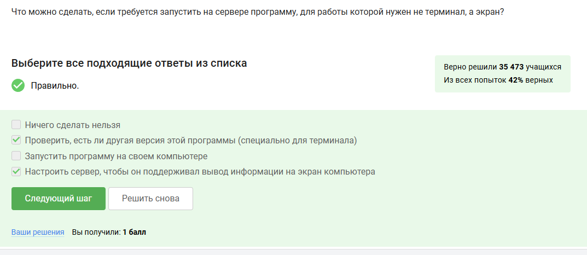

## Задание 7

Обычно чтобы вызвать справочную информацию о программе program
1)program --help 
2)help program
3)man program

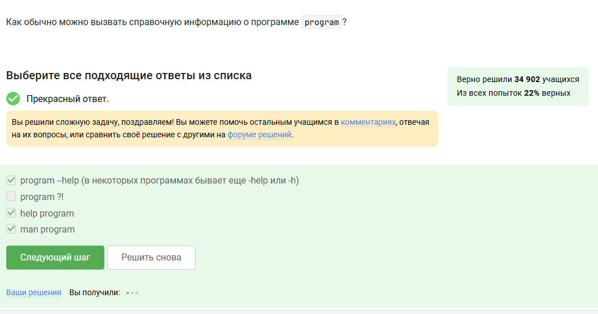

## Задание 8

При просмотре справки по программе FastQC мы найдем информацию то что форматы данных которая запускает в терминале может принимать на вход 

1)bam_mapped, sam_mapped
2)fastq
3)bam, sam

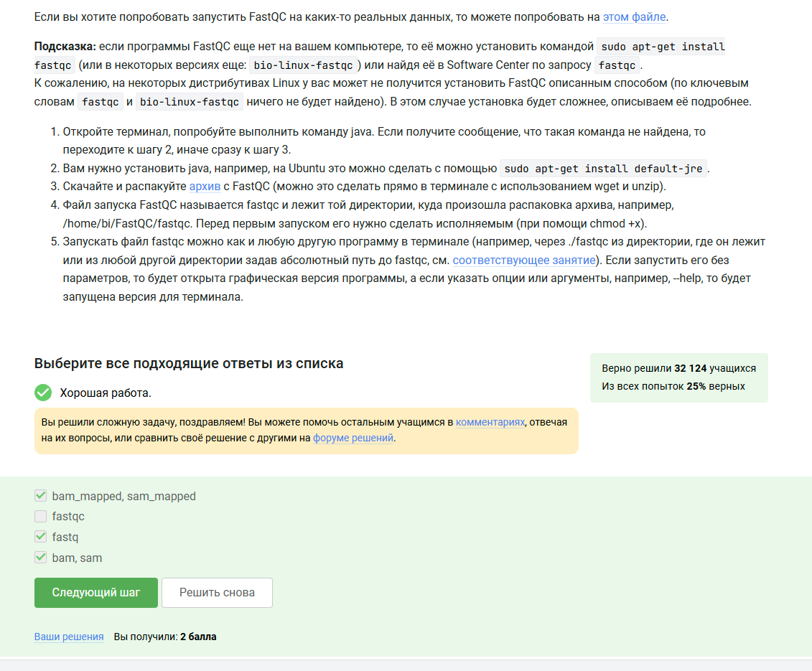

## Задание 9

После просмотра справки по программе мы найдем команду которая запускает в терминале Clustal на файле clustalw_help.txt

Сама команда - clustalw test.fasta -align

## Задание 10

После запуска и выполнения действий мы получим информацию только о program2 и program3 

## Задание 11

Индификатор jobs, top и ps в будут одинаковые только у  ps и top

## Задание 12

С помощью команды kill -9 можно мгновенно завершить остановленный процесс 

## Задание 13

Если мы используем команду kill по отношению к процессу, который был приастановлен при помощи Ctrl+Z Процесс приступит к завершению как только будет продолжен 

## Задание 14

Для вычисления ресурсов центрального процессора использует остановленное многопоточное приложение.0% CPU

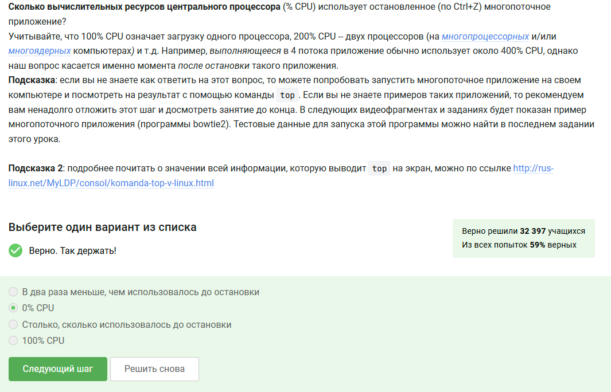

## Задание 15

Сколько памяти занимает остановленный многопоточное приложение. Столько,сколько потребуется в момент остановки 

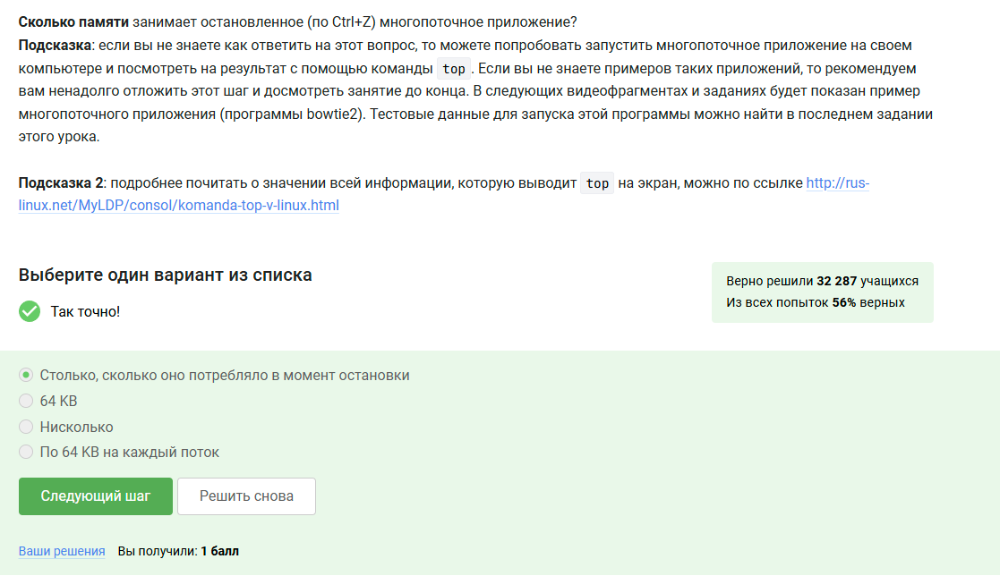

## Задание 16

Принудительно завершить один из потоков запущенного многопоточного приложения никак 

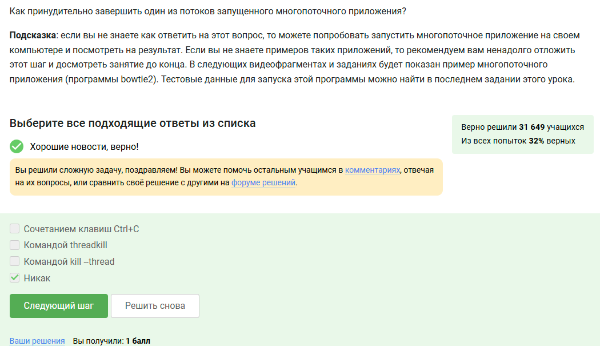

## Задание 17

В несколько потоков можно выполнить только bowtie2. 

## Задание 18

После скачивания файла запускаем bowtie2 и получим 

306174 reads; of these:
  306174 (100.00%) were unpaired; of these:
    11 (0.00%) aligned 0 times
    305580 (99.81%) aligned exactly 1 time
    583 (0.19%) aligned >1 times
100.00% overall alignment rate

## Задание 19

При запуске двух вкладок в терминале.В одной из них ыв запустили процесс и приастановили его, далее переключаемся во вторую вкладку и набрав fg наш терминал сообщит что нет процесса для запуска fg

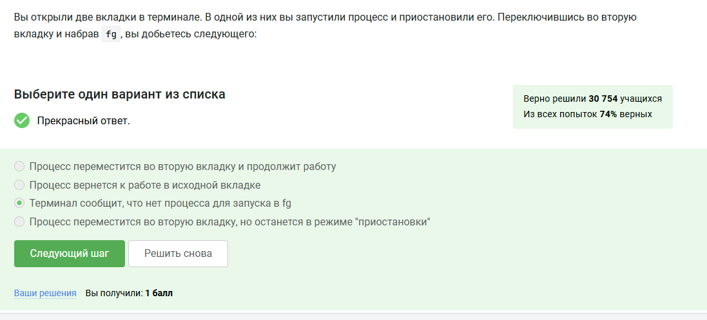

## Задание 20

Предположим что в tmux у нас осталась последняя открытая вкладка и если мы напишем в ней exit то tmux завершит работу 

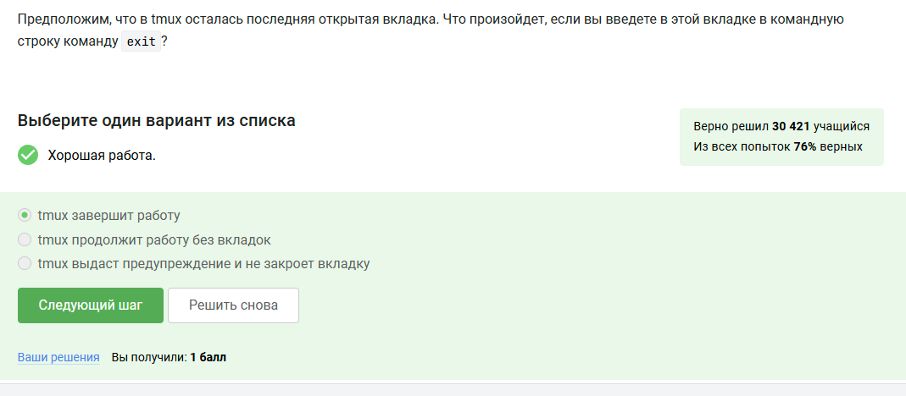

## Задание 21

Предположим что мы открыли терминал зашли в нем на сервер запустили  на этом сервере tmux и начала работу в нем.У нас произойдет соединение с сервером прервется, но работа tmux продолжится 

## Задание 22

Если мы запустим процесс tmux в фоновом режиме в одной из вкладок а затем принудительно закроем эту вкладку то вкладка закроется а вместе с ней пропадет и запущенный в ней процесс

## Задание 23

После изучения справки по tmux мы узнаем что за переименование отвечает команда Ctrl+B и , (запятая)

## Задание 24

После изучения справки по tmux и верными утверждениями будут 
1)Вкладку можно разделить и горизонтально, и вертикально, и даже по несколько раз -- просто используем нужные команды-"разделения" необходимое количество раз
2)Если разделенную горизонтально вкладку разделить еще и вертикально (т.е. нажать один раз Ctrl+B и %), то получится 3 "части" -- две маленькие и одна большая
3)Можно закрыть одну из "частей" вкладки выполнив (Ctrl+B и x)

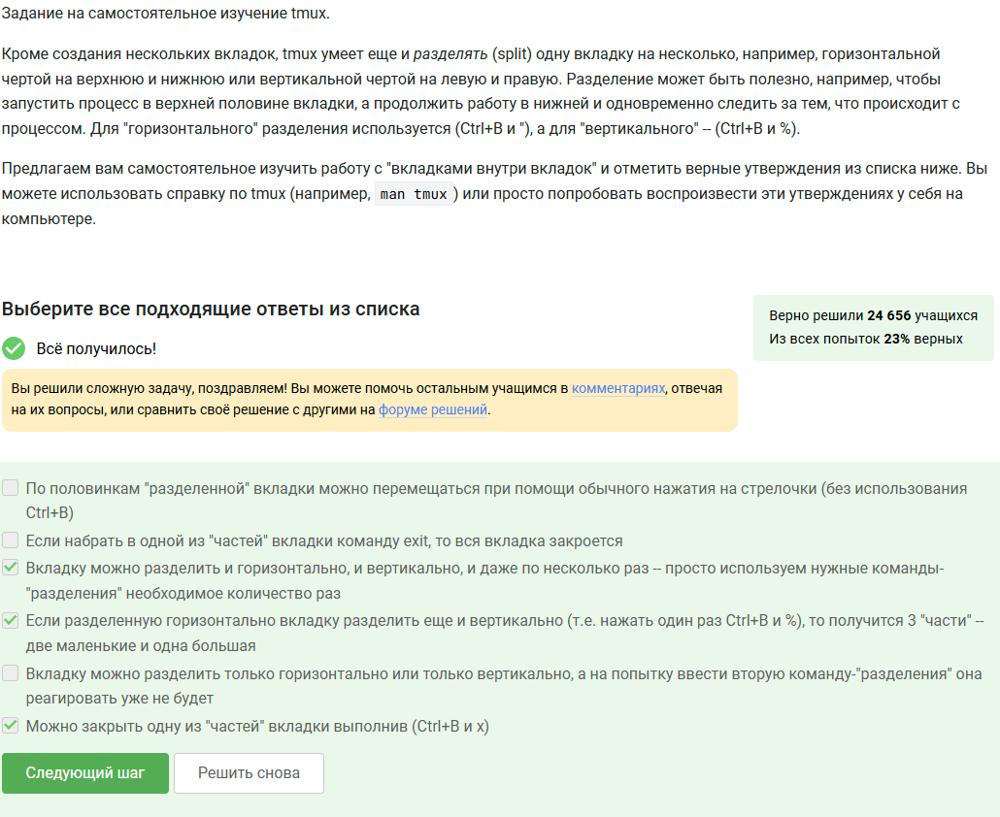

