---
## Front matter
lang: ru-RU
title: Продвинутые темы
subtitle: Часть 3
author:
  - Казначеев С.И.
institute:
  - Российский университет дружбы народов, Москва, Россия Россия
date: 14 мая 2025

## i18n babel
babel-lang: russian
babel-otherlangs: english

## Formatting pdf
toc: false
toc-title: Содержание
slide_level: 2
aspectratio: 169
section-titles: true
theme: metropolis
header-includes:
 - \metroset{progressbar=frametitle,sectionpage=progressbar,numbering=fraction}
---

# Информация

## Докладчик

:::::::::::::: {.columns align=center}
::: {.column width="70%"}

  * Казначеев Сергей Ильич
  * Студент
  * Российский университет дружбы народов
  * [1132240693@pfur.ru]

:::
::: {.column width="30%"}

# Вводная часть

## Задание 1

Чтобы выйти из редактора vim нужно нажать " : ", затем "q", затем "Еnter"

## Задание 2

Главное различие между word и WORD чтобы попасть в конец строки нужно совершить меньше нажатий на W  чем на w

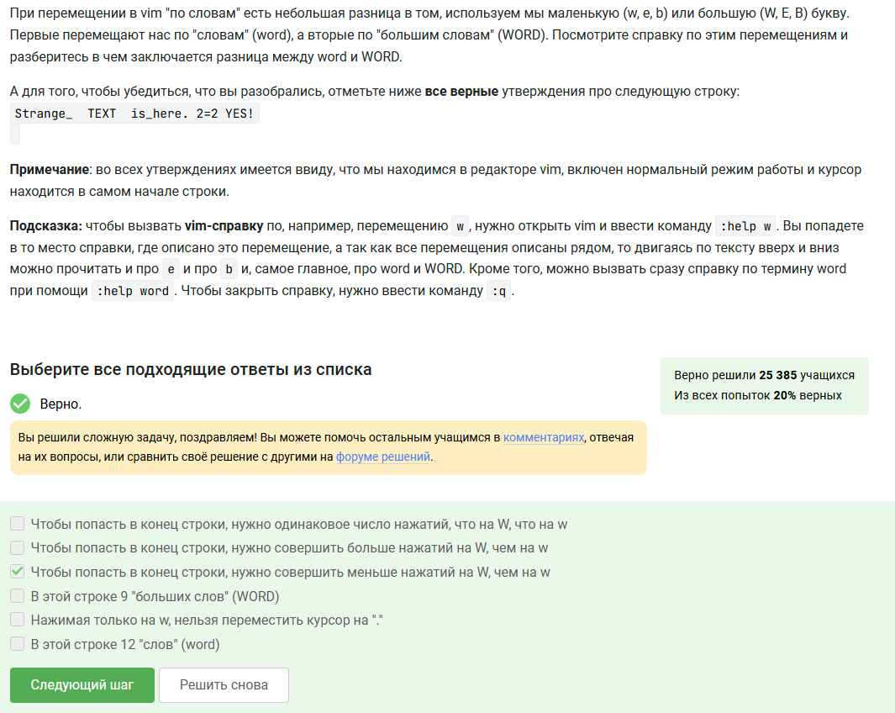

## Задание 3

Чтобы отредактировать данный текст one two three four five в three four four four five нам понадобится 

1)d2w$$bifour four <<Esc>>
2)ddithree four four four five <<Esc>>
3)d2wwifour four <<Esc>>

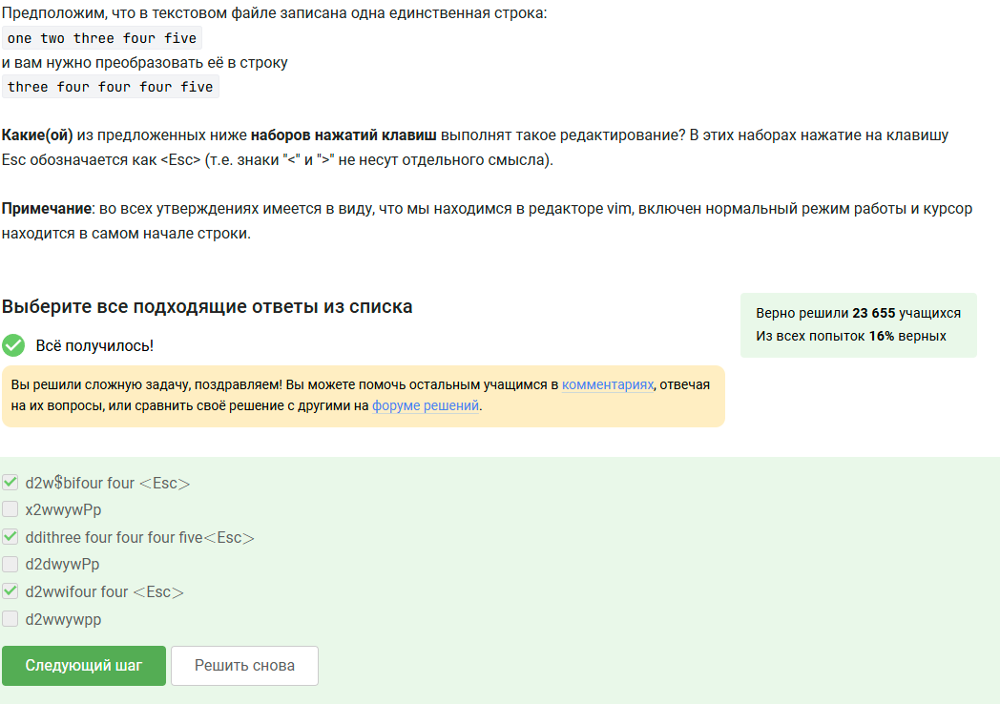

## Задание 4

Чтобы заменить слово Windows на Linux нам понадобится команда 

сама команда :%s/Windows/Linux
	

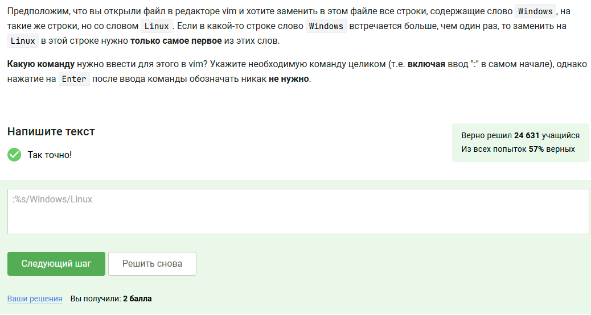

## Задание 5

Существует третий режим vim - режим выделения 

1)Режим выделения открывается из нормального режима по нажатию "v" 
2)В режиме выделения можно использовать команды d (удалить) и y (скопировать)
3)Выйти из режима выделения можно, нажав клавишу Esc два раза
4)В режиме выделения можно использовать команды перемещения (например, W, e, $, и др.)

## Задание 6

Только C

## Задание 7

После изучения скрипта абсолютный путь будет выглядеть /home/bi/file1.txt

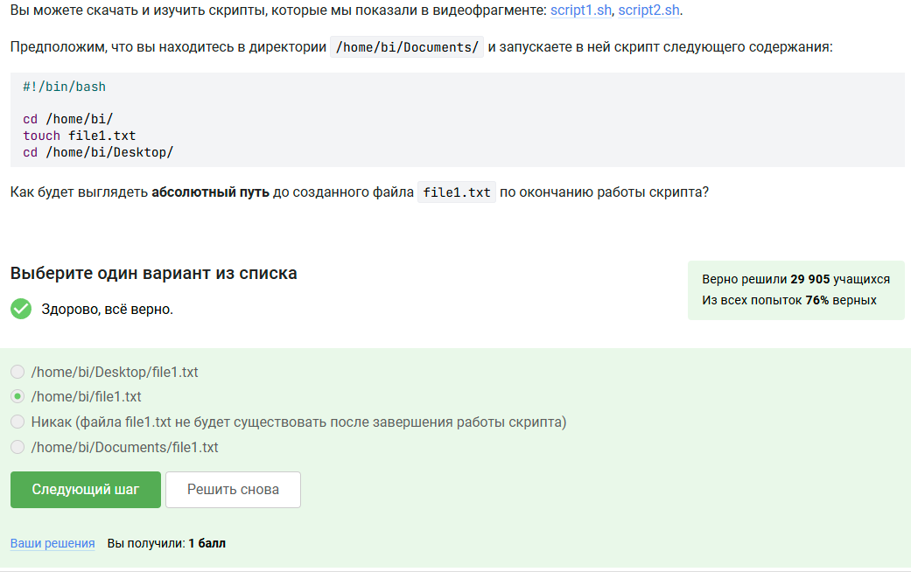

## Задание 8

Именами переменных в bash могут быть:

1)variable123
2)variable_123
3)VARiable
4)__variable

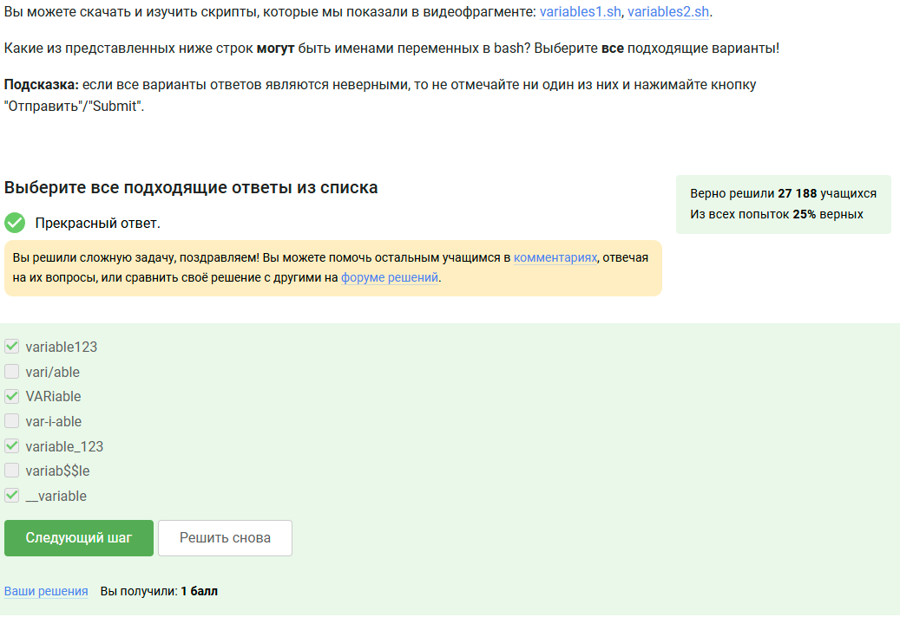

## Задание 9

Напишем скрипт на bash который принимает на вход два аргумента и выводит на экран строку следующего вида - Arguments are: $1=первый_аргумент $2=второй_аргумент

Сам код 

var1=$1
var2=$2

echo "Arguments are: \$1=$var1 \$2=$var2"

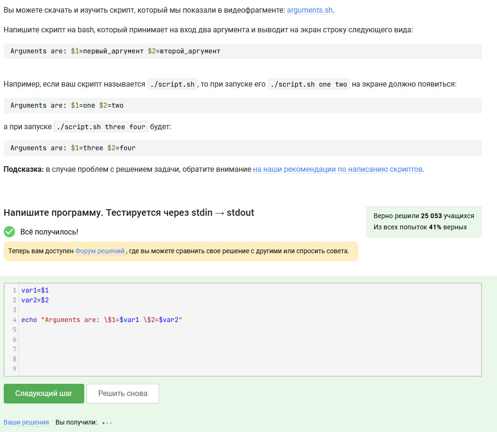

## Задание 10

1)-z ""
2)$var1 == $$var2 || $$var1 != $$var2
3)$# -ge 0
4) -n $0
5)!(4 -le 3)

## Задание 11

Сначала var=3 затем  var=5 у нас он выведет Сначала four, потом four 

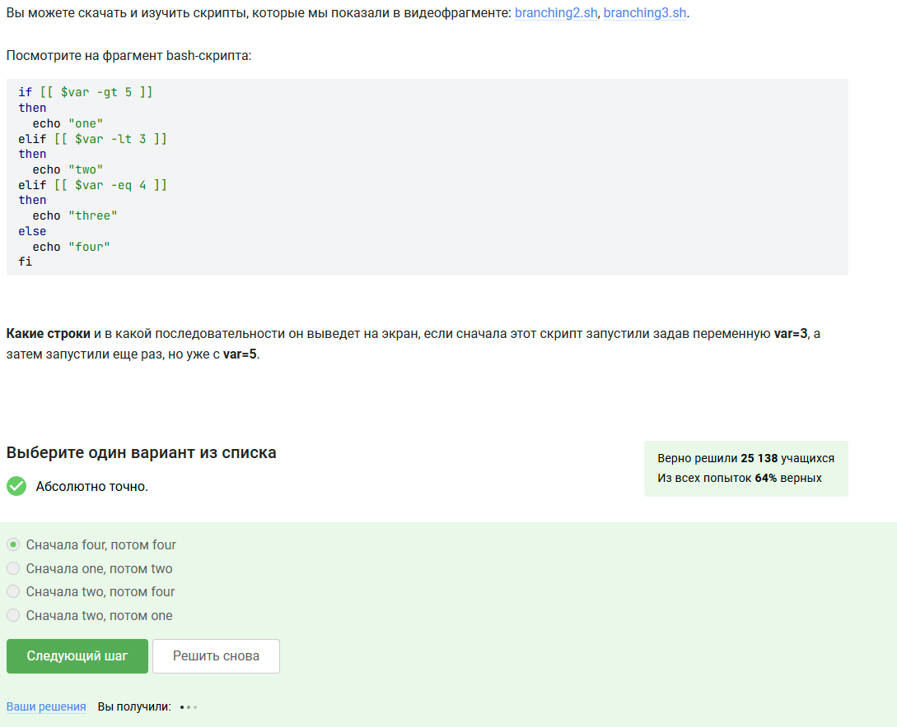

## Задание 12

Напишем скрипн на bash который принимает на вход  один аргумент который будет обозначать число студентов в аудитории

Сам скрипт
if [[ $1 -eq 1 ]]; then
    echo "$1 student"
elif [[ $1 -gt 1 && $1 -le 4 ]]; then
    echo "$1 students"
elif [[ $1 -ge 5 ]]; then
    echo "A lot of students"
else
    echo "No students"
fi

## Задание 13

После запуска скрипта у на выведится 5 start раз и 4 раза finish

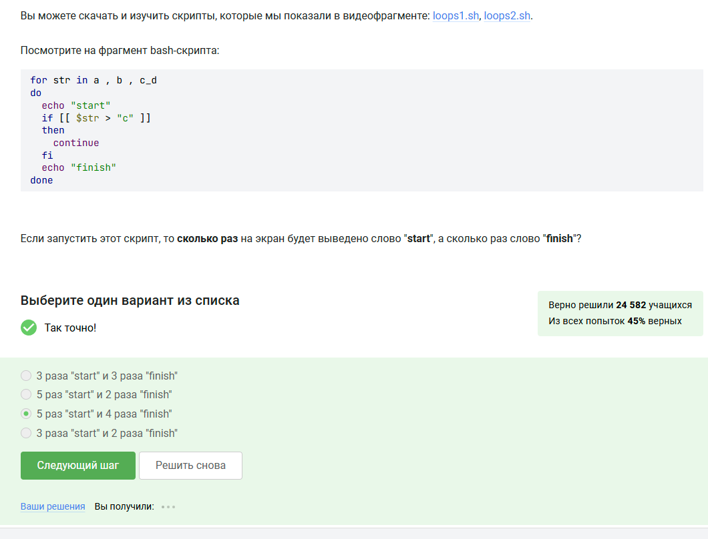

## Задание 14

Напишем скрипн на bash который будет определять в какую возрастную группу попадают пользователи  скрипт будет представлен на скрине 

## Код

## Задание 15

Из ниже предложенных вариантов ответа увеличивает число а на значение б 

1)let a=$$a+$$b
2)let a=a+b
3)let "a=$$a+$$b"
4)let "a = a + b"

## Задание 16

Команда выведет /home/bi

## Задание 17

Ответ 

1)if `program > some_file.txt`
2)Сначала запустить program, затем if [[ $? -eq 0 ]]

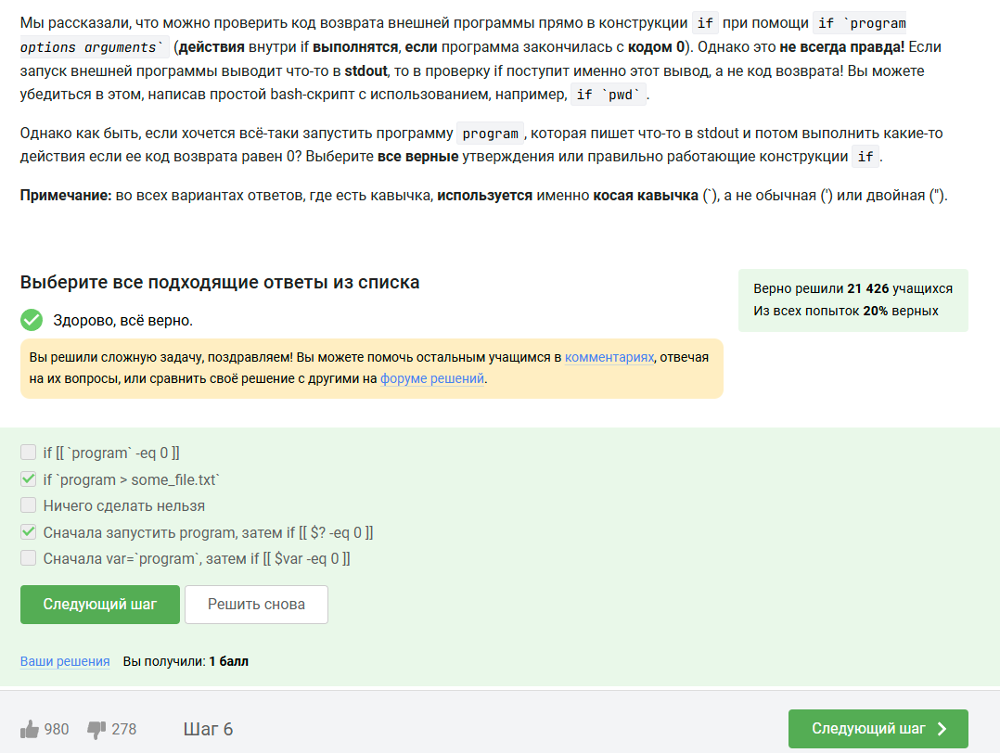

## Задание 18

Команда echo "counters are $c1 and $c2" выведет на экран counters are  and 110

## Задание 19

Напишем скрипнт на bash который будет искать наибольший общий делитель 

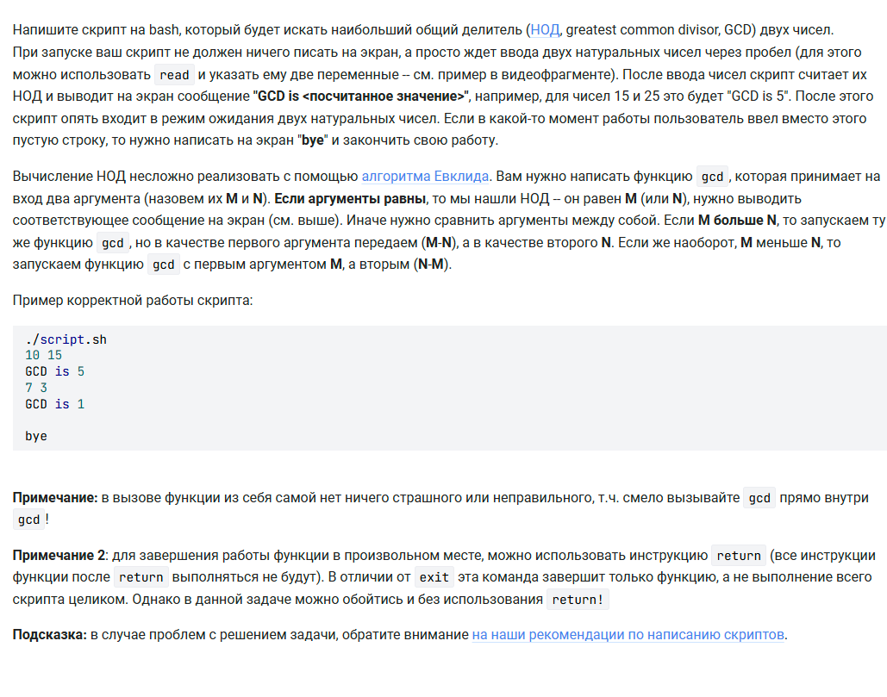

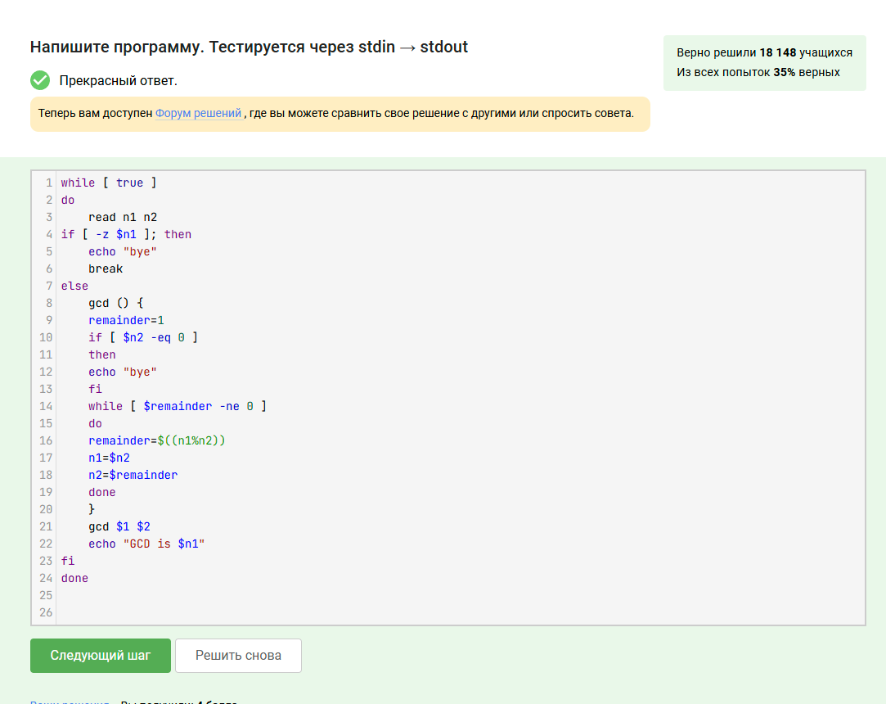

## Задание 20

Напишем калькулятор на bash

Сам скрипт 

## Задание 21

Команда find /home/bi -iname "star*" но  не найдет find /home/bi -name "star*"

1)STARS.txt
2)Star_Wars.avi

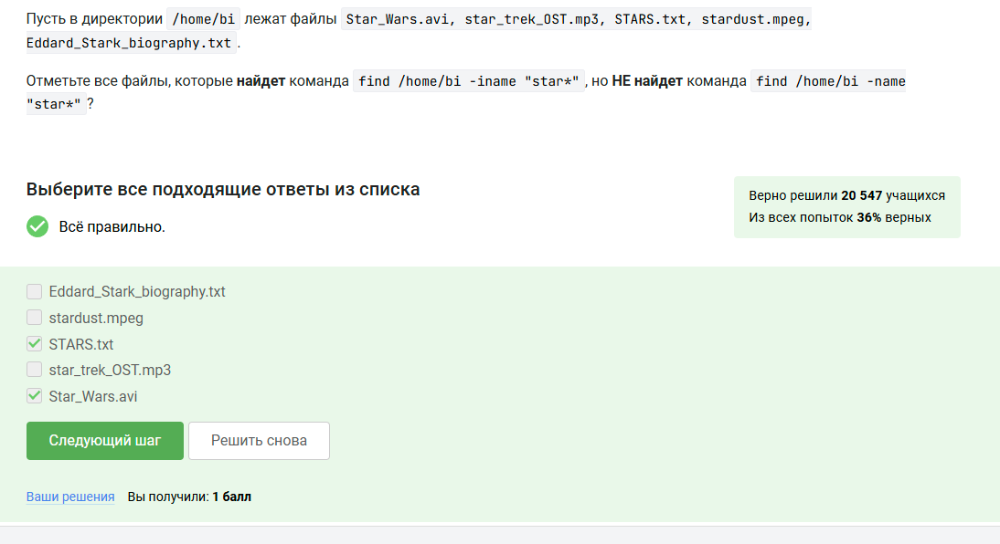

## Задание 22

Команды -path и -name если заменить в команде -name  на -path то результат поиска иногда может остаться таким же 

## Задание 23

Из данных трех файлов  (file1, file2, file3) будут найдены  все кроме file3

## Задание 24

После выполнения всех команда у нас будет  results.txt будет одинакового размера во всех случаях

## Задание 25

После команды grep -E "[xklXKL]?[uU]buntu$" text.txt. у нас выведется 

1)Linux is not always Ubuntu
2)Hmm, XKLubuntu
3) Mac OS X, Windows, Ubuntu
4)I prefer Kubuntu
5)Lubuntu is better than Ubuntu
6)The best OS is Xubuntu

## Задание 26

Если в команде sed -n "/[a-z]*/p" text.txt не указывать опцию -n у нас будет каждая строчка выведена два раза 

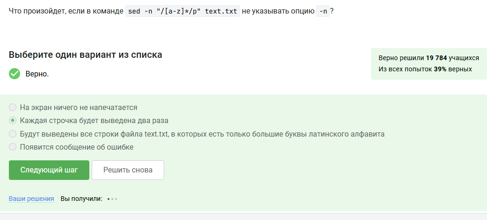

## Задание 27

Ответ sed "s/ [A-Z]+[A-Z]+ / abbreviation /g" input.txt > edited.txt

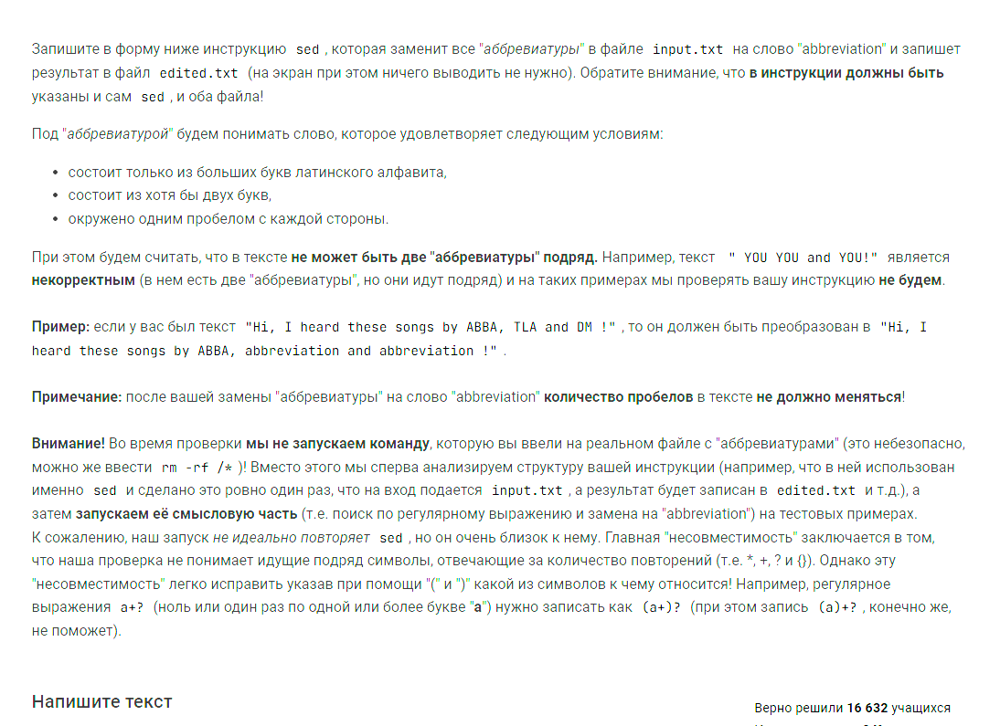

## Код

## Задание 28

При запуске gnuplot можно указать опцию  -p, --persist

## Задание 29

После выполнения кода у нас будет построена и нарисовано Название -- первое значение из второго столбца, нарисовано 9 точек (точка из первой строки пропущена)

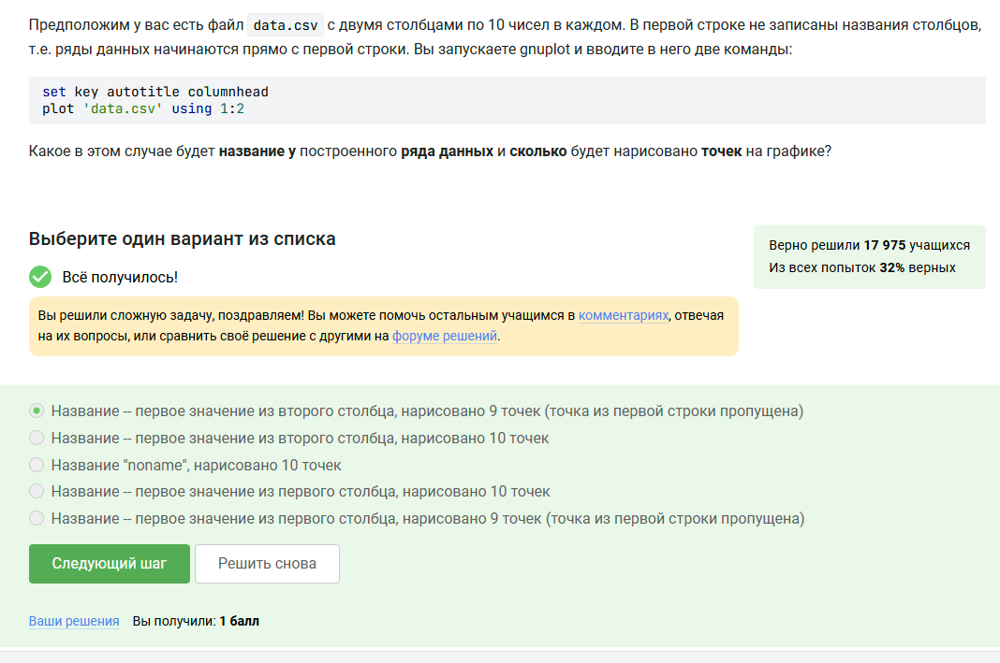

## Задание 30

В скрипт нужно добавить set xtics ("point 1, value ".x1 x1, "point 2, value ".x2 x2, "point 3, value ".x3 x3)

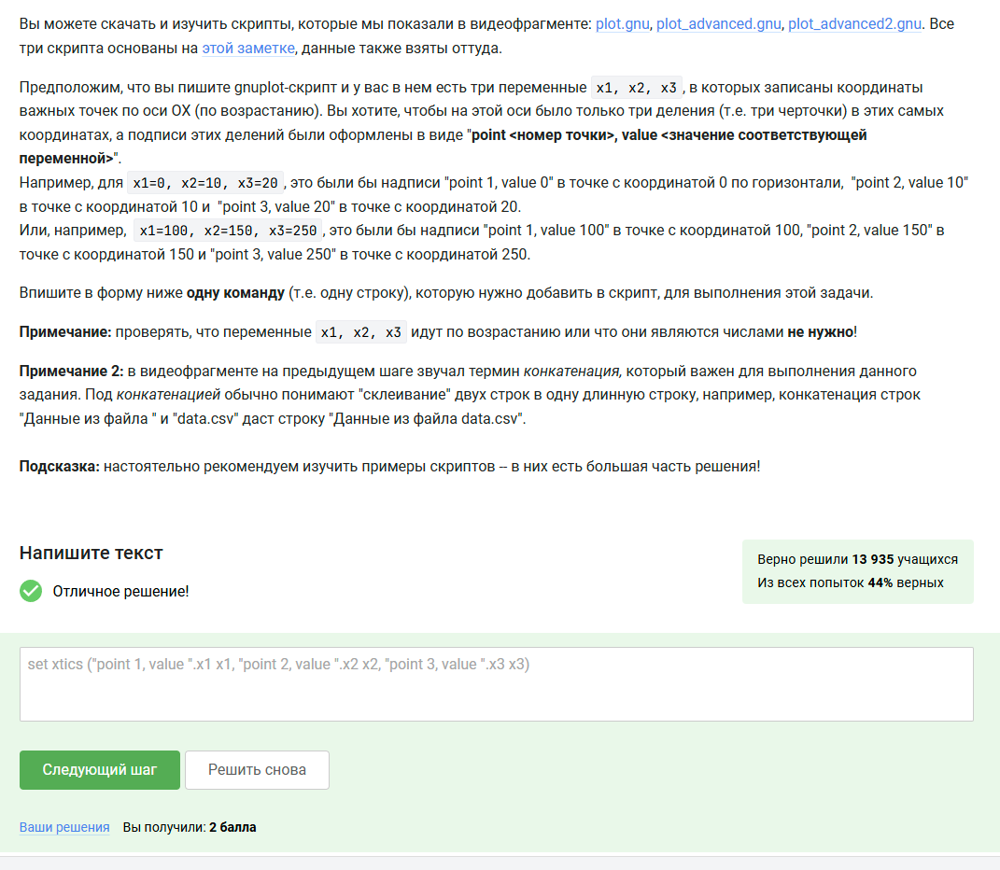

## Задание 31

После изменения файла мы полчим 

## Задание 32

Команды установят файлу file.txt права доступа rwxrw-r--

1)chmod u+wx file.txt; chmod g+w file.txt
2)chmod a+wx file.txt; chmod o-wx file.txt; chmod g-x file.txt
3)chmod 764 file.txt
4)chmod ug+w file.txt; chmod u+x file.txt

## Задание 33

Ответ 

1)sudo chown user:group dir
2)sudo chmod o+w dir 
3)sudo chown user dir
4)sudo chmod a+w dir

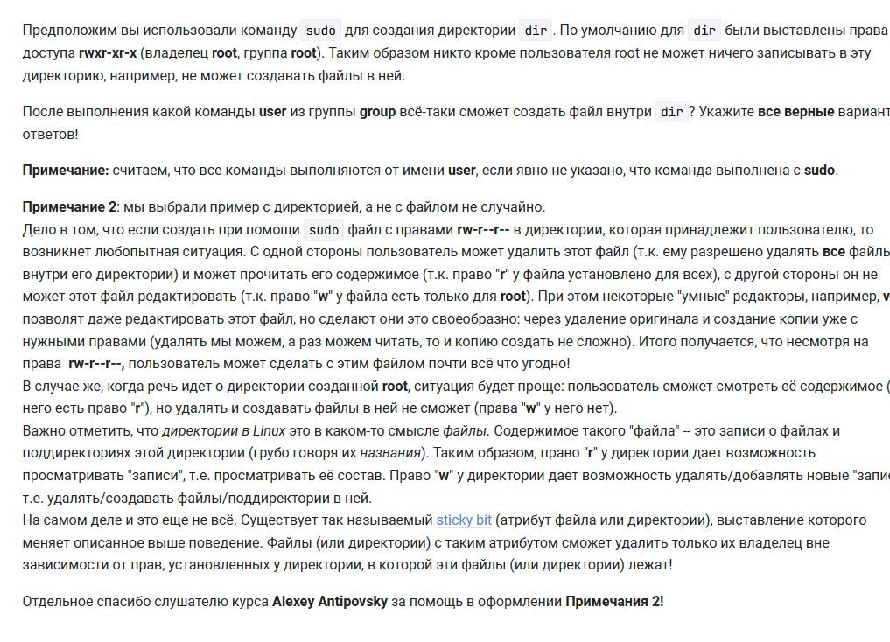

## Код 

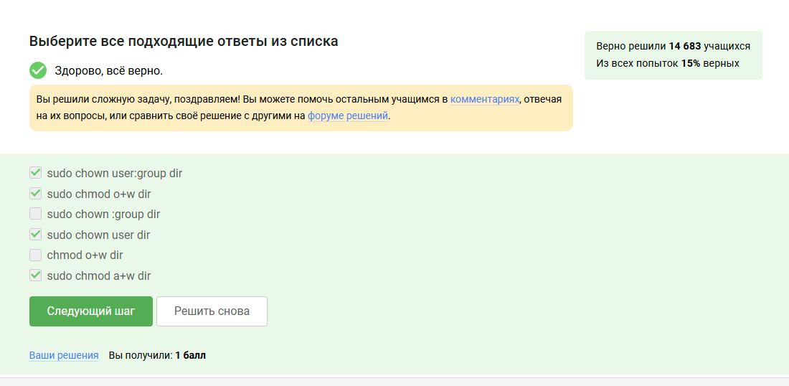

## Задание 34

Характеристики файла можно посчитать с использованием команды wc.
1)Количество символов
2)Количество слов
3)Количество строк

## Задание 35

Напишем форму которая выведет сколько места на диске занимает текущая директория du -h -s

## Задание 36

Команда которая может в текущей директории создаь 3 поддиректории с именами mkdir dir{1,2,3}

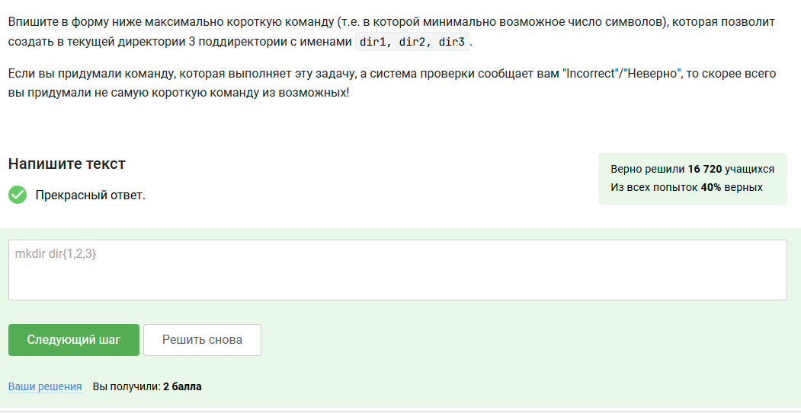

